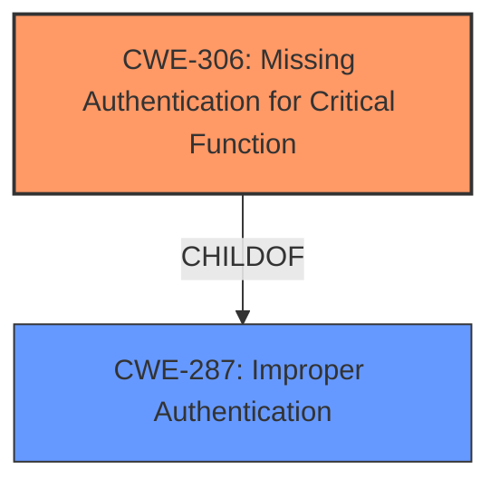

# Analysis Report for CVE-2020-4670

# Vulnerability Analysis Report: CVE-2020-4670

## Description


## Analysis (with Relationship Data)

# Summary
| CWE ID | CWE Name | Confidence | CWE Abstraction Level | CWE Vulnerability Mapping Label | CWE-Vulnerability Mapping Notes |
|---|---|---|---|---|---|
| CWE-306 | Missing Authentication for Critical Function | 1.0 | Base | Allowed | Primary CWE |

## Evidence and Confidence

*   **Confidence Score:** 1.0
*   **Evidence Strength:** HIGH

## Relationship Analysis
The primary relationship that influenced the decision was the ChildOf relationship between CWE-306 and CWE-287. While CWE-287 is a broader classification (Improper Authentication), CWE-306 is a more specific Base level weakness describing the **missing authentication** for a critical function.



## Vulnerability Chain
The vulnerability chain is relatively simple:
1.  **Root Cause:** **Missing authentication** for a critical function (CWE-306).
2.  **Impact:** Unauthorized access to the server.

## Summary of Analysis
The initial analysis focused on identifying the root cause of the vulnerability, which is the **lack of password authentication** for the Redis server. The vulnerability description explicitly states that the Redis server is "**not protected by password authentication**," which is the core issue.

The Retriever Results highlighted several potential CWEs, including CWE-522 (Insufficiently Protected Credentials), CWE-306 (Missing Authentication for Critical Function), and CWE-287 (Improper Authentication).

CWE-522 was considered but deemed less accurate as it implies that credentials exist but are inadequately protected, whereas the description clearly states that authentication is **missing** altogether.

CWE-287 (Improper Authentication) is a more general class of weakness. CWE-306 (Missing Authentication for Critical Function) is a more specific, Base-level CWE that accurately describes the **lack of authentication** for a critical function (accessing the Redis server). The MITRE mapping guidance for CWE-306 states that it is at the Base level of abstraction, which is a preferred level, and that you should carefully read the name and description to ensure that it's an appropriate fit. The provided description aligns perfectly with CWE-306.

Therefore, CWE-306 is the most appropriate CWE for this vulnerability, representing the root cause of the issue.

Relevant CWE Information:
*   **CWE-306 (Missing Authentication for Critical Function):** The product does not perform any authentication for functionality that requires a provable user identity or consumes a significant amount of resources. The Redis server requires authentication, and the product **does not** perform authentication.


## CWE Relationship Analysis

Current CWEs represent these abstraction levels: .


### Vulnerability Chain Analysis

**Chain starting from CWE-287:**
- 287 (Improper Authentication) - ROOT


**Chain starting from CWE-306:**
- 306 (Missing Authentication for Critical Function) - ROOT


### CWE Relationship Diagram

```mermaid
graph TD
    classDef primary fill:#f96,stroke:#333,stroke-width:2px
    classDef secondary fill:#69f,stroke:#333
    classDef tertiary fill:#9e9,stroke:#333
```


*Report generated on 2025-04-02 17:36:21*
