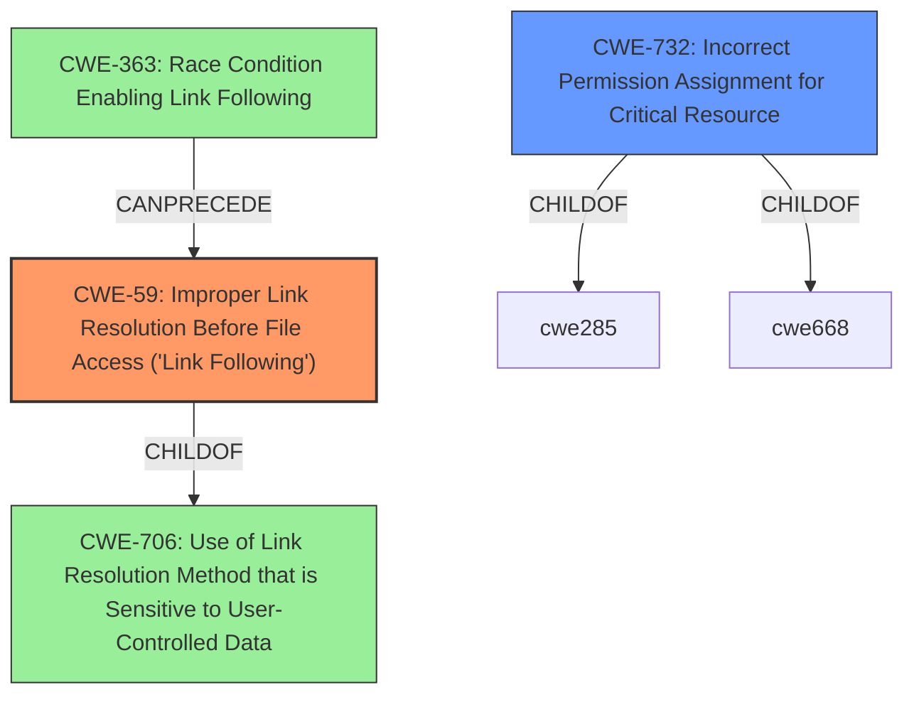

# Raw Analyzer Response for CVE-2020-4717

# Summary
| CWE ID | CWE Name | Confidence | CWE Abstraction Level | CWE Vulnerability Mapping Label | CWE-Vulnerability Mapping Notes |
|---|---|---|---|---|---|
| CWE-59 | Improper Link Resolution Before File Access ('Link Following') | 0.9 | Base | Allowed | Primary CWE: The vulnerability involves improper handling of symbolic links during installation, allowing an attacker to write arbitrary files. |
| CWE-732 | Incorrect Permission Assignment for Critical Resource | 0.7 | Class | Allowed-with-Review | Secondary CWE: The root cause of the vulnerability is an issue with symbolic link permissions. |

## Evidence and Confidence

*   **Confidence Score:** 0.8
*   **Evidence Strength:** HIGH

## Relationship Analysis
The primary CWE, CWE-59, is a base-level weakness that describes the improper handling of symbolic links. CWE-59 is a child of CWE-706 (Use of Link Resolution Method that is Sensitive to User-Controlled Data), indicating that the vulnerability arises from how user-controlled data influences link resolution. It can also be part of a chain, potentially following CWE-363 (Race Condition Enabling Link Following), where a race condition allows an attacker to replace a file with a symbolic link before access.

CWE-732 (Incorrect Permission Assignment for Critical Resource) is a Class-level weakness that is considered as a potential secondary issue because the vulnerability also involves incorrect permissions, but the core problem is the improper handling of symbolic links.

## Vulnerability Chain
The vulnerability chain starts with the Modeler Subscription Installer having a **symbolic link permissions issue**. This leads to the **improper handling of symbolic link permissions** during installation (CWE-59). An attacker with "create symbolic link permission" can then **write arbitrary files** in another protected path. This can lead to actions with elevated privileges.

## Summary of Analysis
The initial analysis focused on the improper handling of symbolic links, as highlighted in the vulnerability description and CVE reference. The "**vector:** symbolic link" and "**attacker:** user with create symbolic link permission" key phrases strongly suggest CWE-59. The CVE Reference Links Content Summary states "**Root cause of vulnerability**: The Modeler subscription installer on Windows platform has a symbolic link permissions issue" and "**Weaknesses/vulnerabilities present**: Improper handling of symbolic link permissions during installation".

CWE-59 (Improper Link Resolution Before File Access ('Link Following')) aligns well with the vulnerability, as the installer **does not properly prevent** a filename from identifying a link that resolves to an unintended resource. This allows a user with symbolic link permissions to **write arbitrary files** in another protected path.

CWE-732 (Incorrect Permission Assignment for Critical Resource) was considered as a secondary factor since the symbolic link permissions are not handled correctly, which could be considered an incorrect permission assignment, but the primary issue is the link following itself.

The selected CWEs are at the optimal level of specificity. CWE-59 is a Base level weakness.

# Relevant CWE Information:

## CWE-59: Improper Link Resolution Before File Access ('Link Following')
**Abstraction:** Base
**Status:** Draft

### Description
The product attempts to access a file based on the filename, but it **does not properly prevent** that filename from identifying a link or shortcut that resolves to an unintended resource.

## CWE-732: Incorrect Permission Assignment for Critical Resource
**Abstraction:** Class
**Status:** Draft

### Description
The product specifies permissions for a security-critical resource in a way that allows that resource to be read or modified by unintended actors.