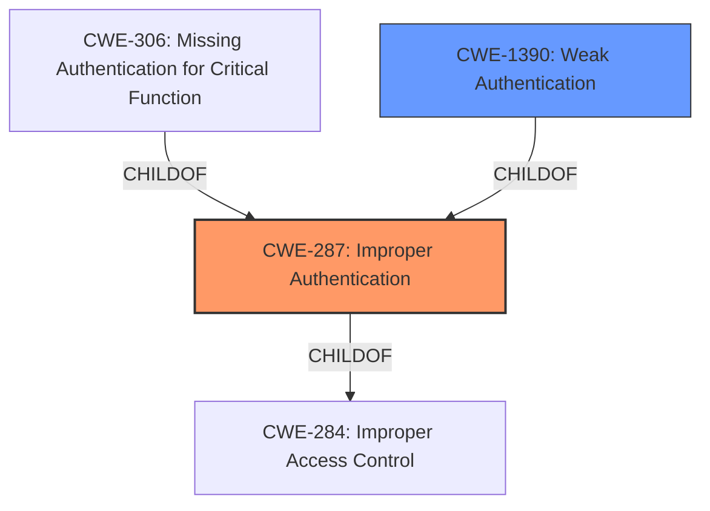

# Enhanced Analysis for CVE-2020-4821

# Summary
| CWE ID | CWE Name | Confidence | CWE Abstraction Level | CWE Vulnerability Mapping Label | CWE-Vulnerability Mapping Notes |
|---|---|---|---|---|---|
| CWE-287 | Improper Authentication | 0.9 | Class | Primary | Discouraged, but selected due to the lack of a more specific Base/Variant CWE. |
| CWE-1390 | Weak Authentication | 0.7 | Class | Secondary | Allowed-with-Review, potential parent of a more specific CWE. |

## Evidence and Confidence

*   **Confidence Score:** 0.9
*   **Evidence Strength:** HIGH

## Relationship Analysis
The primary CWE selected is CWE-287, which is a class-level CWE. Although the mapping guidance discourages its use, the evidence points directly to an authentication issue. CWE-287's parent is CWE-284, Improper Access Control. Several child CWEs of CWE-287 were considered, including CWE-306 (Missing Authentication for Critical Function) and CWE-1390 (Weak Authentication). CWE-306 was deemed less suitable as authentication was present, albeit flawed. CWE-1390 is a valid candidate and considered as a secondary CWE.



## Vulnerability Chain
The vulnerability chain starts with an **insecure configuration** (LDAP with anonymous binding enabled), leading to an **authentication bypass**, and finally resulting in **unauthorized access** and potential **data manipulation**.

## Summary of Analysis
The initial analysis focused on identifying the root cause of the vulnerability, which is the ability to bypass authentication using an empty password string when the system is configured to use LDAP with anonymous binding.

The following evidence supports this assessment:

*   **Vulnerability Description Key Phrases:** "**impact:** bypass authentication mechanisms", "**vector:** empty password string"
*   **CVE Reference Links Content Summary:** "The core weakness is the ability to bypass the intended authentication mechanism when the system is configured to use LDAP with anonymous binding enabled."
*   **CVE Reference Links Content Summary:** "The vulnerability is not inherent in the code, but arises due to an insecure configuration that the software supports. The software does not require LDAP to require authenticated binding which allows anonymous binding."

CWE-287, Improper Authentication, was chosen as the primary CWE because it directly addresses the core issue of bypassing the authentication mechanism. While the MITRE mapping guidance discourages using CWE-287 directly, preferring more specific entries, none of the child CWEs perfectly fit the scenario. CWE-1390, Weak Authentication, is a secondary candidate.

The selected CWEs are at the optimal level of specificity given the available information. While a more specific CWE might exist, the current evidence best supports CWE-287 and CWE-1390.

Relevant CWE Information:
## CWE-1236: Improper Neutralization of Formula Elements in a CSV File
**Abstraction Level**: Base
**Similarity Score**: 0.79
**Source**: dense
Not selected because this CWE relates to CSV injection, which is not applicable to the vulnerability described.

## CWE-74: Improper Neutralization of Special Elements in Output Used by a Downstream Component ('Injection')
**Abstraction Level**: Class
**Similarity Score**: 0.77
**Source**: dense
Not selected because the vulnerability is not directly related to injection.

## CWE-611: Improper Restriction of XML External Entity Reference
**Abstraction Level**: Base
**Similarity Score**: 0.77
**Source**: dense
Not selected because XML External Entity is not the root cause.

## CWE-807: Reliance on Untrusted Inputs in a Security Decision
**Abstraction Level**: Base
**Similarity Score**: 0.76
**Source**: dense
Not selected because the root cause is not from an untrusted input.

## CWE-538: Insertion of Sensitive Information into Externally-Accessible File or Directory
**Abstraction Level**: Base
**Similarity Score**: 0.76
**Source**: dense
Not selected because sensitive information is not inserted into externally accessible files or directories.

## CWE-345: Insufficient Verification of Data Authenticity
**Abstraction Level**: Class
**Similarity Score**: 0.76
**Source**: dense
Not selected because data authenticity is not the primary concern.

## CWE-1391: Use of Weak Credentials
**Abstraction Level**: Class
**Similarity Score**: 0.76
**Source**: dense
Not selected because the vulnerability is due to an empty password string, not weak credentials.

## CWE-116: Improper Encoding or Escaping of Output
**Abstraction Level**: Class
**Similarity Score**: 0.75
**Source**: dense
Not selected because encoding or escaping of output is not the root cause.

## CWE-23: Relative Path Traversal
**Abstraction Level**: Base
**Similarity Score**: 0.75
**Source**: dense
Not selected because path traversal is not relevant to this vulnerability.

## CWE-138: Improper Neutralization of Special Elements
**Abstraction Level**: Class
**Similarity Score**: 0.75
**Source**: dense
Not selected because it is not about neutralizing special elements.

## CWE-1391: Use of Weak Credentials
**Abstraction Level**: Class
**Similarity Score**: 5730.09
**Source**: sparse
Not selected because the vulnerability is due to an empty password string, not weak credentials.

## CWE-327: Use of a Broken or Risky Cryptographic Algorithm
**Abstraction Level**: Class
**Similarity Score**: 5637.22
**Source**: sparse
Not selected because it is not related to broken/risky cryptographic algorithm.

## CWE-1390: Weak Authentication
**Abstraction Level**: Class
**Similarity Score**: 5632.62
**Source**: sparse
Considered as secondary CWE.

## CWE-319: Cleartext Transmission of Sensitive Information
**Abstraction Level**: Base
**Similarity Score**: 5596.73
**Source**: sparse
Not selected because the transmission of sensitive information is not the root cause.

## CWE-611: Improper Restriction of XML External Entity Reference
**Abstraction Level**: Base
**Similarity Score**: 5577.94
**Source**: sparse
Not selected because XML External Entity is not the root cause.

## CWE-613: Insufficient Session Expiration
**Abstraction Level**: base
**Similarity Score**: 4.33
**Source**: graph
Not selected because session expiration is not relevant.

## CWE-441: Unintended Proxy or Intermediary ('Confused Deputy')
**Abstraction Level**: class
**Similarity Score**: 2.98
**Source**: graph
Not selected because this is not a confused deputy issue.

## CWE-287: Improper Authentication
**Abstraction Level**: class
**Similarity Score**: 2.55
**Source**: graph
Selected as Primary CWE.

## CWE-942: Permissive Cross-domain Policy with Untrusted Domains
**Abstraction Level**: variant
**Similarity Score**: 2.55
**Source**: graph
Not selected because it is not a cross-domain policy issue.

## CWE-611: Improper Restriction of XML External Entity Reference
**Abstraction Level**: Base
**Similarity Score**: 2.49
**Source**: graph
Not selected because XML External Entity is not the root cause.

## CWE-307: Improper Restriction of Excessive Authentication Attempts
**Abstraction Level**: base
**Similarity Score**: 2.47
**Source**: graph
Not selected because the issue is not about excessive authentication attempts.

## CWE-306: Missing Authentication for Critical Function
**Abstraction Level**: base
**Similarity Score**: 2.47
**Source**: graph
Not selected because authentication exists, albeit flawed.

## CWE-620: Unverified Password Change
**Abstraction Level**: base
**Similarity Score**: 2.47
**Source**: graph
Not selected because the vulnerability does not involve an unverified password change.

## CWE-1240: Use of a Cryptographic Primitive with a Risky Implementation
**Abstraction Level**: base
**Similarity Score**: 2.47
**Source**: graph
Not selected because cryptography is not involved.

## CWE-918: Server-Side Request Forgery (SSRF)
**Abstraction Level**: base
**Similarity Score**: 2.47
**Source**: graph
Not selected because


## CWE Relationship Analysis

Current CWEs represent these abstraction levels: .


### Vulnerability Chain Analysis

**Chain starting from CWE-116:**
- 116 (Improper Encoding or Escaping of Output) - ROOT


**Chain starting from CWE-441:**
- 441 (Unintended Proxy or Intermediary ('Confused Deputy')) - ROOT


### CWE Relationship Diagram

```mermaid
graph TD
    classDef primary fill:#f96,stroke:#333,stroke-width:2px
    classDef secondary fill:#69f,stroke:#333
    classDef tertiary fill:#9e9,stroke:#333
```