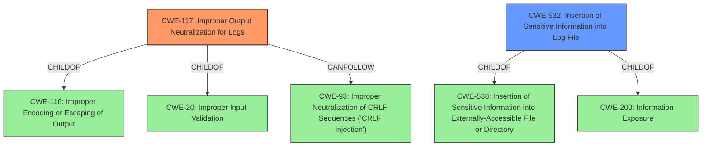

# Raw Analyzer Response for CVE-2020-4851

# Summary
| CWE ID | CWE Name | Confidence | CWE Abstraction Level | CWE Vulnerability Mapping Label | CWE-Vulnerability Mapping Notes |
|---|---|---|---|---|---|
| CWE-117 | Improper Output Neutralization for Logs | 1 | Base | Allowed | Primary CWE |
| CWE-532 | Insertion of Sensitive Information into Log File | 0.7 | Base | Allowed | Secondary Candidate |

## Evidence and Confidence

*   **Confidence Score:** 0.85
*   **Evidence Strength:** HIGH

## Relationship Analysis
The primary CWE selected is CWE-117, which is a Base level CWE. It is related to CWE-116 (Improper Encoding or Escaping of Output) and CWE-20 (Improper Input Validation) through ChildOf relationships. It also has a CanFollow relationship with CWE-93 (Improper Neutralization of CRLF Sequences ('CRLF Injection')).

The secondary CWE, CWE-532 is also a Base level CWE with relationships to CWE-538 (Insertion of Sensitive Information into Externally-Accessible File or Directory) and CWE-200 (Information Exposure).

## Vulnerability Chain
The chain of events can be described as follows:
1.  A local user injects malicious content into log files due to **improper output neutralization for logs** (CWE-117).
2.  This leads to the **insertion of sensitive information into the log file** (CWE-532).
The root cause is CWE-117, and CWE-532 is more of a consequence.

## Summary of Analysis
The primary assessment is based on the provided evidence, particularly the "CVE Reference Links Content Summary" which states that "A vulnerability exists in IBM Spectrum Scale HDFS Transparency that allows a local attacker to inject malicious content into log files." This directly supports the selection of CWE-117, **Improper Output Neutralization for Logs**, as the root cause. The vulnerability allows for the injection of malicious content, indicating a failure to properly neutralize output before writing to the logs.

The graph relationships influenced the selection by highlighting the connections between CWE-117 and related weaknesses like CWE-116 and CWE-20. While these relationships provide additional context, the primary driver for the selection remains the direct evidence of **improper output neutralization**.

CWE-117 is at the optimal level of specificity because it directly addresses the **lack of proper neutralization** of output written to logs. This is more specific than a general input validation issue (CWE-20) and focuses on the logging context.

CWE-532, **Insertion of Sensitive Information into Log File**, was considered as a secondary CWE because the injection of malicious content can be seen as a form of inserting sensitive information. However, it is more accurately described as a consequence of the **improper neutralization** rather than the root cause itself. Thus, it is a secondary candidate.

Relevant CWE Information:

# Enhanced Context (25 CWEs)

## CWE-117: Improper Output Neutralization for Logs
**Abstraction:** Base
**Similarity Score**: 0.110 (Retriever Results)

**Description**:
The product does not neutralize or incorrectly neutralizes output that is written to logs.

**Mapping Guidance**:
- Usage: Allowed
- Rationale: This CWE entry is at the Base level of abstraction, which is a preferred level of abstraction for mapping to the root causes of vulnerabilities.

## CWE-532: Insertion of Sensitive Information into Log File
**Abstraction:** Base
**Similarity Score**: 0.587 (Retriever Results)

**Description**:
The product writes sensitive information to a log file.

**Mapping Guidance**:
- Usage: Allowed
- Rationale: This CWE entry is at the Base level of abstraction, which is a preferred level of abstraction for mapping to the root causes of vulnerabilities.

## Other CWE Considerations:

*   CWE-20, **Improper Input Validation**, was considered but deemed less specific than CWE-117, as the issue is directly related to output neutralization rather than general input handling.
*   CWE-319, **Cleartext Transmission of Sensitive Information**, was considered, but the vulnerability does not involve the transmission of sensitive information in cleartext.
*   CWE-327, **Use of a Broken or Risky Cryptographic Algorithm** and CWE-326, **Inadequate Encryption Strength** are not relevant as the vulnerability doesn't involve cryptography.
*   CWE-799, **Improper Control of Interaction Frequency**, is not applicable since the issue is not about limiting the frequency of interactions.
*   CWE-522, **Insufficiently Protected Credentials**, is not relevant because the vulnerability doesn't directly involve the protection of credentials.
*   CWE-1236, **Improper Neutralization of Formula Elements in a CSV File**, is not applicable as the vulnerability does not concern CSV files.
*   CWE-307, **Improper Restriction of Excessive Authentication Attempts**, is not relevant because it is not an authentication issue.
*   CWE-208, **Observable Timing Discrepancy**, is not relevant to this vulnerability.