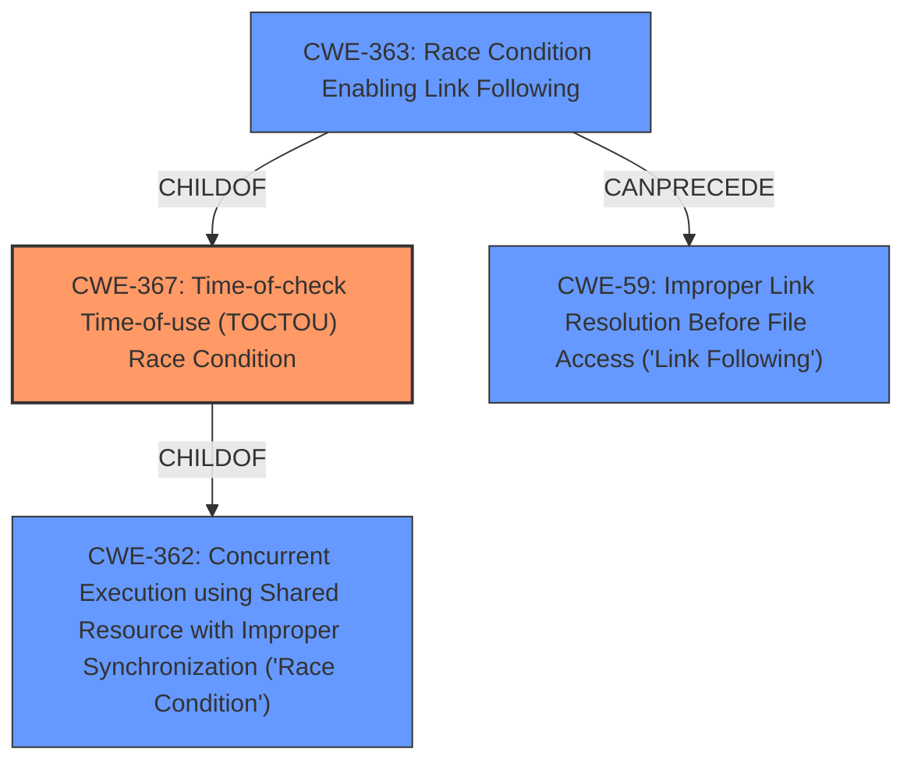

# Analysis Report for CVE-2020-4885

# Vulnerability Analysis Report: CVE-2020-4885

## Description


## Analysis (with Relationship Data)

# Summary
| CWE ID  | CWE Name                                                                                       | Confidence | CWE Abstraction Level | CWE Vulnerability Mapping Label | CWE-Vulnerability Mapping Notes |
| :-------- | :--------------------------------------------------------------------------------------------- | :---------- | :---------------------- | :------------------------------ | :------------------------------ |
| CWE-367 | Time-of-check Time-of-use (TOCTOU) Race Condition                                            | 0.95      | Base                    | Primary                         | Allowed                       |
| CWE-59  | Improper Link Resolution Before File Access ('Link Following')                               | 0.80      | Base                    | Secondary                       | Allowed                       |

## Evidence and Confidence

*   **Confidence Score:** 0.90
*   **Evidence Strength:** HIGH

## Relationship Analysis
The primary relationship that impacted the decision was the parent-child relationship between CWE-367 (Time-of-check Time-of-use Race Condition) and CWE-362 (Concurrent Execution using Shared Resource with Improper Synchronization ('Race Condition')). CWE-367 is a specific type of CWE-362, where the race condition occurs between checking the state of a resource and using it.

Additionally, CWE-363 (Race Condition Enabling Link Following) is a child of CWE-367 and CANPRECEDE CWE-59 (Improper Link Resolution Before File Access ('Link Following')). This indicates a potential chain where a race condition allows an attacker to manipulate a symbolic link. This is an important consideration as the vulnerability description specifically mentions a race condition related to a symbolic link.



## Vulnerability Chain
The vulnerability chain involves a **race condition** that allows a local user to manipulate a symbolic link, ultimately leading to unauthorized access and modification of the Db2 configuration.

1.  **Root Cause:** **Race condition** via symbolic link.
2.  **Weakness:** Improper handling of the **race condition** in conjunction with symbolic link resolution.
3.  **Impact:** Unauthorized access and modification of Db2 configuration.

## Summary of Analysis
The initial assessment strongly points towards CWE-367 (Time-of-check Time-of-use Race Condition) as the primary CWE, because the **rootcause** has the key phrase "**race condition of a symbolic link**". The **CVE Reference Links Content Summary** section also supports this by stating "**Race Condition:** A race condition exists that allows a local user to potentially manipulate the system's state during a critical time window."

CWE-59 (Improper Link Resolution Before File Access ('Link Following')) is added as a secondary CWE, since the **race condition** is related to a symbolic link. The **CVE Reference Links Content Summary** section also supports this by stating "**Symbolic Link Manipulation:** The race condition is exploited via a symbolic link, likely allowing the attacker to redirect file operations."

The graph relationships influenced the final selection by highlighting the connection between **race conditions**, symbolic links, and TOCTOU vulnerabilities.

The selected CWEs are at the optimal level of specificity because they accurately capture the root cause and mechanism of the vulnerability, which is a **race condition** that enables improper link resolution leading to unauthorized configuration changes.

Relevant CWE Information:

# Enhanced Context (25 CWEs)

## CWE-1240: Use of a Cryptographic Primitive with a Risky Implementation
**Abstraction Level**: Base
**Similarity Score**: 0.79
This CWE is not relevant as the vulnerability doesn't involve cryptography.

## CWE-59: Improper Link Resolution Before File Access ('Link Following')
**Abstraction Level**: Base
**Similarity Score**: 0.78
This CWE is relevant since the vulnerability involves symbolic links.

## CWE-328: Use of Weak Hash
**Abstraction Level**: Base
**Similarity Score**: 0.78
This CWE is not relevant as the vulnerability doesn't involve hashing.

## CWE-330: Use of Insufficiently Random Values
**Abstraction Level**: Class
**Similarity Score**: 0.78
This CWE is not relevant as the vulnerability doesn't involve random number generation.

## CWE-667: Improper Locking
**Abstraction Level**: Class
**Similarity Score**: 0.78
This CWE could be related to **race conditions**, but the description specifies a symbolic link, making other CWEs more appropriate.

## CWE-367: Time-of-check Time-of-use (TOCTOU) Race Condition
**Abstraction Level**: Base
**Similarity Score**: 0.78
This is the most relevant CWE because the vulnerability involves a **race condition** between checking and using a resource (the file pointed to by the symbolic link).

## CWE-755: Improper Handling of Exceptional Conditions
**Abstraction Level**: Class
**Similarity Score**: 0.78
This CWE is too general.

## CWE-345: Insufficient Verification of Data Authenticity
**Abstraction Level**: Class
**Similarity Score**: 0.78
This CWE is not relevant.

## CWE-703: Improper Check or Handling of Exceptional Conditions
**Abstraction Level**: Pillar
**Similarity Score**: 0.77
This CWE is too general.

## CWE-41: Improper Resolution of Path Equivalence
**Abstraction Level**: Base
**Similarity Score**: 0.77
This CWE is related to path manipulation, but CWE-59 is more specific to symbolic links.

## CWE-362: Concurrent Execution using Shared Resource with Improper Synchronization ('Race Condition')
**Abstraction Level**: Class
**Similarity Score**: 6547.02
This is related to the **race condition**, but CWE-367 is more specific as it captures the time-of-check time-of-use nature of the **race condition**.

## CWE-61: UNIX Symbolic Link (Symlink) Following
**Abstraction Level**: Compound
**Similarity Score**: 6464.70
This is a compound CWE that includes multiple weaknesses. Given the specific details, a combination of CWE-367 and CWE-59 is more appropriate.

## CWE-732: Incorrect Permission Assignment for Critical Resource
**Abstraction Level**: Class
**Similarity Score**: 6015.04
While incorrect permissions could contribute to the vulnerability, the **race condition** and symbolic link manipulation are the more direct causes.

## CWE-386: Symbolic Name not Mapping to Correct Object
**Abstraction Level**: base
**Similarity Score**: 4.91
This CWE is too generic, and CWE-59 and CWE-367 capture the vulnerability more accurately.

## CWE-476: NULL Pointer Dereference
**Abstraction Level**: base
**Similarity Score**: 4.33
This CWE is not relevant.

## CWE-363: Race Condition Enabling Link Following
**Abstraction Level**: base
**Similarity Score**: 4.33
This CWE is very similar to CWE-367 and could be considered. However, CWE-367 is a broader category that encompasses this specific scenario.

## CWE-416: Use After Free
**Abstraction Level**: variant
**Similarity Score**: 3.24
This CWE is not relevant.

## CWE-73: External Control of File Name or Path
**Abstraction Level**: base
**Similarity Score**: 3.23
While external control of the file name could be a factor, the primary issue is the **race condition** that allows the symbolic link to be exploited.

## CWE-364: Signal Handler Race Condition
**Abstraction Level**: base
**Similarity Score**: 2.87
This CWE is not relevant.

## CWE-609: Double-Checked Locking
**Abstraction Level**: base
**Similarity Score**: 2.87
This CWE is not relevant.

## CWE-252: Unchecked Return Value
**Abstraction Level**: base
**Similarity Score**: 2.87
This CWE is not relevant.

## CWE-1265: Unintended Reentrant Invocation of Non-reentrant Code Via Nested Calls
**Abstraction Level**: base
**Similarity Score**: 2.87
This CWE is not relevant.


## CWE Relationship Analysis

Current CWEs represent these abstraction levels: .


### Vulnerability Chain Analysis

**Chain starting from CWE-362:**
- 362 (Concurrent Execution using Shared Resource with Improper Synchronization ('Race Condition')) - ROOT


**Chain starting from CWE-364:**
- 364 (Signal Handler Race Condition) - ROOT


### CWE Relationship Diagram

```mermaid
graph TD
    classDef primary fill:#f96,stroke:#333,stroke-width:2px
    classDef secondary fill:#69f,stroke:#333
    classDef tertiary fill:#9e9,stroke:#333
```


*Report generated on 2025-04-02 13:57:55*
