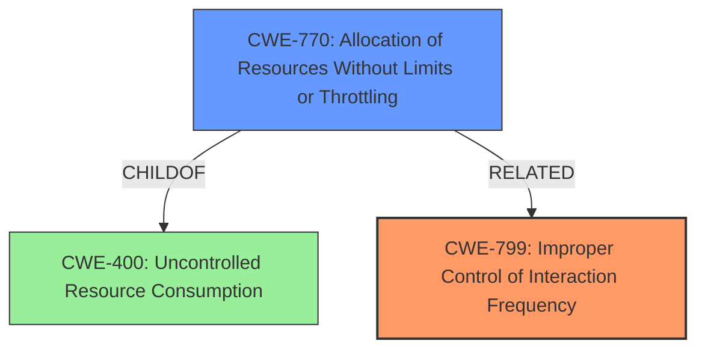

# Analysis for CVE-2020-4890

# Summary
| CWE ID | CWE Name | Confidence | CWE Abstraction Level | CWE Vulnerability Mapping Label | CWE-Vulnerability Mapping Notes |
|---|---|---|---|---|---|
| CWE-799 | Improper Control of Interaction Frequency | 0.9 | Class | Allowed-with-Review | Primary CWE |
| CWE-770 | Allocation of Resources Without Limits or Throttling | 0.7 | Base | Allowed | Secondary Candidate |

## Evidence and Confidence

*   **Confidence Score:** 0.8
*   **Evidence Strength:** MEDIUM

## Relationship Analysis
The primary relationship influencing the selection was the direct match of the vulnerability description to CWE-799, as the **weak or absense of rate limiting** directly relates to the improper control of interaction frequency. CWE-799 is a Class-level CWE, suggesting exploration of more specific Base-level children, which led to the consideration of CWE-770. CWE-770 is a child of CWE-400 (Resource Exhaustion), indicating a potential relationship to denial-of-service impacts.

## Vulnerability Chain
The vulnerability chain begins with the **weak or absense of rate limiting** (CWE-799), which leads to the allocation of resources without limits or throttling (CWE-770), eventually resulting in a denial-of-service (CWE-400) impact. The initial flaw is the lack of proper control over interaction frequency, and the final impact is the inability of legitimate users to access the service.

## Summary of Analysis
The initial assessment focused on the **root cause** of **weak or absense of rate limiting**, which led to the selection of CWE-799 (Improper Control of Interaction Frequency) as the primary CWE. This selection is directly supported by the vulnerability description and the "Vulnerability Description Key Phrases" section. The retriever results also highlighted CWE-799 as a top candidate.

Further analysis considered the impact of the vulnerability, which is a denial of service. This prompted an examination of CWE relationships, particularly child CWEs of CWE-799 and CWE-400, leading to the inclusion of CWE-770 (Allocation of Resources Without Limits or Throttling) as a secondary candidate.

The final decision to prioritize CWE-799 and include CWE-770 as a secondary mapping is based on the available evidence and the desire to provide the most specific and accurate classification possible. The evidence explicitly mentions rate limiting, and the CWE descriptions align well with the vulnerability's technical details.

Relevant CWE Information:

# Enhanced Context (25 CWEs)

## CWE-274: Improper Handling of Insufficient Privileges
**Abstraction Level**: Base
**Similarity Score**: 0.79
**Source**: dense

**Description**:
The product does not handle or incorrectly handles when it has insufficient privileges to perform an operation, leading to resultant weaknesses.

**Mapping Guidance**:
- Usage: Discouraged
- Rationale: This CWE entry could be deprecated in a future version of CWE.

*Why it was not selected:* This CWE is not applicable because the vulnerability is not related to insufficient privileges.

## CWE-653: Improper Isolation or Compartmentalization
**Abstraction Level**: Class
**Similarity Score**: 0.78
**Source**: dense

**Description**:
The product does not properly compartmentalize or isolate functionality, processes, or resources that require different privilege levels, rights, or permissions.

**Mapping Guidance**:
- Usage: Allowed
- Rationale: This CWE entry is at the Base level of abstraction, which is a preferred level of abstraction for mapping to the root causes of vulnerabilities.

*Why it was not selected:* This CWE is not applicable because the vulnerability is not related to improper isolation or compartmentalization.

## CWE-280: Improper Handling of Insufficient Permissions or Privileges
**Abstraction Level**: Base
**Similarity Score**: 0.77
**Source**: dense

**Description**:
The product does not handle or incorrectly handles when it has insufficient privileges to access resources or functionality as specified by their permissions. This may cause it to follow unexpected code paths that may leave the product in an invalid state.

**Mapping Guidance**:
- Usage: Allowed
- Rationale: This CWE entry is at the Base level of abstraction, which is a preferred level of abstraction for mapping to the root causes of vulnerabilities.

*Why it was not selected:* This CWE is not applicable because the vulnerability is not related to insufficient permissions or privileges.

## CWE-799: Improper Control of Interaction Frequency
**Abstraction Level**: Class
**Similarity Score**: 0.76
**Source**: dense

**Description**:
The product does not properly limit the number or frequency of interactions that it has with an actor, such as the number of incoming requests.

**Mapping Guidance**:
- Usage: Allowed-with-Review
- Rationale: This CWE entry is a Class and might have Base-level children that would be more appropriate

*Why it was selected:* This is the primary CWE because the vulnerability is due to **weak or absense of rate limiting**.

## CWE-266: Incorrect Privilege Assignment
**Abstraction Level**: Base
**Similarity Score**: 0.76
**Source**: dense

**Description**:
A product incorrectly assigns a privilege to a particular actor, creating an unintended sphere of control for that actor.

**Mapping Guidance**:
- Usage: Allowed
- Rationale: This CWE entry is at the Base level of abstraction, which is a preferred level of abstraction for mapping to the root causes of vulnerabilities.

*Why it was not selected:* This CWE is not applicable because the vulnerability is not related to incorrect privilege assignment.

## CWE-664: Improper Control of a Resource Through its Lifetime
**Abstraction Level**: Pillar
**Similarity Score**: 0.76
**Source**: dense

**Description**:
The product does not maintain or incorrectly maintains control over a resource throughout its lifetime of creation, use, and release.

**Mapping Guidance**:
- Usage: Discouraged
- Rationale: This CWE entry is high-level when lower-level children are available.

*Why it was not selected:* This CWE is too abstract and does not directly address the specific issue of rate limiting.

## CWE-668: Exposure of Resource to Wrong Sphere
**Abstraction Level**: Class
**Similarity Score**: 0.76
**Source**: dense

**Description**:
The product exposes a resource to the wrong control sphere, providing unintended actors with inappropriate access to the resource.

**Mapping Guidance**:
- Usage: Discouraged
- Rationale: CWE-668 is high-level and is often misused as a catch-all when lower-level CWE IDs might be applicable. It is sometimes used for low-information vulnerability reports [REF-1287]. It is a level-1 Class (i.e., a child of a Pillar). It is not useful for trend analysis.

*Why it was not selected:* This CWE is too abstract and does not directly address the specific issue of rate limiting.

## CWE-405: Asymmetric Resource Consumption (Amplification)
**Abstraction Level**: Class
**Similarity Score**: 0.76
**Source**: dense

**Description**:
The product does not properly control situations in which an adversary can cause the product to consume or produce excessive resources without requiring the adversary to invest equivalent work or otherwise prove authorization, i.e., the adversary's influence is "asymmetric."

**Mapping Guidance**:
- Usage: Allowed-with-Review
- Rationale: This CWE entry is a Class and might have Base-level children that would be more appropriate

*Why it was not selected:* While the vulnerability could lead to asymmetric resource consumption, the root cause is the lack of rate limiting.

## CWE-807: Reliance on Untrusted Inputs in a Security Decision
**Abstraction Level**: Base
**Similarity Score**: 0.76
**Source**: dense

**Description**:
The product uses a protection mechanism that relies on the existence or values of an input, but the input can be modified by an untrusted actor in a way that bypasses the protection mechanism.

**Mapping Guidance**:
- Usage: Allowed
- Rationale: This CWE entry is at the Base level of abstraction, which is a preferred level of abstraction for mapping to the root causes of vulnerabilities.

*Why it was not selected:* This CWE is not applicable because the vulnerability is not related to reliance on untrusted inputs in a security decision.

## CWE-404: Improper Resource Shutdown or Release
**Abstraction Level**: Class
**Similarity Score**: 0.76
**Source**: dense