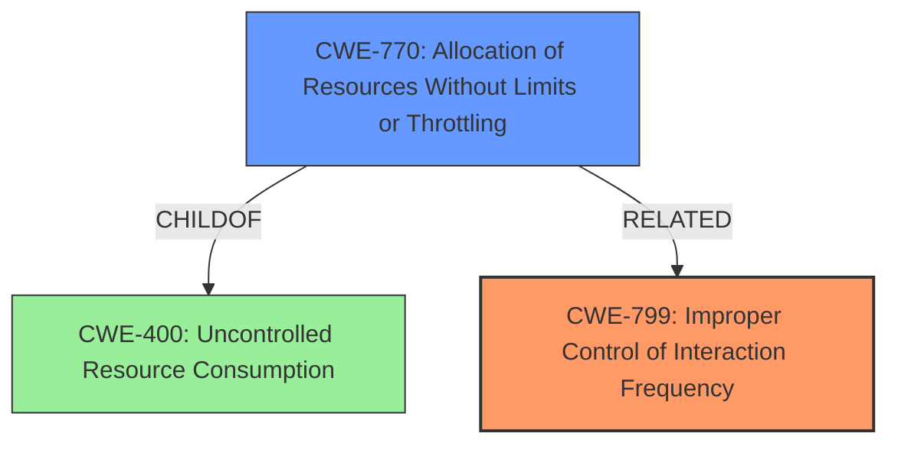

# Analysis for CVE-2020-4890

# Summary
| CWE ID | CWE Name | Confidence | CWE Abstraction Level | CWE Vulnerability Mapping Label | CWE-Vulnerability Mapping Notes |
|---|---|---|---|---|---|
| CWE-799 | Improper Control of Interaction Frequency | 0.9 | Class | Allowed-with-Review | Primary CWE |
| CWE-770 | Allocation of Resources Without Limits or Throttling | 0.7 | Base | Allowed | Secondary Candidate |

## Evidence and Confidence

*   **Confidence Score:** 0.8
*   **Evidence Strength:** MEDIUM

## Relationship Analysis
The primary relationship influencing the selection was the direct match of the vulnerability description to CWE-799, as the **weak or absense of rate limiting** directly relates to the improper control of interaction frequency. CWE-799 is a Class-level CWE, suggesting exploration of more specific Base-level children, which led to the consideration of CWE-770. CWE-770 is a child of CWE-400 (Resource Exhaustion), indicating a potential relationship to denial-of-service impacts.



## Vulnerability Chain
The vulnerability chain begins with the **weak or absense of rate limiting** (CWE-799), which leads to the allocation of resources without limits or throttling (CWE-770), eventually resulting in a denial-of-service (CWE-400) impact. The initial flaw is the lack of proper control over interaction frequency, and the final impact is the inability of legitimate users to access the service.

## Summary of Analysis
The initial assessment focused on the **root cause** of **weak or absense of rate limiting**, which led to the selection of CWE-799 (Improper Control of Interaction Frequency) as the primary CWE. This selection is directly supported by the vulnerability description and the "Vulnerability Description Key Phrases" section. The retriever results also highlighted CWE-799 as a top candidate.

Further analysis considered the impact of the vulnerability, which is a denial of service. This prompted an examination of CWE relationships, particularly child CWEs of CWE-799 and CWE-400, leading to the inclusion of CWE-770 (Allocation of Resources Without Limits or Throttling) as a secondary candidate.

The final decision to prioritize CWE-799 and include CWE-770 as a secondary mapping is based on the available evidence and the desire to provide the most specific and accurate classification possible. The evidence explicitly mentions rate limiting, and the CWE descriptions align well with the vulnerability's technical details.

Relevant CWE Information:

# Enhanced Context (25 CWEs)

## CWE-274: Improper Handling of Insufficient Privileges
**Abstraction Level**: Base
**Similarity Score**: 0.79
**Source**: dense

**Description**:
The product does not handle or incorrectly handles when it has insufficient privileges to perform an operation, leading to resultant weaknesses.

**Mapping Guidance**:
- Usage: Discouraged
- Rationale: This CWE entry could be deprecated in a future version of CWE.

*Why it was not selected:* This CWE is not applicable because the vulnerability is not related to insufficient privileges.

## CWE-653: Improper Isolation or Compartmentalization
**Abstraction Level**: Class
**Similarity Score**: 0.78
**Source**: dense

**Description**:
The product does not properly compartmentalize or isolate functionality, processes, or resources that require different privilege levels, rights, or permissions.

**Mapping Guidance**:
- Usage: Allowed
- Rationale: This CWE entry is at the Base level of abstraction, which is a preferred level of abstraction for mapping to the root causes of vulnerabilities.

*Why it was not selected:* This CWE is not applicable because the vulnerability is not related to improper isolation or compartmentalization.

## CWE-280: Improper Handling of Insufficient Permissions or Privileges
**Abstraction Level**: Base
**Similarity Score**: 0.77
**Source**: dense

**Description**:
The product does not handle or incorrectly handles when it has insufficient privileges to access resources or functionality as specified by their permissions. This may cause it to follow unexpected code paths that may leave the product in an invalid state.

**Mapping Guidance**:
- Usage: Allowed
- Rationale: This CWE entry is at the Base level of abstraction, which is a preferred level of abstraction for mapping to the root causes of vulnerabilities.

*Why it was not selected:* This CWE is not applicable because the vulnerability is not related to insufficient permissions or privileges.

## CWE-799: Improper Control of Interaction Frequency
**Abstraction Level**: Class
**Similarity Score**: 0.76
**Source**: dense

**Description**:
The product does not properly limit the number or frequency of interactions that it has with an actor, such as the number of incoming requests.

**Mapping Guidance**:
- Usage: Allowed-with-Review
- Rationale: This CWE entry is a Class and might have Base-level children that would be more appropriate

*Why it was selected:* This is the primary CWE because the vulnerability is due to **weak or absense of rate limiting**.

## CWE-266: Incorrect Privilege Assignment
**Abstraction Level**: Base
**Similarity Score**: 0.76
**Source**: dense

**Description**:
A product incorrectly assigns a privilege to a particular actor, creating an unintended sphere of control for that actor.

**Mapping Guidance**:
- Usage: Allowed
- Rationale: This CWE entry is at the Base level of abstraction, which is a preferred level of abstraction for mapping to the root causes of vulnerabilities.

*Why it was not selected:* This CWE is not applicable because the vulnerability is not related to incorrect privilege assignment.

## CWE-664: Improper Control of a Resource Through its Lifetime
**Abstraction Level**: Pillar
**Similarity Score**: 0.76
**Source**: dense

**Description**:
The product does not maintain or incorrectly maintains control over a resource throughout its lifetime of creation, use, and release.

**Mapping Guidance**:
- Usage: Discouraged
- Rationale: This CWE entry is high-level when lower-level children are available.

*Why it was not selected:* This CWE is too abstract and does not directly address the specific issue of rate limiting.

## CWE-668: Exposure of Resource to Wrong Sphere
**Abstraction Level**: Class
**Similarity Score**: 0.76
**Source**: dense

**Description**:
The product exposes a resource to the wrong control sphere, providing unintended actors with inappropriate access to the resource.

**Mapping Guidance**:
- Usage: Discouraged
- Rationale: CWE-668 is high-level and is often misused as a catch-all when lower-level CWE IDs might be applicable. It is sometimes used for low-information vulnerability reports [REF-1287]. It is a level-1 Class (i.e., a child of a Pillar). It is not useful for trend analysis.

*Why it was not selected:* This CWE is too abstract and does not directly address the specific issue of rate limiting.

## CWE-405: Asymmetric Resource Consumption (Amplification)
**Abstraction Level**: Class
**Similarity Score**: 0.76
**Source**: dense

**Description**:
The product does not properly control situations in which an adversary can cause the product to consume or produce excessive resources without requiring the adversary to invest equivalent work or otherwise prove authorization, i.e., the adversary's influence is "asymmetric."

**Mapping Guidance**:
- Usage: Allowed-with-Review
- Rationale: This CWE entry is a Class and might have Base-level children that would be more appropriate

*Why it was not selected:* While the vulnerability could lead to asymmetric resource consumption, the root cause is the lack of rate limiting.

## CWE-807: Reliance on Untrusted Inputs in a Security Decision
**Abstraction Level**: Base
**Similarity Score**: 0.76
**Source**: dense

**Description**:
The product uses a protection mechanism that relies on the existence or values of an input, but the input can be modified by an untrusted actor in a way that bypasses the protection mechanism.

**Mapping Guidance**:
- Usage: Allowed
- Rationale: This CWE entry is at the Base level of abstraction, which is a preferred level of abstraction for mapping to the root causes of vulnerabilities.

*Why it was not selected:* This CWE is not applicable because the vulnerability is not related to reliance on untrusted inputs in a security decision.

## CWE-404: Improper Resource Shutdown or Release
**Abstraction Level**: Class
**Similarity Score**: 0.76
**Source**: dense

# Enhanced Query for CVE-2020-4890

## Vulnerability Description
IBM Spectrum Scale 5.0.0 through 5.0.5.5 and 5.1.0 through 5.1.0.2 could allow a local user with a valid role to the REST API to cause a denial of service due to **weak or absense of rate limiting**. IBM X-Force ID 190973.

### Vulnerability Description Key Phrases
- **rootcause:** **weak or absense of rate limiting**
- **impact:** denial of service
- **attacker:** local user with a valid role to the REST API
- **product:** IBM Spectrum Scale
- **version:** 5.0.0 through 5.0.5.5 and 5.1.0 through 5.1.0.2

## CVE Reference Links Content Summary
```
{
  "vulnerability_details": {
    "root_cause": "Vulnerabilities exist in all levels of IBM Spectrum Scale GUI.",
    "weaknesses": [
      "Multiple unspecified vulnerabilities in the IBM Spectrum Scale GUI."
    ],
    "impact": "Unspecified impact due to vulnerabilities in the IBM Spectrum Scale GUI.",
    "attack_vectors": "Through the IBM Spectrum Scale GUI.",
    "required_capabilities": "An attacker would need to interact with the affected IBM Spectrum Scale GUI."
  },
  "affected_products": [
    {
      "product": "IBM Spectrum Scale",
      "versions": ["5.0.0 - 5.0.5.5", "5.1.0 - 5.1.0.2"]
    }
  ],
  "remediation": "Apply fix V5.0.5.6 for versions 5.0.0.0 through 5.0.5.5 or V5.1.0.3 for versions 5.1.0 through 5.1.0.2",
  "additional_notes": "The provided content indicates multiple unspecified vulnerabilities. It does not provide information on specific vulnerabilities, such as the type of weaknesses (e.g., XSS, SQL injection), or the specific impact and exploitation details. No workarounds or mitigations are mentioned."
}
```

## Retriever Results

### Top Combined Results

| Rank | CWE ID | Name | Abstraction | Usage  | Retrievers | Individual Scores |
|------|--------|------|-------------|-------|------------|-------------------|
| 1 | 799 | Improper Control of Interaction Frequency | Class | Allowed-with-Review | sparse | 0.481 |
| 2 | 307 | Improper Restriction of Excessive Authentication Attempts | Base | Allowed | sparse | 0.385 |
| 3 | 327 | Use of a Broken or Risky Cryptographic Algorithm | Class | Allowed-with-Review | sparse | 0.291 |
| 4 | 326 | Inadequate Encryption Strength | Class | Allowed-with-Review | sparse | 0.288 |
| 5 | 117 | Improper Output Neutralization for Logs | Base | Allowed | sparse | 0.287 |
| 6 | 770 | Allocation of Resources Without Limits or Throttling | Base | Allowed | dense | 0.587 |
| 7 | 410 | Insufficient Resource Pool | Base | Allowed | graph | 0.003 |
| 8 | 209 | Generation of Error Message Containing Sensitive Information | Base | Allowed | sparse | 0.279 |
| 9 | 328 | Use of Weak Hash | Base | Allowed | sparse | 0.276 |
| 10 | 269 | Improper Privilege Management | Class | Discouraged | sparse | 0.275 |


# Complete CWE Specifications


## CWE-799: Improper Control of Interaction Frequency
**Abstraction:** Class
**Status:** Incomplete

### Description
The product does not properly limit the number or frequency of interactions that it has with an actor, such as the number of incoming requests.

### Extended Description
This can allow the actor to perform actions more frequently than expected. The actor could be a human or an automated process such as a virus or bot. This could be used to cause a denial of service, compromise program logic (such as limiting humans to a single vote), or other consequences. For example, an authentication routine might not limit the number of times an attacker can guess a password. Or, a web site might conduct a poll but only expect humans to vote a maximum of once a day.

### Alternative Terms
Insufficient anti-automation: The term "insufficient anti-automation" focuses primarly on non-human actors such as viruses or bots, but the scope of this CWE entry is broader.
Brute force: Vulnerabilities that can be targeted using brute force attacks are often symptomatic of this weakness.

### Relationships
ChildOf -> CWE-691

### Mapping Guidance
**Usage:** Allowed-with-Review
**Rationale:** This CWE entry is a Class and might have Base-level children that would be more appropriate
**Comments:** Examine children of this entry to see if there is a better fit
**Reasons:**
- Abstraction


### Observed Examples
- **CVE-2002-1876:** Mail server allows attackers to prevent other users from accessing mail by sending large number of rapid requests.


## CWE-307: Improper Restriction of Excessive Authentication Attempts
**Abstraction:** Base
**Status:** Draft

### Description
The product does not implement sufficient measures to prevent multiple failed authentication attempts within a short time frame.

### Extended Description
Not provided

### Alternative Terms
None

### Relationships
ChildOf -> CWE-1390
ChildOf -> CWE-287
ChildOf -> CWE-799

### Mapping Guidance
**Usage:** Allowed
**Rationale:** This CWE entry is at the Base level of abstraction, which is a preferred level of abstraction for mapping to the root causes of vulnerabilities.
**Comments:** Carefully read both the name and description to ensure that this mapping is an appropriate fit. Do not try to 'force' a mapping to a lower-level Base/Variant simply to comply with this preferred level of abstraction.
**Reasons:**
- Acceptable-Use


### Observed Examples
- **CVE-2019-0039:** the REST API for a network OS has a high limit for number of connections, allowing brute force password guessing
- **CVE-1999-1152:** Product does not disconnect or timeout after multiple failed logins.
- **CVE-2001-1291:** Product does not disconnect or timeout after multiple failed logins.


## CWE-327: Use of a Broken or Risky Cryptographic Algorithm
**Abstraction:** Class
**Status:** Draft

### Description
The product uses a broken or risky cryptographic algorithm or protocol.

### Extended Description


Cryptographic algorithms are the methods by which data is scrambled to prevent observation or influence by unauthorized actors. Insecure cryptography can be exploited to expose sensitive information, modify data in unexpected ways, spoof identities of other users or devices, or other impacts.


It is very difficult to produce a secure algorithm, and even high-profile algorithms by accomplished cryptographic experts have been broken. Well-known techniques exist to break or weaken various kinds of cryptography. Accordingly, there are a small number of well-understood and heavily studied algorithms that should be used by most products. Using a non-standard or known-insecure algorithm is dangerous because a determined adversary may be able to break the algorithm and compromise whatever data has been protected.


Since the state of cryptography advances so rapidly, it is common for an algorithm to be considered "unsafe" even if it was once thought to be strong. This can happen when new attacks are discovered, or if computing power increases so much that the cryptographic algorithm no longer provides the amount of protection that was originally thought.


For a number of reasons, this weakness is even more challenging to manage with hardware deployment of cryptographic algorithms as opposed to software implementation. First, if a flaw is discovered with hardware-implemented cryptography, the flaw cannot be fixed in most cases without a recall of the product, because hardware is not easily replaceable like software. Second, because the hardware product is expected to work for years, the adversary's computing power will only increase over time.


### Alternative Terms
None

### Relationships
ChildOf -> CWE-693
PeerOf -> CWE-311

### Mapping Guidance
**Usage:** Allowed-with-Review
**Rationale:** This CWE entry is a Class and might have Base-level children that would be more appropriate
**Comments:** Examine children of this entry to see if there is a better fit
**Reasons:**
- Abstraction


### Additional Notes
**[Maintenance]** Since CWE 4.4, various cryptography-related entries, including CWE-327 and CWE-1240, have been slated for extensive research, analysis, and community consultation to define consistent terminology, improve relationships, and reduce overlap or duplication. As of CWE 4.6, this work is still ongoing.

**[Maintenance]** The Taxonomy_Mappings to ISA/IEC 62443 were added in CWE 4.10, but they are still under review and might change in future CWE versions. These draft mappings were performed by members of the "Mapping CWE to 62443" subgroup of the CWE-CAPEC ICS/OT Special Interest Group (SIG), and their work is incomplete as of CWE 4.10. The mappings are included to facilitate discussion and review by the broader ICS/OT community, and they are likely to change in future CWE versions.


### Observed Examples
- **CVE-2022-30273:** SCADA-based protocol supports a legacy encryption mode that uses Tiny Encryption Algorithm (TEA) in ECB mode, which leaks patterns in messages and cannot protect integrity
- **CVE-2022-30320:** Programmable Logic Controller (PLC) uses a protocol with a cryptographically insecure hashing algorithm for passwords.
- **CVE-2008-3775:** Product uses "ROT-25" to obfuscate the password in the registry.


## CWE-326: Inadequate Encryption Strength
**Abstraction:** Class
**Status:** Draft

### Description
The product stores or transmits sensitive data using an encryption scheme that is theoretically sound, but is not strong enough for the level of protection required.

### Extended Description
A weak encryption scheme can be subjected to brute force attacks that have a reasonable chance of succeeding using current attack methods and resources.

### Alternative Terms
None

### Relationships
ChildOf -> CWE-693

### Mapping Guidance
**Usage:** Allowed-with-Review
**Rationale:** This CWE entry is a Class and might have Base-level children that would be more appropriate
**Comments:** Examine children of this entry to see if there is a better fit
**Reasons:**
- Abstraction


### Observed Examples
- **CVE-2001-1546:** Weak encryption
- **CVE-2004-2172:** Weak encryption (chosen plaintext attack)
- **CVE-2002-1682:** Weak encryption


## CWE-117: Improper Output Neutralization for Logs
**Abstraction:** Base
**Status:** Draft

### Description
The product does not neutralize or incorrectly neutralizes output that is written to logs.

### Extended Description


This can allow an attacker to forge log entries or inject malicious content into logs.


Log forging vulnerabilities occur when:


  1. Data enters an application from an untrusted source.

  1. The data is written to an application or system log file.


### Alternative Terms
None

### Relationships
ChildOf -> CWE-116
ChildOf -> CWE-20

### Mapping Guidance
**Usage:** Allowed
**Rationale:** This CWE entry is at the Base level of abstraction, which is a preferred level of abstraction for mapping to the root causes of vulnerabilities.
**Comments:** Carefully read both the name and description to ensure that this mapping is an appropriate fit. Do not try to 'force' a mapping to a lower-level Base/Variant simply to comply with this preferred level of abstraction.
**Reasons:**
- Acceptable-Use


### Observed Examples
- **CVE-2006-4624:** Chain: inject fake log entries with fake timestamps using CRLF injection


## CWE-770: Allocation of Resources Without Limits or Throttling
**Abstraction:** Base
**Status:** Incomplete

### Description
The product allocates a reusable resource or group of resources on behalf of an actor without imposing any restrictions on the size or number of resources that can be allocated, in violation of the intended security policy for that actor.

### Extended Description


Code frequently has to work with limited resources, so programmers must be careful to ensure that resources are not consumed too quickly, or too easily. Without use of quotas, resource limits, or other protection mechanisms, it can be easy for an attacker to consume many resources by rapidly making many requests, or causing larger resources to be used than is needed. When too many resources are allocated, or if a single resource is too large, then it can prevent the code from working correctly, possibly leading to a denial of service.


### Alternative Terms
None

### Relationships
ChildOf -> CWE-400
ChildOf -> CWE-665
ChildOf -> CWE-400

### Mapping Guidance
**Usage:** Allowed
**Rationale:** This CWE entry is at the Base level of abstraction, which is a preferred level of abstraction for mapping to the root causes of vulnerabilities.
**Comments:** Carefully read both the name and description to ensure that this mapping is an appropriate fit. Do not try to 'force' a mapping to a lower-level Base/Variant simply to comply with this preferred level of abstraction.
**Reasons:**
- Acceptable-Use


### Additional Notes
**[Relationship]** This entry is different from uncontrolled resource consumption (CWE-400) in that there are other weaknesses that are related to inability to control resource consumption, such as holding on to a resource too long after use, or not correctly keeping track of active resources so that they can be managed and released when they are finished (CWE-771).

**[Theoretical]** Vulnerability theory is largely about how behaviors and resources interact. "Resource exhaustion" can be regarded as either a consequence or an attack, depending on the perspective. This entry is an attempt to reflect one of the underlying weaknesses that enable these attacks (or consequences) to take place.


### Observed Examples
- **CVE-2022-21668:** Chain: Python library does not limit the resources used to process images that specify a very large number of bands (CWE-1284), leading to excessive memory consumption (CWE-789) or an integer overflow (CWE-190).
- **CVE-2009-4017:** Language interpreter does not restrict the number of temporary files being created when handling a MIME request with a large number of parts..
- **CVE-2009-2726:** Driver does not use a maximum width when invoking sscanf style functions, causing stack consumption.


## CWE-410: Insufficient Resource Pool
**Abstraction:** Base
**Status:** Incomplete

### Description
The product's resource pool is not large enough to handle peak demand, which allows an attacker to prevent others from accessing the resource by using a (relatively) large number of requests for resources.

### Extended Description
Frequently the consequence is a "flood" of connection or sessions.

### Alternative Terms
None

### Relationships
ChildOf -> CWE-664
CanPrecede -> CWE-400

### Mapping Guidance
**Usage:** Allowed
**Rationale:** This CWE entry is at the Base level of abstraction, which is a preferred level of abstraction for mapping to the root causes of vulnerabilities.
**Comments:** Carefully read both the name and description to ensure that this mapping is an appropriate fit. Do not try to 'force' a mapping to a lower-level Base/Variant simply to comply with this preferred level of abstraction.
**Reasons:**
- Acceptable-Use


### Observed Examples
- **CVE-1999-1363:** Large number of locks on file exhausts the pool and causes crash.
- **CVE-2001-1340:** Product supports only one connection and does not disconnect a user who does not provide credentials.
- **CVE-2002-0406:** Large number of connections without providing credentials allows connection exhaustion.


## CWE-209: Generation of Error Message Containing Sensitive Information
**Abstraction:** Base
**Status:** Draft

### Description
The product generates an error message that includes sensitive information about its environment, users, or associated data.

### Extended Description


The sensitive information may be valuable information on its own (such as a password), or it may be useful for launching other, more serious attacks. The error message may be created in different ways:


  - self-generated: the source code explicitly constructs the error message and delivers it

  - externally-generated: the external environment, such as a language interpreter, handles the error and constructs its own message, whose contents are not under direct control by the programmer

An attacker may use the contents of error messages to help launch another, more focused attack. For example, an attempt to exploit a path traversal weakness (CWE-22) might yield the full pathname of the installed application. In turn, this could be used to select the proper number of ".." sequences to navigate to the targeted file. An attack using SQL injection (CWE-89) might not initially succeed, but an error message could reveal the malformed query, which would expose query logic and possibly even passwords or other sensitive information used within the query.

### Alternative Terms
None

### Relationships
ChildOf -> CWE-200
ChildOf -> CWE-200
ChildOf -> CWE-755

### Mapping Guidance
**Usage:** Allowed
**Rationale:** This CWE entry is at the Base level of abstraction, which is a preferred level of abstraction for mapping to the root causes of vulnerabilities.
**Comments:** Carefully read both the name and description to ensure that this mapping is an appropriate fit. Do not try to 'force' a mapping to a lower-level Base/Variant simply to comply with this preferred level of abstraction.
**Reasons:**
- Acceptable-Use


### Observed Examples
- **CVE-2008-2049:** POP3 server reveals a password in an error message after multiple APOP commands are sent. Might be resultant from another weakness.
- **CVE-2007-5172:** Program reveals password in error message if attacker can trigger certain database errors.
- **CVE-2008-4638:** Composite: application running with high privileges (CWE-250) allows user to specify a restricted file to process, which generates a parsing error that leaks the contents of the file (CWE-209).


## CWE-328: Use of Weak Hash
**Abstraction:** Base
**Status:** Draft

### Description
The product uses an algorithm that produces a digest (output value) that does not meet security expectations for a hash function that allows an adversary to reasonably determine the original input (preimage attack), find another input that can produce the same hash (2nd preimage attack), or find multiple inputs that evaluate to the same hash (birthday attack).

### Extended Description


A hash function is defined as an algorithm that maps arbitrarily sized data into a fixed-sized digest (output) such that the following properties hold:


  1. The algorithm is not invertible (also called "one-way" or "not reversible")

  1. The algorithm is deterministic; the same input produces the same digest every time

 Building on this definition, a cryptographic hash function must also ensure that a malicious actor cannot leverage the hash function to have a reasonable chance of success at determining any of the following:

  1. the original input (preimage attack), given only the digest

  1. another input that can produce the same digest (2nd preimage attack), given the original input

  1. a set of two or more inputs that evaluate to the same digest (birthday attack), given the actor can arbitrarily choose the inputs to be hashed and can do so a reasonable amount of times

What is regarded as "reasonable" varies by context and threat model, but in general, "reasonable" could cover any attack that is more efficient than brute force (i.e., on average, attempting half of all possible combinations). Note that some attacks might be more efficient than brute force but are still not regarded as achievable in the real world.

Any algorithm that does not meet the above conditions will generally be considered weak for general use in hashing.


In addition to algorithmic weaknesses, a hash function can be made weak by using the hash in a security context that breaks its security guarantees. For example, using a hash function without a salt for storing passwords (that are sufficiently short) could enable an adversary to create a "rainbow table" [REF-637] to recover the password under certain conditions; this attack works against such hash functions as MD5, SHA-1, and SHA-2.


### Alternative Terms
None

### Relationships
ChildOf -> CWE-326
ChildOf -> CWE-327

### Mapping Guidance
**Usage:** Allowed
**Rationale:** This CWE entry is at the Base level of abstraction, which is a preferred level of abstraction for mapping to the root causes of vulnerabilities.
**Comments:** Carefully read both the name and description to ensure that this mapping is an appropriate fit. Do not try to 'force' a mapping to a lower-level Base/Variant simply to comply with this preferred level of abstraction.
**Reasons:**
- Acceptable-Use


### Additional Notes
**[Maintenance]** Since CWE 4.4, various cryptography-related entries including CWE-328 have been slated for extensive research, analysis, and community consultation to define consistent terminology, improve relationships, and reduce overlap or duplication. As of CWE 4.6, this work is still ongoing.


### Observed Examples
- **CVE-2022-30320:** Programmable Logic Controller (PLC) uses a protocol with a cryptographically insecure hashing algorithm for passwords.
- **CVE-2005-4900:** SHA-1 algorithm is not collision-resistant.
- **CVE-2020-25685:** DNS product uses a weak hash (CRC32 or SHA-1) of the query name, allowing attacker to forge responses by computing domain names with the same hash.


## CWE-269: Improper Privilege Management
**Abstraction:** Class
**Status:** Draft

### Description
The product does not properly assign, modify, track, or check privileges for an actor, creating an unintended sphere of control for that actor.

### Extended Description
Not provided

### Alternative Terms
None

### Relationships
ChildOf -> CWE-284

### Mapping Guidance
**Usage:** Discouraged
**Rationale:** CWE-269 is commonly misused. It can be conflated with "privilege escalation," which is a technical impact that is listed in many low-information vulnerability reports [REF-1287]. It is not useful for trend analysis.
**Comments:** If an error or mistake allows privilege escalation, then use the CWE ID for that mistake. Avoid using CWE-269 when only phrases such as "privilege escalation" or "gain privileges" are available, as these indicate technical impact of the vulnerability - not the root cause weakness. If the root cause seems to be directly related to privileges, then examine the children of CWE-269 for additional hints, such as Execution with Unnecessary Privileges (CWE-250) or Incorrect Privilege Assignment (CWE-266).
**Reasons:**
- Frequent Misuse


### Additional Notes
**[Maintenance]** The relationships between privileges, permissions, and actors (e.g. users and groups) need further refinement within the Research view. One complication is that these concepts apply to two different pillars, related to control of resources (CWE-664) and protection mechanism failures (CWE-693).


### Observed Examples
- **CVE-2001-1555:** Terminal privileges are not reset when a user logs out.
- **CVE-2001-1514:** Does not properly pass security context to child processes in certain cases, allows privilege escalation.
- **CVE-2001-0128:** Does not properly compute roles.

