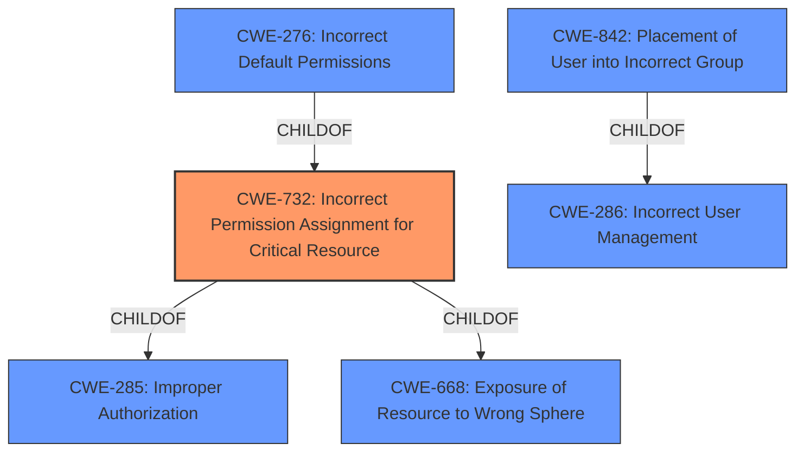

# Raw Analyzer Response for CVE-2020-4945

# Summary
| CWE ID | CWE Name | Confidence | CWE Abstraction Level | CWE Vulnerability Mapping Label | CWE-Vulnerability Mapping Notes |
|---|---|---|---|---|---|
| CWE-732 | Incorrect Permission Assignment for Critical Resource | 0.9 | Class | Allowed-with-Review | Primary CWE |
| CWE-276 | Incorrect Default Permissions | 0.7 | Base | Allowed | Secondary Candidate |
| CWE-842 | Placement of User into Incorrect Group | 0.6 | Base | Allowed | Secondary Candidate |

## Evidence and Confidence

*   **Confidence Score:** 0.9
*   **Evidence Strength:** HIGH

## Relationship Analysis
The primary CWE, CWE-732 **Incorrect Permission Assignment for Critical Resource**, is a child of CWE-285 **Improper Authorization** and CWE-668 **Exposure of Resource to Wrong Sphere**. CWE-276 **Incorrect Default Permissions** is a child of CWE-732. CWE-842 **Placement of User into Incorrect Group** is a child of CWE-286 **Incorrect User Management**. The selection of CWE-732 is preferred because it more closely aligns with the description of the vulnerability.

## Vulnerability Chain
The chain of weaknesses starts with **improper group permissions**, which leads to an authenticated user being able to overwrite arbitrary files.

## Summary of Analysis
The initial analysis identified that the **improper group permissions** allowed authenticated users to overwrite arbitrary files. The evidence from the "Vulnerability Description Key Phrases" and "CVE Reference Links Content Summary" sections support this. The primary CWE selected is CWE-732 **Incorrect Permission Assignment for Critical Resource**. The retriever results also listed CWE-732 as the top match.

The vulnerability description states: "IBM Db2 for Linux, UNIX and Windows (includes Db2 Connect Server) 11.5 could allow an authenticated user to overwrite arbirary files due to **improper group permissions**." The "CVE Reference Links Content Summary" section states: "**Root Cause of Vulnerability**: Improper group permissions within IBM Db2 on Linux and Unix platforms allow an authenticated user to overwrite arbitrary files." This provides strong evidence for the chosen mapping.

CWE-732 is at the Class level, but is preferred because it directly addresses the **improper permission assignment** aspect of the vulnerability. Although MITRE's mapping guidance advises caution due to potential misuse and suggests considering authorization weaknesses, the provided information clearly points to an issue with permission assignment rather than a broader authorization failure.

CWE-276 **Incorrect Default Permissions** was considered because the root cause could be due to incorrect default permissions set during installation. However, the vulnerability description focuses on the **improper group permissions** themselves, rather than how they were initially configured. Therefore, CWE-732 is a more accurate representation.

CWE-842 **Placement of User into Incorrect Group** was also considered, as the issue could be related to users being placed in the wrong group, which then leads to the ability to overwrite arbitrary files. However, the provided information does not explicitly mention incorrect group assignments; it only highlights the **improper group permissions**. Therefore, CWE-732 is a better fit.

The selected CWE-732 is at the optimal level of specificity because it accurately captures the core issue of **improper permission assignment** for a critical resource, which in this case, allows authenticated users to overwrite arbitrary files.

Relevant CWE Information:

# Enhanced Context (25 CWEs)
The following CWEs were identified as potentially relevant to this vulnerability:

## CWE-274: Improper Handling of Insufficient Privileges
**Abstraction Level**: Base
**Similarity Score**: 0.78
**Source**: dense

**Description**:
The product does not handle or incorrectly handles when it has insufficient privileges to perform an operation, leading to resultant weaknesses.

**Mapping Guidance**:
- Usage: Discouraged
- Rationale: This CWE entry could be deprecated in a future version of CWE.

## CWE-280: Improper Handling of Insufficient Permissions or Privileges 
**Abstraction Level**: Base
**Similarity Score**: 0.78
**Source**: dense

**Description**:
The product does not handle or incorrectly handles when it has insufficient privileges to access resources or functionality as specified by their permissions. This may cause it to follow unexpected code paths that may leave the product in an invalid state.

**Mapping Guidance**:
- Usage: Allowed
- Rationale: This CWE entry is at the Base level of abstraction, which is a preferred level of abstraction for mapping to the root causes of vulnerabilities.

## CWE-1220: Insufficient Granularity of Access Control
**Abstraction Level**: Base
**Similarity Score**: 0.76
**Source**: dense

**Description**:
The product implements access controls via a policy or other feature with the intention to disable or restrict accesses (reads and/or writes) to assets in a system from untrusted agents. However, implemented access controls lack required granularity, which renders the control policy too broad because it allows accesses from unauthorized agents to the security-sensitive assets.

**Mapping Guidance**:
- Usage: Allowed
- Rationale: This CWE entry is at the Base level of abstraction, which is a preferred level of abstraction for mapping to the root causes of vulnerabilities.

## CWE-653: Improper Isolation or Compartmentalization
**Abstraction Level**: Class
**Similarity Score**: 0.75
**Source**: dense

**Description**:
The product does not properly compartmentalize or isolate functionality, processes, or resources that require different privilege levels, rights, or permissions.

**Mapping Guidance**:
- Usage: Allowed
- Rationale: This CWE entry is at the Base level of abstraction, which is a preferred level of abstraction for mapping to the root causes of vulnerabilities.

## CWE-664: Improper Control of a Resource Through its Lifetime
**Abstraction Level**: Pillar
**Similarity Score**: 0.75
**Source**: dense

**Description**:
The product does not maintain or incorrectly maintains control over a resource throughout its lifetime of creation, use, and release.

**Mapping Guidance**:
- Usage: Discouraged
- Rationale: This CWE entry is high-level when lower-level children are available.

## CWE-266: Incorrect Privilege Assignment
**Abstraction Level**: Base
**Similarity Score**: 0.75
**Source**: dense

**Description**:
A product incorrectly assigns a privilege to a particular actor, creating an unintended sphere of control for that actor.

**Mapping Guidance**:
- Usage: Allowed
- Rationale: This CWE entry is at the Base level of abstraction, which is a preferred level of abstraction for mapping to the root causes of vulnerabilities.

## CWE-807: Reliance on Untrusted Inputs in a Security Decision
**Abstraction Level**: Base
**Similarity Score**: 0.75
**Source**: dense

**Description**:
The product uses a protection mechanism that relies on the existence or values of an input, but the input can be modified by an untrusted actor in a way that bypasses the protection mechanism.

**Mapping Guidance**:
- Usage: Allowed
- Rationale: This CWE entry is at the Base level of abstraction, which is a preferred level of abstraction for mapping to the root causes of vulnerabilities.

## CWE-668: Exposure of Resource to Wrong Sphere
**Abstraction Level**: Class
**Similarity Score**: 0.75
**Source**: dense

**Description**:
The product exposes a resource to the wrong control sphere, providing unintended actors with inappropriate access to the resource.

**Mapping Guidance**:
- Usage: Discouraged
- Rationale: CWE-668 is high-level and is often misused as a catch-all when lower-level CWE IDs might be applicable. It is sometimes used for low-information vulnerability reports [REF-1287]. It is a level-1 Class (i.e., a child of a Pillar). It is not useful for trend analysis.

## CWE-639: Authorization Bypass Through User-Controlled Key
**Abstraction Level**: Base
**Similarity Score**: 0.75