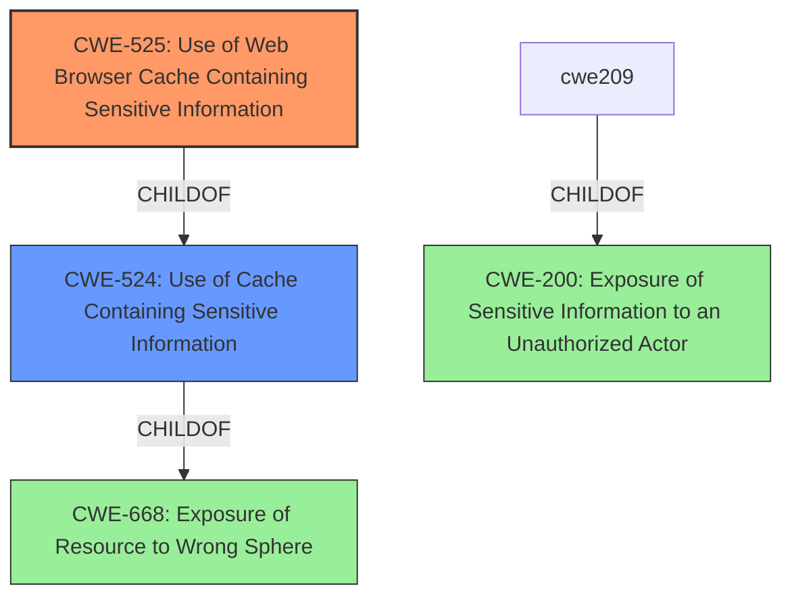

# Analysis for CVE-2020-4951

# Summary
| CWE ID | CWE Name | Confidence | CWE Abstraction Level | CWE Vulnerability Mapping Label | CWE-Vulnerability Mapping Notes |
|---|---|---|---|---|---|
| CWE-525 | Use of Web Browser Cache Containing Sensitive Information | 0.9 | Variant | Allowed | Primary CWE |
| CWE-524 | Use of Cache Containing Sensitive Information | 0.7 | Base | Allowed | Secondary CWE |
| CWE-200 | Exposure of Sensitive Information to an Unauthorized Actor | 0.5 | Class | Discouraged | Secondary CWE |

## Evidence and Confidence

*   **Confidence Score:** 0.8
*   **Evidence Strength:** MEDIUM

## Relationship Analysis
The primary CWE, CWE-525 (Use of Web Browser Cache Containing Sensitive Information), is a variant of CWE-524 (Use of Cache Containing Sensitive Information). CWE-524 is a child of CWE-668 (Exposure of Resource to Wrong Sphere). The hierarchy guides us to choose CWE-525 because it is the most specific. CWE-200 is a high level Class that is not recommended.

## Vulnerability Chain
The vulnerability chain starts with the application's **improper use of the web browser cache** to store sensitive information. This leads to the **exposure of sensitive information** to a local attacker who can access the cached data.

## Summary of Analysis
The initial assessment focused on identifying the root cause of the vulnerability, which lies in the application's handling of sensitive data within the browser cache. The vulnerability description explicitly mentions "locally cached browser data, that could allow a local attacker to obtain sensitive information." This statement directly supports the selection of CWE-525 (Use of Web Browser Cache Containing Sensitive Information) as the primary CWE.

The Retriever Results also highlighted CWE-525 as the top candidate, further solidifying this choice. The relationship analysis confirmed that CWE-525 is a variant of CWE-524, making it the most specific and appropriate option.

CWE-200 (Exposure of Sensitive Information to an Unauthorized Actor) was considered but ultimately deemed less suitable as it represents the impact rather than the root cause. While the vulnerability does result in the exposure of sensitive information, the underlying issue is the **improper caching mechanism**.
The final decision is based on the evidence from the vulnerability description, the Retriever Results, and the relationship analysis, which all point to CWE-525 as the most accurate representation of the vulnerability.

Relevant CWE Information:

# Enhanced Context (25 CWEs)
The following CWEs were identified as potentially relevant to this vulnerability:

## CWE-668: Exposure of Resource to Wrong Sphere
**Abstraction Level**: Class
**Similarity Score**: 0.79
**Source**: dense

**Description**:
The product exposes a resource to the wrong control sphere, providing unintended actors with inappropriate access to the resource.

**Mapping Guidance**:
- Usage: Discouraged
- Rationale: CWE-668 is high-level and is often misused as a catch-all when lower-level CWE IDs might be applicable. It is sometimes used for low-information vulnerability reports [REF-1287]. It is a level-1 Class (i.e., a child of a Pillar). It is not useful for trend analysis.

## CWE-274: Improper Handling of Insufficient Privileges
**Abstraction Level**: Base
**Similarity Score**: 0.79
**Source**: dense

**Description**:
The product does not handle or incorrectly handles when it has insufficient privileges to perform an operation, leading to resultant weaknesses.

**Mapping Guidance**:
- Usage: Discouraged
- Rationale: This CWE entry could be deprecated in a future version of CWE.

## CWE-267: Privilege Defined With Unsafe Actions
**Abstraction Level**: Base
**Similarity Score**: 0.79
**Source**: dense

**Description**:
A particular privilege, role, capability, or right can be used to perform unsafe actions that were not intended, even when it is assigned to the correct entity.

**Mapping Guidance**:
- Usage: Allowed
- Rationale: This CWE entry is at the Base level of abstraction, which is a preferred level of abstraction for mapping to the root causes of vulnerabilities.

## CWE-212: Improper Removal of Sensitive Information Before Storage or Transfer
**Abstraction Level**: Base
**Similarity Score**: 0.79
**Source**: dense

**Description**:
The product stores, transfers, or shares a resource that contains sensitive information, but it does not properly remove that information before the product makes the resource available to unauthorized actors.

**Mapping Guidance**:
- Usage: Allowed
- Rationale: This CWE entry is at the Base level of abstraction, which is a preferred level of abstraction for mapping to the root causes of vulnerabilities.

## CWE-280: Improper Handling of Insufficient Permissions or Privileges 
**Abstraction Level**: Base
**Similarity Score**: 0.78
**Source**: dense

**Description**:
The product does not handle or incorrectly handles when it has insufficient privileges to access resources or functionality as specified by their permissions. This may cause it to follow unexpected code paths that may leave the product in an invalid state.

**Mapping Guidance**:
- Usage: Allowed
- Rationale: This CWE entry is at the Base level of abstraction, which is a preferred level of abstraction for mapping to the root causes of vulnerabilities.

## CWE-41: Improper Resolution of Path Equivalence
**Abstraction Level**: Base
**Similarity Score**: 0.78
**Source**: dense

**Description**:
The product is vulnerable to file system contents disclosure through path equivalence. Path equivalence involves the use of special characters in file and directory names. The associated manipulations are intended to generate multiple names for the same object.

**Mapping Guidance**:
- Usage: Allowed
- Rationale: This CWE entry is at the Base level of abstraction, which is a preferred level of abstraction for mapping to the root causes of vulnerabilities.

## CWE-754: Improper Check for Unusual or Exceptional Conditions
**Abstraction Level**: Class
**Similarity Score**: 0.78
**Source**: dense

**Description**:
The product does not check or incorrectly checks for unusual or exceptional conditions that are not expected to occur frequently during day to day operation of the product.

**Mapping Guidance**:
- Usage: Allowed-with-Review
- Rationale: This CWE entry is a Class and might have Base-level children that would be more appropriate

## CWE-807: Reliance on Untrusted Inputs in a Security Decision
**Abstraction Level**: Base
**Similarity Score**: 0.78
**Source**: dense

**Description**:
The product uses a protection mechanism that relies on the existence or values of an input, but the input can be modified by an untrusted actor in a way that bypasses the protection mechanism.

**Mapping Guidance**:
- Usage: Allowed
- Rationale: This CWE entry is at the Base level of abstraction, which is a preferred level of abstraction for mapping to the root causes of vulnerabilities.

## CWE-755: Improper Handling of Exceptional Conditions
**Abstraction Level**: Class
**Similarity Score**: 0.78
**Source**: dense

**Description**:
The product does not handle or incorrectly handles an exceptional condition.

**Mapping Guidance**:
- Usage: Discouraged
- Rationale: This CWE entry is a level-1 Class (i.e., a child of a Pillar). It might have lower-level children that would be more appropriate

## CWE-266: Incorrect Privilege Assignment
**Abstraction Level**: Base
**Similarity Score**: 0.78
**Source**: dense

**Description**:
A product incorrectly assigns a privilege to a particular actor, creating an unintended sphere of control for that actor.

**Mapping Guidance**:
- Usage: Allowed
- Rationale: This CWE entry is at the Base level of abstraction, which is a preferred level of abstraction for mapping to the root causes of vulnerabilities.

## CWE-209: Generation of Error Message Containing Sensitive Information
**Abstraction Level**: Base
**Similarity Score**: 4277.20
**Source**: sparse

**Description**:
The product generates an error message that includes sensitive information about its environment, users, or associated data.

**Mapping Guidance**:
- Usage: Allowed
- Rationale: This CWE entry is at the

# Enhanced Query for CVE-2020-4951

## Vulnerability Description
IBM Cognos Analytics 11.1.7 and 11.2.0 contains locally cached browser data, that could allow a local attacker to obtain sensitive information.

### Vulnerability Description Key Phrases
- **impact:** obtain sensitive information
- **attacker:** local attacker
- **product:** IBM Cognos Analytics
- **version:** 11.1.7 and 11.2.0
- **component:** locally cached browser data

## CVE Reference Links Content Summary
Based on the provided content, here's a breakdown of the vulnerability information related to CVE-2020-4951:

**Root Cause of Vulnerability:**
The root cause is not explicitly stated in the provided content. However, it mentions that IBM Cognos Analytics versions 11.1.7 and 11.2.0 are susceptible to vulnerabilities.

**Weaknesses/Vulnerabilities Present:**
The content indicates that the IBM Cognos Analytics software has multiple vulnerabilities that, when successfully exploited, could lead to the following:

*   Disclosure of sensitive information
*   Addition or modification of data
*   Denial of Service (DoS)

**Impact of Exploitation:**
The impact of exploiting these vulnerabilities includes:
*   Exposure of sensitive data.
*   Unauthorized modification of data.
*   Disruption of service due to Denial of Service.

**Attack Vectors:**
The CVSS vector for CVE-2020-4951 is  `CVSS:3.1/AV:L/AC:L/PR:L/UI:N/S:U/C:L/I:N/A:N`
*   AV:L (Local Attack Vector)
*   AC:L (Low Attack Complexity)
*  PR:L (Low Privileges Required)
*   UI:N (No User Interaction)
*   S:U (Unchanged Scope)
*   C:L (Low Confidentiality impact)
*   I:N (No Integrity impact)
*   A:N (No Availability impact)

This implies that an attacker would require local access with low privileges, with no user interaction required for the vulnerability to be exploited.

**Required Attacker Capabilities/Position:**
*   The attacker needs to have local access to the affected system.
*   The attacker requires only low privileges on the system.

**Additional Notes:**
*   The IBM document does not directly provide information about the vulnerability other than it being addressed in newer versions.
*   The NetApp document includes CVE-2020-4951 in a list with other vulnerabilities (CVE-2021-29679 and CVE-2021-29745).
*   The NetApp document provides a CVSS score for the vulnerability which is 3.3 (LOW).

The NetApp advisory provides more details, including the affected products and the CVSS score, as well as the impact of the vulnerability, compared to the IBM Security Bulletin which only refers to the CVE as being fixed.

## Retriever Results

### Top Combined Results

| Rank | CWE ID | Name | Abstraction | Usage  | Retrievers | Individual Scores |
|------|--------|------|-------------|-------|------------|-------------------|
| 1 | 525 | Use of Web Browser Cache Containing Sensitive Information | Variant | Allowed | sparse | 0.066 |
| 2 | 522 | Insufficiently Protected Credentials | Class | Allowed-with-Review | sparse | 0.045 |
| 3 | 1004 | Sensitive Cookie Without 'HttpOnly' Flag | Variant | Allowed | sparse | 0.044 |
| 4 | 117 | Improper Output Neutralization for Logs | Base | Allowed | sparse | 0.044 |
| 5 | 97 | Improper Neutralization of Server-Side Includes (SSI) Within a Web Page | Variant | Allowed | sparse | 0.043 |
| 6 | 524 | Use of Cache Containing Sensitive Information | Base | Allowed | dense | 0.536 |
| 7 | 1272 | Sensitive Information Uncleared Before Debug/Power State Transition | Base | Allowed | graph | 0.002 |
| 8 | 209 | Generation of Error Message Containing Sensitive Information | Base | Allowed | sparse | 0.043 |
| 9 | 248 | Uncaught Exception | Base | Allowed | sparse | 0.043 |
| 10 | 250 | Execution with Unnecessary Privileges | Base | Allowed | sparse | 0.041 |

# Complete CWE Specifications

## CWE-525: Use of Web Browser Cache Containing Sensitive Information
**Abstraction:** Variant
**Status:** Incomplete

### Description
The web application does not use an appropriate caching policy that specifies the extent to which each web page and associated form fields should be cached.

### Extended Description
Not provided

### Alternative Terms
None

### Relationships
ChildOf -> CWE-524

### Mapping Guidance
**Usage:** Allowed
**Rationale:** This CWE entry is at the Variant level of abstraction, which is a preferred level of abstraction for mapping to the root causes of vulnerabilities.
**Comments:** Carefully read both the name and description to ensure that this mapping is an appropriate fit. Do not try to 'force' a mapping to a lower-level Base/Variant simply to comply with this preferred level of abstraction.
**Reasons:**
- Acceptable-Use

## CWE-522: Insufficiently Protected Credentials
**Abstraction:** Class
**Status:** Incomplete

### Description
The product transmits or stores authentication credentials, but it uses an insecure method that is susceptible to unauthorized interception and/or retrieval.

### Extended Description
Not provided

### Alternative Terms
None

### Relationships
ChildOf -> CWE-1390
ChildOf -> CWE-287
ChildOf -> CWE-668

### Mapping Guidance
**Usage:** Allowed-with-Review
**Rationale:** This CWE entry is a Class and might have Base-level children that would be more appropriate
**Comments:** Examine children of this entry to see if there is a better fit
**Reasons:**
- Abstraction

### Observed Examples
- **CVE-2022-30018:** A messaging platform serializes all elements of User/Group objects, making private information available to adversaries
- **CVE-2022-29959:** Initialization file contains credentials that can be decoded using a "simple string transformation"
- **CVE-2022-35411:** Python-based RPC framework enables pickle functionality by default, allowing clients to unpickle untrusted data.

## CWE-1004: Sensitive Cookie Without 'HttpOnly' Flag
**Abstraction:** Variant
**Status:** Incomplete

### Description
The product uses a cookie to store sensitive information, but the cookie is not marked with the HttpOnly flag.

### Extended Description
The HttpOnly flag directs compatible browsers to prevent client-side script from accessing cookies. Including the HttpOnly flag in the Set-Cookie HTTP response header helps mitigate the risk associated with Cross-Site Scripting (XSS) where an attacker's script code might attempt to read the contents of a cookie and exfiltrate information obtained. When set, browsers that support the flag will not reveal the contents of the cookie to a third party via client-side script executed via XSS.

### Alternative Terms
None

### Relationships
ChildOf -> CWE-732

### Mapping Guidance
**Usage:** Allowed
**Rationale:** This CWE entry is at the Variant level of abstraction, which is a preferred level of abstraction for mapping to the root causes of vulnerabilities.
**Comments:** Carefully read both the name and description to ensure that this mapping is an appropriate fit. Do not try to 'force' a mapping to a lower-level Base/Variant simply to comply with this preferred level of abstraction.
**Reasons:**
- Acceptable-Use

### Observed Examples
- **CVE-2022-24045:** Web application for a room automation system has client-side Javascript that sets a sensitive cookie without the HTTPOnly security attribute, allowing the cookie to be accessed.
- **CVE-2014-3852:** CMS written in Python does not include the HTTPOnly flag in a Set-Cookie header, allowing remote attackers to obtain potentially sensitive information via script access to this cookie.
- **CVE-2015-4138:** Appliance for managing encrypted communications does not use HttpOnly flag.

## CWE-117: Improper Output Neutralization for Logs
**Abstraction:** Base
**Status:** Draft

### Description
The product does not neutralize or incorrectly neutralizes output that is written to logs.

### Extended Description

This can allow an attacker to forge log entries or inject malicious content into logs.

Log forging vulnerabilities occur when:

  1. Data enters an application from an untrusted source.

  1. The data is written to an application or system log file.

### Alternative Terms
None

### Relationships
ChildOf -> CWE-116
ChildOf -> CWE-20

### Mapping Guidance
**Usage:** Allowed
**Rationale:** This CWE entry is at the Base level of abstraction, which is a preferred level of abstraction for mapping to the root causes of vulnerabilities.
**Comments:** Carefully read both the name and description to ensure that this mapping is an appropriate fit. Do not try to 'force' a mapping to a lower-level Base/Variant simply to comply with this preferred level of abstraction.
**Reasons:**
- Acceptable-Use

### Observed Examples
- **CVE-2006-4624:** Chain: inject fake log entries with fake timestamps using CRLF injection

## CWE-97: Improper Neutralization of Server-Side Includes (SSI) Within a Web Page
**Abstraction:** Variant
**Status:** Draft

### Description
The product generates a web page, but does not neutralize or incorrectly neutralizes user-controllable input that could be interpreted as a server-side include (SSI) directive.

### Extended Description
Not provided

### Alternative Terms
None

### Relationships
ChildOf -> CWE-96

### Mapping Guidance
**Usage:** Allowed
**Rationale:** This CWE entry is at the Variant level of abstraction, which is a preferred level of abstraction for mapping to the root causes of vulnerabilities.
**Comments:** Carefully read both the name and description to ensure that this mapping is an appropriate fit. Do not try to 'force' a mapping to a lower-level Base/Variant simply to comply with this preferred level of abstraction.
**Reasons:**
- Acceptable-Use

### Additional Notes
**[Relationship]** This can be resultant from XSS/HTML injection because the same special characters can be involved. However, this is server-side code execution, not client-side.

## CWE-524: Use of Cache Containing Sensitive Information
**Abstraction:** Base
**Status:** Incomplete

### Description
The code uses a cache that contains sensitive information, but the cache can be read by an actor outside of the intended control sphere.

### Extended Description
Applications may use caches to improve efficiency when communicating with remote entities or performing intensive calculations. A cache maintains a pool of objects, threads, connections, pages, financial data, passwords, or other resources to minimize the time it takes to initialize and access these resources. If the cache is accessible to unauthorized actors, attackers can read the cache and obtain this sensitive information.

### Alternative Terms
None

### Relationships
ChildOf -> CWE-668

### Mapping Guidance
**Usage:** Allowed
**Rationale:** This CWE entry is at the Base level of abstraction, which is a preferred level of abstraction for mapping to the root causes of vulnerabilities.
**Comments:** Carefully read both the name and description to ensure that this mapping is an appropriate fit. Do not try to 'force' a mapping to a lower-level Base/Variant simply to comply with this preferred level of abstraction.
**Reasons:**
- Acceptable-Use

## CWE-1272: Sensitive Information Uncleared Before Debug/Power State Transition
**Abstraction:** Base
**Status:** Stable

### Description
The product performs a power or debug state transition, but it does not clear sensitive information that should no longer be accessible due to changes to information access restrictions.

### Extended Description

A device or system frequently employs many power and sleep states during its normal operation (e.g., normal power, additional power, low power, hibernate, deep sleep, etc.). A device also may be operating within a debug condition. State transitions can happen from one power or debug state to another. If there is information available in the previous state which should not be available in the next state and is not properly removed before the transition into the next state, sensitive information may leak from the system.

### Alternative Terms
None

### Relationships
ChildOf -> CWE-226
CanPrecede -> CWE-200

### Mapping Guidance
**Usage:** Allowed
**Rationale:** This CWE entry is at the Base level of abstraction, which is a preferred level of abstraction for mapping to the root causes of vulnerabilities.
**Comments:** Carefully read both the name and description to ensure that this mapping is an appropriate fit. Do not try to 'force' a mapping to a lower-level Base/Variant simply to comply with this preferred level of abstraction.
**Reasons:**
- Acceptable-Use

### Observed Examples
- **CVE-2020-12926:** Product software does not set a flag as per TPM specifications, thereby preventing a failed authorization attempt from being recorded after a loss of power.

## CWE-209: Generation of Error Message Containing Sensitive Information
**Abstraction:** Base
**Status:** Draft

### Description
The product generates an error message that includes sensitive information about its environment, users, or associated data.

### Extended Description

The sensitive information may be valuable information on its own (such as a password), or it may be useful for launching other, more serious attacks. The error message may be created in different ways:

  - self-generated: the source code explicitly constructs the error message and delivers it

  - externally-generated: the external environment, such as a language interpreter, handles the error and constructs its own message, whose contents are not under direct control by the programmer

An attacker may use the contents of error messages to help launch another, more focused attack. For example, an attempt to exploit a path traversal weakness (CWE-22) might yield the full pathname of the installed application. In turn, this could be used to select the proper number of ".." sequences to navigate to the targeted file. An attack using SQL injection (CWE-89) might not initially succeed, but an error message could reveal the malformed query, which would expose query logic and possibly even passwords or other sensitive information used within the query.

### Alternative Terms
None

### Relationships
ChildOf -> CWE-200
ChildOf -> CWE-200
ChildOf -> CWE-755

### Mapping Guidance
**Usage:** Allowed
**Rationale:** This CWE entry is at the Base level of abstraction, which is a preferred level of abstraction for mapping to the root causes of vulnerabilities.
**Comments:** Carefully read both the name and description to ensure that this mapping is an appropriate fit. Do not try to 'force' a mapping to a lower-level Base/Variant simply to comply with this preferred level of abstraction.
**Reasons:**
- Acceptable-Use

### Observed Examples
- **CVE-2008-2049:** POP3 server reveals a password in an error message after multiple APOP commands are sent. Might be resultant from another weakness.
- **CVE-2007-5172:** Program reveals password in error message if attacker can trigger certain database errors.
- **CVE-2008-4638:** Composite: application running with high privileges (CWE-250) allows user to specify a restricted file to process, which generates a parsing error that leaks the contents of the file (CWE-209).

## CWE-248: Uncaught Exception
**Abstraction:** Base
**Status:** Draft

### Description
An exception is thrown from a function, but it is not caught.

### Extended Description
When an exception is not caught, it may cause the program to crash or expose sensitive information.

### Alternative Terms
None

### Relationships
ChildOf -> CWE-705
ChildOf -> CWE-755
ChildOf -> CWE-703
ChildOf -> CWE-703

### Mapping Guidance
**Usage:** Allowed
**Rationale:** This CWE entry is at the Base level of abstraction, which is a preferred level of abstraction for mapping to the root causes of vulnerabilities.
**Comments:** Carefully read both the name and description to ensure that this mapping is an appropriate fit. Do not try to 'force' a mapping to a lower-level Base/Variant simply to comply with this preferred level of abstraction.
**Reasons:**
- Acceptable-Use

### Observed Examples
- **CVE-2023-41151:** SDK for OPC Unified Architecture (OPC UA) server has uncaught exception when a socket is blocked for writing but the server tries to send an error
- **CVE-2023-21087:** Java code in a smartphone OS can encounter a "boot loop" due to an uncaught exception

## CWE-250: Execution with Unnecessary Privileges
**Abstraction:** Base
**Status:** Draft

### Description
The product performs an operation at a privilege level that is higher than the minimum level required, which creates new weaknesses or amplifies the consequences of other weaknesses.

### Extended Description

New weaknesses can be exposed because running with extra privileges, such as root or Administrator, can disable the normal security checks being performed by the operating system or surrounding environment. Other pre-existing weaknesses can turn into security vulnerabilities if they occur while operating at raised privileges.

Privilege management functions can behave in some less-than-obvious ways, and they have different quirks on different platforms. These inconsistencies are particularly pronounced if you are transitioning from one non-root user to another. Signal handlers and spawned processes run at the privilege of the owning process, so if a process is running as root when a signal fires or a sub-process is executed, the signal handler or sub-process will operate with root privileges.

### Alternative Terms
None

### Relationships
ChildOf -> CWE-269
ChildOf -> CWE-657

### Mapping Guidance
**Usage:** Allowed
**Rationale:** This CWE entry is at the Base level of abstraction, which is a preferred level of abstraction for mapping to the root causes of vulnerabilities.
**Comments:** Carefully read both the name and description to ensure that this mapping is an appropriate fit. Do not try to 'force' a mapping to a lower-level Base/Variant simply to comply with this preferred level of abstraction.
**Reasons:**
- Acceptable-Use

### Additional Notes
**[Relationship]** There is a close association with CWE-653 (Insufficient Separation of Privileges). CWE-653 is about providing separate components for each privilege; CWE-250 is about ensuring that each component has the least amount of privileges possible.

**[Maintenance]** CWE-271, CWE-272, and CWE-250 are all closely related and possibly overlapping. CWE-271 is probably better suited as a category. Both CWE-272 and CWE-250 are in active use by the community. The "least privilege" phrase has multiple interpretations.

**[Maintenance]** The Taxonomy_Mappings to ISA/IEC 62443 were added in CWE 4.10, but they are still under review and might change in future CWE versions. These draft mappings were performed by members of the "Mapping CWE to 62443" subgroup of the CWE-CAPEC ICS/OT Special Interest Group (SIG), and their work is incomplete as of CWE 4.10. The mappings are included to facilitate discussion and review by the broader ICS/OT community, and they are likely to change in future CWE versions.

### Observed Examples
- **CVE-2007-4217:** FTP client program on a certain OS runs with setuid privileges and has a buffer overflow. Most clients do not need extra privileges, so an overflow is not a vulnerability for those clients.
- **CVE-2008-1877:** Program runs with privileges and calls another program with the same privileges, which allows read of arbitrary files.
- **CVE-2007-5159:** OS incorrectly installs a program with setuid privileges, allowing users to gain privileges.

