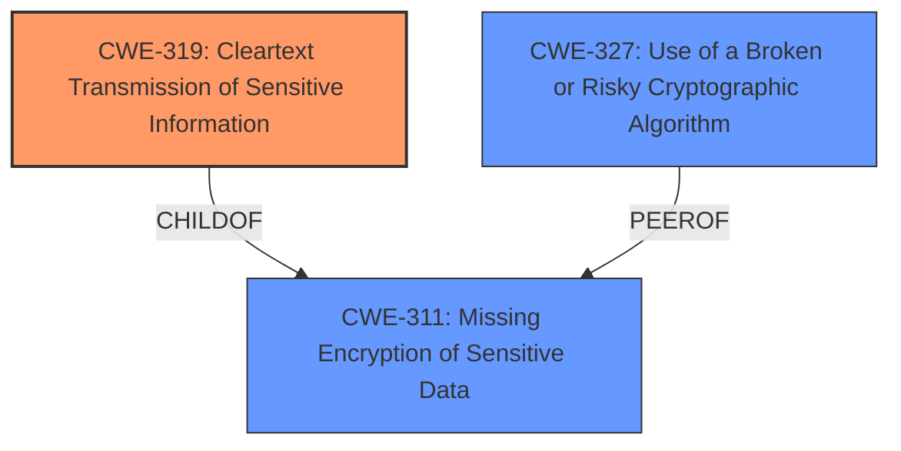

# Enhanced Analysis for CVE-2020-4980

# Summary
| CWE ID    | CWE Name                                                      | Confidence | CWE Abstraction Level | CWE Vulnerability Mapping Label | CWE-Vulnerability Mapping Notes |
| :-------- | :------------------------------------------------------------ | :--------- | :---------------------- | :------------------------------ | :------------------------------ |
| CWE-319   | Cleartext Transmission of Sensitive Information             | 1          | Base                    | Allowed                         | Primary CWE                     |
| CWE-311   | Missing Encryption of Sensitive Data                          | 0.7        | Class                   | Discouraged                     | Secondary Candidate             |
| CWE-327   | Use of a Broken or Risky Cryptographic Algorithm            | 0.7        | Class                   | Allowed-with-Review           | Secondary Candidate             |

## Evidence and Confidence

*   **Confidence Score:** 0.9
*   **Evidence Strength:** HIGH

## Relationship Analysis
The primary relationship that influenced the decision was the ChildOf relationship between CWE-319 and CWE-311. CWE-319 is a more specific case of CWE-311, focusing on data in transit. The weakness states that the application **uses less secure methods for protecting data in transit between hosts**, which directly aligns with the description of CWE-319: "The product transmits sensitive or security-critical data in cleartext in a communication channel that can be sniffed by unauthorized actors."



## Vulnerability Chain
The vulnerability chain involves the **use of less secure methods for data protection** which leads to the potential compromise of data in transit.
  - **Root Cause:**  **Use of less secure methods for protecting data in transit** (CWE-319 or a related weakness).
  - **Impact:** Compromise of data at rest and in transit.

## Summary of Analysis
The analysis strongly suggests that CWE-319 (Cleartext Transmission of Sensitive Information) is the most appropriate primary CWE for this vulnerability. The vulnerability description clearly states that IBM QRadar SIEM **uses less secure methods for protecting data in transit between hosts**. The "CVE Reference Links Content Summary" reinforces this by stating that the **root_cause** is the "use of less secure methods for protecting data in transit between hosts when encrypt host connections is not enabled as well as data at rest," and one of the **weaknesses** is the "Use of less secure methods for data protection".

The selection of CWE-319 is further supported by its Base abstraction level, which is preferred for root cause analysis. The mapping guidance for CWE-319 explicitly allows its usage and states that it is at a preferred level of abstraction.

CWE-311 (Missing Encryption of Sensitive Data) was considered but deemed less specific than CWE-319. While the vulnerability involves a lack of adequate encryption, the focus is specifically on data being transmitted in cleartext. The mapping guidance for CWE-311 discourages its use and suggests considering children like CWE-319. CWE-327 (Use of a Broken or Risky Cryptographic Algorithm) was considered because it relates to cryptographic weaknesses, but it doesn't directly address the issue of data being transmitted without encryption. The provided information doesn't explicitly state that a broken algorithm is in use, only that the methods used are "less secure."

Therefore, CWE-319 is the most accurate and specific representation of the vulnerability, based on the available evidence and MITRE's mapping guidance.

Relevant CWE Information:

# Enhanced Context (25 CWEs)
The following CWEs were identified as potentially relevant to this vulnerability:

## CWE-226: Sensitive Information in Resource Not Removed Before Reuse
**Abstraction Level**: Base
**Similarity Score**: 0.76
**Source**: dense

**Description**:
The product releases a resource such as memory or a file so that it can be made available for reuse, but it does not clear or "zeroize" the information contained in the resource before the product performs a critical state transition or makes the resource available for reuse by other entities.

**Mapping Guidance**:
- Usage: Allowed
- Rationale: This CWE entry is at the Base level of abstraction, which is a preferred level of abstraction for mapping to the root causes of vulnerabilities.

## CWE-1391: Use of Weak Credentials
**Abstraction Level**: Class
**Similarity Score**: 0.75
**Source**: dense

**Description**:
The product uses weak credentials (such as a default key or hard-coded password) that can be calculated, derived, reused, or guessed by an attacker.

**Mapping Guidance**:
- Usage: Allowed-with-Review
- Rationale: This CWE entry is a Class and might have Base-level children that would be more appropriate

## CWE-319: Cleartext Transmission of Sensitive Information
**Abstraction Level**: Base
**Similarity Score**: 0.74
**Source**: dense

**Description**:
The product transmits sensitive or security-critical data in cleartext in a communication channel that can be sniffed by unauthorized actors.

**Mapping Guidance**:
- Usage: Allowed
- Rationale: This CWE entry is at the Base level of abstraction, which is a preferred level of abstraction for mapping to the root causes of vulnerabilities.

## CWE-311: Missing Encryption of Sensitive Data
**Abstraction Level**: Class
**Similarity Score**: 0.74
**Source**: dense

**Description**:
The product does not encrypt sensitive or critical information before storage or transmission.

**Mapping Guidance**:
- Usage: Discouraged
- Rationale: CWE-311 is high-level with more precise children available. It is a level-1 Class (i.e., a child of a Pillar).

## CWE-312: Cleartext Storage of Sensitive Information
**Abstraction Level**: Base
**Similarity Score**: 0.74
**Source**: dense

**Description**:
The product stores sensitive information in cleartext within a resource that might be accessible to another control sphere.

**Mapping Guidance**:
- Usage: Allowed
- Rationale: This CWE entry is at the Base level of abstraction, which is a preferred level of abstraction for mapping to the root causes of vulnerabilities.

## CWE-1390: Weak Authentication
**Abstraction Level**: Class
**Similarity Score**: 0.73
**Source**: dense

**Description**:
The product uses an authentication mechanism to restrict access to specific users or identities, but the mechanism does not sufficiently prove that the claimed identity is correct.

**Mapping Guidance**:
- Usage: Allowed-with-Review
- Rationale: This CWE entry is a Class and might have Base-level children that would be more appropriate

## CWE-807: Reliance on Untrusted Inputs in a Security Decision
**Abstraction Level**: Base
**Similarity Score**: 0.73
**Source**: dense

**Description**:
The product uses a protection mechanism that relies on the existence or values of an input, but the input can be modified by an untrusted actor in a way that bypasses the protection mechanism.

**Mapping Guidance**:
- Usage: Allowed
- Rationale: This CWE entry is at the Base level of abstraction, which is a preferred level of abstraction for mapping to the root causes of vulnerabilities.

## CWE-657: Violation of Secure Design Principles
**Abstraction Level**: Class
**Similarity Score**: 0.73
**Source**: dense

**Description**:
The product violates well-established principles for secure design.

**Mapping Guidance**:
- Usage: Discouraged
- Rationale: This CWE entry is a level-1 Class (i.e., a child of a Pillar). It might have lower-level children that would be more appropriate

## CWE-1240: Use of a Cryptographic Primitive with a Risky Implementation
**Abstraction Level**: Base
**Similarity Score**: 0.73
**Source**: dense

**Description**:
To fulfill the need for a cryptographic primitive, the product implements a cryptographic algorithm using a non-standard, unproven, or disallowed/non-compliant cryptographic implementation.

**Mapping Guidance**:
- Usage: Allowed
- Rationale: This CWE entry is at the Base level of abstraction, which is a preferred level of abstraction for mapping to the root causes of vulnerabilities.

## CWE-345: Insufficient Verification of Data Authenticity
**Abstraction Level**: Class
**Similarity Score**: 0.73
**Source**: dense

**Description**:
The product does not sufficiently verify the origin or authenticity of data, in a way that causes it to accept invalid data.

**Mapping Guidance**:
- Usage: Discouraged
- Rationale: This CWE entry is a


## CWE Relationship Analysis

Current CWEs represent these abstraction levels: .


### Vulnerability Chain Analysis

**Chain starting from CWE-657:**
- 657 (Violation of Secure Design Principles) - ROOT


**Chain starting from CWE-312:**
- 312 (Cleartext Storage of Sensitive Information) - ROOT


### CWE Relationship Diagram

```mermaid
graph TD
    classDef primary fill:#f96,stroke:#333,stroke-width:2px
    classDef secondary fill:#69f,stroke:#333
    classDef tertiary fill:#9e9,stroke:#333
```