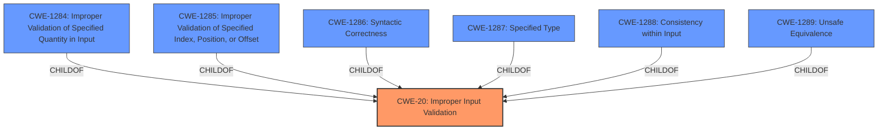

# Enhanced Analysis for CVE-2020-4981

# Summary
| CWE ID | CWE Name | Confidence | CWE Abstraction Level | CWE Vulnerability Mapping Label | CWE-Vulnerability Mapping Notes |
|---|---|---|---|---|---|
| CWE-20 | Improper Input Validation | 0.8 | Class | Primary | Discouraged |

## Evidence and Confidence

*   **Confidence Score:** 0.8
*   **Evidence Strength:** MEDIUM

## Relationship Analysis
The primary relationship that impacted the decision was the parent-child relationship between CWE-20 and its children, as well as the discouragement of using CWE-20 directly. However, without more information, it is difficult to select a more specific child of CWE-20.



## Vulnerability Chain
The vulnerability chain consists of the **improper input validation** leading to the ability to overwrite files.

## Summary of Analysis
The vulnerability description states that IBM Spectrum Scale is vulnerable to a local privileged user being able to overwrite files due to **improper input validation**.

The key phrase " **improper input validation**" from the "Vulnerability Description Key Phrases" section directly indicates CWE-20. The "CVE Reference Links Content Summary" further supports this by stating, "The vulnerability is due to insecure external command execution within IBM Spectrum Scale CSI" and "Weaknesses/vulnerabilities present: Insecure external command execution." However, the description lacks specific details about the type of input that is not being properly validated, which makes it difficult to choose a more specific CWE.

CWE-20, **Improper Input Validation**, is a Class-level CWE that describes a situation where a product receives input but does not validate that the input has the properties required to process the data safely and correctly. The "Mapping Guidance" for CWE-20 states that it is "Discouraged" because it is commonly misused in low-information vulnerability reports and suggests considering lower-level children. However, without more specific information about the **improper input validation**, it is difficult to map to a more specific CWE.

Given the available information, CWE-20 is the most appropriate CWE.
Other CWEs Considered and Rejected:
*   CWE-22, **Improper Limitation of a Pathname to a Restricted Directory ('Path Traversal')**: While file overwriting is the impact, there is no indication of path traversal in the description.
*   CWE-117, **Improper Output Neutralization for Logs**: This CWE relates to logging and is not applicable here.
*   CWE-269, **Improper Privilege Management**: While a local privileged user is mentioned, the root cause is **improper input validation**, not privilege management.
*   CWE-307, **Improper Restriction of Excessive Authentication Attempts**: This CWE is related to authentication and is not applicable here.
*   CWE-1236, **Improper Neutralization of Formula Elements in a CSV File**: This CWE is specific to CSV files and is not applicable here.
*   CWE-799, **Improper Control of Interaction Frequency**: This CWE is related to the frequency of interactions and is not applicable here.
*   CWE-326, **Inadequate Encryption Strength** and CWE-327 **Use of a Broken or Risky Cryptographic Algorithm**: These CWEs relate to cryptographic algorithms and are not applicable here.
*   CWE-732, **Incorrect Permission Assignment for Critical Resource**: The root cause is **improper input validation**, not permission assignment.


## CWE Relationship Analysis

Current CWEs represent these abstraction levels: .


### Vulnerability Chain Analysis

**Chain starting from CWE-732:**
- 732 (Incorrect Permission Assignment for Critical Resource) - ROOT


**Chain starting from CWE-1287:**
- 1287 (Improper Validation of Specified Type of Input) - ROOT


### CWE Relationship Diagram

```mermaid
graph TD
    classDef primary fill:#f96,stroke:#333,stroke-width:2px
    classDef secondary fill:#69f,stroke:#333
    classDef tertiary fill:#9e9,stroke:#333
```