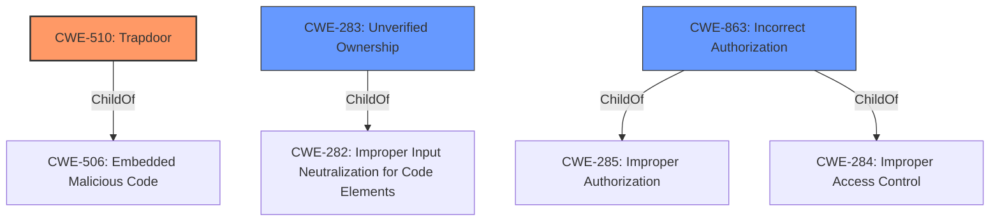

# Analysis for CVE-2020-5232

# Summary
| CWE ID | CWE Name | Confidence | CWE Abstraction Level | CWE Vulnerability Mapping Label | CWE-Vulnerability Mapping Notes |
|---|---|---|---|---|---|
| CWE-510 | Trapdoor | 0.9 | Base | Primary | Allowed |
| CWE-283 | Unverified Ownership | 0.7 | Base | Secondary | Allowed |
| CWE-863 | Incorrect Authorization | 0.6 | Class | Secondary | Allowed-with-Review |

## Evidence and Confidence

*   **Confidence Score:** 0.8
*   **Evidence Strength:** HIGH

## Relationship Analysis
The primary relationship influencing the selection was the direct match of the vulnerability description with the definition of CWE-510 (Trapdoor). The other CWEs describe elements that could be considered related or contributing factors.



## Vulnerability Chain
The vulnerability chain starts with a **trapdoor** in the ENS registry, leading to **unverified ownership** after a transfer, and ultimately results in a **incorrect authorization** when the original owner regains control.

## Summary of Analysis
The primary assessment focuses on the presence of a **trapdoor** that allows an attacker to regain ownership of an ENS domain without the new owner's consent. This aligns directly with CWE-510. Supporting evidence is found in the vulnerability description: "A user who owns an ENS domain can **set a trapdoor**, allowing them to transfer ownership to another user, and later regain ownership without the new owners consent or awareness." The CVE reference also explicitly states a **"trapdoor"** mechanism.

The retriever results also list CWE-510 with a relatively high score based on dense matching, further supporting this classification.

CWE-283 (Unverified Ownership) is considered because the "trapdoor" allows the original owner to bypass normal ownership verification mechanisms. This is supported by the description of the vulnerability that the ownership can be regained "without the new owners consent or awareness," implying **unverified ownership**.

CWE-863 (Incorrect Authorization) is relevant since the **trapdoor** circumvents the intended authorization checks, allowing unauthorized access to regain ownership. The CVE reference describes the core issue as a flaw in how ownership transfers were handled, which can be seen as an authorization failure.

The final selection prioritizes CWE-510 as the most specific root cause, with CWE-283 and CWE-863 as secondary contributing factors. This provides a multi-faceted view of the vulnerability, encompassing the initial **trapdoor**, the subsequent **unverified ownership**, and the final **incorrect authorization** outcome.

Relevant CWE Information:

# Enhanced Context (25 CWEs)

## CWE-639: Authorization Bypass Through User-Controlled Key
**Abstraction Level**: Base
**Similarity Score**: 0.77
**Source**: dense

**Description**:
The system's authorization functionality does not prevent one user from gaining access to another user's data or record by modifying the key value identifying the data.

**Mapping Guidance**:
- Usage: Allowed
- Rationale: This CWE entry is at the Base level of abstraction, which is a preferred level of abstraction for mapping to the root causes of vulnerabilities.

## CWE-73: External Control of File Name or Path
**Abstraction Level**: Base
**Similarity Score**: 0.76
**Source**: dense

**Description**:
The product allows user input to control or influence paths or file names that are used in filesystem operations.

**Mapping Guidance**:
- Usage: Allowed
- Rationale: This CWE entry is at the Base level of abstraction, which is a preferred level of abstraction for mapping to the root causes of vulnerabilities.

## CWE-41: Improper Resolution of Path Equivalence
**Abstraction Level**: Base
**Similarity Score**: 0.76
**Source**: dense

**Description**:
The product is vulnerable to file system contents disclosure through path equivalence. Path equivalence involves the use of special characters in file and directory names. The associated manipulations are intended to generate multiple names for the same object.

**Mapping Guidance**:
- Usage: Allowed
- Rationale: This CWE entry is at the Base level of abstraction, which is a preferred level of abstraction for mapping to the root causes of vulnerabilities.

## CWE-668: Exposure of Resource to Wrong Sphere
**Abstraction Level**: Class
**Similarity Score**: 0.76
**Source**: dense

**Description**:
The product exposes a resource to the wrong control sphere, providing unintended actors with inappropriate access to the resource.

**Mapping Guidance**:
- Usage: Discouraged
- Rationale: CWE-668 is high-level and is often misused as a catch-all when lower-level CWE IDs might be applicable. It is sometimes used for low-information vulnerability reports [REF-1287]. It is a level-1 Class (i.e., a child of a Pillar). It is not useful for trend analysis.

## CWE-274: Improper Handling of Insufficient Privileges
**Abstraction Level**: Base
**Similarity Score**: 0.75
**Source**: dense

**Description**:
The product does not handle or incorrectly handles when it has insufficient privileges to perform an operation, leading to resultant weaknesses.

**Mapping Guidance**:
- Usage: Discouraged
- Rationale: This CWE entry could be deprecated in a future version of CWE.

## CWE-280: Improper Handling of Insufficient Permissions or Privileges
**Abstraction Level**: Base
**Similarity Score**: 0.75
**Source**: dense

**Description**:
The product does not handle or incorrectly handles when it has insufficient privileges to access resources or functionality as specified by their permissions. This may cause it to follow unexpected code paths that may leave the product in an invalid state.

**Mapping Guidance**:
- Usage: Allowed
- Rationale: This CWE entry is at the Base level of abstraction, which is a preferred level of abstraction for mapping to the root causes of vulnerabilities.

## CWE-267: Privilege Defined With Unsafe Actions
**Abstraction Level**: Base
**Similarity Score**: 0.75
**Source**: dense

**Description**:
A particular privilege, role, capability, or right can be used to perform unsafe actions that were not intended, even when it is assigned to the correct entity.

**Mapping Guidance**:
- Usage: Allowed
- Rationale: This CWE entry is at the Base level of abstraction, which is a preferred level of abstraction for mapping to the root causes of vulnerabilities.

## CWE-59: Improper Link Resolution Before File Access ('Link Following')
**Abstraction Level**: Base
**Similarity Score**: 0.75
**Source**: dense

**Description**:
The product attempts to access a file based on the filename, but it does not properly prevent that filename from identifying a link or shortcut that resolves to an unintended resource.

**Mapping Guidance**:
- Usage: Allowed
- Rationale: This CWE entry is at the Base level of abstraction, which is a preferred level of abstraction for mapping to the root causes of vulnerabilities.

## CWE-266: Incorrect Privilege Assignment
**Abstraction Level**: Base
**Similarity Score**: 0.75
**Source**: dense

**Description**:
A product incorrectly assigns a privilege to a particular actor, creating an unintended sphere of control for that actor.

**Mapping Guidance**:
- Usage: Allowed
- Rationale: This CWE entry is at the Base level of abstraction, which is a preferred level of abstraction for mapping to the root causes of vulnerabilities.

## CWE-1289: Improper Validation of Unsafe Equivalence in Input
**Abstraction Level**: Base
**Similarity Score**: 0.75
**Source**: dense

**Description**:
The product receives an input value that is used as a resource identifier or other type of reference, but it does not validate or incorrectly validates that the input is equivalent to a potentially-unsafe value.

**Mapping Guidance**:
- Usage: Allowed
- Rationale: This CWE entry is at the Base level of abstraction, which is a preferred level of abstraction for mapping to the root causes of vulnerabilities.

## CWE-639: Authorization Bypass Through User-Controlled Key
**Abstraction Level**: Base
**Similarity Score**: 6283.34
**Source**: sparse

**Description**:
The system's authorization functionality

# Enhanced Query for CVE-2020-5232

## Vulnerability Description
A user who owns an ENS domain can **set a trapdoor**, allowing them to transfer ownership to another user, and later regain ownership without the new owners consent or awareness. A new ENS deployment is being rolled out that fixes this vulnerability in the ENS registry.

### Vulnerability Description Key Phrases
- **weakness:** **set a trapdoor**
- **impact:** transfer ownership to another user, and later regain ownership without the new owners consent or awareness
- **attacker:** user who owns an ENS domain
- **product:** ENS registry

## CVE Reference Links Content Summary
Based on the provided content, here's an analysis of CVE-2020-5232:

**Root Cause of Vulnerability:**
The vulnerability stems from a flaw in the ENS (Ethereum Name Service) registry contract. Specifically, a malicious owner of an ENS domain could create a "trapdoor" allowing them to transfer ownership to another user, but subsequently regain ownership without the new owner's consent or knowledge. This implies an issue in how ownership transfers were handled in the old contract.

**Weaknesses/Vulnerabilities Present:**
- **Flawed Ownership Transfer Logic:** The core issue was a vulnerability in the logic governing how ownership of ENS domains was transferred. This allowed a previous owner to circumvent normal ownership transfer mechanisms.

**Impact of Exploitation:**
- **Malicious Takeover:** An attacker who previously owned an ENS domain could regain control of the domain even after transferring it to a new owner. This is a complete takeover, effectively rendering the new owner powerless over their purchased domain.
- **Loss of Control:** Legitimate owners of ENS domains who had received a transfer of ownership were vulnerable to having their domains seized without their consent.
- **Deception and Unawareness:** The new owner would not be aware of the trapdoor mechanism, leading to a deceptive seizure of the domain.

**Attack Vectors:**
- The attack vector is through the `setSubnodeOwner` function of the old ENS registry.
- An attacker first owns an ENS domain.
- The attacker transfers the domain to a victim using the flawed method.
- The attacker then uses the exploit to regain ownership of the domain.

**Required Attacker Capabilities/Position:**
- **Previous ENS Domain Ownership:** The attacker must have previously owned the ENS domain they intend to seize.
- **Knowledge of Vulnerability:** The attacker needs to understand how the "trapdoor" within the old ENS registry contract could be exploited.
- **Ability to Interact with Contract:** The attacker must be able to interact directly with the vulnerable smart contract, specifically the transfer of ownership functionality of the old contract.

**Additional Details:**
- **Patches:** A new ENS deployment at address `0x00000000000C2E074eC69A0dFb2997BA6C7d2e1e` was rolled out to fix the vulnerability in the ENS registry.
- **Workarounds:** Users were advised not to accept ENS domain transfers from others using the old registrar.
- **Migration Guide:** A migration guide was provided to assist dApp developers with the transition to the new ENS registry.
- **Affected Versions:** Versions 0.1.0 and greater of the `@ensdomains/ens` npm package were affected.
- **Patched Versions:** Version 0.4.0 of the `@ensdomains/ens` npm package contains the fix.

## Retriever Results

### Top Combined Results

| Rank | CWE ID | Name | Abstraction | Usage  | Retrievers | Individual Scores |
|------|--------|------|-------------|-------|------------|-------------------|
| 1 | 283 | Unverified Ownership | Base | Allowed | sparse | 0.614 |
| 2 | 708 | Incorrect Ownership Assignment | Base | Allowed | sparse | 0.231 |
| 3 | 269 | Improper Privilege Management | Class | Discouraged | sparse | 0.227 |
| 4 | 59 | Improper Link Resolution Before File Access ('Link Following') | Base | Allowed | sparse | 0.227 |
| 5 | 212 | Improper Removal of Sensitive Information Before Storage or Transfer | Base | Allowed | sparse | 0.227 |
| 6 | 510 | Trapdoor | Base | Allowed | dense | 0.510 |
| 7 | 73 | External Control of File Name or Path | Base | Allowed | graph | 0.002 |
| 8 | 789 | Memory Allocation with Excessive Size Value | Variant | Allowed | sparse | 0.216 |
| 9 | 639 | Authorization Bypass Through User-Controlled Key | Base | Allowed | sparse | 0.216 |
| 10 | 863 | Incorrect Authorization | Class | Allowed-with-Review | sparse | 0.208 |


# Complete CWE Specifications


## CWE-283: Unverified Ownership
**Abstraction:** Base
**Status:** Draft

### Description
The product does not properly verify that a critical resource is owned by the proper entity.

### Extended Description
Not provided

### Alternative Terms
None

### Relationships
ChildOf -> CWE-282

### Mapping Guidance
**Usage:** Allowed
**Rationale:** This CWE entry is at the Base level of abstraction, which is a preferred level of abstraction for mapping to the root causes of vulnerabilities.
**Comments:** Carefully read both the name and description to ensure that this mapping is an appropriate fit. Do not try to 'force' a mapping to a lower-level Base/Variant simply to comply with this preferred level of abstraction.
**Reasons:**
- Acceptable-Use


### Additional Notes
**[Relationship]** This overlaps insufficient comparison, verification errors, permissions, and privileges.


### Observed Examples
- **CVE-2001-0178:** Program does not verify the owner of a UNIX socket that is used for sending a password.
- **CVE-2004-2012:** Owner of special device not checked, allowing root.


## CWE-708: Incorrect Ownership Assignment
**Abstraction:** Base
**Status:** Incomplete

### Description
The product assigns an owner to a resource, but the owner is outside of the intended control sphere.

### Extended Description
This may allow the resource to be manipulated by actors outside of the intended control sphere.

### Alternative Terms
None

### Relationships
ChildOf -> CWE-282
CanAlsoBe -> CWE-345

### Mapping Guidance
**Usage:** Allowed
**Rationale:** This CWE entry is at the Base level of abstraction, which is a preferred level of abstraction for mapping to the root causes of vulnerabilities.
**Comments:** Carefully read both the name and description to ensure that this mapping is an appropriate fit. Do not try to 'force' a mapping to a lower-level Base/Variant simply to comply with this preferred level of abstraction.
**Reasons:**
- Acceptable-Use


### Additional Notes
**[Maintenance]** 

This overlaps verification errors, permissions, and privileges.


A closely related weakness is the incorrect assignment of groups to a resource. It is not clear whether it would fall under this entry or require a different entry.


### Observed Examples
- **CVE-2007-5101:** File system sets wrong ownership and group when creating a new file.
- **CVE-2007-4238:** OS installs program with bin owner/group, allowing modification.
- **CVE-2007-1716:** Manager does not properly restore ownership of a reusable resource when a user logs out, allowing privilege escalation.


## CWE-269: Improper Privilege Management
**Abstraction:** Class
**Status:** Draft

### Description
The product does not properly assign, modify, track, or check privileges for an actor, creating an unintended sphere of control for that actor.

### Extended Description
Not provided

### Alternative Terms
None

### Relationships
ChildOf -> CWE-284

### Mapping Guidance
**Usage:** Discouraged
**Rationale:** CWE-269 is commonly misused. It can be conflated with "privilege escalation," which is a technical impact that is listed in many low-information vulnerability reports [REF-1287]. It is not useful for trend analysis.
**Comments:** If an error or mistake allows privilege escalation, then use the CWE ID for that mistake. Avoid using CWE-269 when only phrases such as "privilege escalation" or "gain privileges" are available, as these indicate technical impact of the vulnerability - not the root cause weakness. If the root cause seems to be directly related to privileges, then examine the children of CWE-269 for additional hints, such as Execution with Unnecessary Privileges (CWE-250) or Incorrect Privilege Assignment (CWE-266).
**Reasons:**
- Frequent Misuse


### Additional Notes
**[Maintenance]** The relationships between privileges, permissions, and actors (e.g. users and groups) need further refinement within the Research view. One complication is that these concepts apply to two different pillars, related to control of resources (CWE-664) and protection mechanism failures (CWE-693).


### Observed Examples
- **CVE-2001-1555:** Terminal privileges are not reset when a user logs out.
- **CVE-2001-1514:** Does not properly pass security context to child processes in certain cases, allows privilege escalation.
- **CVE-2001-0128:** Does not properly compute roles.


## CWE-59: Improper Link Resolution Before File Access ('Link Following')
**Abstraction:** Base
**Status:** Draft

### Description
The product attempts to access a file based on the filename, but it does not properly prevent that filename from identifying a link or shortcut that resolves to an unintended resource.

### Extended Description
Not provided

### Alternative Terms
insecure temporary file: Some people use the phrase "insecure temporary file" when referring to a link following weakness, but other weaknesses can produce insecure temporary files without any symlink involvement at all.
Zip Slip: "Zip slip" is an attack that uses file archives (e.g., ZIP, tar, rar, etc.) that contain filenames with path traversal sequences that cause the files to be written outside of the directory under which the archive is expected to be extracted [REF-1282]. It is most commonly used for relative path traversal (CWE-23) and link following (CWE-59).

### Relationships
ChildOf -> CWE-706
ChildOf -> CWE-706

### Mapping Guidance
**Usage:** Allowed
**Rationale:** This CWE entry is at the Base level of abstraction, which is a preferred level of abstraction for mapping to the root causes of vulnerabilities.
**Comments:** Carefully read both the name and description to ensure that this mapping is an appropriate fit. Do not try to 'force' a mapping to a lower-level Base/Variant simply to comply with this preferred level of abstraction.
**Reasons:**
- Acceptable-Use


### Additional Notes
**[Theoretical]** 

Link following vulnerabilities are Multi-factor Vulnerabilities (MFV). They are the combination of multiple elements: file or directory permissions, filename predictability, race conditions, and in some cases, a design limitation in which there is no mechanism for performing atomic file creation operations.


Some potential factors are race conditions, permissions, and predictability.


### Observed Examples
- **CVE-1999-1386:** Some versions of Perl follow symbolic links when running with the -e option, which allows local users to overwrite arbitrary files via a symlink attack.
- **CVE-2000-1178:** Text editor follows symbolic links when creating a rescue copy during an abnormal exit, which allows local users to overwrite the files of other users.
- **CVE-2004-0217:** Antivirus update allows local users to create or append to arbitrary files via a symlink attack on a logfile.


## CWE-212: Improper Removal of Sensitive Information Before Storage or Transfer
**Abstraction:** Base
**Status:** Incomplete

### Description
The product stores, transfers, or shares a resource that contains sensitive information, but it does not properly remove that information before the product makes the resource available to unauthorized actors.

### Extended Description


Resources that may contain sensitive data include documents, packets, messages, databases, etc. While this data may be useful to an individual user or small set of users who share the resource, it may need to be removed before the resource can be shared outside of the trusted group. The process of removal is sometimes called cleansing or scrubbing.


For example, a product for editing documents might not remove sensitive data such as reviewer comments or the local pathname where the document is stored. Or, a proxy might not remove an internal IP address from headers before making an outgoing request to an Internet site.


### Alternative Terms
None

### Relationships
ChildOf -> CWE-669
ChildOf -> CWE-669
CanPrecede -> CWE-201

### Mapping Guidance
**Usage:** Allowed
**Rationale:** This CWE entry is at the Base level of abstraction, which is a preferred level of abstraction for mapping to the root causes of vulnerabilities.
**Comments:** Carefully read both the name and description to ensure that this mapping is an appropriate fit. Do not try to 'force' a mapping to a lower-level Base/Variant simply to comply with this preferred level of abstraction.
**Reasons:**
- Acceptable-Use


### Additional Notes
**[Relationship]** This entry is intended to be different from resultant information leaks, including those that occur from improper buffer initialization and reuse, improper encryption, interaction errors, and multiple interpretation errors. This entry could be regarded as a privacy leak, depending on the type of information that is leaked.

**[Relationship]** There is a close association between CWE-226 and CWE-212. The difference is partially that of perspective. CWE-226 is geared towards the final stage of the resource lifecycle, in which the resource is deleted, eliminated, expired, or otherwise released for reuse. Technically, this involves a transfer to a different control sphere, in which the original contents of the resource are no longer relevant. CWE-212, however, is intended for sensitive data in resources that are intentionally shared with others, so they are still active. This distinction is useful from the perspective of the CWE research view (CWE-1000).

**[Terminology]** The terms "cleansing" and "scrubbing" have multiple uses within computing. In information security, these are used for the removal of sensitive data, but they are also used for the modification of incoming/outgoing data so that it conforms to specifications.


### Observed Examples
- **CVE-2019-3733:** Cryptography library does not clear heap memory before release
- **CVE-2005-0406:** Some image editors modify a JPEG image, but the original EXIF thumbnail image is left intact within the JPEG. (Also an interaction error).
- **CVE-2002-0704:** NAT feature in firewall leaks internal IP addresses in ICMP error messages.


## CWE-510: Trapdoor
**Abstraction:** Base
**Status:** Incomplete

### Description
A trapdoor is a hidden piece of code that responds to a special input, allowing its user access to resources without passing through the normal security enforcement mechanism.

### Extended Description
Not provided

### Alternative Terms
None

### Relationships
ChildOf -> CWE-506

### Mapping Guidance
**Usage:** Allowed
**Rationale:** This CWE entry is at the Base level of abstraction, which is a preferred level of abstraction for mapping to the root causes of vulnerabilities.
**Comments:** Carefully read both the name and description to ensure that this mapping is an appropriate fit. Do not try to 'force' a mapping to a lower-level Base/Variant simply to comply with this preferred level of abstraction.
**Reasons:**
- Acceptable-Use


## CWE-73: External Control of File Name or Path
**Abstraction:** Base
**Status:** Draft

### Description
The product allows user input to control or influence paths or file names that are used in filesystem operations.

### Extended Description


This could allow an attacker to access or modify system files or other files that are critical to the application.


Path manipulation errors occur when the following two conditions are met:

```
		1. An attacker can specify a path used in an operation on the filesystem.
		2. By specifying the resource, the attacker gains a capability that would not otherwise be permitted.
```
For example, the program may give the attacker the ability to overwrite the specified file or run with a configuration controlled by the attacker.

### Alternative Terms
None

### Relationships
ChildOf -> CWE-642
ChildOf -> CWE-610
ChildOf -> CWE-20
CanPrecede -> CWE-22
CanPrecede -> CWE-41
CanPrecede -> CWE-98
CanPrecede -> CWE-434
CanPrecede -> CWE-59

### Mapping Guidance
**Usage:** Allowed
**Rationale:** This CWE entry is at the Base level of abstraction, which is a preferred level of abstraction for mapping to the root causes of vulnerabilities.
**Comments:** Carefully read both the name and description to ensure that this mapping is an appropriate fit. Do not try to 'force' a mapping to a lower-level Base/Variant simply to comply with this preferred level of abstraction.
**Reasons:**
- Acceptable-Use


### Additional Notes
**[Maintenance]** CWE-114 is a Class, but it is listed a child of CWE-73 in view 1000. This suggests some abstraction problems that should be resolved in future versions.

**[Relationship]** 

The external control of filenames can be the primary link in chains with other file-related weaknesses, as seen in the CanPrecede relationships. This is because software systems use files for many different purposes: to execute programs, load code libraries, to store application data, to store configuration settings, record temporary data, act as signals or semaphores to other processes, etc.


However, those weaknesses do not always require external control. For example, link-following weaknesses (CWE-59) often involve pathnames that are not controllable by the attacker at all.


The external control can be resultant from other issues. For example, in PHP applications, the register_globals setting can allow an attacker to modify variables that the programmer thought were immutable, enabling file inclusion (CWE-98) and path traversal (CWE-22). Operating with excessive privileges (CWE-250) might allow an attacker to specify an input filename that is not directly readable by the attacker, but is accessible to the privileged program. A buffer overflow (CWE-119) might give an attacker control over nearby memory locations that are related to pathnames, but were not directly modifiable by the attacker.


### Observed Examples
- **CVE-2022-45918:** Chain: a learning management tool debugger uses external input to locate previous session logs (CWE-73) and does not properly validate the given path (CWE-20), allowing for filesystem path traversal using "../" sequences (CWE-24)
- **CVE-2008-5748:** Chain: external control of values for user's desired language and theme enables path traversal.
- **CVE-2008-5764:** Chain: external control of user's target language enables remote file inclusion.


## CWE-789: Memory Allocation with Excessive Size Value
**Abstraction:** Variant
**Status:** Draft

### Description
The product allocates memory based on an untrusted, large size value, but it does not ensure that the size is within expected limits, allowing arbitrary amounts of memory to be allocated.

### Extended Description
Not provided

### Alternative Terms
Stack Exhaustion: When a weakness allocates excessive memory on the stack, it is often described as "stack exhaustion," which is a technical impact of the weakness. This technical impact is often encountered as a consequence of CWE-789 and/or CWE-1325.

### Relationships
ChildOf -> CWE-770
CanPrecede -> CWE-476

### Mapping Guidance
**Usage:** Allowed
**Rationale:** This CWE entry is at the Variant level of abstraction, which is a preferred level of abstraction for mapping to the root causes of vulnerabilities.
**Comments:** Carefully read both the name and description to ensure that this mapping is an appropriate fit. Do not try to 'force' a mapping to a lower-level Base/Variant simply to comply with this preferred level of abstraction.
**Reasons:**
- Acceptable-Use


### Additional Notes
**[Relationship]** This weakness can be closely associated with integer overflows (CWE-190). Integer overflow attacks would concentrate on providing an extremely large number that triggers an overflow that causes less memory to be allocated than expected. By providing a large value that does not trigger an integer overflow, the attacker could still cause excessive amounts of memory to be allocated.

**[Applicable Platform]** 

Uncontrolled memory allocation is possible in many languages, such as dynamic array allocation in perl or initial size parameters in Collections in Java. However, languages like C and C++ where programmers have the power to more directly control memory management will be more susceptible.


### Observed Examples
- **CVE-2022-21668:** Chain: Python library does not limit the resources used to process images that specify a very large number of bands (CWE-1284), leading to excessive memory consumption (CWE-789) or an integer overflow (CWE-190).
- **CVE-2010-3701:** program uses ::alloca() for encoding messages, but large messages trigger segfault
- **CVE-2008-1708:** memory consumption and daemon exit by specifying a large value in a length field


## CWE-639: Authorization Bypass Through User-Controlled Key
**Abstraction:** Base
**Status:** Incomplete

### Description
The system's authorization functionality does not prevent one user from gaining access to another user's data or record by modifying the key value identifying the data.

### Extended Description


Retrieval of a user record occurs in the system based on some key value that is under user control. The key would typically identify a user-related record stored in the system and would be used to lookup that record for presentation to the user. It is likely that an attacker would have to be an authenticated user in the system. However, the authorization process would not properly check the data access operation to ensure that the authenticated user performing the operation has sufficient entitlements to perform the requested data access, hence bypassing any other authorization checks present in the system.


For example, attackers can look at places where user specific data is retrieved (e.g. search screens) and determine whether the key for the item being looked up is controllable externally. The key may be a hidden field in the HTML form field, might be passed as a URL parameter or as an unencrypted cookie variable, then in each of these cases it will be possible to tamper with the key value.


One manifestation of this weakness is when a system uses sequential or otherwise easily-guessable session IDs that would allow one user to easily switch to another user's session and read/modify their data.


### Alternative Terms
Insecure Direct Object Reference / IDOR: The "Insecure Direct Object Reference" term, as described in the OWASP Top Ten, is broader than this CWE because it also covers path traversal (CWE-22). Within the context of vulnerability theory, there is a similarity between the OWASP concept and CWE-706: Use of Incorrectly-Resolved Name or Reference.
Broken Object Level Authorization / BOLA: BOLA is used in the 2019 OWASP API Security Top 10 and is said to be the same as IDOR.
Horizontal Authorization: "Horizontal Authorization" is used to describe situations in which two users have the same privilege level, but must be prevented from accessing each other's resources. This is fairly common when using key-based access to resources in a multi-user context.

### Relationships
ChildOf -> CWE-863
ChildOf -> CWE-863
ChildOf -> CWE-284

### Mapping Guidance
**Usage:** Allowed
**Rationale:** This CWE entry is at the Base level of abstraction, which is a preferred level of abstraction for mapping to the root causes of vulnerabilities.
**Comments:** Carefully read both the name and description to ensure that this mapping is an appropriate fit. Do not try to 'force' a mapping to a lower-level Base/Variant simply to comply with this preferred level of abstraction.
**Reasons:**
- Acceptable-Use


### Observed Examples
- **CVE-2021-36539:** An educational application does not appropriately restrict file IDs to a particular user. The attacker can brute-force guess IDs, indicating IDOR.


## CWE-863: Incorrect Authorization
**Abstraction:** Class
**Status:** Incomplete

### Description
The product performs an authorization check when an actor attempts to access a resource or perform an action, but it does not correctly perform the check.

### Extended Description
Not provided

### Alternative Terms
AuthZ: "AuthZ" is typically used as an abbreviation of "authorization" within the web application security community. It is distinct from "AuthN" (or, sometimes, "AuthC") which is an abbreviation of "authentication." The use of "Auth" as an abbreviation is discouraged, since it could be used for either authentication or authorization.

### Relationships
ChildOf -> CWE-285
ChildOf -> CWE-284

### Mapping Guidance
**Usage:** Allowed-with-Review
**Rationale:** This CWE entry is a Class and might have Base-level children that would be more appropriate
**Comments:** Examine children of this entry to see if there is a better fit
**Reasons:**
- Abstraction


### Additional Notes
**[Terminology]** 

Assuming a user with a given identity, authorization is the process of determining whether that user can access a given resource, based on the user's privileges and any permissions or other access-control specifications that apply to the resource.


### Observed Examples
- **CVE-2021-39155:** Chain: A microservice integration and management platform compares the hostname in the HTTP Host header in a case-sensitive way (CWE-178, CWE-1289), allowing bypass of the authorization policy (CWE-863) using a hostname with mixed case or other variations.
- **CVE-2019-15900:** Chain: sscanf() call is used to check if a username and group exists, but the return value of sscanf() call is not checked (CWE-252), causing an uninitialized variable to be checked (CWE-457), returning success to allow authorization bypass for executing a privileged (CWE-863).
- **CVE-2009-2213:** Gateway uses default "Allow" configuration for its authorization settings.

