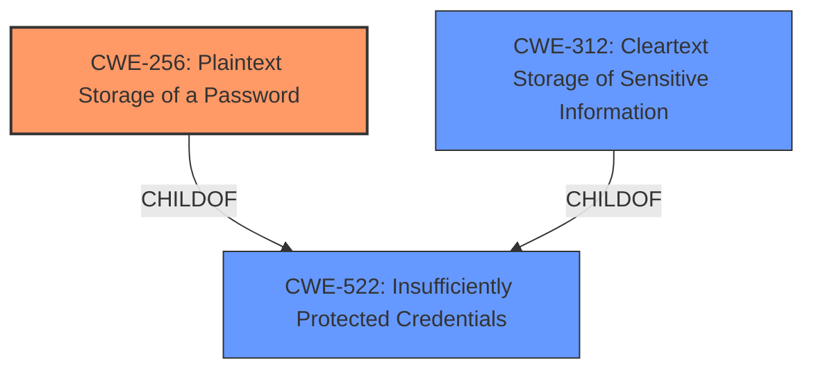

# Analysis for CVE-2020-5315

# Summary
| CWE ID | CWE Name | Confidence | CWE Abstraction Level | CWE Vulnerability Mapping Label | CWE-Vulnerability Mapping Notes |
|---|---|---|---|---|---|
| CWE-256 | Plaintext Storage of a Password | 1.0 | Base | Allowed | Primary CWE |
| CWE-312 | Cleartext Storage of Sensitive Information | 0.7 | Base | Allowed | Secondary Candidate |
| CWE-522 | Insufficiently Protected Credentials | 0.6 | Class | Allowed-with-Review | Secondary Candidate |

## Evidence and Confidence

*   **Confidence Score:** 0.9
*   **Evidence Strength:** HIGH

## Relationship Analysis
The primary relationship influencing the CWE selection is the parent-child relationship between CWE-522 (Insufficiently Protected Credentials) and CWE-256 (Plaintext Storage of a Password). CWE-256 is a more specific case of CWE-522, making it a more accurate representation of the vulnerability. CWE-312 is a peer of CWE-256 and is also a more specific case of CWE-522.

## Vulnerability Chain
The chain of events for this vulnerability is straightforward:
1.  **Root Cause:** The application stores the proxy server user password in **plain-text password storage** within a local database (**CWE-256**).
2.  **Impact:** A local authenticated malicious user with access to the local file system can access the exposed password and use it to gain unauthorized access (**CWE-256**).

## Summary of Analysis
The initial analysis strongly pointed towards **CWE-256 (Plaintext Storage of a Password)** as the primary CWE, given the explicit mention of **plain-text password storage** in the vulnerability description and summary. The "Vulnerability Description Key Phrases" also indicate "**plain-text password storage**" as the root cause. The "CVE Reference Links Content Summary" confirms that the application "**stores the proxy server user password in a plain text**."

The retriever results also list **CWE-256 (Plaintext Storage of a Password)** as the top candidate. The graph relationships show that **CWE-256 (Plaintext Storage of a Password)** is a child of **CWE-522 (Insufficiently Protected Credentials)**. Therefore, **CWE-256 (Plaintext Storage of a Password)** is a more specific and accurate representation of the vulnerability than **CWE-522 (Insufficiently Protected Credentials)**.

**CWE-312 (Cleartext Storage of Sensitive Information)** was also considered. The definition of **CWE-312 (Cleartext Storage of Sensitive Information)** says "The product stores sensitive information in cleartext within a resource that might be accessible to another control sphere". This is very similar to **CWE-256 (Plaintext Storage of a Password)** which is "Storing a password in plaintext may result in a system compromise." Since the **rootcause** specifically calls out the password stored in plaintext, **CWE-256 (Plaintext Storage of a Password)** is the best and most precise fit.

Relevant CWE Information:

# Enhanced Context (25 CWEs)

## CWE-1391: Use of Weak Credentials
**Abstraction Level**: Class
**Similarity Score**: 0.78
**Source**: dense

**Description**:
The product uses weak credentials (such as a default key or hard-coded password) that can be calculated, derived, reused, or guessed by an attacker.

**Mapping Guidance**:
- Usage: Allowed-with-Review
- Rationale: This CWE entry is a Class and might have Base-level children that would be more appropriate

*This CWE was not selected as it is about the strength of the credentials, not how they are stored.*

## CWE-312: Cleartext Storage of Sensitive Information
**Abstraction Level**: Base
**Similarity Score**: 0.78
**Source**: dense

**Description**:
The product stores sensitive information in cleartext within a resource that might be accessible to another control sphere.

**Mapping Guidance**:
- Usage: Allowed
- Rationale: This CWE entry is at the Base level of abstraction, which is a preferred level of abstraction for mapping to the root causes of vulnerabilities.

*This CWE was considered but CWE-256 is more specific.*

## CWE-319: Cleartext Transmission of Sensitive Information
**Abstraction Level**: Base
**Similarity Score**: 0.75
**Source**: dense

**Description**:
The product transmits sensitive or security-critical data in cleartext in a communication channel that can be sniffed by unauthorized actors.

**Mapping Guidance**:
- Usage: Allowed
- Rationale: This CWE entry is at the Base level of abstraction, which is a preferred level of abstraction for mapping to the root causes of vulnerabilities.

*This CWE was not selected as it relates to transmission, not storage.*

## CWE-311: Missing Encryption of Sensitive Data
**Abstraction Level**: Class
**Similarity Score**: 0.75
**Source**: dense

**Description**:
The product does not encrypt sensitive or critical information before storage or transmission.

**Mapping Guidance**:
- Usage: Discouraged
- Rationale: CWE-311 is high-level with more precise children available. It is a level-1 Class (i.e., a child of a Pillar).

*This CWE was not selected as it is too general. CWE-256 is more specific.*

## CWE-916: Use of Password Hash With Insufficient Computational Effort
**Abstraction Level**: Base
**Similarity Score**: 0.75
**Source**: dense

**Description**:
The product generates a hash for a password, but it uses a scheme that does not provide a sufficient level of computational effort that would make password cracking attacks infeasible or expensive.

**Mapping Guidance**:
- Usage: Allowed
- Rationale: This CWE entry is at the Base level of abstraction, which is a preferred level of abstraction for mapping to the root causes of vulnerabilities.

*This CWE was not selected as the password is not hashed at all.*

## CWE-261: Weak Encoding for Password
**Abstraction Level**: Base
**Similarity Score**: 0.75
**Source**: dense

**Description**:
Obscuring a password with a trivial encoding does not protect the password.

**Mapping Guidance**:
- Usage: Allowed
- Rationale: This CWE entry is at the Base level of abstraction, which is a preferred level of abstraction for mapping to the root causes of vulnerabilities.

*This CWE was not selected as there is no encoding at all.*

## CWE-257: Storing Passwords in a Recoverable Format
**Abstraction Level**: Base
**Similarity Score**: 0.75
**Source**: dense

**Description**:
The storage of passwords in a recoverable format makes them subject to password reuse attacks by malicious users. In fact, it should be noted that recoverable encrypted passwords provide no significant benefit over plaintext passwords since they are subject not only to reuse by malicious attackers but also by malicious insiders. If a system administrator can recover a password directly, or use a brute force search on the available information, the administrator can use the password on other accounts.

**Mapping Guidance**:
- Usage: Allowed
- Rationale: This CWE entry is at the Base level of abstraction, which is a preferred level of abstraction for mapping to the root causes of vulnerabilities.

*This CWE was not selected as the password is not encrypted at all.*

## CWE-1392: Use of Default Credentials
**Abstraction Level**: Base
**Similarity Score**: 0.75
**Source**: dense

**Description**:
The product uses default credentials (such as passwords or cryptographic keys) for potentially critical functionality.

**Mapping Guidance**:
- Usage: Allowed
- Rationale: This CWE entry is at the Base level of abstraction, which is a preferred level of abstraction for mapping to the root causes of vulnerabilities.

*This CWE was not selected as it is about the use of default credentials, not how they are stored.*

## CWE-1240: Use of a Cryptographic Primitive with a Risky Implementation
**Abstraction Level**: Base
**Similarity Score**: 0.75
**Source**: dense

**Description**:
To fulfill the need for a cryptographic primitive, the product implements a cryptographic algorithm using a non-standard, unproven, or disallowed/non-compliant cryptographic implementation.

**Mapping Guidance**:
- Usage: Allowed
- Rationale: This CWE entry is at the Base level of abstraction, which is a preferred level of abstraction for mapping to the root causes of vulnerabilities.

*This CWE was not selected as it is about the use