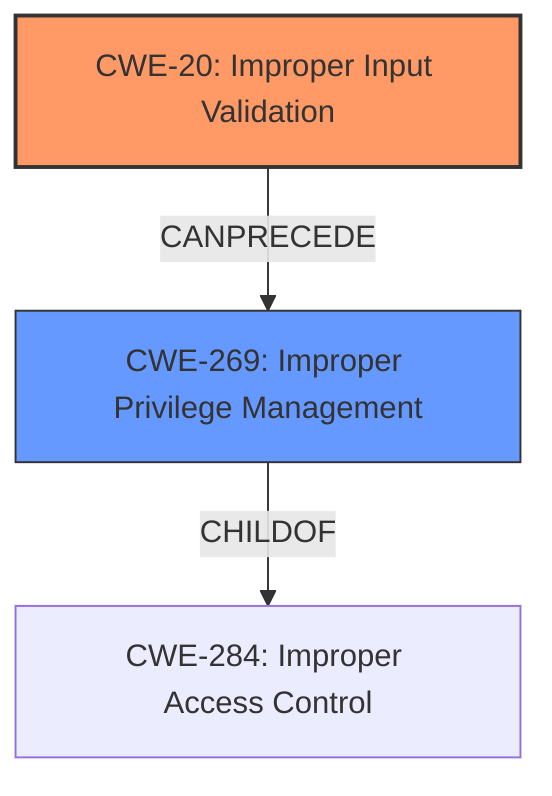

# Enhanced Analysis for CVE-2020-5321

# Summary
| CWE ID  | CWE Name                                                                                       | Confidence | CWE Abstraction Level | CWE Vulnerability Mapping Label | CWE-Vulnerability Mapping Notes |
| :-------- | :--------------------------------------------------------------------------------------------- | :---------- | :---------------------- | :------------------------------ | :------------------------------ |
| CWE-20  | Improper Input Validation                                                                    | 0.9        | Class                     | Primary                         | Discouraged                   |
| CWE-269 | Improper Privilege Management | 0.6        | Class                    | Secondary                         | Discouraged                    |

## Evidence and Confidence

*   **Confidence Score:** 0.75
*   **Evidence Strength:** HIGH

## Relationship Analysis
The primary relationship considered was the parent-child relationship, specifically CWE-20 **Improper Input Validation** as a general class of weakness. Several potential child CWEs were reviewed to determine if a more specific variant was applicable, but the provided information did not support a more detailed classification. The relationship between **Improper Input Validation** and **Improper Privilege Management** was also considered, as successful exploitation could lead to privilege escalation.



## Vulnerability Chain
The chain of events starts with **improper input validation** (CWE-20), which then allows an attacker to spawn tasks with elevated privileges. This leads to **improper privilege management** (CWE-269) and potential further compromise of the system.

## Summary of Analysis
The initial assessment focused on the stated **rootcause** of **improper input validation**. The analysis of the description clearly pointed to a failure in validating user-supplied input.

The vulnerability description states: "Dell EMC OpenManage Enterprise (OME) versions prior to 3.2 and OpenManage Enterprise-Modular (OME-M) versions prior to 1.10.00 contain an **improper input validation** vulnerability. A remote authenticated malicious user with high privileges could potentially exploit this vulnerability to spawn tasks with elevated privileges." The **CVE Reference Links Content Summary** reinforces this by stating the **root cause of the vulnerability** is **improper input validation**.

The Retriever Results listed CWE-20 **Improper Input Validation** as a candidate CWE. The CWE specification for CWE-20 describes a scenario where the product receives input but does not validate or incorrectly validates that the input has the properties that are required to process the data safely and correctly. This aligns with the vulnerability description.

CWE-20 is a Class-level CWE, and the guidance discourages its use when more specific CWEs are available. However, the description lacks the specific details to select a more granular CWE.

CWE-269 **Improper Privilege Management** was considered as a secondary CWE because the impact of the vulnerability allows an attacker to "spawn tasks with elevated privileges". The **CVE Reference Links Content Summary** mentions that a successful exploit can allow an attacker to spawn tasks with elevated privileges. This aligns with the description of CWE-269 where the product does not properly check privileges for an actor, creating an unintended sphere of control for that actor. However, **improper privilege management** is a consequence of the **improper input validation** rather than a primary weakness.

The selected CWEs are at the optimal level of specificity given the information provided. While a more detailed investigation might reveal a more specific CWE for **improper input validation**, the current evidence supports CWE-20 as the primary weakness and CWE-269 as a secondary weakness.

Relevant CWE Information:

# Enhanced Context (25 CWEs)
The following CWEs were identified as potentially relevant to this vulnerability:

## CWE-280: Improper Handling of Insufficient Permissions or Privileges 
**Abstraction Level**: Base
**Similarity Score**: 0.76
**Source**: dense

**Description**:
The product does not handle or incorrectly handles when it has insufficient privileges to access resources or functionality as specified by their permissions. This may cause it to follow unexpected code paths that may leave the product in an invalid state.

**Mapping Guidance**:
- Usage: Allowed
- Rationale: This CWE entry is at the Base level of abstraction, which is a preferred level of abstraction for mapping to the root causes of vulnerabilities.

## CWE-274: Improper Handling of Insufficient Privileges
**Abstraction Level**: Base
**Similarity Score**: 0.76
**Source**: dense

**Description**:
The product does not handle or incorrectly handles when it has insufficient privileges to perform an operation, leading to resultant weaknesses.

**Mapping Guidance**:
- Usage: Discouraged
- Rationale: This CWE entry could be deprecated in a future version of CWE.

## CWE-653: Improper Isolation or Compartmentalization
**Abstraction Level**: Class
**Similarity Score**: 0.75
**Source**: dense

**Description**:
The product does not properly compartmentalize or isolate functionality, processes, or resources that require different privilege levels, rights, or permissions.

**Mapping Guidance**:
- Usage: Allowed
- Rationale: This CWE entry is at the Base level of abstraction, which is a preferred level of abstraction for mapping to the root causes of vulnerabilities.

## CWE-807: Reliance on Untrusted Inputs in a Security Decision
**Abstraction Level**: Base
**Similarity Score**: 0.75
**Source**: dense

**Description**:
The product uses a protection mechanism that relies on the existence or values of an input, but the input can be modified by an untrusted actor in a way that bypasses the protection mechanism.

**Mapping Guidance**:
- Usage: Allowed
- Rationale: This CWE entry is at the Base level of abstraction, which is a preferred level of abstraction for mapping to the root causes of vulnerabilities.

## CWE-1220: Insufficient Granularity of Access Control
**Abstraction Level**: Base
**Similarity Score**: 0.74
**Source**: dense

**Description**:
The product implements access controls via a policy or other feature with the intention to disable or restrict accesses (reads and/or writes) to assets in a system from untrusted agents. However, implemented access controls lack required granularity, which renders the control policy too broad because it allows accesses from unauthorized agents to the security-sensitive assets.

**Mapping Guidance**:
- Usage: Allowed
- Rationale: This CWE entry is at the Base level of abstraction, which is a preferred level of abstraction for mapping to the root causes of vulnerabilities.

## CWE-639: Authorization Bypass Through User-Controlled Key
**Abstraction Level**: Base
**Similarity Score**: 0.74
**Source**: dense

**Description**:
The system's authorization functionality does not prevent one user from gaining access to another user's data or record by modifying the key value identifying the data.

**Mapping Guidance**:
- Usage: Allowed
- Rationale: This CWE entry is at the Base level of abstraction, which is a preferred level of abstraction for mapping to the root causes of vulnerabilities.

## CWE-266: Incorrect Privilege Assignment
**Abstraction Level**: Base
**Similarity Score**: 0.74
**Source**: dense

**Description**:
A product incorrectly assigns a privilege to a particular actor, creating an unintended sphere of control for that actor.

**Mapping Guidance**:
- Usage: Allowed
- Rationale: This CWE entry is at the Base level of abstraction, which is a preferred level of abstraction for mapping to the root causes of vulnerabilities.

## CWE-1289: Improper Validation of Unsafe Equivalence in Input
**Abstraction Level**: Base
**Similarity Score**: 0.73
**Source**: dense

**Description**:
The product receives an input value that is used as a resource identifier or other type of reference, but it does not validate or incorrectly validates that the input is equivalent to a potentially-unsafe value.

**Mapping Guidance**:
- Usage: Allowed
- Rationale: This CWE entry is at the Base level of abstraction, which is a preferred level of abstraction for mapping to the root causes of vulnerabilities.

## CWE-267: Privilege Defined With Unsafe Actions
**Abstraction Level**: Base
**Similarity Score**: 0.73
**Source**: dense

**Description**:
A particular privilege, role, capability, or right can be used to perform unsafe actions that were not intended, even when it is assigned to the correct entity.

**Mapping Guidance**:
- Usage: Allowed
- Rationale: This CWE entry is at the Base level of abstraction, which is a preferred level of abstraction for mapping to the root causes of vulnerabilities.

## CWE-226: Sensitive Information in Resource Not Removed Before Reuse
**Abstraction Level**: Base
**Similarity Score**: 0.73
**Source**: dense

**Description**:
The product releases a resource such as memory or a file so that it can be made available for reuse, but it does not clear or "zeroize" the information contained in the resource before the product performs a critical


## CWE Relationship Analysis

Current CWEs represent these abstraction levels: .


### Vulnerability Chain Analysis

**Chain starting from CWE-639:**
- 639 (Authorization Bypass Through User-Controlled Key) - ROOT


**Chain starting from CWE-284:**
- 284 (Improper Access Control) - ROOT


### CWE Relationship Diagram

```mermaid
graph TD
    classDef primary fill:#f96,stroke:#333,stroke-width:2px
    classDef secondary fill:#69f,stroke:#333
    classDef tertiary fill:#9e9,stroke:#333
```