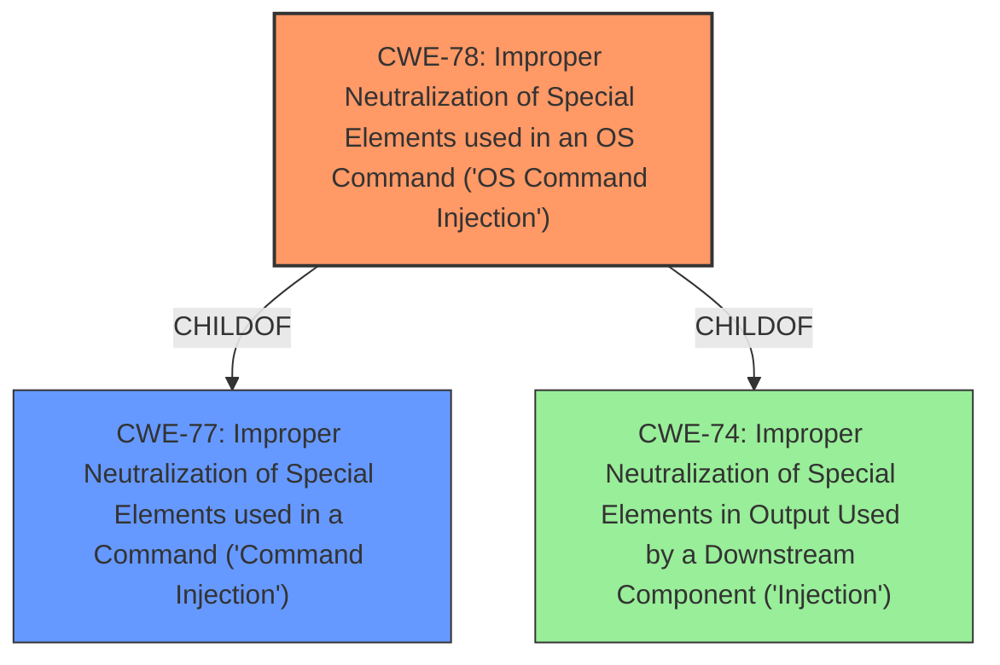

# Raw Analyzer Response for CVE-2020-5322

# Summary
| CWE ID | CWE Name | Confidence | CWE Abstraction Level | CWE Vulnerability Mapping Label | CWE-Vulnerability Mapping Notes |
|---|---|---|---|---|---|
| CWE-78 | Improper Neutralization of Special Elements used in an OS Command ('OS Command Injection') | 1.0 | Base | Allowed | Primary CWE |
| CWE-77 | Improper Neutralization of Special Elements used in a Command ('Command Injection') | 0.7 | Class | Allowed-with-Review | Secondary Candidate |

## Evidence and Confidence

*   **Confidence Score:** 0.9
*   **Evidence Strength:** HIGH

## Relationship Analysis
The primary relationship that impacted the decision was the ChildOf relationship between CWE-78 and CWE-77, indicating that OS Command Injection is a specific type of Command Injection. While both are relevant, CWE-78 is a more precise classification. The Retriever Results also list CWE-78 as a strong candidate.

## Vulnerability Chain
The vulnerability chain is straightforward:
1.  **Root Cause:** **Command Injection** (CWE-78)
2.  **Impact:** Execution of arbitrary shell commands

## Summary of Analysis
The initial analysis strongly pointed to a **command injection** vulnerability. The "Vulnerability Description Key Phrases" section explicitly mentions "**command injection**" as a **weakness**, and the "CVE Reference Links Content Summary" confirms that the **root cause** is a **command injection** flaw. Given that the vulnerability allows the execution of arbitrary *shell* commands, CWE-78, "Improper Neutralization of Special Elements used in an OS Command ('OS Command Injection')" is the most appropriate primary CWE. The description of CWE-78 aligns perfectly with the vulnerability: "The product constructs all or part of an OS command using externally-influenced input..., but it does not neutralize or incorrectly neutralizes special elements that could modify the intended OS command..."

CWE-77, "Improper Neutralization of Special Elements used in a Command ('Command Injection')" was considered as a broader, more general case of command injection, but because the vulnerability specifically mentions "shell commands" or "OS commands", CWE-78 is more specific and accurate. The MITRE mapping guidance for CWE-78 states: "This CWE entry is at the Base level of abstraction, which is a preferred level of abstraction for mapping to the root causes of vulnerabilities."

The evidence from the vulnerability description and the content summary is sufficient to confidently classify this vulnerability as CWE-78.

Relevant CWE Information:

# Enhanced Context (25 CWEs)

## CWE-653: Improper Isolation or Compartmentalization
**Abstraction Level**: Class
**Similarity Score**: 0.74
**Source**: dense
This CWE was not selected because it does not describe the root cause of the vulnerability, which is command injection.

## CWE-74: Improper Neutralization of Special Elements in Output Used by a Downstream Component ('Injection')
**Abstraction Level**: Class
**Similarity Score**: 0.73
**Source**: dense
This CWE was considered, but it is a more general class of injection vulnerabilities. Since the vulnerability specifically involves OS commands, CWE-78 is a more precise match.

## CWE-184: Incomplete List of Disallowed Inputs
**Abstraction Level**: Base
**Similarity Score**: 0.72
**Source**: dense
This CWE doesn't fit the vulnerability. The issue is not with an incomplete list of disallowed inputs, but rather with the improper handling of special elements within the input.

## CWE-668: Exposure of Resource to Wrong Sphere
**Abstraction Level**: Class
**Similarity Score**: 0.72
**Source**: dense
This CWE does not describe the root cause of the vulnerability.

## CWE-807: Reliance on Untrusted Inputs in a Security Decision
**Abstraction Level**: Base
**Similarity Score**: 0.72
**Source**: dense
This CWE does not describe the root cause of the vulnerability.

## CWE-912: Hidden Functionality
**Abstraction Level**: Class
**Similarity Score**: 0.72
**Source**: dense
This CWE is not relevant to the vulnerability.

## CWE-41: Improper Resolution of Path Equivalence
**Abstraction Level**: Base
**Similarity Score**: 0.71
**Source**: dense
This CWE is not relevant to the vulnerability.

## CWE-829: Inclusion of Functionality from Untrusted Control Sphere
**Abstraction Level**: Base
**Similarity Score**: 0.71
**Source**: dense
This CWE is not relevant to the vulnerability.

## CWE-749: Exposed Dangerous Method or Function
**Abstraction Level**: Base
**Similarity Score**: 0.71
**Source**: dense
This CWE is not relevant to the vulnerability.

## CWE-472: External Control of Assumed-Immutable Web Parameter
**Abstraction Level**: Base
**Similarity Score**: 0.71
**Source**: dense
This CWE is not relevant to the vulnerability.

## CWE-79: Improper Neutralization of Input During Web Page Generation ('Cross-site Scripting')
**Abstraction Level**: Base
**Similarity Score**: 9500.98
**Source**: sparse
This CWE is not relevant to the vulnerability, which involves command injection, not cross-site scripting.

## CWE-116: Improper Encoding or Escaping of Output
**Abstraction Level**: Class
**Similarity Score**: 9449.75
**Source**: sparse
This CWE is not the primary issue, as the root cause is the lack of proper neutralization of special elements in OS commands, not encoding or escaping.

## CWE-138: Improper Neutralization of Special Elements
**Abstraction Level**: Class
**Similarity Score**: 9333.00
**Source**: sparse
This is a more general class, and CWE-78 is a more specific and accurate representation of the vulnerability.

## CWE-88: Improper Neutralization of Argument Delimiters in a Command ('Argument Injection')
**Abstraction Level**: Base
**Similarity Score**: 9243.84
**Source**: sparse
This could be a secondary weakness if argument delimiters are not properly handled. However, the primary issue is that special elements are not neutralized in the OS command.

## CWE-22: Improper Limitation of a Pathname to a Restricted Directory ('Path Traversal')
**Abstraction Level**: Base
**Similarity Score**: 9174.44
**Source**: sparse
This CWE is not relevant to the vulnerability.

## CWE-78: Improper Neutralization of Special Elements used in an OS Command ('OS Command Injection')
**Abstraction Level**: base
**Similarity Score**: 5.03
**Source**: graph
**Description**:
CWE-78: Improper Neutralization of Special Elements used in an OS Command ('OS Command Injection')
This is the selected CWE.

## CWE-79: Improper Neutralization of Input During Web Page Generation ('Cross-site Scripting')
**Abstraction Level**: base
**Similarity Score**: 5.03
**Source**: graph
This CWE is not relevant to the vulnerability.

## CWE-494: Download of Code Without Integrity Check
**Abstraction Level**: base
**Similarity Score**: 4.33
**Source**: graph
This CWE is not relevant to the vulnerability.

## CWE-22: Improper Limitation of a Pathname to a Restricted Directory ('Path Traversal')
**Abstraction Level**: base
**Similarity Score**: 4.33
**Source**: graph
This CWE is not relevant to the vulnerability.

## CWE-770: Allocation of Resources Without Limits or Throttling
**Abstraction Level**: base
**Similarity Score**: 4.33
**Source**: graph
This CWE is not relevant to the vulnerability.

## CWE-190: Integer Overflow or Wraparound
**Abstraction Level**: base
**Similarity Score**: 4.33
**Source**: graph
This CWE is not relevant to the vulnerability.

## CWE-125: Out-of-bounds Read
**Abstraction Level**: base
**Similarity Score**: 3.89
**Source**: graph
This CWE is not relevant to the vulnerability.

## CWE-88: Improper Neutralization of Argument Delimiters in a Command ('Argument Injection')
**Abstraction Level**: base
**Similarity Score**: 3.64
**Source**: graph
This CWE is not relevant to the vulnerability.

## CWE-1