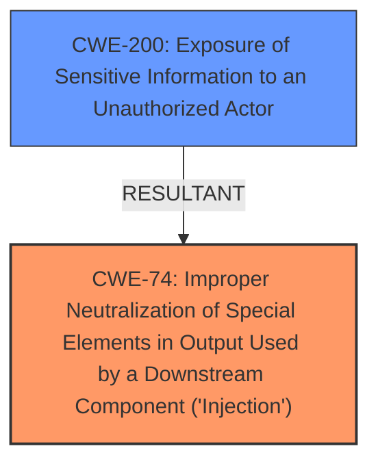

# Raw Analyzer Response for CVE-2020-5323

# Summary
| CWE ID | CWE Name | Confidence | CWE Abstraction Level | CWE Vulnerability Mapping Label | CWE-Vulnerability Mapping Notes |
|---|---|---|---|---|---|
| CWE-74 | Improper Neutralization of Special Elements in Output Used by a Downstream Component ('Injection') | 0.8 | Class | Allowed | The primary weakness is due to an injection vulnerability, which fits the CWE-74 description. |
| CWE-200 | Exposure of Sensitive Information to an Unauthorized Actor | 0.5 | Class | Discouraged | The impact of the injection vulnerability is to gain access to sensitive information, which aligns with CWE-200. However, it's a secondary impact rather than a root cause. |

## Evidence and Confidence

*   **Confidence Score:** 0.7
*   **Evidence Strength:** MEDIUM

## Relationship Analysis
The primary relationship impacting the decision is the parent-child relationship between CWE-74 and its potential children. CWE-74 is a class-level CWE, and the vulnerability description lacks specific details about the injection type. Therefore, mapping to a more specific child is not possible. CWE-200 is related as a potential impact of the injection vulnerability.

## Vulnerability Chain
The vulnerability chain starts with the **injection vulnerability** (CWE-74), which leads to the potential impact of gaining access to sensitive information (CWE-200) or denial-of-service.

## Summary of Analysis
Initially, the vulnerability description indicated an **injection vulnerability**, leading to consideration of CWE-74. The impact, gaining access to sensitive information, suggested CWE-200.

The analysis hinges on the provided evidence, primarily the "Vulnerability Description Key Phrases" and "CVE Reference Links Content Summary". The "Vulnerability Description Key Phrases" clearly identifies the **weakness** as an **injection vulnerability**. The "CVE Reference Links Content Summary" further confirms this by stating the **Root Cause:** The vulnerability is due to an unspecified **injection flaw**.

CWE-74 (Improper Neutralization of Special Elements in Output Used by a Downstream Component ('Injection')) aligns with the identified root cause. The description of CWE-74 matches the vulnerability, as it involves constructing a command or data structure using externally-influenced input without proper neutralization.

CWE-200 (Exposure of Sensitive Information to an Unauthorized Actor) was considered because the impact of the vulnerability includes gaining access to sensitive information. However, CWE-200 represents the consequence rather than the root cause. The "Mapping Guidance" for CWE-200 explicitly discourages its use when it represents the loss of confidentiality, as it is a technical impact and not a root cause error.

The decision to primarily map to CWE-74 is based on the root cause identified in the provided evidence and the MITRE mapping guidance. The choice of a class-level CWE is due to the lack of specific details about the injection type.

Relevant CWE Information:

# Enhanced Context (25 CWEs)
The following CWEs were identified as potentially relevant to this vulnerability:

## CWE-653: Improper Isolation or Compartmentalization
**Abstraction Level**: Class
**Similarity Score**: 0.76
**Source**: dense

**Description**:
The product does not properly compartmentalize or isolate functionality, processes, or resources that require different privilege levels, rights, or permissions.

**Mapping Guidance**:
- Usage: Allowed
- Rationale: This CWE entry is at the Base level of abstraction, which is a preferred level of abstraction for mapping to the root causes of vulnerabilities.

*Rejected:* This is not a compartmentalization issue, but an injection issue.

## CWE-226: Sensitive Information in Resource Not Removed Before Reuse
**Abstraction Level**: Base
**Similarity Score**: 0.75
**Source**: dense

**Description**:
The product releases a resource such as memory or a file so that it can be made available for reuse, but it does not clear or "zeroize" the information contained in the resource before the product performs a critical state transition or makes the resource available for reuse by other entities.

**Mapping Guidance**:
- Usage: Allowed
- Rationale: This CWE entry is at the Base level of abstraction, which is a preferred level of abstraction for mapping to the root causes of vulnerabilities.

*Rejected:* This is not a resource reuse issue, but an injection issue.

## CWE-74: Improper Neutralization of Special Elements in Output Used by a Downstream Component ('Injection')
**Abstraction Level**: Class
**Similarity Score**: 0.74
**Source**: dense

**Description**:
The product constructs all or part of a command, data structure, or record using externally-influenced input from an upstream component, but it does not neutralize or incorrectly neutralizes special elements that could modify how it is parsed or interpreted when it is sent to a downstream component.

**Mapping Guidance**:
- Usage: Discouraged
- Rationale: CWE-74 is high-level and often misused when lower-level weaknesses are more appropriate.

*Accepted:* The vulnerability is specifically described as an injection vulnerability, making this the most relevant CWE.

## CWE-131: Incorrect Calculation of Buffer Size
**Abstraction Level**: Base
**Similarity Score**: 0.74
**Source**: dense

**Description**:
The product does not correctly calculate the size to be used when allocating a buffer, which could lead to a buffer overflow.

**Mapping Guidance**:
- Usage: Allowed
- Rationale: This CWE entry is at the Base level of abstraction, which is a preferred level of abstraction for mapping to the root causes of vulnerabilities.

*Rejected:* There is no evidence of a buffer size miscalculation.

## CWE-404: Improper Resource Shutdown or Release
**Abstraction Level**: Class
**Similarity Score**: 0.74
**Source**: dense

**Description**:
The product does not release or incorrectly releases a resource before it is made available for re-use.

**Mapping Guidance**:
- Usage: Allowed-with-Review
- Rationale: This CWE entry is a Class and might have Base-level children that would be more appropriate

*Rejected:* There is no evidence of resource shutdown issues.

## CWE-667: Improper Locking
**Abstraction Level**: Class
**Similarity Score**: 0.74
**Source**: dense

**Description**:
The product does not properly acquire or release a lock on a resource, leading to unexpected resource state changes and behaviors.

**Mapping Guidance**:
- Usage: Allowed-with-Review
- Rationale: This CWE entry is a Class and might have Base-level children that would be more appropriate

*Rejected:* There is no evidence of locking issues.

## CWE-1289: Improper Validation of Unsafe Equivalence in Input
**Abstraction Level**: Base
**Similarity Score**: 0.74
**Source**: dense

**Description**:
The product receives an input value that is used as a resource identifier or other type of reference, but it does not validate or incorrectly validates that the input is equivalent to a potentially-unsafe value.

**Mapping Guidance**:
- Usage: Allowed
- Rationale: This CWE entry is at the Base level of abstraction, which is a preferred level of abstraction for mapping to the root causes of vulnerabilities.

*Rejected:* This is not an unsafe equivalence issue, but an injection issue.

## CWE-274: Improper Handling of Insufficient Privileges
**Abstraction Level**: Base
**Similarity Score**: 0.74
**Source**: dense

**Description**:
The product does not handle or incorrectly handles when it has insufficient privileges to perform an operation, leading to resultant weaknesses.

**Mapping Guidance**:
- Usage: Discouraged
- Rationale: This CWE entry could be deprecated in a future version of CWE.

*Rejected:* While the attacker requires low privileges, this is an injection issue not a privilege handling issue.

## CWE-119: Improper Restriction of Operations within the Bounds of a Memory Buffer
**Abstraction Level**: Class
**Similarity Score**: 0.74
**Source**: dense

**Description**:
The product performs operations on a memory buffer, but it reads from or writes to a memory location outside the buffer's intended boundary. This may result in read or write operations on unexpected memory locations that could be linked to other variables, data structures, or internal program data.

**Mapping Guidance**:
- Usage: Discouraged
- Rationale: CWE-119 is commonly misused in low-information vulnerability reports when lower-level CWEs could be used instead, or when more details about the vulnerability are available.

*Rejected:* There is no evidence of a buffer overflow.

## CWE-125: Out-of-bounds Read
**Abstraction Level**: Base
**Similarity Score**: 0.73
**Source**: dense

**Description**:
The product reads data past the end, or before the beginning