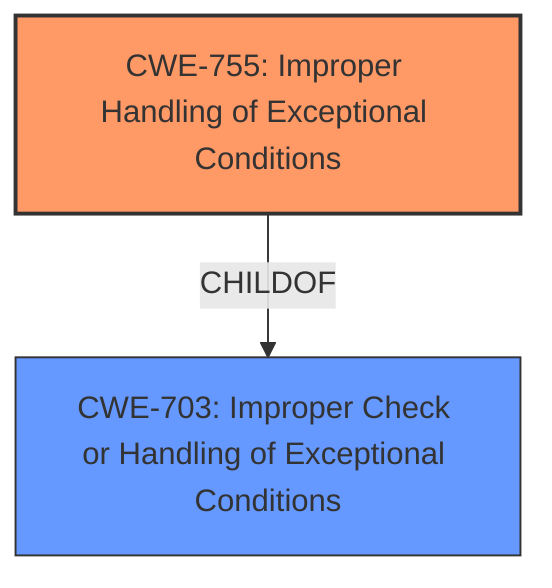

# Analysis for CVE-2020-5387

# Summary
| CWE ID | CWE Name | Confidence | CWE Abstraction Level | CWE Vulnerability Mapping Label | CWE-Vulnerability Mapping Notes |
|---|---|---|---|---|---|
| CWE-755 | Improper Handling of Exceptional Conditions | 0.9 | Class | Allowed-with-Review | Primary CWE |

## Evidence and Confidence

*   **Confidence Score:** 0.9
*   **Evidence Strength:** HIGH

## Relationship Analysis
The primary relationship that influenced my decision was the ChildOf relationship between CWE-755 and CWE-703 (Improper Check or Handling of Exceptional Conditions), indicating that CWE-755 is a more specific type of the broader category defined by CWE-703. Given the direct mention of "**Improper Exception Handling**" in the vulnerability description key phrases, selecting CWE-755 provides a more precise classification than its parent.

## Vulnerability Chain
The vulnerability chain starts with "**Improper Exception Handling**" which leads to preventing the system from booting.

## Summary of Analysis
The initial assessment identified CWE-755 as the most relevant CWE due to the explicit mention of "**Improper Exception Handling**" in the vulnerability description. The vulnerability description clearly states that a local attacker with physical access can exploit this vulnerability to prevent the system from booting.

The evidence for selecting CWE-755 is primarily based on the "**Improper Exception Handling**" phrase found in the "Vulnerability Description Key Phrases" section. The retriever results also list CWE-755 as the top candidate.

The selection of CWE-755 is at the optimal level of specificity because it directly addresses the type of weakness described in the vulnerability, which is the **improper handling of exceptions**. While more specific CWEs might exist for particular types of exception handling errors, the available information does not provide sufficient detail to warrant a more granular classification.

Relevant CWE Information:

# Enhanced Context (25 CWEs)

## CWE-755: Improper Handling of Exceptional Conditions
**Abstraction:** Class
**Status:** Incomplete

### Description
The product does not handle or incorrectly handles an exceptional condition.

### Extended Description
Not provided

### Alternative Terms
None

### Relationships
ChildOf -> CWE-703

### Mapping Guidance
**Usage:** Discouraged
**Rationale:** This CWE entry is a level-1 Class (i.e., a child of a Pillar). It might have lower-level children that would be more appropriate
**Comments:** Examine children of this entry to see if there is a better fit
**Reasons:**
- Abstraction