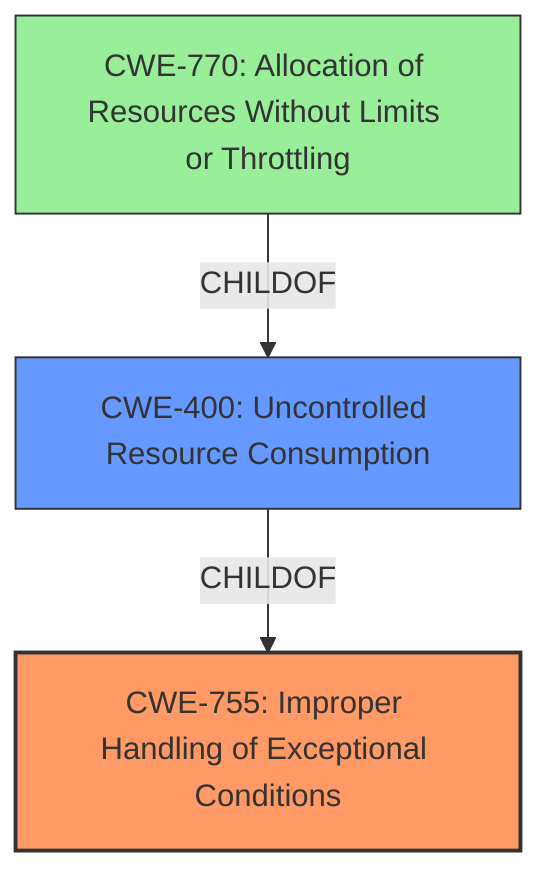

# Analysis Report for CVE-2020-5403

# Vulnerability Analysis Report: CVE-2020-5403

## Description


## Analysis (with Relationship Data)

# Summary

| CWE ID  | CWE Name                                           | Confidence | CWE Abstraction Level | CWE Vulnerability Mapping Label | CWE-Vulnerability Mapping Notes |
|---------|----------------------------------------------------|------------|-----------------------|---------------------------------|---------------------------------|
| CWE-755 | Improper Handling of Exceptional Conditions       | 0.85       | Class                 | Primary                          | Allowed-with-Review              |
| CWE-400 | Uncontrolled Resource Consumption                | 0.75       | Class                 | Secondary                         | Discouraged                     |
| CWE-770 | Allocation of Resources Without Limits or Throttling | 0.65       | Base                  | Secondary                         | Allowed                         |

## Evidence and Confidence

*   **Confidence Score:** 0.80
*   **Evidence Strength:** HIGH

## Relationship Analysis
The primary relationship influencing the CWE selection is the hierarchical relationship. CWE-755 (Improper Handling of Exceptional Conditions) is a Class-level CWE, and other potential candidates such as CWE-400 (Uncontrolled Resource Consumption) and CWE-770 (Allocation of Resources Without Limits or Throttling) are also related. While CWE-400 is a Class, CWE-770 is a Base, providing a more specific view of the problem. However, the root cause described in the vulnerability is the improper handling of the exception.



## Vulnerability Chain
The vulnerability chain begins with the Reactor Netty HTTP server encountering a malformed URL, leading to a `URISyntaxException`. Instead of handling this exception gracefully (e.g., by returning a 400 error), the server prematurely closes the connection, resulting in a denial-of-service.

The chain can be summarized as:
1.  Malformed URL Received
2.  `URISyntaxException` Thrown
3.  **Improper Handling of Exceptional Conditions (CWE-755)** - Server fails to properly handle the exception.
4.  Connection Closed Prematurely.
5.  **Uncontrolled Resource Consumption (CWE-400)** - Repeated attacks could exhaust server resources.

## Summary of Analysis
The initial assessment identified several potential CWEs, including CWE-755, CWE-400, and CWE-770. The final decision favors CWE-755 as the primary weakness because the core issue is the **improper handling** of the `URISyntaxException`. The evidence from the "CVE Reference Links Content Summary" states, "The server prematurely closes the connection instead of responding with a 400 error," which directly indicates a failure in exception handling.

CWE-400 and CWE-770 are considered secondary because they represent potential consequences of the primary weakness. An attacker exploiting this vulnerability could potentially cause a denial-of-service by repeatedly sending malformed URLs, leading to **uncontrolled resource consumption**.

The selection of CWE-755 is at the optimal level of specificity. While more specific CWEs related to resource management exist, the root cause is the lack of proper exception handling. This directly leads to the connection being closed.

Relevant CWE Information:

# Enhanced Context (25 CWEs)

## CWE-404: Improper Resource Shutdown or Release
**Abstraction Level**: Class
**Similarity Score**: 0.80
**Source**: dense

**Description**:
The product does not release or incorrectly releases a resource before it is made available for re-use.

**Mapping Guidance**:
- Usage: Allowed-with-Review
- Rationale: This CWE entry is a Class and might have Base-level children that would be more appropriate

## CWE-226: Sensitive Information in Resource Not Removed Before Reuse
**Abstraction Level**: Base
**Similarity Score**: 0.79
**Source**: dense

**Description**:
The product releases a resource such as memory or a file so that it can be made available for reuse, but it does not clear or "zeroize" the information contained in the resource before the product performs a critical state transition or makes the resource available for reuse by other entities.

**Mapping Guidance**:
- Usage: Allowed
- Rationale: This CWE entry is at the Base level of abstraction, which is a preferred level of abstraction for mapping to the root causes of vulnerabilities.

## CWE-772: Missing Release of Resource after Effective Lifetime
**Abstraction Level**: Base
**Similarity Score**: 0.76
**Source**: dense

**Description**:
The product does not release a resource after its effective lifetime has ended, i.e., after the resource is no longer needed.

**Mapping Guidance**:
- Usage: Allowed
- Rationale: This CWE entry is at the Base level of abstraction, which is a preferred level of abstraction for mapping to the root causes of vulnerabilities.

## CWE-664: Improper Control of a Resource Through its Lifetime
**Abstraction Level**: Pillar
**Similarity Score**: 0.76
**Source**: dense

**Description**:
The product does not maintain or incorrectly maintains control over a resource throughout its lifetime of creation, use, and release.

**Mapping Guidance**:
- Usage: Discouraged
- Rationale: This CWE entry is high-level when lower-level children are available.

## CWE-405: Asymmetric Resource Consumption (Amplification)
**Abstraction Level**: Class
**Similarity Score**: 0.74
**Source**: dense

**Description**:
The product does not properly control situations in which an adversary can cause the product to consume or produce excessive resources without requiring the adversary to invest equivalent work or otherwise prove authorization, i.e., the adversary's influence is "asymmetric."

**Mapping Guidance**:
- Usage: Allowed-with-Review
- Rationale: This CWE entry is a Class and might have Base-level children that would be more appropriate

## CWE-1325: Improperly Controlled Sequential Memory Allocation
**Abstraction Level**: Base
**Similarity Score**: 0.73
**Source**: dense

**Description**:
The product manages a group of objects or resources and performs a separate memory allocation for each object, but it does not properly limit the total amount of memory that is consumed by all of the combined objects.

**Mapping Guidance**:
- Usage: Allowed
- Rationale: This CWE entry is at the Base level of abstraction, which is a preferred level of abstraction for mapping to the root causes of vulnerabilities.

## CWE-667: Improper Locking
**Abstraction Level**: Class
**Similarity Score**: 0.73
**Source**: dense

**Description**:
The product does not properly acquire or release a lock on a resource, leading to unexpected resource state changes and behaviors.

**Mapping Guidance**:
- Usage: Allowed-with-Review
- Rationale: This CWE entry is a Class and might have Base-level children that would be more appropriate

## CWE-771: Missing Reference to Active Allocated Resource
**Abstraction Level**: Base
**Similarity Score**: 0.73
**Source**: dense

**Description**:
The product does not properly maintain a reference to a resource that has been allocated, which prevents the resource from being reclaimed.

**Mapping Guidance**:
- Usage: Allowed
- Rationale: This CWE entry is at the Base level of abstraction, which is a preferred level of abstraction for mapping to the root causes of vulnerabilities.

## CWE-789: Memory Allocation with Excessive Size Value
**Abstraction Level**: Variant
**Similarity Score**: 0.72
**Source**: dense

**Description**:
The product allocates memory based on an untrusted, large size value, but it does not ensure that the size is within expected limits, allowing arbitrary amounts of memory to be allocated.

**Mapping Guidance**:
- Usage: Allowed
- Rationale: This CWE entry is at the Variant level of abstraction, which is a preferred level of abstraction for mapping to the root causes of vulnerabilities.

## CWE-410: Insufficient Resource Pool
**Abstraction Level**: Base
**Similarity Score**: 0.72
**Source**: dense

**Description**:
The product's resource pool is not large enough to handle peak demand, which allows an attacker to prevent others from accessing the resource by using a (relatively) large number of requests for resources.

**Mapping Guidance**:
- Usage: Allowed
- Rationale: This CWE entry is at the Base level of abstraction, which is a preferred level of abstraction for mapping to the root causes of vulnerabilities.

## CWE-770: Allocation of Resources Without Limits or Throttling
**Abstraction Level**: Base
**Similarity Score**: 6097.42
**Source**: sparse

**Description


## CWE Relationship Analysis

Current CWEs represent these abstraction levels: .


### Vulnerability Chain Analysis

**Chain starting from CWE-667:**
- 667 (Improper Locking) - ROOT


**Chain starting from CWE-664:**
- 664 (Improper Control of a Resource Through its Lifetime) - ROOT


### CWE Relationship Diagram

```mermaid
graph TD
    classDef primary fill:#f96,stroke:#333,stroke-width:2px
    classDef secondary fill:#69f,stroke:#333
    classDef tertiary fill:#9e9,stroke:#333
```


*Report generated on 2025-04-01 19:01:07*
