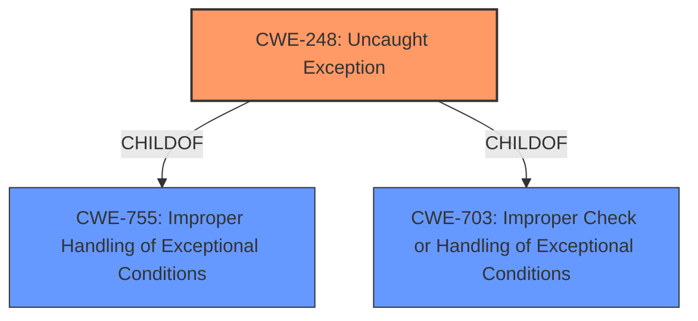

# Raw Analyzer Response for CVE-2020-5801

# Summary
| CWE ID | CWE Name | Confidence | CWE Abstraction Level | CWE Vulnerability Mapping Label | CWE-Vulnerability Mapping Notes |
|---|---|---|---|---|---|
| CWE-248 | Uncaught Exception | 1.0 | Base | Primary | Allowed |

## Evidence and Confidence

*   **Confidence Score:** 1.0
*   **Evidence Strength:** HIGH

## Relationship Analysis
The primary relationship that influenced my decision was the ChildOf relationship between CWE-248 and other more general CWEs such as CWE-755 and CWE-703. While CWE-755 (Improper Handling of Exceptional Conditions) could be considered, CWE-248 is more specific, focusing on the scenario where an exception is thrown but not caught, leading to a crash.

## Vulnerability Chain
The vulnerability chain is straightforward: A crafted message is sent, leading to an **unhandled exception**, which then causes process termination.
  - The root cause is the **unhandled exception**.
  - The impact is process termination.

## Summary of Analysis
The analysis is based directly on the provided evidence, especially the key phrases and CVE reference summary. The vulnerability description explicitly mentions an **"unhandled exception"** leading to process termination. The CVE reference links content summary for CVE-2020-5801 explicitly mentions **"Unhandled exception in CFTLDManager::HandleRequest function"** and impact as **"Denial of service (DoS) due to RSLinxNG.exe process termination"**. The retriever results also highlight CWE-248 as the top candidate.

CWE-248 (Uncaught Exception) is the most appropriate mapping because it precisely describes the core issue: an exception is thrown but not caught, leading to a crash. The description of CWE-248 mentions: "When an exception is not caught, it may cause the program to crash or expose sensitive information."

I considered CWE-755 (Improper Handling of Exceptional Conditions), but it's a more general class. While an **unhandled exception** is indeed an improper handling of an exceptional condition, CWE-248 is more specific and directly addresses the scenario.

CWE-789 (Memory Allocation with Excessive Size Value) was considered because other CVEs in the provided summary exhibited this weakness, however this specific CVE does not present this root cause, but focuses on an **unhandled exception**.

The selection of CWE-248 is at the optimal level of specificity, as it directly reflects the **root cause** described in the vulnerability.