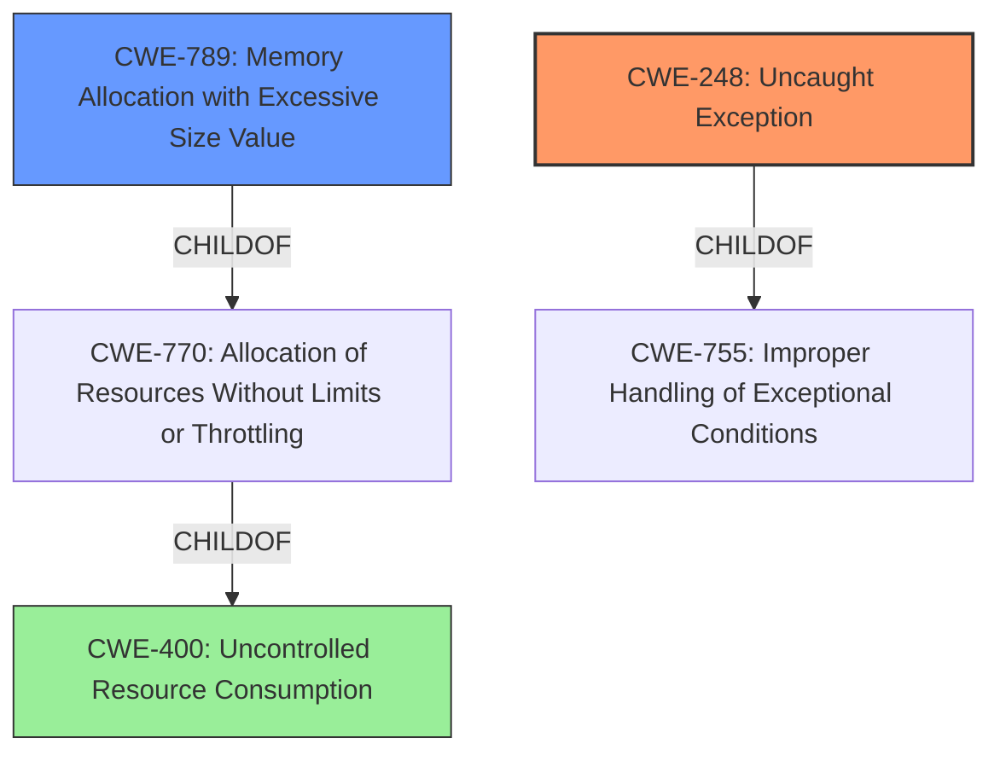

# Raw Analyzer Response for CVE-2020-5807

# Summary
| CWE ID  | CWE Name                                                               | Confidence | CWE Abstraction Level | CWE Vulnerability Mapping Label | CWE-Vulnerability Mapping Notes |
| ------- | ---------------------------------------------------------------------- | ---------- | ----------------------- | ------------------------------- | ----------------------------- |
| CWE-248 | Uncaught Exception                                                     | 0.9        | Base                    | Allowed                         | Primary CWE                   |
| CWE-789 | Memory Allocation with Excessive Size Value                             | 0.7        | Variant                 | Allowed                         | Secondary Candidate           |
| CWE-400 | Uncontrolled Resource Consumption                                      | 0.6        | Class                   | Discouraged                     | Secondary Candidate           |

## Evidence and Confidence

*   **Confidence Score:** 0.8
*   **Evidence Strength:** HIGH

## Relationship Analysis
The primary relationship influencing the CWE selection is the hierarchical relationship. CWE-248 (Uncaught Exception) is a base CWE, making it more specific than its parent classes. The vulnerability description clearly indicates an unhandled exception, supporting this choice. CWE-789 (Memory Allocation with Excessive Size Value) is a variant of CWE-770 and relates to the potential cause of the exception. CWE-400 (Uncontrolled Resource Consumption) is a broader class that encompasses the potential resource exhaustion.

## Vulnerability Chain
The vulnerability chain starts with an unauthenticated remote attacker sending data to a specific port. This leads to long fields being written to the FactoryTalk Diagnostics event log. When a local user opens the FactoryTalk Diagnostics Viewer, the long fields cause an **unhandled exception in wcscpy_s()**, potentially due to memory allocation issues.

## Summary of Analysis
The initial assessment strongly points to CWE-248 (Uncaught Exception) as the primary weakness, given the explicit mention of an **unhandled exception** in the vulnerability description. This is further supported by the CVE Reference Links Content Summary, which highlights the **root cause** as the way `wcscpy_s()` handles long fields, leading to an **unhandled exception**.

The retriever results also list CWE-248 as the top combined result.

The relationship graph clarifies that CWE-248 is a base CWE and directly addresses the core issue. While other CWEs like CWE-789 (Memory Allocation with Excessive Size Value) and CWE-400 (Uncontrolled Resource Consumption) could be contributing factors or consequences, CWE-248 most accurately reflects the **weakness** as described.

The final decision is based on the provided evidence, the retriever results, and the hierarchical relationships between the CWEs. CWE-248 is chosen as the primary CWE because it directly represents the **unhandled exception**. CWE-789 and CWE-400 are considered secondary as potential contributing factors related to the memory allocation issues.

Relevant CWE Information:

# Enhanced Context (25 CWEs)

## CWE-328: Use of Weak Hash
**Abstraction Level**: Base
**Similarity Score**: 0.77
**Source**: dense

**Description**:
The product uses an algorithm that produces a digest (output value) that does not meet security expectations for a hash function that allows an adversary to reasonably determine the original input (preimage attack), find another input that can produce the same hash (2nd preimage attack), or find multiple inputs that evaluate to the same hash (birthday attack).

**Mapping Guidance**:
- Usage: Allowed
- Rationale: This CWE entry is at the Base level of abstraction, which is a preferred level of abstraction for mapping to the root causes of vulnerabilities.

## CWE-1391: Use of Weak Credentials
**Abstraction Level**: Class
**Similarity Score**: 0.77
**Source**: dense

**Description**:
The product uses weak credentials (such as a default key or hard-coded password) that can be calculated, derived, reused, or guessed by an attacker.

**Mapping Guidance**:
- Usage: Allowed-with-Review
- Rationale: This CWE entry is a Class and might have Base-level children that would be more appropriate

## CWE-668: Exposure of Resource to Wrong Sphere
**Abstraction Level**: Class
**Similarity Score**: 0.77
**Source**: dense

**Description**:
The product exposes a resource to the wrong control sphere, providing unintended actors with inappropriate access to the resource.

**Mapping Guidance**:
- Usage: Discouraged
- Rationale: CWE-668 is high-level and is often misused as a catch-all when lower-level CWE IDs might be applicable. It is sometimes used for low-information vulnerability reports [REF-1287]. It is a level-1 Class (i.e., a child of a Pillar). It is not useful for trend analysis.

## CWE-916: Use of Password Hash With Insufficient Computational Effort
**Abstraction Level**: Base
**Similarity Score**: 0.77
**Source**: dense

**Description**:
The product generates a hash for a password, but it uses a scheme that does not provide a sufficient level of computational effort that would make password cracking attacks infeasible or expensive.

**Mapping Guidance**:
- Usage: Allowed
- Rationale: This CWE entry is at the Base level of abstraction, which is a preferred level of abstraction for mapping to the root causes of vulnerabilities.

## CWE-345: Insufficient Verification of Data Authenticity
**Abstraction Level**: Class
**Similarity Score**: 0.76
**Source**: dense

**Description**:
The product does not sufficiently verify the origin or authenticity of data, in a way that causes it to accept invalid data.

**Mapping Guidance**:
- Usage: Discouraged
- Rationale: This CWE entry is a level-1 Class (i.e., a child of a Pillar). It might have lower-level children that would be more appropriate

## CWE-330: Use of Insufficiently Random Values
**Abstraction Level**: Class
**Similarity Score**: 0.76
**Source**: dense

**Description**:
The product uses insufficiently random numbers or values in a security context that depends on unpredictable numbers.

**Mapping Guidance**:
- Usage: Discouraged
- Rationale: This CWE entry is a level-1 Class (i.e., a child of a Pillar). It might have lower-level children that would be more appropriate

## CWE-226: Sensitive Information in Resource Not Removed Before Reuse
**Abstraction Level**: Base
**Similarity Score**: 0.76
**Source**: dense

**Description**:
The product releases a resource such as memory or a file so that it can be made available for reuse, but it does not clear or "zeroize" the information contained in the resource before the product performs a critical state transition or makes the resource available for reuse by other entities.

**Mapping Guidance**:
- Usage: Allowed
- Rationale: This CWE entry is at the Base level of abstraction, which is a preferred level of abstraction for mapping to the root causes of vulnerabilities.

## CWE-41: Improper Resolution of Path Equivalence
**Abstraction Level**: Base
**Similarity Score**: 0.76
**Source**: dense

**Description**:
The product is vulnerable to file system contents disclosure through path equivalence. Path equivalence involves the use of special characters in file and directory names. The associated manipulations are intended to generate multiple names for the same object.

**Mapping Guidance**:
- Usage: Allowed
- Rationale: This CWE entry is at the Base level of abstraction, which is a preferred level of abstraction for mapping to the root causes of vulnerabilities.

## CWE-74: Improper Neutralization of Special Elements in Output Used by a Downstream Component ('Injection')
**Abstraction Level**: Class
**Similarity Score**: 0.76
**Source**: dense

**Description**:
The product constructs all or part of a command, data structure, or record using externally-influenced input from an upstream component, but it does not neutralize or incorrectly neutralizes special elements that could modify how it is parsed or interpreted when it is sent to a downstream component.

**Mapping Guidance**:
- Usage: Discouraged
- Rationale: CWE-74 is high-level and often misused when lower-level weaknesses are more appropriate.

## CWE-755: Improper Handling of Exceptional Conditions
**Abstraction Level**: Class
**Similarity Score**: 0.75