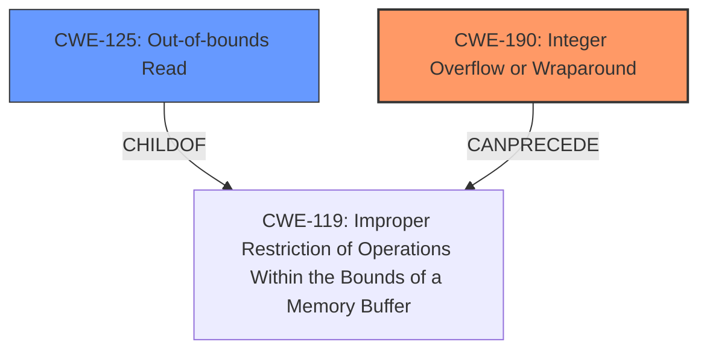

# Enhanced Analysis for CVE-2020-6059

# Summary

| CWE ID | CWE Name | Confidence | CWE Abstraction Level | CWE Vulnerability Mapping Label | CWE-Vulnerability Mapping Notes |
|---|---|---|---|---|---|
| CWE-190 | Integer Overflow or Wraparound | 0.9 | Base | Allowed | Primary CWE |
| CWE-125 | Out-of-bounds Read | 0.8 | Base | Allowed | Secondary Candidate |

## Evidence and Confidence

*   **Confidence Score:** 0.85
*   **Evidence Strength:** HIGH

## Relationship Analysis
The primary weakness is an integer overflow (CWE-190) that leads to an out-of-bounds read (CWE-125). CWE-190 can precede CWE-119 (Improper Restriction of Operations Within the Bounds of a Memory Buffer), which is a parent of CWE-125. This parent-child relationship and the can-precede relationship indicates a vulnerability chain. The base abstraction level of both CWEs is appropriate.



## Vulnerability Chain
The vulnerability chain starts with an integer overflow (CWE-190) in the `decode_int` function when parsing the length of an integer within an SNMP packet. This leads to an **out-of-bounds read** (CWE-125) when accessing `packet[*pos]` in the while loop. The root cause is CWE-190, and the direct consequence is CWE-125, leading to information disclosure and denial of service.

## Summary of Analysis
The initial analysis identified the **out-of-bounds read** as the primary vulnerability. However, the CVE Reference Links Content Summary clearly indicates that the root cause is an integer overflow that leads to the out-of-bounds read. The integer overflow occurs in the `decode_int` function when parsing the length of an integer within an SNMP packet: "Specifically, the check at `[1]` is vulnerable to integer wraparound when `len` is larger than `size`." This directly results in an out-of-bounds read in the while loop at `[2]` when accessing `packet[*pos]`." The vulnerability description also specifies "A specially crafted SNMP request can trigger an out of bounds memory read". Therefore, CWE-190 (Integer Overflow or Wraparound) is the primary CWE, and CWE-125 (Out-of-bounds Read) is a secondary CWE. Both CWEs are at the base level of abstraction, which is the preferred level.

Relevant CWE Information:

# Enhanced Context (25 CWEs)

## CWE-1289: Improper Validation of Unsafe Equivalence in Input
**Abstraction Level**: Base
**Similarity Score**: 0.79

**Description**:
The product receives an input value that is used as a resource identifier or other type of reference, but it does not validate or incorrectly validates that the input is equivalent to a potentially-unsafe value.
## CWE-197: Numeric Truncation Error
**Abstraction Level**: Base
**Similarity Score**: 0.77

**Description**:
Truncation errors occur when a primitive is cast to a primitive of a smaller size and data is lost in the conversion.
## CWE-1288: Improper Validation of Consistency within Input
**Abstraction Level**: Base
**Similarity Score**: 0.77

**Description**:
The product receives a complex input with multiple elements or fields that must be consistent with each other, but it does not validate or incorrectly validates that the input is actually consistent.
## CWE-606: Unchecked Input for Loop Condition
**Abstraction Level**: Base
**Similarity Score**: 0.76

**Description**:
The product does not properly check inputs that are used for loop conditions, potentially leading to a denial of service or other consequences because of excessive looping.
## CWE-191: Integer Underflow (Wrap or Wraparound)
**Abstraction Level**: Base
**Similarity Score**: 0.76

**Description**:
The product subtracts one value from another, such that the result is less than the minimum allowable integer value, which produces a value that is not equal to the correct result.
## CWE-115: Misinterpretation of Input
**Abstraction Level**: Base
**Similarity Score**: 0.75

**Description**:
The product misinterprets an input, whether from an attacker or another product, in a security-relevant fashion.
## CWE-807: Reliance on Untrusted Inputs in a Security Decision
**Abstraction Level**: Base
**Similarity Score**: 0.75

**Description**:
The product uses a protection mechanism that relies on the existence or values of an input, but the input can be modified by an untrusted actor in a way that bypasses the protection mechanism.
## CWE-183: Permissive List of Allowed Inputs
**Abstraction Level**: Base
**Similarity Score**: 0.75

**Description**:
The product implements a protection mechanism that relies on a list of inputs (or properties of inputs) that are explicitly allowed by policy because the inputs are assumed to be safe, but the list is too permissive - that is, it allows an input that is unsafe, leading to resultant weaknesses.
## CWE-681: Incorrect Conversion between Numeric Types
**Abstraction Level**: Base
**Similarity Score**: 0.75

**Description**:
When converting from one data type to another, such as long to integer, data can be omitted or translated in a way that produces unexpected values. If the resulting values are used in a sensitive context, then dangerous behaviors may occur.
## CWE-184: Incomplete List of Disallowed Inputs
**Abstraction Level**: Base
**Similarity Score**: 0.75

**Description**:
The product implements a protection mechanism that relies on a list of inputs (or properties of inputs) that are not allowed by policy or otherwise require other action to neutralize before additional processing takes place, but the list is incomplete.
## CWE-190: Integer Overflow or Wraparound
**Abstraction Level**: base
**Similarity Score**: 7353.95

**Description**:
The product performs a calculation that can produce an integer overflow or wraparound when the logic assumes that the resulting value will always be larger than the original value. This occurs when an integer value is incremented to a value that is too large to store in the associated representation. When this occurs, the value may become a very small or negative number.
## CWE-197: Numeric Truncation Error
**Abstraction Level**: Base
**Similarity Score**: 7039.10

**Description**:
Truncation errors occur when a primitive is cast to a primitive of a smaller size and data is lost in the conversion.
## CWE-125: Out-of-bounds Read
**Abstraction Level**: Base
**Similarity Score**: 6962.18

**Description**:
The product reads data past the end, or before the beginning, of the intended buffer.
## CWE-1284: Improper Validation of Specified Quantity in Input
**Abstraction Level**: Base
**Similarity Score**: 6922.51

**Description**:
The product receives input that is expected to specify a quantity (such as size or length), but it does not validate or incorrectly validates that the quantity has the required properties.
## CWE-193: Off-by-one Error
**Abstraction Level**: Base
**Similarity Score**: 6719.77

**Description**:
A product calculates or uses an incorrect maximum or minimum value that is 1 more, or 1 less, than the correct value.
## CWE-190: Integer Overflow or Wraparound
**Abstraction Level**: base
**Similarity Score**: 5.03

**Description**:
CWE-190: Integer Overflow or Wraparound
## CWE-128: Wrap-around Error
**Abstraction Level**: base
**Similarity Score**: 5.03

**Description**:
CWE-128: Wrap-around Error
## CWE-41: Improper Resolution of Path Equivalence
**Abstraction Level**: base
**Similarity Score**: 5.03

**Description**:
CWE-41: Improper Resolution of Path Equivalence
## CWE-195: Signed to Unsigned Conversion Error
**Abstraction Level**: variant
**Similarity Score**: 4.53

**Description**:
CWE-195: Signed to Unsigned Conversion Error
## CWE-787: Out-of-bounds Write
**Abstraction Level**: base
**Similarity Score**: 4.33

**Description**:
CWE-787: Out-of-bounds Write
## CWE-823: Use of Out


## CWE Relationship Analysis

Current CWEs represent these abstraction levels: .


### Vulnerability Chain Analysis

**Chain starting from CWE-787:**
- 787 (Out-of-bounds Write) - ROOT


**Chain starting from CWE-115:**
- 115 (Misinterpretation of Input) - ROOT


### CWE Relationship Diagram

```mermaid
graph TD
    classDef primary fill:#f96,stroke:#333,stroke-width:2px
    classDef secondary fill:#69f,stroke:#333
    classDef tertiary fill:#9e9,stroke:#333
```