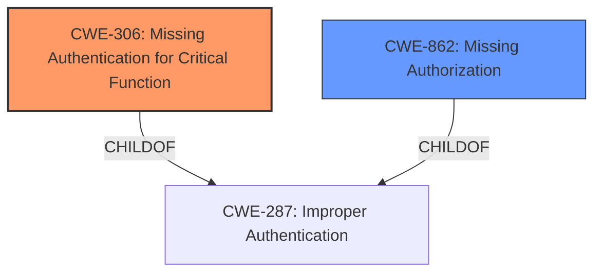

# Analysis for CVE-2020-6207

# Summary
| CWE ID | CWE Name | Confidence | CWE Abstraction Level | CWE Vulnerability Mapping Label | CWE-Vulnerability Mapping Notes |
|---|---|---|---|---|---|
| CWE-306 | Missing Authentication for Critical Function | 1.0 | Base | Allowed | Primary CWE |
| CWE-862 | Missing Authorization | 0.7 | Class | Allowed-with-Review | Secondary Candidate |

## Evidence and Confidence

*   **Confidence Score:** 0.9
*   **Evidence Strength:** HIGH

## Relationship Analysis
The primary relationship is that CWE-306 [Missing Authentication for Critical Function] is a child of CWE-287 [Improper Authentication]. CWE-862 [Missing Authorization] is a Class-level CWE and could potentially be a related weakness but is less specific than CWE-306 for this vulnerability. The abstraction levels guided the selection, with the Base-level CWE-306 being preferred for its specificity.

## Vulnerability Chain
The vulnerability chain starts with the **missing authentication check** (CWE-306), which allows an attacker to bypass security and directly access critical functions. This leads to the complete compromise of connected SMDAgents.

## Summary of Analysis
The initial analysis focused on identifying the **root cause** of the vulnerability, which is the **missing authentication check**. The evidence from the vulnerability description and CVE reference links clearly indicates the absence of any authentication mechanism for a critical service. This directly aligns with the definition of CWE-306 [Missing Authentication for Critical Function].

The primary evidence is: "due to **Missing Authentication Check** does not perform any authentication for a service resulting in complete compromise of all SMDAgents connected to the Solution Manager" and "The root cause is a **missing authentication check** in the `EemAdminService/EemAdmin` web service endpoint of SAP Solution Manager 7.2. This web service is exposed by default and does not require any authentication to use."

The graph relationships reinforce that CWE-306 [Missing Authentication for Critical Function] is a more specific instance of the broader category of improper authentication (CWE-287 [Improper Authentication]). Therefore, choosing CWE-306 [Missing Authentication for Critical Function] provides a more accurate and granular representation of the vulnerability. The selected CWE is at the optimal level of specificity because it directly addresses the **missing authentication** aspect rather than a general authentication failure or weakness.

Relevant CWE Information:

# Enhanced Context (25 CWEs)

## CWE-306: Missing Authentication for Critical Function
**Abstraction Level**: Base
**Similarity Score**: 0.231
**Source**: sparse

**Description**:
The product does not perform any authentication for functionality that requires a provable user identity or consumes a significant amount of resources.

**Mapping Guidance**:
- Usage: Allowed
- Rationale: This CWE entry is at the Base level of abstraction, which is a preferred level of abstraction for mapping to the root causes of vulnerabilities.

## CWE-862: Missing Authorization
**Abstraction Level**: Class
**Similarity Score**: 0.215
**Source**: sparse

**Description**:
The product does not perform an authorization check when an actor attempts to access a resource or perform an action.

**Mapping Guidance**:
- Usage: Allowed-with-Review
- Rationale: This CWE entry is a Class and might have Base-level children that would be more appropriate

### CWE Selection:

*   **CWE-306 [Missing Authentication for Critical Function]:** This is the primary CWE because the vulnerability description explicitly states a **missing authentication check**. This aligns perfectly with CWE-306, which describes a situation where "the product does not perform any authentication for functionality that requires a provable user identity." The CVE reference links content summary also confirms this, stating that the root cause is a **missing authentication check**. This CWE is at the Base level of abstraction, which is preferred. The "Usage: Allowed" mapping guidance confirms that this is an appropriate mapping.
*   **CWE-862 [Missing Authorization]:** This CWE was considered as a secondary candidate because, in addition to the **missing authentication**, there is a mention of a **missing authorization** check in the LM-SERVICE component. However, the primary and more critical vulnerability is the complete absence of authentication, which is more accurately captured by CWE-306 [Missing Authentication for Critical Function]. Also, CWE-862 [Missing Authorization] is a class level.
*   **CWE-287 [Improper Authentication]:** This CWE was considered but ultimately not chosen because it's a more general case of authentication issues. The vulnerability description clearly points to a complete **lack of authentication**, making CWE-306 [Missing Authentication for Critical Function] a more precise fit. The MITRE mapping guidance for CWE-287 [Improper Authentication] also discourages its use when lower-level CWEs are applicable, suggesting alternatives like CWE-306 [Missing Authentication for Critical Function].