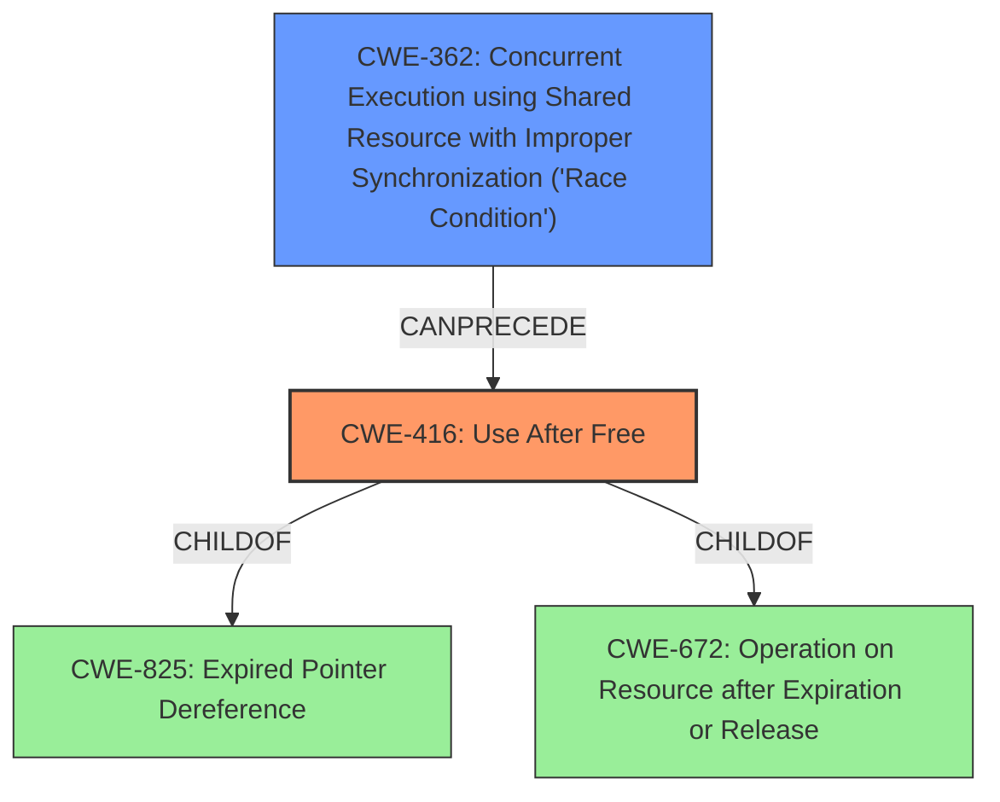

# Raw Analyzer Response for CVE-2020-6820

# Summary
| CWE ID | CWE Name | Confidence | CWE Abstraction Level | CWE Vulnerability Mapping Label | CWE-Vulnerability Mapping Notes |
|---|---|---|---|---|---|
| CWE-416 | Use After Free | 1.0 | Variant | Allowed | Primary CWE |
| CWE-362 | Concurrent Execution using Shared Resource with Improper Synchronization ('Race Condition') | 0.9 | Class | Allowed-with-Review | Secondary CWE |

## Evidence and Confidence

*   **Confidence Score:** 0.95
*   **Evidence Strength:** HIGH

## Relationship Analysis
The primary weakness is a **use-after-free (CWE-416)** which is caused by a **race condition (CWE-362)**. The relationship between CWE-362 and CWE-416 is that CWE-362 can precede CWE-416. CWE-416 is a variant, making it more specific than higher-level classifications and is a child of CWE-825 and CWE-672. CWE-362 is a class and might have base-level children.

## Vulnerability Chain
The vulnerability chain starts with a **race condition (CWE-362)** that leads to a **use-after-free (CWE-416)**.

## Summary of Analysis
The vulnerability description clearly states that a **race condition** leads to a **use-after-free**. The CVE Reference Links Content Summary confirms this, stating "Race condition during the handling of a ReadableStream leading to a use-after-free." This provides strong evidence for mapping both CWE-362 and CWE-416.

CWE-416 is chosen as the primary CWE because the vulnerability is ultimately a **use-after-free**. CWE-362 is a contributing factor as it causes the **use-after-free**.

The retriever results list both CWE-362 and CWE-416 with high scores and relevance, supporting the selection of these CWEs.

CWE-787 (Out-of-bounds Write) was considered but not selected. While a **use-after-free** can lead to memory corruption, the description does not explicitly mention an out-of-bounds write.
CWE-367 (Time-of-check Time-of-use (TOCTOU) Race Condition) was considered because it is a type of **race condition**, but it is not applicable here because the **race condition** doesn't involve checking the state of a resource before using it. The general **race condition (CWE-362)** is a more accurate description of the vulnerability.
CWE-427 (Uncontrolled Search Path Element) was considered but is not relevant to this vulnerability.
CWE-366 (Race Condition within a Thread) was considered, but the description doesn't specify that the **race condition** is within a thread, so CWE-362 is more appropriate.
CWE-123 (Write-what-where Condition) was considered because **use-after-free** can result in arbitrary writes, however the description does not directly mention this condition.
CWE-415 (Double Free) was considered, but the description doesn't mention a double free.
CWE-667 (Improper Locking) was considered because it can lead to **race conditions**, but there's no mention of locking mechanisms in the description.
CWE-662 (Improper Synchronization) was considered, but it's a higher-level class and there's no specific information about synchronization mechanisms in the description.

The selection of CWE-416 and CWE-362 is based on the provided evidence, and their hierarchical relationship is well-defined. The chosen CWEs are at the optimal level of specificity.

Relevant CWE Information:
- CWE-362: Concurrent Execution using Shared Resource with Improper Synchronization ('Race Condition')
- CWE-416: Use After Free