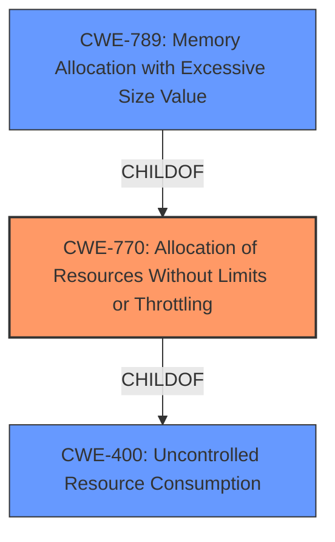

# Raw Analyzer Response for CVE-2020-6867

# Summary
| CWE ID  | CWE Name                                                                    | Confidence | CWE Abstraction Level | CWE Vulnerability Mapping Label | CWE-Vulnerability Mapping Notes |
| :-------- | :-------------------------------------------------------------------------- | :--------- | :---------------------- | :------------------------------ | :------------------------------ |
| CWE-770 | Allocation of Resources Without Limits or Throttling                         | 0.9        | Base                    | Primary                       | Allowed                       |
| CWE-400 | Uncontrolled Resource Consumption                                           | 0.7        | Class                   | Secondary                       | Discouraged                       |
| CWE-789 | Memory Allocation with Excessive Size Value                                | 0.7        | Variant                 | Secondary                       | Allowed                       |

## Evidence and Confidence

*   **Confidence Score:** 0.9
*   **Evidence Strength:** HIGH

## Relationship Analysis
The primary CWE is CWE-770 Allocation of Resources Without Limits or Throttling, due to the **resource management error** leading to a **memory overflow**.

CWE-770 is a base level CWE, which is preferred. It is also a child of CWE-400 Uncontrolled Resource Consumption, indicating that this is a specific type of resource consumption issue. CWE-789 Memory Allocation with Excessive Size Value is a child of CWE-770 meaning that it is a specific type of resource allocation issue.

## Vulnerability Chain
The vulnerability chain starts with the **resource management error**, which causes the system to not properly limit the allocation of resources (CWE-770). This leads to a **memory overflow** (CWE-789) and ultimately results in denial of service due to uncontrolled resource consumption (CWE-400).

## Summary of Analysis
The initial assessment identified several potential CWEs, including CWE-190, CWE-119, CWE-770, CWE-755, CWE-400, CWE-410, and CWE-789.

The vulnerability description clearly states a **resource management error** leading to a **memory overflow** risk. The CVE Reference Links Content Summary further supports this by highlighting the root cause as a resource management error due to frequent RPC calls and the resulting vulnerability as long response times and memory overflow risk.

Based on this evidence, CWE-770 (Allocation of Resources Without Limits or Throttling) is the most appropriate primary CWE because the system does not properly limit the allocation of resources.

CWE-400 (Uncontrolled Resource Consumption) is a class-level CWE and a parent of CWE-770 which is a base-level CWE. It's applicable because the **resource management error** allows for uncontrolled consumption of memory resources, eventually leading to a denial-of-service. The description mentions "mass traffic data" which aligns with the concept of uncontrolled resource allocation.

CWE-789 (Memory Allocation with Excessive Size Value) can be considered a variant of CWE-770, as the **memory overflow** risk is a direct consequence of allocating excessive memory.

Other CWEs considered but not selected:

*   CWE-190 (Integer Overflow or Wraparound): While integer overflows can lead to memory allocation issues, the description doesn't explicitly mention integer overflows.
*   CWE-119 (Improper Restriction of Operations within the Bounds of a Memory Buffer): While memory overflow can sometimes lead to writing beyond buffer bounds, there is not enough evidence.
*   CWE-755 (Improper Handling of Exceptional Conditions): The vulnerability is more directly related to resource management, rather than the handling of exceptional conditions.
*   CWE-410 (Insufficient Resource Pool): While related to resource management, the description doesn't indicate the resource pool is explicitly too small, but rather that resources are being allocated without limits.

The selected CWEs are at the optimal level of specificity, with CWE-770 being a base-level CWE directly addressing the root cause, and CWE-400 and CWE-789 providing context regarding the type of resource consumption and allocation issues respectively.