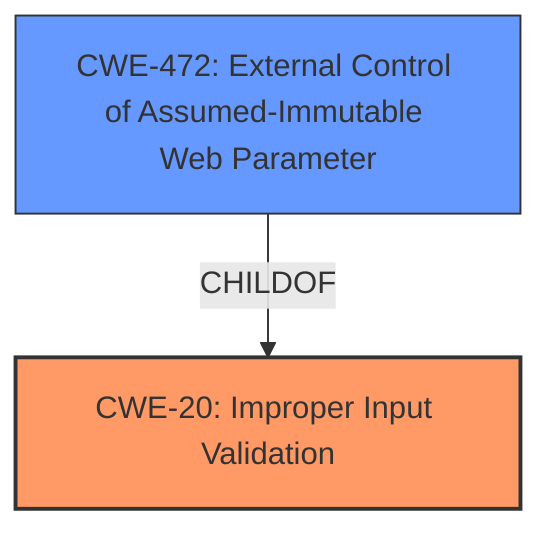

# Analysis Report for CVE-2020-6879

# Vulnerability Analysis Report: CVE-2020-6879

## Description


## Analysis (with Relationship Data)

# Summary
| CWE ID | CWE Name | Confidence | CWE Abstraction Level | CWE Vulnerability Mapping Label | CWE-Vulnerability Mapping Notes |
|---|---|---|---|---|---|
| CWE-20 | Improper Input Validation | 0.9 | Class | Primary | Discouraged |
| CWE-472 | External Control of Assumed-Immutable Web Parameter | 0.7 | Base | Secondary | Allowed |

## Evidence and Confidence

*   **Confidence Score:** 0.8
*   **Evidence Strength:** MEDIUM

## Relationship Analysis
The primary relationship that influenced my decision was the hierarchical relationship between CWE-20 (Improper Input Validation) and its potential children, particularly CWE-472 (External Control of Assumed-Immutable Web Parameter). While CWE-20 is a broader class, the specific vulnerability details pointed towards the manipulation of parameters, which aligns with CWE-472.



## Vulnerability Chain
The vulnerability chain begins with the **improper input validation** at the web service backend (CWE-20), which then leads to the ability to tamper with parameter values. In this case, it appears the front-end validation is bypassed, leading to the backend **failing to effectively verify the abnormal input**.

## Summary of Analysis
The initial assessment was to map this to CWE-20 (**Improper Input Validation**) because the **root cause** is stated as **input verification vulnerabilities** and the **WEB service backend fails to effectively verify the abnormal input**.

However, it is important to consider the MITRE mapping guidance. CWE-20 is **Discouraged** because it is a Class and might be misused when lower-level CWE entries are likely to be applicable.

The vulnerability description mentions that the **restriction of the front-end code can be bypassed by constructing a POST request message** and the **attacker can successfully use the vulnerability to tamper parameter values**. This suggests that the vulnerability involves the manipulation of parameters, which can be externally controlled.

CWE-472 (**External Control of Assumed-Immutable Web Parameter**) specifically addresses the scenario where a web application does not sufficiently verify inputs that are assumed to be immutable but are actually externally controllable, such as hidden form fields.

The "CVE Reference Links Content Summary" reinforces that the **front-end validation can be bypassed** and the **backend fails to properly validate input**, allowing for **tampering of parameter values**.

Therefore, while the primary weakness is the **improper input validation** (CWE-20), a secondary factor is the ability to manipulate assumed-immutable parameters (CWE-472) to achieve the desired outcome. The selection of CWE-20 is maintained due to the lack of validation, but the presence of a specific mechanism to bypass it using parameters makes CWE-472 a good secondary match.

Relevant CWE Information:

# Enhanced Context (25 CWEs)

## CWE-807: Reliance on Untrusted Inputs in a Security Decision
**Abstraction Level**: Base
**Similarity Score**: 0.75
**Source**: dense

**Description**:
The product uses a protection mechanism that relies on the existence or values of an input, but the input can be modified by an untrusted actor in a way that bypasses the protection mechanism.

**Mapping Guidance**:
- Usage: Allowed
- Rationale: This CWE entry is at the Base level of abstraction, which is a preferred level of abstraction for mapping to the root causes of vulnerabilities.

*Rationale for not selecting*: While this CWE is relevant, it focuses more on the reliance of a protection mechanism on untrusted input, which isn't the primary issue here. The primary issue is the **lack of effective input validation**.

## CWE-1220: Insufficient Granularity of Access Control
**Abstraction Level**: Base
**Similarity Score**: 0.75
**Source**: dense

**Description**:
The product implements access controls via a policy or other feature with the intention to disable or restrict accesses (reads and/or writes) to assets in a system from untrusted agents. However, implemented access controls lack required granularity, which renders the control policy too broad because it allows accesses from unauthorized agents to the security-sensitive assets.

**Mapping Guidance**:
- Usage: Allowed
- Rationale: This CWE entry is at the Base level of abstraction, which is a preferred level of abstraction for mapping to the root causes of vulnerabilities.

*Rationale for not selecting*: This CWE is related to access control granularity, which is not the main factor in this vulnerability. The main issue is the **failure to properly validate the input**.

## CWE-653: Improper Isolation or Compartmentalization
**Abstraction Level**: Class
**Similarity Score**: 0.72
**Source**: dense

**Description**:
The product does not properly compartmentalize or isolate functionality, processes, or resources that require different privilege levels, rights, or permissions.

**Mapping Guidance**:
- Usage: Allowed
- Rationale: This CWE entry is at the Base level of abstraction, which is a preferred level of abstraction for mapping to the root causes of vulnerabilities.

*Rationale for not selecting*: While isolation issues might be present, the root cause is the **improper input validation**.

## CWE-1263: Improper Physical Access Control
**Abstraction Level**: Class
**Similarity Score**: 0.72
**Source**: dense

**Description**:
The product is designed with access restricted to certain information, but it does not sufficiently protect against an unauthorized actor with physical access to these areas.

**Mapping Guidance**:
- Usage: Allowed-with-Review
- Rationale: This CWE entry is a Class and might have Base-level children that would be more appropriate

*Rationale for not selecting*: This CWE deals with physical access, which is irrelevant to this vulnerability.

## CWE-472: External Control of Assumed-Immutable Web Parameter
**Abstraction Level**: Base
**Similarity Score**: 0.71
**Source**: dense

**Description**:
The product does not sufficiently verify inputs that are assumed to be immutable but are actually externally controllable, such as hidden form fields.

**Mapping Guidance**:
- Usage: Allowed
- Rationale: This CWE entry is at the Base level of abstraction, which is a preferred level of abstraction for mapping to the root causes of vulnerabilities.

*Rationale for selecting*: The attacker can bypass front-end restrictions by crafting a POST request, indicating that parameters assumed to be immutable are being externally controlled.

## CWE-280: Improper Handling of Insufficient Permissions or Privileges
**Abstraction Level**: Base
**Similarity Score**: 0.71
**Source**: dense

**Description**:
The product does not handle or incorrectly handles when it has insufficient privileges to access resources or functionality as specified by their permissions. This may cause it to follow unexpected code paths that may leave the product in an invalid state.

**Mapping Guidance**:
- Usage: Allowed
- Rationale: This CWE entry is at the Base level of abstraction, which is a preferred level of abstraction for mapping to the root causes of vulnerabilities.

*Rationale for not selecting*: The vulnerability is not about insufficient privileges but about the **lack of input validation**.

## CWE-1289: Improper Validation of Unsafe Equivalence in Input
**Abstraction Level**: Base
**Similarity Score**: 0.71
**Source**: dense

**Description**:
The product receives an input value that is used as a resource identifier or other type of reference, but it does not validate or incorrectly validates that the input is equivalent to a potentially-unsafe value.

**Mapping Guidance**:
- Usage: Allowed
- Rationale: This CWE entry is at the Base level of abstraction, which is a preferred level of abstraction for mapping to the root causes of vulnerabilities.

*Rationale for not selecting*: The vulnerability is about the **lack of validation** in general, rather than the unsafe equivalence of inputs.

## CWE-657: Violation of Secure Design Principles
**Abstraction Level**: Class
**Similarity Score**: 0.70
**Source**: dense

**Description**:
The product violates well-established principles for secure design.

**Mapping Guidance**:
- Usage: Discouraged
- Rationale: This CWE entry is a level-1 Class (i.e., a child of a Pillar). It might have lower-level children that would be more appropriate

*Rationale for not selecting*: This is a high-level CWE. The vulnerability is better described by more specific CWEs.

## CWE-274: Improper Handling of Insufficient Privileges
**Abstraction Level**: Base
**Similarity Score**: 0.70
**Source**: dense

**Description**:
The product does not handle or incorrectly handles when it has insufficient privileges to perform an operation, leading to resultant weaknesses.

**Mapping Guidance**:
- Usage: Discouraged
- Rationale: This CWE entry could be deprecated in a future version of CWE.

*Rationale for not selecting*: The vulnerability is not about insufficient privileges, but the **lack of input validation**.

## CWE-671: Lack of


## CWE Relationship Analysis

Current CWEs represent these abstraction levels: .


### Vulnerability Chain Analysis

**Chain starting from CWE-657:**
- 657 (Violation of Secure Design Principles) - ROOT


**Chain starting from CWE-653:**
- 653 (Improper Isolation or Compartmentalization) - ROOT


### CWE Relationship Diagram

```mermaid
graph TD
    classDef primary fill:#f96,stroke:#333,stroke-width:2px
    classDef secondary fill:#69f,stroke:#333
    classDef tertiary fill:#9e9,stroke:#333
```


*Report generated on 2025-04-02 07:33:24*
