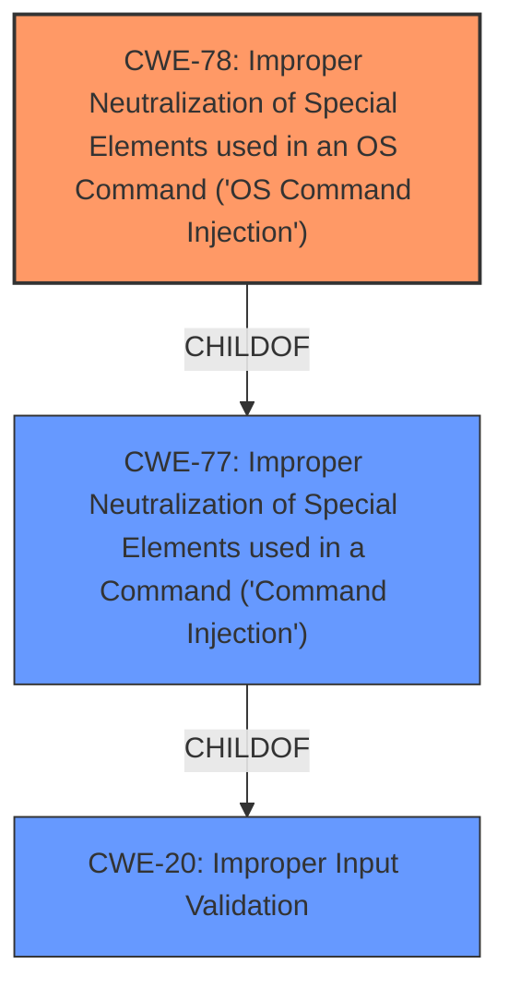

# Enhanced Analysis for CVE-2020-7034

# Summary

| CWE ID | CWE Name | Confidence | CWE Abstraction Level | CWE Vulnerability Mapping Label | CWE-Vulnerability Mapping Notes |
|---|---|---|---|---|---|
| CWE-78 | Improper Neutralization of Special Elements used in an OS Command ('OS Command Injection') | 1.0 | Base | Allowed | Primary CWE |
| CWE-77 | Improper Neutralization of Special Elements used in a Command ('Command Injection') | 0.7 | Class | Allowed-with-Review | Secondary Candidate |
| CWE-20 | Improper Input Validation | 0.5 | Class | Discouraged | Secondary Candidate |

## Evidence and Confidence

*   **Confidence Score:** 1.0
*   **Evidence Strength:** HIGH

## Relationship Analysis

The primary CWE is CWE-78, which is a child of CWE-77. CWE-77 is a more general case of command injection, while CWE-78 specifically refers to OS command injection. CWE-20 is a parent of CWE-78, representing a general lack of input validation that can lead to command injection.



## Vulnerability Chain

The vulnerability chain starts with the **lack of proper input validation**, potentially represented by CWE-20, although it's a high level abstraction. This leads to **improper neutralization of special elements in a command**, specifically an OS command (CWE-78), which allows an attacker to **execute arbitrary commands** on the system.

## Summary of Analysis

The primary weakness is **OS Command Injection (CWE-78)**. The vulnerability description explicitly states a "**command injection** vulnerability" and the CVE Reference Links Content Summary confirms this by stating, "A command injection vulnerability exists in Avaya Session Border Controller for Enterprise." Given that the attacker can "execute arbitrary commands with the affected system privileges," it is highly likely that this involves the operating system. This aligns perfectly with the description of CWE-78: "The product constructs all or part of an OS command using externally-influenced input...".

CWE-77 was considered because the vulnerability is described as "**command injection**". However, CWE-78 is more specific as it indicates OS Command Injection. Given that the impact is "execute arbitrary commands with the affected system privileges", it is highly likely that this involves the operating system, making CWE-78 a more precise fit. The MITRE mapping guidance for CWE-77 suggests considering CWE-78 when OS command injection is intended.

CWE-20 was also considered because **improper input validation** is often a precursor to injection vulnerabilities. However, the description focuses on the **command injection** itself, not specifically on the input validation process. Therefore, CWE-20 is a less direct representation of the vulnerability.

The choice of CWE-78 is at the optimal level of specificity because it accurately describes the **root cause** of the vulnerability (improper neutralization of OS command special elements) and aligns with the evidence provided in the vulnerability description.

Relevant CWE Information:
- CWE-78: Improper Neutralization of Special Elements used in an OS Command ('OS Command Injection')
- CWE-77: Improper Neutralization of Special Elements used in a Command ('Command Injection')
- CWE-20: Improper Input Validation


## CWE Relationship Analysis

Current CWEs represent these abstraction levels: .


### Vulnerability Chain Analysis

**Chain starting from CWE-78:**
- 78 (Improper Neutralization of Special Elements used in an OS Command ('OS Command Injection')) - ROOT


**Chain starting from CWE-77:**
- 77 (Improper Neutralization of Special Elements used in a Command ('Command Injection')) - ROOT


### CWE Relationship Diagram

```mermaid
graph TD
    classDef primary fill:#f96,stroke:#333,stroke-width:2px
    classDef secondary fill:#69f,stroke:#333
    classDef tertiary fill:#9e9,stroke:#333
```