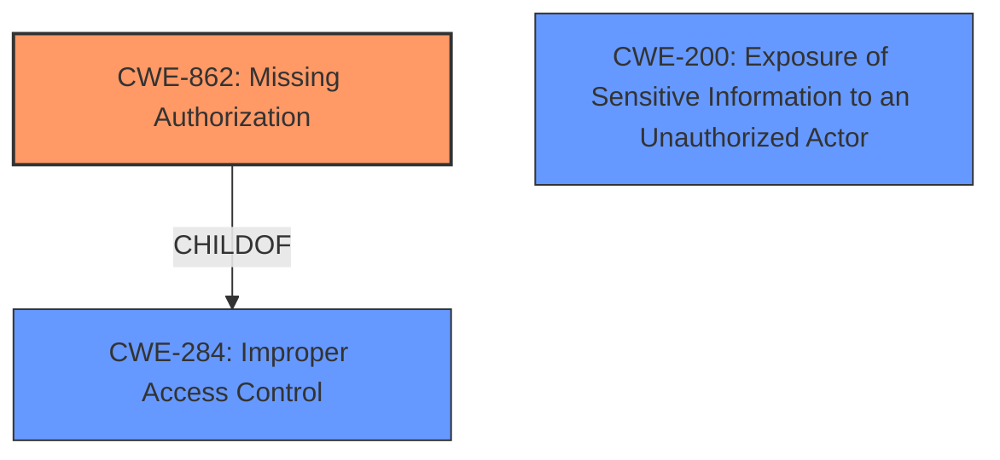

# Raw Analyzer Response for CVE-2020-7038

# Summary
| CWE ID | CWE Name | Confidence | CWE Abstraction Level | CWE Vulnerability Mapping Label | CWE-Vulnerability Mapping Notes |
|---|---|---|---|---|---|
| CWE-862 | Missing Authorization | 0.9 | Base | Primary | Allowed |
| CWE-200 | Exposure of Sensitive Information to an Unauthorized Actor | 0.6 | Class | Secondary | Discouraged |

## Evidence and Confidence

*   **Confidence Score:** 0.75
*   **Evidence Strength:** MEDIUM

## Relationship Analysis
The primary relationship that influenced the decision was the parent-child relationship between CWE-284 (Improper Access Control) and its children, specifically CWE-862 (Missing Authorization). Since the vulnerability stemmed from a **lack of access control** on screen sharing and whiteboard sessions, opting for the more specific CWE-862 was appropriate. CWE-200 (Exposure of Sensitive Information) was considered due to the impact of the vulnerability, but ultimately deemed secondary as it represents the impact rather than the root cause.

## Vulnerability Chain
The vulnerability chain starts with the **missing authorization** check (CWE-862) on the Management component of Avaya Equinox Conferencing. This leads to unauthorized access to screen sharing and whiteboard sessions. The final impact is the **exposure of sensitive information** (CWE-200) and potential disruption of meetings.

## Summary of Analysis
Initially, several CWEs related to access control and privilege management were considered, including CWE-284 (Improper Access Control), CWE-269 (Improper Privilege Management), and CWE-285 (Improper Authorization). However, based on the provided evidence, the root cause of the vulnerability is the **lack of any authorization check** for accessing screen sharing and whiteboard sessions.

The "CVE Reference Links Content Summary" explicitly states that the vulnerability "allows unauthorized access to live meeting screen sharing and whiteboard sessions. This suggests a **lack of proper access controls or authentication checks** for these features within the Management component."

Therefore, CWE-862 (Missing Authorization) is the most appropriate primary CWE. It accurately captures the root cause of the vulnerability, which is the absence of an authorization mechanism.

CWE-200 (Exposure of Sensitive Information to an Unauthorized Actor) was considered as a secondary CWE. While the exploitation of the vulnerability could lead to information exposure, this is the impact of the missing authorization, not the root cause. Therefore, it's more accurately classified as a secondary consequence.

The chosen CWEs are at the optimal level of specificity. CWE-862 is a Base-level CWE, which is preferred for mapping root causes. It's more specific than its parent, CWE-284 (Improper Access Control), and accurately reflects the missing authorization check.

Relevant CWE Information:

# Enhanced Context (25 CWEs)

## CWE-538: Insertion of Sensitive Information into Externally-Accessible File or Directory
**Abstraction Level**: Base
**Similarity Score**: 0.78
**Source**: dense

**Description**:
The product places sensitive information into files or directories that are accessible to actors who are allowed to have access to the files, but not to the sensitive information.

**Mapping Guidance**:
- Usage: Allowed
- Rationale: This CWE entry is at the Base level of abstraction, which is a preferred level of abstraction for mapping to the root causes of vulnerabilities.

## CWE-497: Exposure of Sensitive System Information to an Unauthorized Control Sphere
**Abstraction Level**: Base
**Similarity Score**: 0.76
**Source**: dense

**Description**:
The product does not properly prevent sensitive system-level information from being accessed by unauthorized actors who do not have the same level of access to the underlying system as the product does.

**Mapping Guidance**:
- Usage: Allowed
- Rationale: This CWE entry is at the Base level of abstraction, which is a preferred level of abstraction for mapping to the root causes of vulnerabilities.

## CWE-226: Sensitive Information in Resource Not Removed Before Reuse
**Abstraction Level**: Base
**Similarity Score**: 0.76
**Source**: dense

**Description**:
The product releases a resource such as memory or a file so that it can be made available for reuse, but it does not clear or "zeroize" the information contained in the resource before the product performs a critical state transition or makes the resource available for reuse by other entities.

**Mapping Guidance**:
- Usage: Allowed
- Rationale: This CWE entry is at the Base level of abstraction, which is a preferred level of abstraction for mapping to the root causes of vulnerabilities.

## CWE-212: Improper Removal of Sensitive Information Before Storage or Transfer
**Abstraction Level**: Base
**Similarity Score**: 0.76
**Source**: dense

**Description**:
The product stores, transfers, or shares a resource that contains sensitive information, but it does not properly remove that information before the product makes the resource available to unauthorized actors.

**Mapping Guidance**:
- Usage: Allowed
- Rationale: This CWE entry is at the Base level of abstraction, which is a preferred level of abstraction for mapping to the root causes of vulnerabilities.

## CWE-668: Exposure of Resource to Wrong Sphere
**Abstraction Level**: Class
**Similarity Score**: 0.76
**Source**: dense

**Description**:
The product exposes a resource to the wrong control sphere, providing unintended actors with inappropriate access to the resource.

**Mapping Guidance**:
- Usage: Discouraged
- Rationale: CWE-668 is high-level and is often misused as a catch-all when lower-level CWE IDs might be applicable. It is sometimes used for low-information vulnerability reports [REF-1287]. It is a level-1 Class (i.e., a child of a Pillar). It is not useful for trend analysis.

## CWE-213: Exposure of Sensitive Information Due to Incompatible Policies
**Abstraction Level**: Base
**Similarity Score**: 0.75
**Source**: dense

**Description**:
The product's intended functionality exposes information to certain actors in accordance with the developer's security policy, but this information is regarded as sensitive according to the intended security policies of other stakeholders such as the product's administrator, users, or others whose information is being processed.

**Mapping Guidance**:
- Usage: Allowed
- Rationale: This CWE entry is at the Base level of abstraction, which is a preferred level of abstraction for mapping to the root causes of vulnerabilities.

## CWE-552: Files or Directories Accessible to External Parties
**Abstraction Level**: Base
**Similarity Score**: 0.74
**Source**: dense

**Description**:
The product makes files or directories accessible to unauthorized actors, even though they should not be.

**Mapping Guidance**:
- Usage: Allowed
- Rationale: This CWE entry is at the Base level of abstraction, which is a preferred level of abstraction for mapping to the root causes of vulnerabilities.

## CWE-200: Exposure of Sensitive Information to an Unauthorized Actor
**Abstraction Level**: Class
**Similarity Score**: 0.74
**Source**: dense

**Description**:
The product exposes sensitive information to an actor that is not explicitly authorized to have access to that information.

**Mapping Guidance**:
- Usage: Discouraged
- Rationale: CWE-200 is commonly misused to represent the loss of confidentiality in a vulnerability, but confidentiality loss is a technical impact - not a root cause error. As of CWE 4.9, over 400 CWE entries can lead to a loss of confidentiality. Other options are often available. [REF-1287].

## CWE-274: Improper Handling of Insufficient Privileges
**Abstraction Level**: Base
**Similarity Score**: 0.74
**Source**: dense

**Description**:
The product does not handle or incorrectly handles when it has insufficient privileges to perform an operation, leading to resultant weaknesses.

**Mapping Guidance**:
- Usage: Discouraged
- Rationale: This CWE entry could be deprecated in a future version of CWE.

## CWE-280: Improper Handling of Insufficient Permissions or Privileges
**Abstraction Level**: Base
**Similarity Score**: 0.74
**Source**: dense

**Description**:
The product does not handle or incorrectly handles when it has insufficient privileges to access resources or functionality as specified by their permissions. This may cause it to follow unexpected code paths that may leave the product in an invalid state.

**Mapping Guidance**:
- Usage: Allowed
- Rationale: This CWE entry is at the Base level of abstraction, which is a preferred level of abstraction for mapping to the root causes of vulnerabilities.

## CWE-86