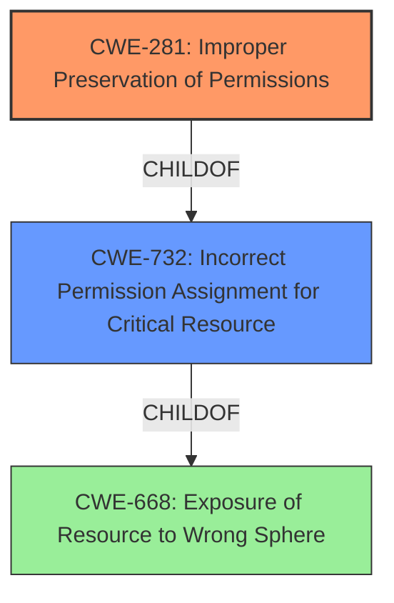

# Enhanced Analysis for CVE-2020-7063

# Summary
| CWE ID | CWE Name | Confidence | CWE Abstraction Level | CWE Vulnerability Mapping Label | CWE-Vulnerability Mapping Notes |
|---|---|---|---|---|---|
| CWE-281 | Improper Preservation of Permissions | 0.9 | Base | Allowed | Primary CWE |

## Evidence and Confidence

*   **Confidence Score:** 0.9
*   **Evidence Strength:** HIGH

## Relationship Analysis
The primary relationship considered was the ChildOf relationship between CWE-281 and CWE-732. However, the vulnerability description highlights the **improper preservation of permissions** rather than a general incorrect assignment, making CWE-281 a more precise fit. The other considered CWEs (path traversal, external control of filename) were not relevant to the specific weakness described.



## Vulnerability Chain
The vulnerability chain consists of:
1.  The **weakness** is that the files are added with default permissions (**0666, or all access**)
2.  The **impact** is that the files having more lax permissions than intended when extracted.

## Summary of Analysis
The initial analysis focused on the **weakness** of the **files are added with default permissions (0666, or all access)**, even if the original files on the filesystem were with more restrictive permissions. This directly points to an issue with how permissions are handled during the creation of the PHAR archive.

The CVE Reference Links Content Summary confirms this, stating that the root cause is the "Incorrect handling of file permissions when creating PHAR archives using PharData::buildFromIterator(). Files are added with default permissions (0666), ignoring original file permissions."

The Retriever Results listed CWE-281 (Improper Preservation of Permissions) as the top match, which aligns well with the vulnerability description. The relationship analysis further supports this, as CWE-281 accurately captures the specific issue of permissions not being correctly preserved. The mapping guidance for CWE-281 explicitly allows its usage and states that it is at the preferred Base level of abstraction.

Therefore, CWE-281 is the most appropriate and specific CWE for this vulnerability.

Other CWEs Considered:

*   CWE-732 (Incorrect Permission Assignment for Critical Resource): This was considered as a parent of CWE-281. However, it's a more general case and less descriptive of the specific problem of not preserving existing permissions.
*   CWE-22 (Improper Limitation of a Pathname to a Restricted Directory ('Path Traversal')): Irrelevant, as path traversal is not involved.
*   CWE-73 (External Control of File Name or Path): Irrelevant, as the vulnerability is not about external control of file names.
*   CWE-269 (Improper Privilege Management): Discouraged to use and too general, as the problem is specifically about permissions, not general privilege management.
*   CWE-668 (Exposure of Resource to Wrong Sphere): Discouraged to use and too general.


## CWE Relationship Analysis

Current CWEs represent these abstraction levels: .


### Vulnerability Chain Analysis

**Chain starting from CWE-732:**
- 732 (Incorrect Permission Assignment for Critical Resource) - ROOT


**Chain starting from CWE-73:**
- 73 (External Control of File Name or Path) - ROOT


### CWE Relationship Diagram

```mermaid
graph TD
    classDef primary fill:#f96,stroke:#333,stroke-width:2px
    classDef secondary fill:#69f,stroke:#333
    classDef tertiary fill:#9e9,stroke:#333
```