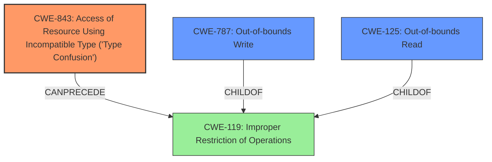

# Analysis Report for CVE-2020-7081

# Vulnerability Analysis Report: CVE-2020-7081

## Description


## Analysis (with Relationship Data)

# Summary
| CWE ID | CWE Name | Confidence | CWE Abstraction Level | CWE Vulnerability Mapping Label | CWE-Vulnerability Mapping Notes |
|---|---|---|---|---|---|
| CWE-843 | Access of Resource Using Incompatible Type ('Type Confusion') | 1.0 | Base | Allowed | Primary CWE |
| CWE-787 | Out-of-bounds Write | 0.6 | Base | Allowed | Secondary Candidate |
| CWE-125 | Out-of-bounds Read | 0.6 | Base | Allowed | Secondary Candidate |

## Evidence and Confidence

*   **Confidence Score:** 0.8
*   **Evidence Strength:** HIGH

## Relationship Analysis
The primary CWE is CWE-843, which is a Base level CWE. It can precede CWE-119 (Improper Restriction of Operations Within the Bounds of a Memory Buffer). The secondary CWEs considered are CWE-787 (Out-of-bounds Write) and CWE-125 (Out-of-bounds Read). These are both child of CWE-119. The relationship between CWE-843 and CWE-119, and then CWE-119 to CWE-787 and CWE-125 represents a potential chain of events.



## Vulnerability Chain
The vulnerability chain starts with a **type confusion** (CWE-843), which leads to out-of-bounds memory access, potentially resulting in an out-of-bounds read (CWE-125) or write (CWE-787), and ultimately, arbitrary code execution or denial of service.

## Summary of Analysis
The initial analysis identified a **type confusion** vulnerability, leading to arbitrary code read/write. The retriever results strongly suggested CWE-843 (Access of Resource Using Incompatible Type ('Type Confusion')) as the primary candidate. The description of CWE-843 aligns perfectly with the vulnerability description, stating that the product allocates or initializes a resource using one type but later accesses it using an incompatible type. This can lead to out-of-bounds memory access in languages without memory safety. The CVE Reference Links Content Summary also supports this by mentioning that the **root cause of the vulnerability** is a **type confusion** in FBX-SDK, leading to out-of-bounds memory read/write. The evidence explicitly states that the vulnerability is a **type confusion**, making CWE-843 the most accurate and specific choice.

I am overriding the retriever results and choosing CWE-843 as the primary, and CWE-787 and CWE-125 as secondary candidates because the description and the reference links explicitly mention **type confusion** as the **root cause**. The relationship graph shows how this can lead to further exploitation.

CWE-787 (Out-of-bounds Write) and CWE-125 (Out-of-bounds Read) were considered as secondary candidates due to the arbitrary code read/write impact and the reference links stating that the **type confusion** leads to out-of-bounds memory read/write. These are potential consequences of the **type confusion**.

CWE-704 (Incorrect Type Conversion or Cast) was considered but not selected as the primary because it is a Class level CWE, and CWE-843 is a more specific Base level CWE that directly addresses the **type confusion**.

Other CWEs like CWE-129, CWE-822, CWE-427, CWE-98, CWE-197, CWE-367, and CWE-379 were considered but deemed less relevant as they did not directly address the **type confusion** issue.

Relevant CWE Information:

# Enhanced Context (25 CWEs)

## CWE-59: Improper Link Resolution Before File Access ('Link Following')
**Abstraction Level**: Base
**Similarity Score**: 0.79
**Source**: dense

**Description**:
The product attempts to access a file based on the filename, but it does not properly prevent that filename from identifying a link or shortcut that resolves to an unintended resource.

**Mapping Guidance**:
- Usage: Allowed
- Rationale: This CWE entry is at the Base level of abstraction, which is a preferred level of abstraction for mapping to the root causes of vulnerabilities.

## CWE-367: Time-of-check Time-of-use (TOCTOU) Race Condition
**Abstraction Level**: Base
**Similarity Score**: 0.79
**Source**: dense

**Description**:
The product checks the state of a resource before using that resource, but the resource's state can change between the check and the use in a way that invalidates the results of the check. This can cause the product to perform invalid actions when the resource is in an unexpected state.

**Mapping Guidance**:
- Usage: Allowed
- Rationale: This CWE entry is at the Base level of abstraction, which is a preferred level of abstraction for mapping to the root causes of vulnerabilities.

## CWE-41: Improper Resolution of Path Equivalence
**Abstraction Level**: Base
**Similarity Score**: 0.78
**Source**: dense

**Description**:
The product is vulnerable to file system contents disclosure through path equivalence. Path equivalence involves the use of special characters in file and directory names. The associated manipulations are intended to generate multiple names for the same object.

**Mapping Guidance**:
- Usage: Allowed
- Rationale: This CWE entry is at the Base level of abstraction, which is a preferred level of abstraction for mapping to the root causes of vulnerabilities.

## CWE-23: Relative Path Traversal
**Abstraction Level**: Base
**Similarity Score**: 0.78
**Source**: dense

**Description**:
The product uses external input to construct a pathname that should be within a restricted directory, but it does not properly neutralize sequences such as ".." that can resolve to a location that is outside of that directory.

**Mapping Guidance**:
- Usage: Allowed
- Rationale: This CWE entry is at the Base level of abstraction, which is a preferred level of abstraction for mapping to the root causes of vulnerabilities.

## CWE-73: External Control of File Name or Path
**Abstraction Level**: Base
**Similarity Score**: 0.78
**Source**: dense

**Description**:
The product allows user input to control or influence paths or file names that are used in filesystem operations.

**Mapping Guidance**:
- Usage: Allowed
- Rationale: This CWE entry is at the Base level of abstraction, which is a preferred level of abstraction for mapping to the root causes of vulnerabilities.

## CWE-125: Out-of-bounds Read
**Abstraction Level**: Base
**Similarity Score**: 0.78
**Source**: dense

**Description**:
The product reads data past the end, or before the beginning, of the intended buffer.

**Mapping Guidance**:
- Usage: Allowed
- Rationale: This CWE entry is at the Base level of abstraction, which is a preferred level of abstraction for mapping to the root causes of vulnerabilities.

## CWE-843: Access of Resource Using Incompatible Type ('Type Confusion')
**Abstraction Level**: Base
**Similarity Score**: 0.78
**Source**: dense

**Description**:
The product allocates or initializes a resource such as a pointer, object, or variable using one type, but it later accesses that resource using a type that is incompatible with the original type.

**Mapping Guidance**:
- Usage: Allowed
- Rationale: This CWE entry is at the Base level of abstraction, which is a preferred level of abstraction for mapping to the root causes of vulnerabilities.

## CWE-667: Improper Locking
**Abstraction Level**: Class
**Similarity Score**: 0.77
**Source**: dense

**Description**:
The product does not properly acquire or release a lock on a resource, leading to unexpected resource state changes and behaviors.

**Mapping Guidance**:
- Usage: Allowed-with-Review
- Rationale: This CWE entry is a Class and might have Base-level children that would be more appropriate

## CWE-427: Uncontrolled Search Path Element
**Abstraction Level**: Base
**Similarity Score**: 0.77
**Source**: dense

**Description**:
The product uses a fixed or controlled search path to find resources, but one or more locations in that path can be under the control of unintended actors.

**Mapping Guidance**:
-


## CWE Relationship Analysis

Current CWEs represent these abstraction levels: .


### Vulnerability Chain Analysis

**Chain starting from CWE-667:**
- 667 (Improper Locking) - ROOT


**Chain starting from CWE-787:**
- 787 (Out-of-bounds Write) - ROOT


### CWE Relationship Diagram

```mermaid
graph TD
    classDef primary fill:#f96,stroke:#333,stroke-width:2px
    classDef secondary fill:#69f,stroke:#333
    classDef tertiary fill:#9e9,stroke:#333
```


*Report generated on 2025-04-01 22:23:23*
