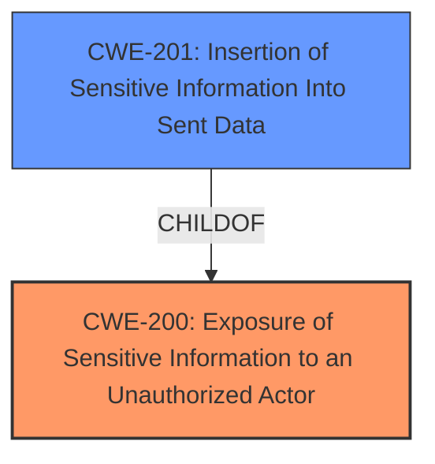

# Raw Analyzer Response for CVE-2020-7269

# Summary
| CWE ID | CWE Name | Confidence | CWE Abstraction Level | CWE Vulnerability Mapping Label | CWE-Vulnerability Mapping Notes |
|---|---|---|---|---|---|
| CWE-200 | Exposure of Sensitive Information to an Unauthorized Actor | 0.8 | Class | Primary | Allowed-with-Review |
| CWE-201 | Insertion of Sensitive Information Into Sent Data | 0.6 | Base | Secondary | Allowed |

## Evidence and Confidence

*   **Confidence Score:** 0.7
*   **Evidence Strength:** MEDIUM

## Relationship Analysis
The primary CWE selected is CWE-200 **Exposure of Sensitive Information to an Unauthorized Actor**, a Class-level CWE. The secondary CWE is CWE-201 **Insertion of Sensitive Information Into Sent Data**, which is a Base-level CWE and a child of CWE-200. This indicates a hierarchical relationship where CWE-201 is a more specific case of CWE-200, involving sensitive information being inserted into data that is sent to an unauthorized actor. The selection of CWE-200 as primary is influenced by the general nature of the vulnerability description. If more information had been provided about the specific mechanism of insertion, CWE-201 could have been the primary.

## Vulnerability Chain
The vulnerability chain starts with the **improper handling of HTTP requests**, leading to the **exposure of sensitive unencrypted information** to **remote authenticated users**.

## Summary of Analysis
The initial analysis focused on identifying the root cause and impact of the vulnerability based on the provided description. The key phrase "view sensitive unencrypted information" strongly suggests an information exposure issue. The vulnerability description mentions that "Exposure of Sensitive Information in the web interface in McAfee Advanced Threat Defense (ATD) prior to 4.12.2 allows remote authenticated users to view sensitive unencrypted information via a carefully crafted HTTP request parameter."

CWE-200 **Exposure of Sensitive Information to an Unauthorized Actor** is a strong initial candidate, as it directly addresses the **exposure of sensitive information**. However, the mapping guidance discourages its use as a primary CWE if a more specific weakness can be identified.

CWE-201 **Insertion of Sensitive Information Into Sent Data** is also considered, as the vulnerability involves a "carefully crafted HTTP request parameter," implying that sensitive information might be inserted into the data being sent.

Given the available information, CWE-200 is the primary CWE because it directly describes the **exposure of sensitive information**. CWE-201 is a secondary CWE, as the vulnerability involves crafting HTTP requests which suggests the sensitive data is being sent. The hierarchical relationship between these CWEs supports this decision. Both CWEs are at acceptable levels of abstraction, though CWE-200 is a Class and thus less specific, and should be chosen with review.

The final selection is based on maximizing specificity while adhering to the provided evidence and guidance.

Relevant CWE Information:

# Enhanced Context (25 CWEs)

## CWE-226: Sensitive Information in Resource Not Removed Before Reuse
**Abstraction Level**: Base
**Similarity Score**: 0.78
**Source**: dense

**Description**:
The product releases a resource such as memory or a file so that it can be made available for reuse, but it does not clear or "zeroize" the information contained in the resource before the product performs a critical state transition or makes the resource available for reuse by other entities.

**Mapping Guidance**:
- Usage: Allowed
- Rationale: This CWE entry is at the Base level of abstraction, which is a preferred level of abstraction for mapping to the root causes of vulnerabilities.

This CWE was not selected because the description does not indicate reuse of resources.

## CWE-807: Reliance on Untrusted Inputs in a Security Decision
**Abstraction Level**: Base
**Similarity Score**: 0.77
**Source**: dense

**Description**:
The product uses a protection mechanism that relies on the existence or values of an input, but the input can be modified by an untrusted actor in a way that bypasses the protection mechanism.

**Mapping Guidance**:
- Usage: Allowed
- Rationale: This CWE entry is at the Base level of abstraction, which is a preferred level of abstraction for mapping to the root causes of vulnerabilities.

This CWE was not selected because the description does not indicate a protection mechanism is being bypassed.

## CWE-538: Insertion of Sensitive Information into Externally-Accessible File or Directory
**Abstraction Level**: Base
**Similarity Score**: 0.77
**Source**: dense

**Description**:
The product places sensitive information into files or directories that are accessible to actors who are allowed to have access to the files, but not to the sensitive information.

**Mapping Guidance**:
- Usage: Allowed
- Rationale: This CWE entry is at the Base level of abstraction, which is a preferred level of abstraction for mapping to the root causes of vulnerabilities.

This CWE was not selected because the description does not indicate the insertion of information into files or directories.

## CWE-668: Exposure of Resource to Wrong Sphere
**Abstraction Level**: Class
**Similarity Score**: 0.77
**Source**: dense

**Description**:
The product exposes a resource to the wrong control sphere, providing unintended actors with inappropriate access to the resource.

**Mapping Guidance**:
- Usage: Discouraged
- Rationale: CWE-668 is high-level and is often misused as a catch-all when lower-level CWE IDs might be applicable. It is sometimes used for low-information vulnerability reports [REF-1287]. It is a level-1 Class (i.e., a child of a Pillar). It is not useful for trend analysis.

This CWE was not selected because while it relates to exposure, it is too general.

## CWE-212: Improper Removal of Sensitive Information Before Storage or Transfer
**Abstraction Level**: Base
**Similarity Score**: 0.77
**Source**: dense

**Description**:
The product stores, transfers, or shares a resource that contains sensitive information, but it does not properly remove that information before the product makes the resource available to unauthorized actors.

**Mapping Guidance**:
- Usage: Allowed
- Rationale: This CWE entry is at the Base level of abstraction, which is a preferred level of abstraction for mapping to the root causes of vulnerabilities.

This CWE was not selected as the description doesn't describe improper removal of sensitive data.

## CWE-497: Exposure of Sensitive System Information to an Unauthorized Control Sphere
**Abstraction Level**: Base
**Similarity Score**: 0.76
**Source**: dense

**Description**:
The product does not properly prevent sensitive system-level information from being accessed by unauthorized actors who do not have the same level of access to the underlying system as the product does.

**Mapping Guidance**:
- Usage: Allowed
- Rationale: This CWE entry is at the Base level of abstraction, which is a preferred level of abstraction for mapping to the root causes of vulnerabilities.

This CWE was not selected as the vulnerability description does not specify system-level information being exposed.

## CWE-303: Incorrect Implementation of Authentication Algorithm
**Abstraction Level**: Base
**Similarity Score**: 0.76
**Source**: dense

**Description**:
The requirements for the product dictate the use of an established authentication algorithm, but the implementation of the algorithm is incorrect.

**Mapping Guidance**:
- Usage: Allowed
- Rationale: This CWE entry is at the Base level of abstraction, which is a preferred level of abstraction for mapping to the root causes of vulnerabilities.

This CWE was not selected as there is no indication of an authentication algorithm implementation error.

## CWE-319: Cleartext Transmission of Sensitive Information
**Abstraction Level**: Base
**Similarity Score**: 0.76
**Source**: dense

**Description**:
The product transmits sensitive or security-critical data in cleartext in a communication channel that can be sniffed by unauthorized actors.

**Mapping Guidance**:
- Usage: Allowed
- Rationale: This CWE entry is at the Base level of abstraction, which is a preferred level of abstraction for mapping to the root causes of vulnerabilities.

This CWE was not selected as the description doesn't mention cleartext transmission.

## CWE-404: Improper Resource Shutdown or Release
**Abstraction Level**: Class
**Similarity Score**: 0.76
**Source**: dense

**Description**:
The product does not release or incorrectly releases a resource before it is made available for re-use.

**Mapping Guidance**:
- Usage: Allowed-with-Review
- Rationale: This CWE entry is a Class and might have Base-level children that would be more appropriate

This CWE was not selected as the description doesn't mention a resource shutdown or release issue.

## CWE-639: Authorization Bypass Through User-Controlled Key
**Abstraction Level**: Base
**Similarity Score**: 6578.98
**Source**: