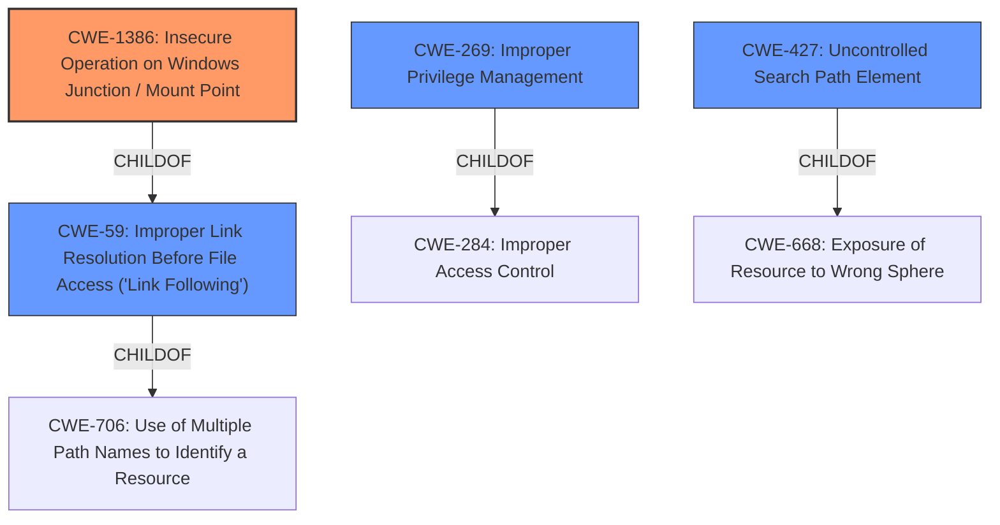

# Analysis Report for CVE-2020-7346

# Vulnerability Analysis Report: CVE-2020-7346

## Description


## Analysis (with Relationship Data)

# Summary
| CWE ID    | CWE Name                                                        | Confidence | CWE Abstraction Level | CWE Vulnerability Mapping Label | CWE-Vulnerability Mapping Notes |
| :-------- | :-------------------------------------------------------------- | :--------- | :-------------------- | :------------------------------ | :------------------------------ |
| CWE-1386  | Insecure Operation on Windows Junction / Mount Point            | 0.95       | Base                  | Primary CWE                     | Allowed                       |
| CWE-59    | Improper Link Resolution Before File Access ('Link Following') | 0.80       | Base                  | Secondary Candidate             | Allowed                       |
| CWE-269   | Improper Privilege Management                                   | 0.60       | Class                 | Secondary Candidate             | Discouraged                    |
| CWE-427   | Uncontrolled Search Path Element                                | 0.60       | Base                  | Secondary Candidate             | Allowed                       |

## Evidence and Confidence

*   **Confidence Score:** 0.85
*   **Evidence Strength:** HIGH

## Relationship Analysis
The primary CWE, CWE-1386, is a child of CWE-59 which deals with more general link following issues. The vulnerability description specifically mentions the use of junctions, which makes CWE-1386 a more precise fit. CWE-269 is a parent of CWE-250, Execution with Unnecessary Privileges, but the description doesn't give enough information to choose which child of CWE-269 is most applicable, so it is classified as a Class level CWE. Finally, the vulnerability description does not include information about search paths, however the **attackers** using **junctions** to cause the product to load DLLs of their choosing suggests that CWE-427 may be in play.



## Vulnerability Chain
The vulnerability chain starts with the **improper handling of junctions (CWE-1386)**, leading to the loading of attacker-controlled DLLs and culminating in **privilege escalation**.

## Summary of Analysis
The initial assessment strongly points towards CWE-1386 as the primary weakness, given the explicit mention of junctions in the vulnerability description: "through the use of junctions to cause the product to load DLLs of the attackers choosing." This aligns perfectly with CWE-1386's description: "The product opens a file or directory, but it does not properly prevent the name from being associated with a junction or mount point to a destination that is outside of the intended control sphere."

Further supporting evidence includes the vulnerability description's focus on local, low-privileged **attackers** exploiting this weakness to escalate privileges. The use of junctions to load malicious DLLs directly reflects the core issue described in CWE-1386.

While other CWEs like CWE-59 (Improper Link Resolution Before File Access) and CWE-427 (Uncontrolled Search Path Element) were considered, CWE-1386 provides the most specific and accurate representation of the vulnerability's root cause.

The analysis considered the relationships between CWEs, particularly the child-of relationship between CWE-1386 and CWE-59. However, the specificity of junctions as the attack vector solidifies CWE-1386 as the primary classification.

The final selection is based on the evidence provided in the vulnerability description, the CWE specifications, and the relationships between CWEs. The chosen CWEs are at the optimal level of specificity, providing a clear and accurate representation of the vulnerability.

Relevant CWE Information:

# Enhanced Context (25 CWEs)

## CWE-274: Improper Handling of Insufficient Privileges
**Abstraction Level**: Base
**Similarity Score**: 0.77
**Source**: dense

**Description**:
The product does not handle or incorrectly handles when it has insufficient privileges to perform an operation, leading to resultant weaknesses.

**Mapping Guidance**:
- Usage: Discouraged
- Rationale: This CWE entry could be deprecated in a future version of CWE.

## CWE-1220: Insufficient Granularity of Access Control
**Abstraction Level**: Base
**Similarity Score**: 0.76
**Source**: dense

**Description**:
The product implements access controls via a policy or other feature with the intention to disable or restrict accesses (reads and/or writes) to assets in a system from untrusted agents. However, implemented access controls lack required granularity, which renders the control policy too broad because it allows accesses from unauthorized agents to the security-sensitive assets.

**Mapping Guidance**:
- Usage: Allowed
- Rationale: This CWE entry is at the Base level of abstraction, which is a preferred level of abstraction for mapping to the root causes of vulnerabilities.

## CWE-664: Improper Control of a Resource Through its Lifetime
**Abstraction Level**: Pillar
**Similarity Score**: 0.76
**Source**: dense

**Description**:
The product does not maintain or incorrectly maintains control over a resource throughout its lifetime of creation, use, and release.

**Mapping Guidance**:
- Usage: Discouraged
- Rationale: This CWE entry is high-level when lower-level children are available.

## CWE-653: Improper Isolation or Compartmentalization
**Abstraction Level**: Class
**Similarity Score**: 0.76
**Source**: dense

**Description**:
The product does not properly compartmentalize or isolate functionality, processes, or resources that require different privilege levels, rights, or permissions.

**Mapping Guidance**:
- Usage: Allowed
- Rationale: This CWE entry is at the Base level of abstraction, which is a preferred level of abstraction for mapping to the root causes of vulnerabilities.

## CWE-691: Insufficient Control Flow Management
**Abstraction Level**: Pillar
**Similarity Score**: 0.76
**Source**: dense

**Description**:
The code does not sufficiently manage its control flow during execution, creating conditions in which the control flow can be modified in unexpected ways.

**Mapping Guidance**:
- Usage: Discouraged
- Rationale: This CWE entry is extremely high-level, a Pillar. However, classification research is limited for weaknesses of this type, so there can be gaps or organizational difficulties within CWE that force use of this weakness, even at such a high level of abstraction.

## CWE-1289: Improper Validation of Unsafe Equivalence in Input
**Abstraction Level**: Base
**Similarity Score**: 0.76
**Source**: dense

**Description**:
The product receives an input value that is used as a resource identifier or other type of reference, but it does not validate or incorrectly validates that the input is equivalent to a potentially-unsafe value.

**Mapping Guidance**:
- Usage: Allowed
- Rationale: This CWE entry is at the Base level of abstraction, which is a preferred level of abstraction for mapping to the root causes of vulnerabilities.

## CWE-807: Reliance on Untrusted Inputs in a Security Decision
**Abstraction Level**: Base
**Similarity Score**: 0.76
**Source**: dense

**Description**:
The product uses a protection mechanism that relies on the existence or values of an input, but the input can be modified by an untrusted actor in a way that bypasses the protection mechanism.

**Mapping Guidance**:
- Usage: Allowed
- Rationale: This CWE entry is at the Base level of abstraction, which is a preferred level of abstraction for mapping to the root causes of vulnerabilities.

## CWE-280: Improper Handling of Insufficient Permissions or Privileges
**Abstraction Level**: Base
**Similarity Score**: 0.76
**Source**: dense

**Description**:
The product does not handle or incorrectly handles when it has insufficient privileges to access resources or functionality as specified by their permissions. This may cause it to follow unexpected code paths that may leave the product in an invalid state.

**Mapping Guidance**:
- Usage: Allowed
- Rationale: This CWE entry is at the Base level of abstraction, which is a preferred level of abstraction for mapping to the root causes of vulnerabilities.

## CWE-668: Exposure of Resource to Wrong Sphere
**Abstraction Level**: Class
**Similarity Score**: 0.75


## CWE Relationship Analysis

Current CWEs represent these abstraction levels: .


### Vulnerability Chain Analysis

**Chain starting from CWE-691:**
- 691 (Insufficient Control Flow Management) - ROOT


**Chain starting from CWE-664:**
- 664 (Improper Control of a Resource Through its Lifetime) - ROOT


### CWE Relationship Diagram

```mermaid
graph TD
    classDef primary fill:#f96,stroke:#333,stroke-width:2px
    classDef secondary fill:#69f,stroke:#333
    classDef tertiary fill:#9e9,stroke:#333
```


*Report generated on 2025-04-02 03:16:13*
