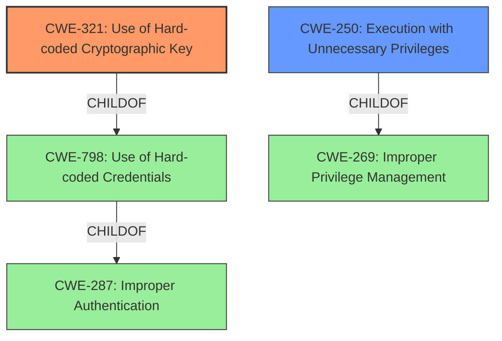

# Raw Analyzer Response for CVE-2020-7352

# Summary
| CWE ID | CWE Name | Confidence | CWE Abstraction Level | CWE Vulnerability Mapping Label | CWE-Vulnerability Mapping Notes |
|---|---|---|---|---|---|
| CWE-321 | Use of Hard-coded Cryptographic Key | 1.0 | Variant | Allowed | Primary CWE |
| CWE-250 | Execution with Unnecessary Privileges | 0.8 | Base | Allowed | Secondary Candidate |

## Evidence and Confidence

*   **Confidence Score:** 0.9
*   **Evidence Strength:** HIGH

## Relationship Analysis
The primary CWE is CWE-321, which is a variant of CWE-798 (Use of Hard-coded Credentials). CWE-798 is a child of CWE-287 (Improper Authentication). CWE-250 (Execution with Unnecessary Privileges) is a child of CWE-269 (Improper Privilege Management). The relationship analysis shows that the **hard-coded cryptographic key** led to the ability to execute commands with elevated privileges.

## Vulnerability Chain
The vulnerability chain starts with the **use of a hard-coded cryptographic key** (CWE-321), which allows an attacker to bypass authentication and send commands to a service that is running with elevated privileges. This leads to arbitrary code execution with SYSTEM privileges.
  - CWE-321: **Use of Hard-coded Cryptographic Key**
  - CWE-250: Execution with Unnecessary Privileges

## Summary of Analysis
The primary weakness is the **use of a hard-coded cryptographic key** (CWE-321), which allows an attacker to bypass authentication. The GOG Galaxy Client's `GalaxyClientService` runs with elevated SYSTEM privileges and listens for commands on a local network port. An attacker with the static RSA private key can send arbitrary commands to the service, which executes them with SYSTEM privileges. This leads to arbitrary code execution with SYSTEM privileges.

The selection of CWE-321 is based on the following evidence from the vulnerability description:
- "Due to the software shipping with embedded, static RSA private key..."
- "An attacker with this key material and local user permissions can effectively send any operating system command to the service for execution in this elevated context."

CWE-321 is at the Variant level of abstraction, which is a preferred level of abstraction for mapping to the root causes of vulnerabilities. The MITRE mapping guidance for CWE-321 allows its use.

CWE-250 (Execution with Unnecessary Privileges) is also included as a secondary CWE because the `GalaxyClientService` runs with elevated SYSTEM privileges. This amplifies the impact of the vulnerability, as the attacker can execute arbitrary code with SYSTEM privileges. While the **static private key** is the root cause, the elevated privileges magnify the impact.

CWE-20 (Improper Input Validation), CWE-269 (Improper Privilege Management), and CWE-287 (Improper Authentication) were considered but not selected. CWE-20 is too generic and does not accurately describe the root cause of the vulnerability. CWE-269 is also too generic and is often misused. CWE-287 is more general, while CWE-321 specifies the kind of authentication bypass.

Relevant CWE Information:

# Enhanced Context (25 CWEs)
The following CWEs were identified as potentially relevant to this vulnerability:

## CWE-798: Use of Hard-coded Credentials
**Abstraction Level**: Base
**Similarity Score**: 0.78
**Source**: dense

**Description**:
The product contains hard-coded credentials, such as a password or cryptographic key.

**Mapping Guidance**:
- Usage: Allowed
- Rationale: This CWE entry is at the Base level of abstraction, which is a preferred level of abstraction for mapping to the root causes of vulnerabilities.

## CWE-250: Execution with Unnecessary Privileges
**Abstraction Level**: Base
**Similarity Score**: 0.504
**Source**: dense

**Description**:
The product performs an operation at a privilege level that is higher than the minimum level required, which creates new weaknesses or amplifies the consequences of other weaknesses.

**Mapping Guidance**:
- Usage: Allowed
- Rationale: This CWE entry is at the Base level of abstraction, which is a preferred level of abstraction for mapping to the root causes of vulnerabilities.

## CWE-321: Use of Hard-coded Cryptographic Key
**Abstraction Level**: Variant
**Similarity Score**: 8263.31
**Source**: sparse

**Description**:
The use of a hard-coded cryptographic key significantly increases the possibility that encrypted data may be recovered.

**Mapping Guidance**:
- Usage: Allowed
- Rationale: This CWE entry is at the Variant level of abstraction, which is a preferred level of abstraction for mapping to the root causes of vulnerabilities.