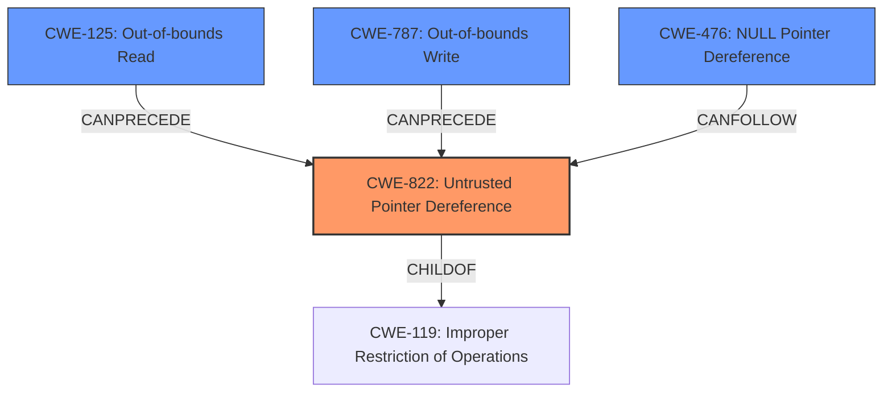

# Enhanced Analysis for CVE-2020-7452

# Summary
| CWE ID | CWE Name | Confidence | CWE Abstraction Level | CWE Vulnerability Mapping Label | CWE-Vulnerability Mapping Notes |
|---|---|---|---|---|---|
| CWE-822 | Untrusted Pointer Dereference | 0.9 | Base | Allowed | Primary CWE. The vulnerability involves the **incorrect use of a user-controlled pointer**, which directly aligns with the description of CWE-822. |
| CWE-476 | NULL Pointer Dereference | 0.5 | Base | Allowed | Secondary Candidate. Although the primary issue is the incorrect use of a user-controlled pointer, it could potentially lead to a NULL pointer dereference. |
| CWE-787 | Out-of-bounds Write | 0.5 | Base | Allowed | Secondary Candidate. The **incorrect use of a user-controlled pointer** could also lead to writing outside the bounds of the allocated memory. |

## Evidence and Confidence

*   **Confidence Score:** 0.9
*   **Evidence Strength:** HIGH

## Relationship Analysis
The primary CWE is CWE-822, which is a Base level weakness. It can lead to other weaknesses such as CWE-125 (Out-of-bounds Read) and CWE-787 (Out-of-bounds Write). CWE-476 (NULL Pointer Dereference) is considered as a possible secondary weakness, as incorrect pointer usage can lead to dereferencing a NULL pointer.



## Vulnerability Chain
The vulnerability chain starts with the **incorrect use of a user-controlled pointer** (CWE-822). This can potentially lead to a system panic or arbitrary code execution.

## Summary of Analysis
The primary weakness is the **incorrect use of a user-controlled pointer** in the epair virtual network module, which aligns well with CWE-822 (Untrusted Pointer Dereference). The vulnerability description explicitly mentions that a user-controlled pointer is used incorrectly in the kernel. The CVE Reference Links Content Summary confirms that the root cause involves the incorrect use of a potentially user-controlled pointer.

The retriever results also listed CWE-822 as the top combined result.

The final decision is based on the provided evidence and the retriever results and relationship graph. CWE-822 is the most specific and appropriate CWE for this vulnerability.

Relevant CWE Information:
- CWE-822: Untrusted Pointer Dereference
  - "The product obtains a value from an untrusted source, converts this value to a pointer, and dereferences the resulting pointer." This aligns directly with the vulnerability description mentioning the **incorrect use of a user-controlled pointer**.
- CWE-476: NULL Pointer Dereference
  - "The product dereferences a pointer that it expects to be valid but is NULL." This is a possible outcome of the **incorrect use of a user-controlled pointer**, although not the primary issue.
- CWE-787: Out-of-bounds Write
  - "The product writes data past the end, or before the beginning, of the intended buffer." This is another possible outcome if the **user-controlled pointer** points to an address outside the allocated memory region.


## CWE Relationship Analysis

Current CWEs represent these abstraction levels: .


### Vulnerability Chain Analysis

**Chain starting from CWE-476:**
- 476 (NULL Pointer Dereference) - ROOT


**Chain starting from CWE-787:**
- 787 (Out-of-bounds Write) - ROOT


### CWE Relationship Diagram

```mermaid
graph TD
    classDef primary fill:#f96,stroke:#333,stroke-width:2px
    classDef secondary fill:#69f,stroke:#333
    classDef tertiary fill:#9e9,stroke:#333
```