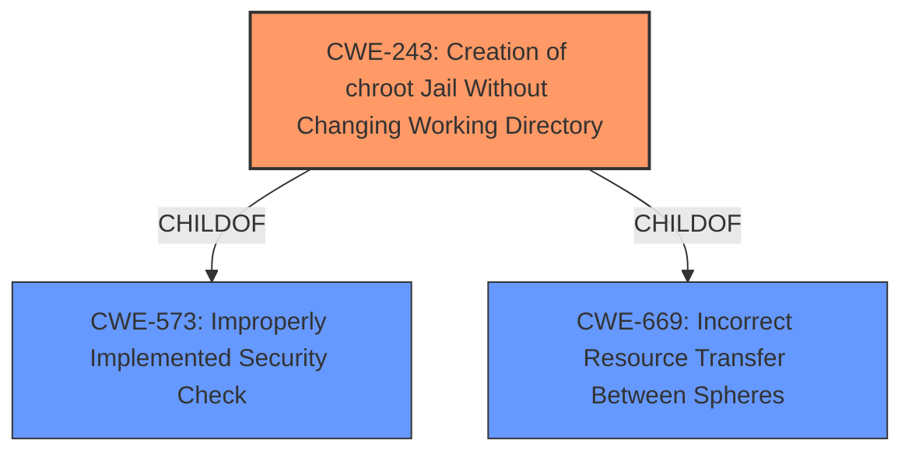

# Analysis for CVE-2020-7468

# Summary
| CWE ID | CWE Name | Confidence | CWE Abstraction Level | CWE Vulnerability Mapping Label | CWE-Vulnerability Mapping Notes |
|---|---|---|---|---|---|
| CWE-243 | Creation of chroot Jail Without Changing Working Directory | 0.9 | Variant | Allowed | Primary CWE |

## Evidence and Confidence

*   **Confidence Score:** 0.9
*   **Evidence Strength:** HIGH

## Relationship Analysis
The primary relationship influencing the CWE selection is the ChildOf relationship. CWE-243 "Creation of chroot Jail Without Changing Working Directory" is a variant of CWE-573 "Improperly Implemented Security Check" and CWE-669 "Incorrect Resource Transfer Between Spheres". Choosing CWE-243 provides a more specific classification than its parents.

## Vulnerability Chain
The vulnerability chain begins with a **bug in the implementation of the file system sandbox** (CWE-243), leading to an ability to **escape the file system restriction** and ultimately **gain root privileges**.

## Summary of Analysis
The initial analysis focused on the vulnerability description which highlighted a **bug in the implementation of the file system sandbox**, allowing a malicious client to escape the `ftpchroot(5)` restrictions and gain root privileges. The provided information strongly suggests that the root cause is related to how the chroot jail was implemented.

The Retriever Results identified CWE-243 "Creation of chroot Jail Without Changing Working Directory" as the top candidate, which aligns well with the description of a **bug in the implementation of the file system sandbox** specifically related to `ftpchroot(5)`.

The selection of CWE-243 is based on the following evidence:
- "Vulnerability Description Key Phrases": "**rootcause:** **bug in the implementation of the file system sandbox**"
- "CVE Reference Links Content Summary": "The `ftpd(8)` implementation of the file system sandbox has a flaw that allows a malicious client to escape the restrictions imposed by `ftpchroot(5)`."
- "Retriever Results": CWE-243 is the top combined result.
- "Complete CWE Specifications": The description of CWE-243 accurately reflects the vulnerability: "The product uses the chroot() system call to create a jail, but does not change the working directory afterward. This does not prevent access to files outside of the jail."

The other CWEs considered were not as directly relevant:
- CWE-1284 "Improper Validation of Specified Quantity in Input": While input validation issues can be related to security vulnerabilities, the primary issue here is the incorrect implementation of the chroot jail itself, not the validation of input quantities.
- CWE-863 "Incorrect Authorization": Incorrect authorization could be a consequence of the vulnerability, but the root cause is the flawed implementation of the sandbox.
- CWE-285 "Improper Authorization": See CWE-863.
- CWE-220 "Storage of File With Sensitive Data Under FTP Root": This CWE is not applicable as it focuses on storing sensitive data under the FTP root, while the vulnerability is about escaping the chroot jail.

The selected CWE, CWE-243, is at the optimal level of specificity as it directly addresses the **bug in the implementation of the file system sandbox** related to the missing working directory change after the `chroot()` call. This is a variant level CWE, which is preferred.

Relevant CWE Information:

# Enhanced Context (25 CWEs)
The following CWEs were identified as potentially relevant to this vulnerability:

## CWE-404: Improper Resource Shutdown or Release
**Abstraction Level**: Class
**Similarity Score**: 0.77
**Source**: dense

**Description**:
The product does not release or incorrectly releases a resource before it is made available for re-use.

**Mapping Guidance**:
- Usage: Allowed-with-Review
- Rationale: This CWE entry is a Class and might have Base-level children that would be more appropriate

## CWE-131: Incorrect Calculation of Buffer Size
**Abstraction Level**: Base
**Similarity Score**: 0.77
**Source**: dense

**Description**:
The product does not correctly calculate the size to be used when allocating a buffer, which could lead to a buffer overflow.

**Mapping Guidance**:
- Usage: Allowed
- Rationale: This CWE entry is at the Base level of abstraction, which is a preferred level of abstraction for mapping to the root causes of vulnerabilities.

## CWE-667: Improper Locking
**Abstraction Level**: Class
**Similarity Score**: 0.77
**Source**: dense

**Description**:
The product does not properly acquire or release a lock on a resource, leading to unexpected resource state changes and behaviors.

**Mapping Guidance**:
- Usage: Allowed-with-Review
- Rationale: This CWE entry is a Class and might have Base-level children that would be more appropriate

## CWE-191: Integer Underflow (Wrap or Wraparound)
**Abstraction Level**: Base
**Similarity Score**: 0.76
**Source**: dense

**Description**:
The product subtracts one value from another, such that the result is less than the minimum allowable integer value, which produces a value that is not equal to the correct result.

**Mapping Guidance**:
- Usage: Allowed
- Rationale: This CWE entry is at the Base level of abstraction, which is a preferred level of abstraction for mapping to the root causes of vulnerabilities.

## CWE-754: Improper Check for Unusual or Exceptional Conditions
**Abstraction Level**: Class
**Similarity Score**: 0.76
**Source**: dense

**Description**:
The product does not check or incorrectly checks for unusual or exceptional conditions that are not expected to occur frequently during day to day operation of the product.

**Mapping Guidance**:
- Usage: Allowed-with-Review
- Rationale: This CWE entry is a Class and might have Base-level children that would be more appropriate

## CWE-41: Improper Resolution of Path Equivalence
**Abstraction Level**: Base
**Similarity Score**: 0.76
**Source**: dense

**Description**:
The product is vulnerable to file system contents disclosure through path equivalence. Path equivalence involves the use of special characters in file and directory names. The associated manipulations are intended to generate multiple names for the same object.

**Mapping Guidance**:
- Usage: Allowed
- Rationale: This CWE entry is at the Base level of abstraction, which is a preferred level of abstraction for mapping to the root causes of vulnerabilities.

## CWE-125: Out-of-bounds Read
**Abstraction Level**: Base
**Similarity Score**: 0.76
**Source**: dense

**Description**:
The product reads data past the end, or before the beginning, of the intended buffer.

**Mapping Guidance**:
- Usage: Allowed
- Rationale: This CWE entry is at the Base level of abstraction, which is a preferred level of abstraction for mapping to the root causes of vulnerabilities.

## CWE-212: Improper Removal of Sensitive Information Before Storage or Transfer
**Abstraction Level**: Base
**Similarity Score**: 0.76
**Source**: dense

**Description**:
The product stores, transfers, or shares a resource that contains sensitive information, but it does not properly remove that information before the product makes the resource available to unauthorized actors.

**Mapping Guidance**:
- Usage: Allowed
- Rationale: This CWE entry is at the Base level of abstraction, which is a preferred level of abstraction for mapping to the root causes of vulnerabilities.

## CWE-703: Improper Check or Handling of Exceptional Conditions
**Abstraction Level**: Pillar
**Similarity Score**: 0.75
**Source**: dense

**Description**:
The product does not properly anticipate or handle exceptional conditions that rarely occur during normal operation of the product.

**Mapping Guidance**:
- Usage: Discouraged
- Rationale: This CWE entry is extremely high-level, a Pillar.

## CWE-274: Improper Handling of Insufficient Privileges
**Abstraction Level**: Base
**Similarity Score**: 0.75
**Source**: dense

**Description**:
The product does not handle or incorrectly handles when it has insufficient privileges to perform an operation, leading to resultant weaknesses.

**Mapping Guidance**:
- Usage: Discouraged
- Rationale: This CWE entry could be deprecated in a future version of CWE.

## CWE-863: Incorrect Authorization
**Abstraction Level**: Class
**Similarity Score**: 4019.62
**Source**: sparse

**Description**:
The product performs an authorization check when