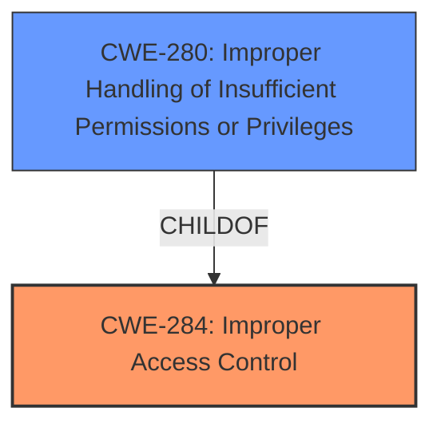

# Raw Analyzer Response for CVE-2020-7545

# Summary
| CWE ID  | CWE Name                       | Confidence | CWE Abstraction Level | CWE Vulnerability Mapping Label | CWE-Vulnerability Mapping Notes |
|---------|--------------------------------|------------|-----------------------|---------------------------------|-----------------------------------|
| CWE-284 | Improper Access Control        | 0.75       | Pillar                | Primary                           | Discouraged                       |
| CWE-280 | Improper Handling of Insufficient Permissions or Privileges | 0.65 | Base | Secondary | Allowed |

## Evidence and Confidence

*   **Confidence Score:** 0.70
*   **Evidence Strength:** MEDIUM

## Relationship Analysis
The primary relationship that influenced the decision was the hierarchical structure with CWE-284 being a Pillar and having more specific children. While the description points towards **Improper Access Control**, the lack of specific details makes it difficult to choose a more specific CWE. CWE-280 was considered as a potential more specific match, representing the scenario where the authorized user **lacks** sufficient permissions, but the description does not clearly state if the **improper access control** is the user accessing something they should not or if there is some function that is failing because the user does not have enough privileges.

## Vulnerability Chain
The vulnerability chain starts with **Improper Access Control** (CWE-284) which leads to arbitrary code execution.

## Summary of Analysis
The initial analysis focused on the provided vulnerability description and key phrases, which explicitly mention **"Improper Access Control"** as the root cause. The description states that this vulnerability in EcoStruxure and SmartStruxure Power Monitoring and SCADA Software could allow for arbitrary code execution on the server when an authorized user accesses an affected webpage.

The Retriever Results listed several CWEs, including CWE-522, CWE-284, CWE-311, and others. However, the primary focus remained on **Improper Access Control** due to its direct mention in the vulnerability description.

The selection of CWE-284 is based on the evidence of **Improper Access Control** being the root cause, but with the acknowledgement that it is a high-level CWE. CWE-280 was considered since the description refers to an authorized user, which might mean the user does not have enough privilges, but the evidence is insufficient to confirm this.

The final decision is to use CWE-284 as the primary CWE due to the explicit mention in the description, but with a lower confidence score of 0.75 because it is a high-level classification.

Relevant CWE Information:

# Enhanced Context (25 CWEs)
The following CWEs were identified as potentially relevant to this vulnerability:

## CWE-280: Improper Handling of Insufficient Permissions or Privileges 
**Abstraction Level**: Base
**Similarity Score**: 0.78
**Source**: dense

**Description**:
The product does not handle or incorrectly handles when it has insufficient privileges to access resources or functionality as specified by their permissions. This may cause it to follow unexpected code paths that may leave the product in an invalid state.

**Mapping Guidance**:
- Usage: Allowed
- Rationale: This CWE entry is at the Base level of abstraction, which is a preferred level of abstraction for mapping to the root causes of vulnerabilities.

## CWE-284: Improper Access Control
**Abstraction Level**: Pillar
**Similarity Score**: 6390.84
**Source**: sparse

**Description**:
The product does not restrict or incorrectly restricts access to a resource from an unauthorized actor.

**Mapping Guidance**:
- Usage: Discouraged
- Rationale: CWE-284 is extremely high-level, a Pillar. Its name, "Improper Access Control," is often misused in low-information vulnerability reports [REF-1287] or by active use of the OWASP Top Ten, such as "A01:2021-Broken Access Control". It is not useful for trend analysis.

## CWE-522: Insufficiently Protected Credentials
**Abstraction:** Class
**Status:** Incomplete

### Description
The product transmits or stores authentication credentials, but it uses an insecure method that is susceptible to unauthorized interception and/or retrieval.