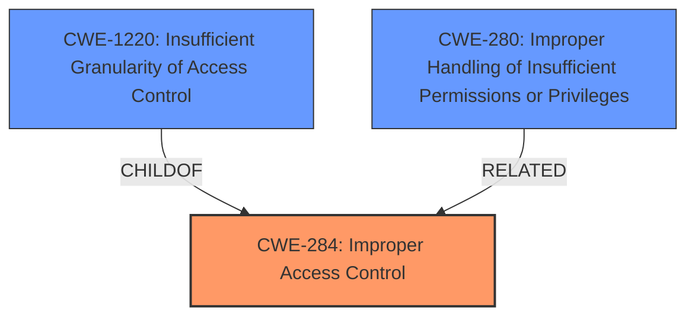

# Raw Analyzer Response for CVE-2020-7547

# Summary
| CWE ID | CWE Name | Confidence | CWE Abstraction Level | CWE Vulnerability Mapping Label | CWE-Vulnerability Mapping Notes |
|---|---|---|---|---|---|
| CWE-284 | Improper Access Control | 0.75 | Pillar | Primary | Discouraged |
| CWE-1220 | Insufficient Granularity of Access Control | 0.6 | Base | Secondary | Allowed |
| CWE-280 | Improper Handling of Insufficient Permissions or Privileges | 0.5 | Base | Secondary | Allowed |

## Evidence and Confidence

*   **Confidence Score:** 0.75
*   **Evidence Strength:** MEDIUM

## Relationship Analysis
The primary CWE selected is CWE-284, which is a high-level Pillar. The description indicates an **improper access control** issue. While CWE-284 is discouraged due to its high level of abstraction, it serves as the initial classification. More specific CWEs such as CWE-1220 and CWE-280 were considered as secondary classifications. CWE-1220 (Insufficient Granularity of Access Control) is a child of CWE-284 and provides more specific details on the access control issue. CWE-280 is related to handling insufficient permissions and privileges, which could be part of the access control problem.

## Vulnerability Chain
The chain of events is as follows:
1.  **Root Cause:** **Improper Access Control** (CWE-284) exists in the software.
2.  The **improper access control** might be due to **insufficient granularity** (CWE-1220) or **improper handling of permissions** (CWE-280).
3.  **Impact:** A user can perform actions via the web interface at a higher privilege level.

## Summary of Analysis
The initial assessment identified CWE-284 as the primary weakness based on the **improper access control** description. However, CWE-284 is a high-level Pillar, which is discouraged. Thus, secondary CWEs that are more specific were also considered. CWE-1220 and CWE-280 provide more granular descriptions of the access control issue. The relationship graph shows that CWE-1220 is a child of CWE-284, which supports its inclusion as a secondary CWE. The final decision is to include CWE-284 as the primary CWE with CWE-1220 and CWE-280 as secondary CWEs to provide more context. The weakness is at the pillar level due to the high-level description, but it is supplemented with the more specific base level CWEs.

Relevant CWE Information:

# Enhanced Context (25 CWEs)

## CWE-1220: Insufficient Granularity of Access Control
**Abstraction Level**: Base
**Similarity Score**: 0.77
**Source**: dense

**Description**:
The product implements access controls via a policy or other feature with the intention to disable or restrict accesses (reads and/or writes) to assets in a system from untrusted agents. However, implemented access controls lack required granularity, which renders the control policy too broad because it allows accesses from unauthorized agents to the security-sensitive assets.

**Mapping Guidance**:
- Usage: Allowed
- Rationale: This CWE entry is at the Base level of abstraction, which is a preferred level of abstraction for mapping to the root causes of vulnerabilities.

## CWE-284: Improper Access Control
**Abstraction:** Pillar
**Status:** Incomplete

### Description
The product does not restrict or incorrectly restricts access to a resource from an unauthorized actor.

### Extended Description

Access control involves the use of several protection mechanisms such as:

  - Authentication (proving the identity of an actor)

  - Authorization (ensuring that a given actor can access a resource), and

  - Accountability (tracking of activities that were performed)

When any mechanism is not applied or otherwise fails, attackers can compromise the security of the product by gaining privileges, reading sensitive information, executing commands, evading detection, etc.

There are two distinct behaviors that can introduce access control weaknesses:

  - Specification: incorrect privileges, permissions, ownership, etc. are explicitly specified for either the user or the resource (for example, setting a password file to be world-writable, or giving administrator capabilities to a guest user). This action could be performed by the program or the administrator.

  - Enforcement: the mechanism contains errors that prevent it from properly enforcing the specified access control requirements (e.g., allowing the user to specify their own privileges, or allowing a syntactically-incorrect ACL to produce insecure settings). This problem occurs within the program itself, in that it does not actually enforce the intended security policy that the administrator specifies.

### Alternative Terms
Authorization: The terms "access control" and "authorization" are often used interchangeably, although many people have distinct definitions. The CWE usage of "access control" is intended as a general term for the various mechanisms that restrict which users can access which resources, and "authorization" is more narrowly defined. It is unlikely that there will be community consensus on the use of these terms.

### Relationships
None

### Mapping Guidance
**Usage:** Discouraged
**Rationale:** CWE-284 is extremely high-level, a Pillar. Its name, "Improper Access Control," is often misused in low-information vulnerability reports [REF-1287] or by active use of the OWASP Top Ten, such as "A01:2021-Broken Access Control". It is not useful for trend analysis.
**Comments:** Consider using descendants of CWE-284 that are more specific to the kind of access control involved, such as those involving authorization (Missing Authorization (CWE-862), Incorrect Authorization (CWE-863), Incorrect Permission Assignment for Critical Resource (CWE-732), etc.); authentication (Missing Authentication (CWE-306) or Weak Authentication (CWE-1390)); Incorrect User Management (CWE-286); Improper Restriction of Communication Channel to Intended Endpoints (CWE-923); etc.
**Reasons:**
- Frequent Misuse
- Abstraction
**Suggested Alternatives:**
- CWE-862: Missing Authorization
- CWE-863: Incorrect Authorization
- CWE-732: Incorrect Permission Assignment for Critical Resource
- CWE-306: Missing Authentication
- CWE-1390: Weak Authentication
- CWE-923: Improper Restriction of Communication Channel to Intended Endpoints

## CWE-280: Improper Handling of Insufficient Permissions or Privileges 
**Abstraction:** Base
**Status:** Draft

### Description
The product does not handle or incorrectly handles when it has insufficient privileges to access resources or functionality as specified by their permissions. This may cause it to follow unexpected code paths that may leave the product in an invalid state.

### Extended Description
Not provided

### Alternative Terms
None

### Relationships
ChildOf -> CWE-755

### Mapping Guidance
**Usage:** Allowed
**Rationale:** This CWE entry is at the Base level of abstraction, which is a preferred level of abstraction for mapping to the root causes of vulnerabilities.
**Comments:** Carefully read both the name and description to ensure that this mapping is an appropriate fit. Do not try to 'force' a mapping to a lower-level Base/Variant simply to comply with this preferred level of abstraction.
**Reasons:**
- Acceptable-Use

## Other CWEs Considered and Rejected:
*   CWE-285: Improper Authorization - This is a Class-level CWE and is too general. It is also discouraged.
*   CWE-863: Incorrect Authorization, CWE-862: Missing Authorization - These are more specific forms of authorization issues. However, they are not supported by the evidence provided in the description.
*   CWE-639: Authorization Bypass Through User-Controlled Key - This CWE is too specific and is not supported by the provided vulnerability description.
*   CWE-668: Exposure of Resource to Wrong Sphere - This is a Class-level CWE and is too general for the specific vulnerability described.
*   CWE-942: Permissive Cross-domain Policy with Untrusted Domains - The vulnerability does not specify cross-domain issues.