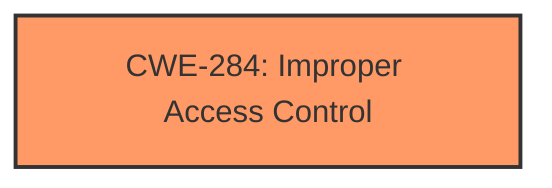

# Analysis Report for CVE-2020-7573

# Vulnerability Analysis Report: CVE-2020-7573

## Description


## Analysis (with Relationship Data)

# Summary
| CWE ID | CWE Name | Confidence | CWE Abstraction Level | CWE Vulnerability Mapping Label | CWE-Vulnerability Mapping Notes |
|---|---|---|---|---|---|
| CWE-284 | Improper Access Control | 0.75 | Pillar | Discouraged | The description indicates an access control issue, but lacks the specificity to identify the root cause at a lower level of abstraction. |

## Evidence and Confidence

*   **Confidence Score:** 0.75
*   **Evidence Strength:** MEDIUM

## Relationship Analysis
The primary relationship considered was the hierarchical structure with CWE-284 as the Pillar. The analysis considered potential child CWEs like CWE-862, CWE-863, CWE-732, CWE-306, CWE-1390, and CWE-923 but the description did not provide enough detail to select a more specific Base or Variant CWE.



## Vulnerability Chain
The chain of events begins with **Improper Access Control** (CWE-284), leading to the impact of allowing a remote attacker to access restricted web resources.

## Summary of Analysis
The initial analysis focused on the provided vulnerability description, which explicitly mentions "**Improper Access Control**". The retriever results also listed CWE-284 as the top candidate. However, the description lacks specific details regarding the root cause of the access control issue.

The decision to assign CWE-284 is based on the direct statement in the vulnerability description: "A CWE-284 **Improper Access Control** vulnerability exists... that could cause a remote attacker being able to access a restricted web resources due to **improper access control**."

CWE-284 is selected because it directly corresponds to the stated vulnerability. However, it's important to acknowledge that CWE-284 is a high-level Pillar, and the MITRE mapping guidance discourages its use when more specific CWEs are available.

Other CWEs considered but not selected:

*   CWE-668 (Exposure of Resource to Wrong Sphere): Considered, but the description does not explicitly mention resource exposure.
*   CWE-285 (Improper Authorization): Considered, but the root cause is too generic.
*   CWE-280 (Improper Handling of Insufficient Permissions or Privileges): Considered, but the description doesn't provide specific details about insufficient privileges.
*   CWE-639 (Authorization Bypass Through User-Controlled Key): This is too specific, and there is no evidence in the description that a user-controlled key is involved.
*   CWE-306 (Missing Authentication for Critical Function): This is too specific, as the vulnerability focuses on access control, not necessarily a complete lack of authentication.

The final selection of CWE-284 reflects the information available in the vulnerability description. While a more specific CWE would be preferable, the current evidence is insufficient to justify such a mapping. This is why the confidence is at 0.75. If more details were available about the root cause, a more precise CWE could be assigned.

Relevant CWE Information:
* CWE-284


## CWE Relationship Analysis

Current CWEs represent these abstraction levels: .


### Vulnerability Chain Analysis

**Chain starting from CWE-732:**
- 732 (Incorrect Permission Assignment for Critical Resource) - ROOT


**Chain starting from CWE-306:**
- 306 (Missing Authentication for Critical Function) - ROOT


### CWE Relationship Diagram

```mermaid
graph TD
    classDef primary fill:#f96,stroke:#333,stroke-width:2px
    classDef secondary fill:#69f,stroke:#333
    classDef tertiary fill:#9e9,stroke:#333
```


*Report generated on 2025-04-02 13:12:31*
