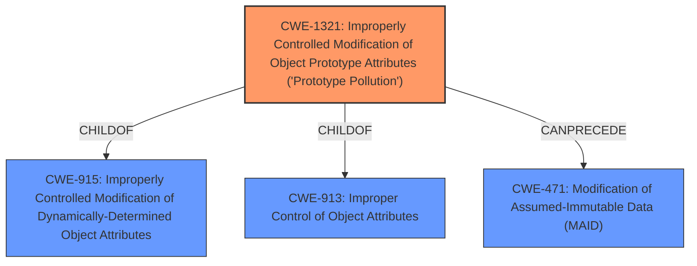

# Analysis for CVE-2020-7643

# Summary
| CWE ID  | CWE Name                                                                                                       | Confidence | CWE Abstraction Level | CWE Vulnerability Mapping Label | CWE-Vulnerability Mapping Notes |
| :-------- | :------------------------------------------------------------------------------------------------------------- | :---------- | :---------------------- | :------------------------------ | :-------------------------------- |
| CWE-1321  | Improperly Controlled Modification of Object Prototype Attributes ('Prototype Pollution')                      | 1          | Variant                | Allowed                        | Primary CWE                      |
| CWE-915   | Improperly Controlled Modification of Dynamically-Determined Object Attributes                              | 0.7        | Base                  | Allowed                        | Secondary Candidate              |

## Evidence and Confidence

*   **Confidence Score:** 1
*   **Evidence Strength:** HIGH

## Relationship Analysis
The primary CWE is CWE-1321, which is a variant of CWE-915 and CWE-913. It also can precede CWE-471. The vulnerability description specifically mentions **Prototype Pollution** and the ability to modify the `Object.prototype`, making CWE-1321 the most specific and appropriate choice.

## Vulnerability Chain
The chain starts with the **improper control of object attributes**, leading to **prototype pollution**, which can then lead to **modification of assumed immutable data**.

## Summary of Analysis
The initial assessment strongly pointed towards CWE-1321 due to the explicit mention of **Prototype Pollution** in the vulnerability description. The evidence from the CVE reference links content summary confirmed that the **root cause** was indeed the ability to modify the prototype of the `Object` class. This aligned perfectly with the description of CWE-1321.

The retriever results also supported this, with CWE-1321 being the top match. The relationship analysis showed that CWE-1321 is a variant of CWE-915, but since the vulnerability specifically targets the prototype, CWE-1321 is more appropriate.

The mapping guidance for CWE-1321 also supports its selection, as it is at the Variant level of abstraction, which is a preferred level.

Relevant CWE Information:

# Enhanced Context (25 CWEs)
The following CWEs were identified as potentially relevant to this vulnerability:

## CWE-74: Improper Neutralization of Special Elements in Output Used by a Downstream Component ('Injection')
**Abstraction Level**: Class
**Similarity Score**: 0.75
**Source**: dense

**Description**:
The product constructs all or part of a command, data structure, or record using externally-influenced input from an upstream component, but it does not neutralize or incorrectly neutralizes special elements that could modify how it is parsed or interpreted when it is sent to a downstream component.

**Mapping Guidance**:
- Usage: Discouraged
- Rationale: CWE-74 is high-level and often misused when lower-level weaknesses are more appropriate.

*   CWE-74 was considered but rejected because it is too high-level and doesn't accurately describe the specific issue of prototype pollution.

## CWE-113: Improper Neutralization of CRLF Sequences in HTTP Headers ('HTTP Request/Response Splitting')
**Abstraction Level**: Variant
**Similarity Score**: 0.74
**Source**: dense

**Description**:
The product receives data from an HTTP agent/component (e.g., web server, proxy, browser, etc.), but it does not neutralize or incorrectly neutralizes CR and LF characters before the data is included in outgoing HTTP headers.

**Mapping Guidance**:
- Usage: Allowed
- Rationale: This CWE entry is at the Variant level of abstraction, which is a preferred level of abstraction for mapping to the root causes of vulnerabilities.

*   CWE-113 was considered but rejected because it is specific to HTTP headers and CRLF sequences, which are not relevant to this vulnerability.

## CWE-799: Improper Control of Interaction Frequency
**Abstraction Level**: Class
**Similarity Score**: 0.74
**Source**: dense

**Description**:
The product does not properly limit the number or frequency of interactions that it has with an actor, such as the number of incoming requests.

**Mapping Guidance**:
- Usage: Allowed-with-Review
- Rationale: This CWE entry is a Class and might have Base-level children that would be more appropriate

*   CWE-799 was considered but rejected because it is about controlling interaction frequency, which is not related to prototype pollution.

## CWE-472: External Control of Assumed-Immutable Web Parameter
**Abstraction Level**: Base
**Similarity Score**: 0.73
**Source**: dense

**Description**:
The web application does not sufficiently verify inputs that are assumed to be immutable but are actually externally controllable, such as hidden form fields.

**Mapping Guidance**:
- Usage: Allowed
- Rationale: This CWE entry is at the Base level of abstraction, which is a preferred level of abstraction for mapping to the root causes of vulnerabilities.

*   CWE-472 was considered but rejected because it focuses on web parameters and assumed immutability, which doesn't directly address the prototype pollution issue.

## CWE-1289: Improper Validation of Unsafe Equivalence in Input
**Abstraction Level**: Base
**Similarity Score**: 0.73
**Source**: dense

**Description**:
The product receives an input value that is used as a resource identifier or other type of reference, but it does not validate or incorrectly validates that the input is equivalent to a potentially-unsafe value.

**Mapping Guidance**:
- Usage: Allowed
- Rationale: This CWE entry is at the Base level of abstraction, which is a preferred level of abstraction for mapping to the root causes of vulnerabilities.

*   CWE-1289 was considered but rejected because it is about validating input equivalence to unsafe values, which is not the core issue of prototype pollution.

## CWE-41: Improper Resolution of Path Equivalence
**Abstraction Level**: Base
**Similarity Score**: 0.73
**Source**: dense

**Description**:
The product is vulnerable to file system contents disclosure through path equivalence. Path equivalence involves the use of special characters in file and directory names. The associated manipulations are intended to generate multiple names for the same object.

**Mapping Guidance**:
- Usage: Allowed
- Rationale: This CWE entry is at the Base level of abstraction, which is a preferred level of abstraction for mapping to the root causes of vulnerabilities.

*   CWE-41 was considered but rejected because it relates to file system path equivalence, which is not relevant to this vulnerability.

## CWE-405: Asymmetric Resource Consumption (Amplification)
**Abstraction Level**: Class
**Similarity Score**: 0.73
**Source**: dense

**Description**:
The product does not properly control situations in which an adversary can cause the product to consume or produce excessive resources without requiring the adversary to invest equivalent work or otherwise prove authorization, i.e., the adversary's influence is "asymmetric."

**Mapping Guidance**:
- Usage: Allowed-with-Review
- Rationale: This CWE entry is a Class and might have Base-level children that would be more appropriate

*   CWE-405 was considered but rejected because it is about asymmetric resource consumption, which is not directly related to prototype pollution, even though DoS is a potential impact.

## CWE-80: Improper Neutralization of Script-Related HTML Tags in a Web Page (Basic XSS)
**Abstraction Level**: Variant
**Similarity Score**: 0.73
**Source**: dense

**Description**:
The product receives input from an upstream component, but it does not neutralize or incorrectly neutralizes special characters such as "<", ">", and "&" that could be interpreted as web-scripting elements when they are sent to a downstream component that processes web pages.

**Mapping Guidance**:
- Usage: Allowed
- Rationale: This CWE entry is at the Variant level of abstraction, which is a preferred level of abstraction for mapping to the root causes of vulnerabilities.

*   CWE-80 was considered but rejected because it is about improper neutralization of HTML tags, leading to XSS, which is not related to prototype pollution.

## CWE-807: Reliance on Untrusted Inputs in a Security Decision
**Abstraction Level**: Base
**Similarity Score**: