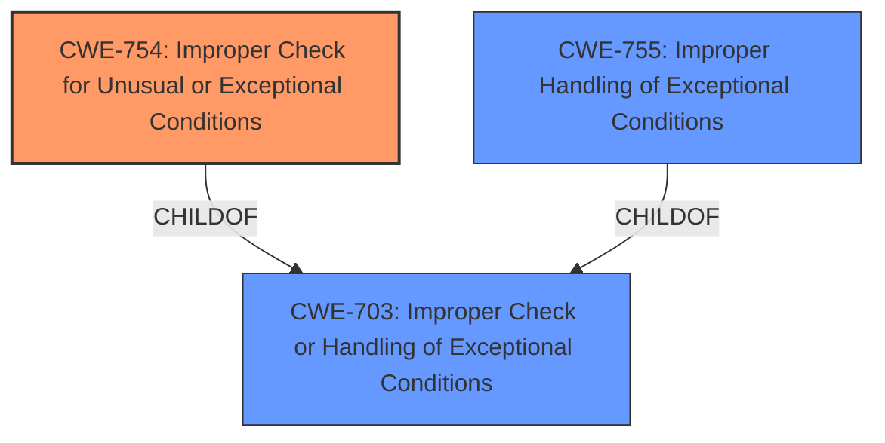

# Raw Analyzer Response for CVE-2020-7693

# Summary
| CWE ID | CWE Name | Confidence | CWE Abstraction Level | CWE Vulnerability Mapping Label | CWE-Vulnerability Mapping Notes |
|---|---|---|---|---|---|
| CWE-754 | Improper Check for Unusual or Exceptional Conditions | 0.8 | Class | Primary | Allowed-with-Review |
| CWE-703 | Improper Check or Handling of Exceptional Conditions | 0.6 | Pillar | Secondary | Discouraged |
| CWE-755 | Improper Handling of Exceptional Conditions | 0.6 | Class | Secondary | Discouraged |

## Evidence and Confidence

*   **Confidence Score:** 0.8
*   **Evidence Strength:** HIGH

## Relationship Analysis
The primary CWE selected is CWE-754 (Improper Check for Unusual or Exceptional Conditions), which is a class-level CWE and a child of CWE-703 (Improper Check or Handling of Exceptional Conditions). While CWE-754 is a better fit than its parent CWE-703, it is still a class-level CWE, so its child CWEs should be reviewed. CWE-755 (Improper Handling of Exceptional Conditions) is also a child of CWE-703.

## Vulnerability Chain
The vulnerability chain starts with the **incorrect handling of the Upgrade header**, leading to multiple calls to `res.end()`, which results in an `ERR_STREAM_WRITE_AFTER_END` error and ultimately a crash of the application or container, causing a denial of service.

## Summary of Analysis
The vulnerability description indicates an **incorrect handling** of a specific HTTP header ("Upgrade" with value "websocket"). The CVE reference details that the server attempts to call `res.end()` multiple times when handling upgrade requests on an invalid URL, leading to a crash.

The initial assessment considered the retriever results, with CWE-755 (Improper Handling of Exceptional Conditions), CWE-789 (Memory Allocation with Excessive Size Value), and CWE-754 (Improper Check for Unusual or Exceptional Conditions) being the top candidates. However, CWE-789 is not relevant as there is no mention of memory allocation issues. CWE-755 and CWE-754 both seem plausible, since they focus on the handling of exceptional conditions. The vulnerability centers on how the application responds to unexpected or unusual requests, specifically websocket upgrade requests on invalid URLs. 

CWE-754 (Improper Check for Unusual or Exceptional Conditions) is selected as the primary CWE because the application **does not properly check** the validity of the URL before attempting to handle the websocket upgrade request. The **incorrect handling** leads to the exceptional condition (multiple calls to `res.end()`) and subsequent crash. The CVE summary explicitly mentions the **improper handling** of WebSocket upgrade requests. CWE-703 and CWE-755 are also considered, but CWE-754 is more descriptive of the root cause, even though all three are related.

The selected CWE is at the optimal level of specificity, given the available evidence. While a more specific CWE might exist, the current description and CVE details primarily highlight the lack of proper checking for unusual conditions (invalid URLs for websocket upgrades) rather than a more granular weakness.

Relevant CWE Information:

# Enhanced Context (25 CWEs)
The following CWEs were identified as potentially relevant to this vulnerability:

## CWE-703: Improper Check or Handling of Exceptional Conditions
**Abstraction Level**: Pillar
**Similarity Score**: 0.79
**Source**: dense

**Description**:
The product does not properly anticipate or handle exceptional conditions that rarely occur during normal operation of the product.

**Mapping Guidance**:
- Usage: Discouraged
- Rationale: This CWE entry is extremely high-level, a Pillar.

## CWE-754: Improper Check for Unusual or Exceptional Conditions
**Abstraction Level**: Class
**Similarity Score**: 0.78
**Source**: dense

**Description**:
The product does not check or incorrectly checks for unusual or exceptional conditions that are not expected to occur frequently during day to day operation of the product.

**Mapping Guidance**:
- Usage: Allowed-with-Review
- Rationale: This CWE entry is a Class and might have Base-level children that would be more appropriate

## CWE-755: Improper Handling of Exceptional Conditions
**Abstraction Level**: Class
**Similarity Score**: 0.77
**Source**: dense

**Description**:
The product does not handle or incorrectly handles an exceptional condition.

**Mapping Guidance**:
- Usage: Discouraged
- Rationale: This CWE entry is a level-1 Class (i.e., a child of a Pillar). It might have lower-level children that would be more appropriate

## CWE-476: NULL Pointer Dereference
**Abstraction Level**: base
**Similarity Score**: 4.33
**Source**: graph

**Description**:
CWE-476: NULL Pointer Dereference

**Mapping Guidance**:
- Usage: Allowed
- Rationale: This CWE entry is at the Base level of abstraction, which is a preferred level of abstraction for mapping to the root causes of vulnerabilities.

## CWE-789: Memory Allocation with Excessive Size Value
**Abstraction Level**: Variant
**Similarity Score**: 0.76
**Source**: dense

**Description**:
The product allocates memory based on an untrusted, large size value, but it does not ensure that the size is within expected limits, allowing arbitrary amounts of memory to be allocated.

**Mapping Guidance**:
- Usage: Allowed
- Rationale: This CWE entry is at the Variant level of abstraction, which is a preferred level of abstraction for mapping to the root causes of vulnerabilities.