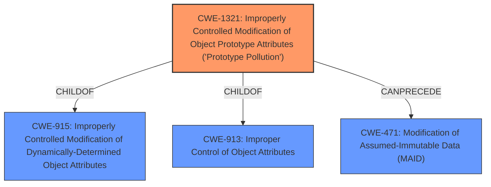

# Raw Analyzer Response for CVE-2020-7771

# Summary
| CWE ID  | CWE Name                                                                                   | Confidence | CWE Abstraction Level | CWE Vulnerability Mapping Label | CWE-Vulnerability Mapping Notes |
| ------- | ------------------------------------------------------------------------------------------ | ---------- | ----------------------- | ------------------------------- | ------------------------------- |
| CWE-1321 | Improperly Controlled Modification of Object Prototype Attributes ('Prototype Pollution') | 1          | Variant                 | Allowed                         | Primary CWE                     |

## Evidence and Confidence

*   **Confidence Score:** 1
*   **Evidence Strength:** HIGH

## Relationship Analysis
The primary relationship is that CWE-1321 is a variant, which is the preferred abstraction level, and it's a child of CWE-915 and CWE-913, indicating a more specific type of improper control. The CANPRECEDE relationship to CWE-471 (Modification of Assumed-Immutable Data (MAID)) suggests a potential chain where prototype pollution leads to modification of immutable data, but there isn't enough information to confirm it.

## Vulnerability Chain
The vulnerability chain is straightforward:
1.  **Root Cause:** **Prototype Pollution** (CWE-1321) due to **improperly controlled modification of object prototype attributes**.
2.  **Impact:** This can lead to Denial of Service (DoS), Remote Code Execution (RCE), or Property Injection as explained in the CVE description.

## Summary of Analysis
The initial assessment strongly points to CWE-1321 as the primary weakness, and the follow-up analysis confirms this selection. The vulnerability description explicitly states "**Prototype Pollution**" and the CVE reference summary details how the `asciitable.js` library is vulnerable to this issue via the main function due to an unsafe object recursive merge, allowing attackers to inject properties into the prototype of JavaScript objects using the `__proto__` attribute.

>   "The vulnerability is due to a prototype pollution issue in the `asciitable.js` library. This arises from how the library handles user-provided options."

>   "**Prototype Pollution:** The library is vulnerable to prototype pollution via the main function. Specifically, the library is susceptible to an unsafe object recursive merge. An attacker can inject properties into the prototype of JavaScript objects using the `__proto__` attribute."

The graph relationships further solidify this choice, placing CWE-1321 as a variant with specific parent relationships. The abstraction level is optimal because it is a Variant, and the evidence directly supports this classification.

Relevant CWE Information:

# Enhanced Context (25 CWEs)
The following CWEs were identified as potentially relevant to this vulnerability:

## CWE-74: Improper Neutralization of Special Elements in Output Used by a Downstream Component ('Injection')
**Abstraction Level**: Class
**Similarity Score**: 0.78
**Source**: dense

**Description**:
The product constructs all or part of a command, data structure, or record using externally-influenced input from an upstream component, but it does not neutralize or incorrectly neutralizes special elements that could modify how it is parsed or interpreted when it is sent to a downstream component.

**Mapping Guidance**:
- Usage: Discouraged
- Rationale: CWE-74 is high-level and often misused when lower-level weaknesses are more appropriate.

*Not Selected:* This is a general injection class and not as specific as the Prototype Pollution vulnerability.

## CWE-138: Improper Neutralization of Special Elements
**Abstraction Level**: Class
**Similarity Score**: 0.77
**Source**: dense

**Description**:
The product receives input from an upstream component, but it does not neutralize or incorrectly neutralizes special elements that could be interpreted as control elements or syntactic markers when they are sent to a downstream component.

**Mapping Guidance**:
- Usage: Discouraged
- Rationale: This CWE entry is a level-1 Class (i.e., a child of a Pillar). It might have lower-level children that would be more appropriate

*Not Selected:* This is a class-level CWE, and a more specific variant (CWE-1321) is available.

## CWE-184: Incomplete List of Disallowed Inputs
**Abstraction Level**: Base
**Similarity Score**: 0.77
**Source**: dense

**Description**:
The product implements a protection mechanism that relies on a list of inputs (or properties of inputs) that are not allowed by policy or otherwise require other action to neutralize before additional processing takes place, but the list is incomplete.

**Mapping Guidance**:
- Usage: Allowed
- Rationale: This CWE entry is at the Base level of abstraction, which is a preferred level of abstraction for mapping to the root causes of vulnerabilities.

*Not Selected:* This is not related to an incomplete list of disallowed inputs, but rather improper handling of object prototypes.

## CWE-1289: Improper Validation of Unsafe Equivalence in Input
**Abstraction Level**: Base
**Similarity Score**: 0.76
**Source**: dense

**Description**:
The product receives an input value that is used as a resource identifier or other type of reference, but it does not validate or incorrectly validates that the input is equivalent to a potentially-unsafe value.

**Mapping Guidance**:
- Usage: Allowed
- Rationale: This CWE entry is at the Base level of abstraction, which is a preferred level of abstraction for mapping to the root causes of vulnerabilities.

*Not Selected:* The vulnerability does not stem from improper validation of unsafe equivalence in input.

## CWE-80: Improper Neutralization of Script-Related HTML Tags in a Web Page (Basic XSS)
**Abstraction Level**: Variant
**Similarity Score**: 0.75
**Source**: dense

**Description**:
The product receives input from an upstream component, but it does not neutralize or incorrectly neutralizes special characters such as "<", ">", and "&" that could be interpreted as web-scripting elements when they are sent to a downstream component that processes web pages.

**Mapping Guidance**:
- Usage: Allowed
- Rationale: This CWE entry is at the Variant level of abstraction, which is a preferred level of abstraction for mapping to the root causes of vulnerabilities.

*Not Selected:* This vulnerability is not related to Cross-Site Scripting (XSS).

## CWE-41: Improper Resolution of Path Equivalence
**Abstraction Level**: Base
**Similarity Score**: 0.75
**Source**: dense

**Description**:
The product is vulnerable to file system contents disclosure through path equivalence. Path equivalence involves the use of special characters in file and directory names. The associated manipulations are intended to generate multiple names for the same object.

**Mapping Guidance**:
- Usage: Allowed
- Rationale: This CWE entry is at the Base level of abstraction, which is a preferred level of abstraction for mapping to the root causes of vulnerabilities.

*Not Selected:* The vulnerability is not related to file system path equivalence.

## CWE-150: Improper Neutralization of Escape, Meta, or Control Sequences
**Abstraction Level**: Variant
**Similarity Score**: 0.75
**Source**: dense

**Description**:
The product receives input from an upstream component, but it does not neutralize or incorrectly neutralizes special elements that could be interpreted as escape, meta, or control character sequences when they are sent to a downstream component.

**Mapping Guidance**:
- Usage: Allowed
- Rationale: This CWE entry is at the Variant level of abstraction, which is a preferred level of abstraction for mapping to the root causes of vulnerabilities.

*Not Selected:* The vulnerability is not related to improper neutralization of escape, meta, or control sequences.

## CWE-653: Improper Isolation or Compartmentalization
**Abstraction Level**: Class
**Similarity Score**: 0.75
**Source**: dense

**Description**:
The product does not properly compartmentalize or isolate functionality, processes, or resources that require different privilege levels, rights, or permissions.

**Mapping Guidance**:
- Usage: Allowed
- Rationale: This CWE entry is at the Base level of abstraction, which is a preferred level of abstraction for mapping to the root causes of vulnerabilities.

*Not Selected:* The vulnerability is not related to improper isolation or compartmentalization.

## CWE-212: Improper Removal of Sensitive Information Before Storage or Transfer
**Abstraction Level**: Base
**Similarity Score**: 0.75
**Source**: dense

**Description**:
The product stores, transfers, or shares a resource that contains sensitive