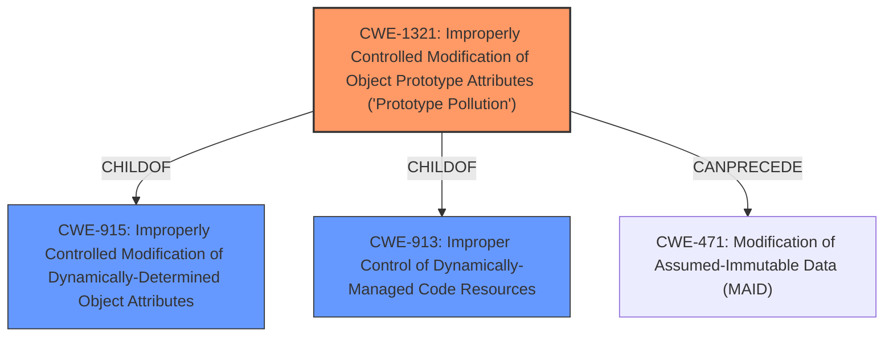

# Analysis for CVE-2020-7792

# Summary
| CWE ID  | CWE Name | Confidence | CWE Abstraction Level | CWE Vulnerability Mapping Label | CWE-Vulnerability Mapping Notes |
|------------------|---------------------------------------------------------------------------------------------------|------------|-----------------------|-----------------------------------|-----------------------------------|
| CWE-1321 | Improperly Controlled Modification of Object Prototype Attributes ('Prototype Pollution') | 1.0        | Variant              | Allowed                             | Primary CWE |
| CWE-915 | Improperly Controlled Modification of Dynamically-Determined Object Attributes | 0.7        | Base              | Allowed                             | Secondary CWE |

## Evidence and Confidence

*   **Confidence Score:** 0.9
*   **Evidence Strength:** HIGH

## Relationship Analysis
The primary CWE selected is CWE-1321, a Variant of CWE-915 (Improperly Controlled Modification of Dynamically-Determined Object Attributes) and CWE-913. This hierarchical relationship indicates that CWE-1321 is a more specific case of the broader weakness described by CWE-915. The vulnerability description explicitly mentions **Prototype Pollution**, justifying the selection of the variant CWE-1321. CWE-1321 can precede CWE-471.



## Vulnerability Chain
The vulnerability chain starts with the `deepFillIn` and `deepMixIn` functions **improperly controlling modification** of object attributes. This leads to the **Prototype Pollution** vulnerability, where an attacker can inject properties into JavaScript language construct prototypes, leading to denial of service, tampering, or privilege escalation.

## Summary of Analysis
The initial analysis strongly points towards **Prototype Pollution** due to the vulnerable functions recursively merging objects without checking keys. The evidence from the CVE Reference Links Content Summary confirms this by stating "The `deepFillIn` and `deepMixIn` functions in the mout library recursively merge objects without checking the keys used to access the target object, making them vulnerable to **prototype pollution**."

CWE-1321 perfectly matches this description, as it addresses the **improperly controlled modification of object prototype attributes**. The retriever results also ranked CWE-1321 as the top match.

CWE-915 was also considered because CWE-1321 is a child of CWE-915. The final decision prioritizes CWE-1321 as the primary mapping because it is a more specific variant that directly addresses the **Prototype Pollution** weakness.

Relevant CWE Information:

# Enhanced Context (25 CWEs)

## CWE-639: Authorization Bypass Through User-Controlled Key
**Abstraction Level**: Base
**Similarity Score**: 0.77
**Source**: dense

**Description**:
The system's authorization functionality does not prevent one user from gaining access to another user's data or record by modifying the key value identifying the data.

**Mapping Guidance**:
- Usage: Allowed
- Rationale: This CWE entry is at the Base level of abstraction, which is a preferred level of abstraction for mapping to the root causes of vulnerabilities.

## CWE-1289: Improper Validation of Unsafe Equivalence in Input
**Abstraction Level**: Base
**Similarity Score**: 0.76
**Source**: dense

**Description**:
The product receives an input value that is used as a resource identifier or other type of reference, but it does not validate or incorrectly validates that the input is equivalent to a potentially-unsafe value.

**Mapping Guidance**:
- Usage: Allowed
- Rationale: This CWE entry is at the Base level of abstraction, which is a preferred level of abstraction for mapping to the root causes of vulnerabilities.

## CWE-807: Reliance on Untrusted Inputs in a Security Decision
**Abstraction Level**: Base
**Similarity Score**: 0.76
**Source**: dense

**Description**:
The product uses a protection mechanism that relies on the existence or values of an input, but the input can be modified by an untrusted actor in a way that bypasses the protection mechanism.

**Mapping Guidance**:
- Usage: Allowed
- Rationale: This CWE entry is at the Base level of abstraction, which is a preferred level of abstraction for mapping to the root causes of vulnerabilities.

## CWE-915: Improperly Controlled Modification of Dynamically-Determined Object Attributes
**Abstraction Level**: Base
**Similarity Score**: 0.75
**Source**: dense

**Description**:
The product receives input from an upstream component that specifies multiple attributes, properties, or fields that are to be initialized or updated in an object, but it does not properly control which attributes can be modified.

**Mapping Guidance**:
- Usage: Allowed
- Rationale: This CWE entry is at the Base level of abstraction, which is a preferred level of abstraction for mapping to the root causes of vulnerabilities.

## CWE-668: Exposure of Resource to Wrong Sphere
**Abstraction Level**: Class
**Similarity Score**: 0.75
**Source**: dense

**Description**:
The product exposes a resource to the wrong control sphere, providing unintended actors with inappropriate access to the resource.

**Mapping Guidance**:
- Usage: Discouraged
- Rationale: CWE-668 is high-level and is often misused as a catch-all when lower-level CWE IDs might be applicable. It is sometimes used for low-information vulnerability reports [REF-1287]. It is a level-1 Class (i.e., a child of a Pillar). It is not useful for trend analysis.

## CWE-183: Permissive List of Allowed Inputs
**Abstraction Level**: Base
**Similarity Score**: 0.75
**Source**: dense

**Description**:
The product implements a protection mechanism that relies on a list of inputs (or properties of inputs) that are explicitly allowed by policy because the inputs are assumed to be safe, but the list is too permissive - that is, it allows an input that is unsafe, leading to resultant weaknesses.

**Mapping Guidance**:
- Usage: Allowed
- Rationale: This CWE entry is at the Base level of abstraction, which is a preferred level of abstraction for mapping to the root causes of vulnerabilities.

## CWE-405: Asymmetric Resource Consumption (Amplification)
**Abstraction Level**: Class
**Similarity Score**: 0.75
**Source**: dense

**Description**:
The product does not properly control situations in which an adversary can cause the product to consume or produce excessive resources without requiring the adversary to invest equivalent work or otherwise prove authorization, i.e., the adversary's influence is "asymmetric."

**Mapping Guidance**:
- Usage: Allowed-with-Review
- Rationale: This CWE entry is a Class and might have Base-level children that would be more appropriate

## CWE-472: External Control of Assumed-Immutable Web Parameter
**Abstraction Level**: Base
**Similarity Score**: 0.75
**Source**: dense

**Description**:
The web application does not sufficiently verify inputs that are assumed to be immutable but are actually externally controllable, such as hidden form fields.

**Mapping Guidance**:
- Usage: Allowed
- Rationale: This CWE entry is at the Base level of abstraction, which is a preferred level of abstraction for mapping to the root causes of vulnerabilities.

## CWE-799: Improper Control of Interaction Frequency
**Abstraction Level**: Class
**Similarity Score**: 0.75
**Source**: dense

**Description**:
The product does not properly limit the number or frequency of interactions that it has with an actor, such as the number of incoming requests.

**Mapping Guidance**:
- Usage: Allowed-with-Review
- Rationale: This CWE entry is a Class and might have Base-level children that would be more appropriate

## CWE-1390: Weak Authentication
**Abstraction Level**: Class
**Similarity Score**: 0.75
**Source**: dense

**Description**:
The product uses an authentication mechanism to restrict access to specific users or identities, but the mechanism does not sufficiently prove that the claimed identity is correct.

**Mapping Guidance**:
- Usage: Allowed-with-Review
- Rationale: This CWE entry is a Class and might have Base-level children that would be more appropriate

## CWE-335: Incorrect Usage of Seeds in Pseudo-Random Number Generator (PRNG)
**Abstraction Level**: Base
**Similarity Score**: 5

# Enhanced Query for CVE-2020-7792

## Vulnerability Description
This affects all versions of package mout. The deepFillIn function can be used to fill missing properties recursively, while the deepMixIn mixes objects into the target object, recursively mixing existing child objects as well. In both cases, the key used to access the target object recursively is not checked, leading to a **Prototype Pollution**.

### Vulnerability Description Key Phrases
- **weakness:** **Prototype Pollution**
- **product:** package mout
- **version:** all versions
- **component:** deepFillIn function and deepMixIn

## CVE Reference Links Content Summary
```
{
  "vulnerability": {
    "root_cause": "The `deepFillIn` and `deepMixIn` functions in the mout library recursively merge objects without checking the keys used to access the target object, making them vulnerable to prototype pollution.",
    "weaknesses": [
      "Prototype Pollution",
      "Unsafe recursive object merge"
    ],
    "impact": "An attacker can inject properties into existing JavaScript language construct prototypes, such as objects, leading to denial of service by triggering JavaScript exceptions, tampering with application source code to force code path injection, or property injection to achieve admin privileges or access sensitive data.",
     "attack_vectors": [
      "Manipulating the `__proto__`, `constructor` or `prototype` attributes of objects.",
        "Providing a crafted object with a `__proto__` property that is then processed by the vulnerable `deepFillIn` or `deepMixIn` functions."
    ],
    "attacker_capabilities": "The attacker needs to control the input to either `deepFillIn` or `deepMixIn` functions.  This can occur if the library is used to parse untrusted data or if the attacker can influence the parameters passed to these functions.",
     "additional_information": "The vulnerability can be exploited on application servers, web servers, and web browsers.  The vulnerable functions are in the `deepFillIn.js` and `deepMixIn.js` files within the mout library.  The fix involves upgrading the library to version 1.2.3 or higher, or applying mitigation techniques such as freezing the prototype using `Object.freeze(Object.prototype)`, requiring schema validation of JSON input, or avoiding the use of unsafe recursive merge functions."
  }
}
```

## Retriever Results

### Top Combined Results

| Rank | CWE ID | Name | Abstraction | Usage  | Retrievers | Individual Scores |
|------|--------|------|-------------|-------|------------|-------------------|
| 1 | 1321 | Improperly Controlled Modification of Object Prototype Attributes ('Prototype Pollution') | Variant | Allowed | sparse | 0.578 |
| 2 | 843 | Access of Resource Using Incompatible Type ('Type Confusion') | Base | Allowed | sparse | 0.264 |
| 3 | 502 | Deserialization of Untrusted Data | Base | Allowed | sparse | 0.258 |
| 4 | 835 | Loop with Unreachable Exit Condition ('Infinite Loop') | Base | Allowed | sparse | 0.254 |
| 5 | 639 | Authorization Bypass Through User-Controlled Key | Base | Allowed | sparse | 0.254 |
| 6 | 1091 | Use of Object without Invoking Destructor Method | Base | Allowed | dense | 0.397 |
| 7 | 915 | Improperly Controlled Modification of Dynamically-Determined Object Attributes | Base | Allowed | graph | 0.002 |
| 8 | 776 | Improper Restriction of Recursive Entity References in DTDs ('XML Entity Expansion') | Base | Allowed | sparse | 0.248 |
| 9 | 335 | Incorrect Usage of Seeds in Pseudo-Random Number Generator (PRNG) | Base | Allowed | sparse | 0.248 |
| 10 | 863 | Incorrect Authorization | Class | Allowed-with-Review | sparse | 0.241 |


# Complete CWE Specifications


## CWE-1321: Improperly Controlled Modification of Object Prototype Attributes ('Prototype Pollution')
**Abstraction:** Variant
**Status:** Incomplete

### Description
The product receives input from an upstream component that specifies attributes that are to be initialized or updated in an object, but it does not properly control modifications of attributes of the object prototype.

### Extended Description


By adding or modifying attributes of an object prototype, it is possible to create attributes that exist on every object, or replace critical attributes with malicious ones. This can be problematic if the product depends on existence or non-existence of certain attributes, or uses pre-defined attributes of object prototype (such as hasOwnProperty, toString or valueOf).


This weakness is usually exploited by using a special attribute of objects called proto, constructor or prototype. Such attributes give access to the object prototype. This weakness is often found in code that assigns object attributes based on user input, or merges or clones objects recursively.


### Alternative Terms
None

### Relationships
ChildOf -> CWE-915
ChildOf -> CWE-913
CanPrecede -> CWE-471

### Mapping Guidance
**Usage:** Allowed
**Rationale:** This CWE entry is at the Variant level of abstraction, which is a preferred level of abstraction for mapping to the root causes of vulnerabilities.
**Comments:** Carefully read both the name and description to ensure that this mapping is an appropriate fit. Do not try to 'force' a mapping to a lower-level Base/Variant simply to comply with this preferred level of abstraction.
**Reasons:**
- Acceptable-Use


### Observed Examples
- **CVE-2018-3721:** Prototype pollution by merging objects.
- **CVE-2019-10744:** Prototype pollution by setting default values to object attributes recursively.
- **CVE-2019-11358:** Prototype pollution by merging objects recursively.


## CWE-843: Access of Resource Using Incompatible Type ('Type Confusion')
**Abstraction:** Base
**Status:** Incomplete

### Description
The product allocates or initializes a resource such as a pointer, object, or variable using one type, but it later accesses that resource using a type that is incompatible with the original type.

### Extended Description


When the product accesses the resource using an incompatible type, this could trigger logical errors because the resource does not have expected properties. In languages without memory safety, such as C and C++, type confusion can lead to out-of-bounds memory access.


While this weakness is frequently associated with unions when parsing data with many different embedded object types in C, it can be present in any application that can interpret the same variable or memory location in multiple ways.


This weakness is not unique to C and C++. For example, errors in PHP applications can be triggered by providing array parameters when scalars are expected, or vice versa. Languages such as Perl, which perform automatic conversion of a variable of one type when it is accessed as if it were another type, can also contain these issues.


### Alternative Terms
Object Type Confusion

### Relationships
ChildOf -> CWE-704
ChildOf -> CWE-704
CanPrecede -> CWE-119

### Mapping Guidance
**Usage:** Allowed
**Rationale:** This CWE entry is at the Base level of abstraction, which is a preferred level of abstraction for mapping to the root causes of vulnerabilities.
**Comments:** Carefully read both the name and description to ensure that this mapping is an appropriate fit. Do not try to 'force' a mapping to a lower-level Base/Variant simply to comply with this preferred level of abstraction.
**Reasons:**
- Acceptable-Use


### Additional Notes
**[Applicable Platform]** 

This weakness is possible in any type-unsafe programming language.


**[Research Gap]** 

Type confusion weaknesses have received some attention by applied researchers and major software vendors for C and C++ code. Some publicly-reported vulnerabilities probably have type confusion as a root-cause weakness, but these may be described as "memory corruption" instead.


For other languages, there are very few public reports of type confusion weaknesses. These are probably under-studied. Since many programs rely directly or indirectly on loose typing, a potential "type confusion" behavior might be intentional, possibly requiring more manual analysis.


### Observed Examples
- **CVE-2010-4577:** Type confusion in CSS sequence leads to out-of-bounds read.
- **CVE-2011-0611:** Size inconsistency allows code execution, first discovered when it was actively exploited in-the-wild.
- **CVE-2010-0258:** Improperly-parsed file containing records of different types leads to code execution when a memory location is interpreted as a different object than intended.


## CWE-502: Deserialization of Untrusted Data
**Abstraction:** Base
**Status:** Draft

### Description
The product deserializes untrusted data without sufficiently ensuring that the resulting data will be valid.

### Extended Description
Not provided

### Alternative Terms
Marshaling, Unmarshaling: Marshaling and unmarshaling are effectively synonyms for serialization and deserialization, respectively.
Pickling, Unpickling: In Python, the "pickle" functionality is used to perform serialization and deserialization.
PHP Object Injection: Some PHP application researchers use this term when attacking unsafe use of the unserialize() function; but it is also used for CWE-915.

### Relationships
ChildOf -> CWE-913
ChildOf -> CWE-913
PeerOf -> CWE-915

### Mapping Guidance
**Usage:** Allowed
**Rationale:** This CWE entry is at the Base level of abstraction, which is a preferred level of abstraction for mapping to the root causes of vulnerabilities.
**Comments:** Carefully read both the name and description to ensure that this mapping is an appropriate fit. Do not try to 'force' a mapping to a lower-level Base/Variant simply to comply with this preferred level of abstraction.
**Reasons:**
- Acceptable-Use


### Additional Notes
**[Maintenance]** The relationships between CWE-502 and CWE-915 need further exploration. CWE-915 is more narrowly scoped to object modification, and is not necessarily used for deserialization.


### Observed Examples
- **CVE-2019-12799:** chain: bypass of untrusted deserialization issue (CWE-502) by using an assumed-trusted class (CWE-183)
- **CVE-2015-8103:** Deserialization issue in commonly-used Java library allows remote execution.
- **CVE-2015-4852:** Deserialization issue in commonly-used Java library allows remote execution.


## CWE-835: Loop with Unreachable Exit Condition ('Infinite Loop')
**Abstraction:** Base
**Status:** Incomplete

### Description
The product contains an iteration or loop with an exit condition that cannot be reached, i.e., an infinite loop.

### Extended Description
Not provided

### Alternative Terms
None

### Relationships
ChildOf -> CWE-834
ChildOf -> CWE-834

### Mapping Guidance
**Usage:** Allowed
**Rationale:** This CWE entry is at the Base level of abstraction, which is a preferred level of abstraction for mapping to the root causes of vulnerabilities.
**Comments:** Carefully read both the name and description to ensure that this mapping is an appropriate fit. Do not try to 'force' a mapping to a lower-level Base/Variant simply to comply with this preferred level of abstraction.
**Reasons:**
- Acceptable-Use


### Observed Examples
- **CVE-2022-22224:** Chain: an operating system does not properly process malformed Open Shortest Path First (OSPF) Type/Length/Value Identifiers (TLV) (CWE-703), which can cause the process to enter an infinite loop (CWE-835)
- **CVE-2022-25304:** A Python machine communication platform did not account for receiving a malformed packet with a null size, causing the receiving function to never update the message buffer and be caught in an infinite loop.
- **CVE-2011-1027:** Chain: off-by-one error (CWE-193) leads to infinite loop (CWE-835) using invalid hex-encoded characters.


## CWE-639: Authorization Bypass Through User-Controlled Key
**Abstraction:** Base
**Status:** Incomplete

### Description
The system's authorization functionality does not prevent one user from gaining access to another user's data or record by modifying the key value identifying the data.

### Extended Description


Retrieval of a user record occurs in the system based on some key value that is under user control. The key would typically identify a user-related record stored in the system and would be used to lookup that record for presentation to the user. It is likely that an attacker would have to be an authenticated user in the system. However, the authorization process would not properly check the data access operation to ensure that the authenticated user performing the operation has sufficient entitlements to perform the requested data access, hence bypassing any other authorization checks present in the system.


For example, attackers can look at places where user specific data is retrieved (e.g. search screens) and determine whether the key for the item being looked up is controllable externally. The key may be a hidden field in the HTML form field, might be passed as a URL parameter or as an unencrypted cookie variable, then in each of these cases it will be possible to tamper with the key value.


One manifestation of this weakness is when a system uses sequential or otherwise easily-guessable session IDs that would allow one user to easily switch to another user's session and read/modify their data.


### Alternative Terms
Insecure Direct Object Reference / IDOR: The "Insecure Direct Object Reference" term, as described in the OWASP Top Ten, is broader than this CWE because it also covers path traversal (CWE-22). Within the context of vulnerability theory, there is a similarity between the OWASP concept and CWE-706: Use of Incorrectly-Resolved Name or Reference.
Broken Object Level Authorization / BOLA: BOLA is used in the 2019 OWASP API Security Top 10 and is said to be the same as IDOR.
Horizontal Authorization: "Horizontal Authorization" is used to describe situations in which two users have the same privilege level, but must be prevented from accessing each other's resources. This is fairly common when using key-based access to resources in a multi-user context.

### Relationships
ChildOf -> CWE-863
ChildOf -> CWE-863
ChildOf -> CWE-284

### Mapping Guidance
**Usage:** Allowed
**Rationale:** This CWE entry is at the Base level of abstraction, which is a preferred level of abstraction for mapping to the root causes of vulnerabilities.
**Comments:** Carefully read both the name and description to ensure that this mapping is an appropriate fit. Do not try to 'force' a mapping to a lower-level Base/Variant simply to comply with this preferred level of abstraction.
**Reasons:**
- Acceptable-Use


### Observed Examples
- **CVE-2021-36539:** An educational application does not appropriately restrict file IDs to a particular user. The attacker can brute-force guess IDs, indicating IDOR.


## CWE-1091: Use of Object without Invoking Destructor Method
**Abstraction:** Base
**Status:** Incomplete

### Description
The product contains a method that accesses an object but does not later invoke
					the element's associated finalize/destructor method.

### Extended Description


This issue can make the product perform more slowly by retaining memory and/or other resources longer than necessary. If the relevant code is reachable by an attacker, then this performance problem might introduce a vulnerability.


### Alternative Terms
None

### Relationships
ChildOf -> CWE-772
ChildOf -> CWE-1076

### Mapping Guidance
**Usage:** Allowed
**Rationale:** This CWE entry is at the Base level of abstraction, which is a preferred level of abstraction for mapping to the root causes of vulnerabilities.
**Comments:** Carefully read both the name and description to ensure that this mapping is an appropriate fit. Do not try to 'force' a mapping to a lower-level Base/Variant simply to comply with this preferred level of abstraction.
**Reasons:**
- Acceptable-Use


## CWE-915: Improperly Controlled Modification of Dynamically-Determined Object Attributes
**Abstraction:** Base
**Status:** Incomplete

### Description
The product receives input from an upstream component that specifies multiple attributes, properties, or fields that are to be initialized or updated in an object, but it does not properly control which attributes can be modified.

### Extended Description


If the object contains attributes that were only intended for internal use, then their unexpected modification could lead to a vulnerability.


This weakness is sometimes known by the language-specific mechanisms that make it possible, such as mass assignment, autobinding, or object injection.


### Alternative Terms
Mass Assignment: "Mass assignment" is the name of a feature in Ruby on Rails that allows simultaneous modification of multiple object attributes.
AutoBinding: The "Autobinding" term is used in frameworks such as Spring MVC and ASP.NET MVC.
PHP Object Injection: Some PHP application researchers use this term for attacking unsafe use of the unserialize() function, but it is also used for CWE-502.

### Relationships
ChildOf -> CWE-913
PeerOf -> CWE-502

### Mapping Guidance
**Usage:** Allowed
**Rationale:** This CWE entry is at the Base level of abstraction, which is a preferred level of abstraction for mapping to the root causes of vulnerabilities.
**Comments:** Carefully read both the name and description to ensure that this mapping is an appropriate fit. Do not try to 'force' a mapping to a lower-level Base/Variant simply to comply with this preferred level of abstraction.
**Reasons:**
- Acceptable-Use


### Additional Notes
**[Maintenance]** The relationships between CWE-502 and CWE-915 need further exploration. CWE-915 is more narrowly scoped to object modification, and is not necessarily used for deserialization.


### Observed Examples
- **CVE-2024-3283:** Application for using LLMs allows modification of a sensitive variable using mass assignment.
- **CVE-2012-2054:** Mass assignment allows modification of arbitrary attributes using modified URL.
- **CVE-2012-2055:** Source version control product allows modification of trusted key using mass assignment.


## CWE-776: Improper Restriction of Recursive Entity References in DTDs ('XML Entity Expansion')
**Abstraction:** Base
**Status:** Draft

### Description
The product uses XML documents and allows their structure to be defined with a Document Type Definition (DTD), but it does not properly control the number of recursive definitions of entities.

### Extended Description
If the DTD contains a large number of nested or recursive entities, this can lead to explosive growth of data when parsed, causing a denial of service.

### Alternative Terms
XEE: XEE is the acronym commonly used for XML Entity Expansion.
Billion Laughs Attack
XML Bomb: While the "XML Bomb" term was used in the early years of knowledge of this issue, the XEE term seems to be more commonly used.

### Relationships
ChildOf -> CWE-674
ChildOf -> CWE-674
ChildOf -> CWE-405

### Mapping Guidance
**Usage:** Allowed
**Rationale:** This CWE entry is at the Base level of abstraction, which is a preferred level of abstraction for mapping to the root causes of vulnerabilities.
**Comments:** Carefully read both the name and description to ensure that this mapping is an appropriate fit. Do not try to 'force' a mapping to a lower-level Base/Variant simply to comply with this preferred level of abstraction.
**Reasons:**
- Acceptable-Use


### Observed Examples
- **CVE-2008-3281:** XEE in XML-parsing library.
- **CVE-2011-3288:** XML bomb / XEE in enterprise communication product.
- **CVE-2011-1755:** "Billion laughs" attack in XMPP server daemon.


## CWE-335: Incorrect Usage of Seeds in Pseudo-Random Number Generator (PRNG)
**Abstraction:** Base
**Status:** Draft

### Description
The product uses a Pseudo-Random Number Generator (PRNG) but does not correctly manage seeds.

### Extended Description


 PRNGs are deterministic and, while their output appears random, they cannot actually create entropy. They rely on cryptographically secure and unique seeds for entropy so proper seeding is critical to the secure operation of the PRNG.


 Management of seeds could be broken down into two main areas: 


  -  (1) protecting seeds as cryptographic material (such as a cryptographic key); 

  -  (2) whenever possible, using a uniquely generated seed from a cryptographically secure source 

 PRNGs require a seed as input to generate a stream of numbers that are functionally indistinguishable from random numbers. While the output is, in many cases, sufficient for cryptographic uses, the output of any PRNG is directly determined by the seed provided as input. If the seed can be ascertained by a third party, the entire output of the PRNG can be made known to them. As such, the seed should be kept secret and should ideally not be able to be guessed. For example, the current time may be a poor seed. Knowing the approximate time the PRNG was seeded greatly reduces the possible key space. 

 Seeds do not necessarily need to be unique, but reusing seeds may open up attacks if the seed is discovered. 


### Alternative Terms
None

### Relationships
ChildOf -> CWE-330
ChildOf -> CWE-330

### Mapping Guidance
**Usage:** Allowed
**Rationale:** This CWE entry is at the Base level of abstraction, which is a preferred level of abstraction for mapping to the root causes of vulnerabilities.
**Comments:** Carefully read both the name and description to ensure that this mapping is an appropriate fit. Do not try to 'force' a mapping to a lower-level Base/Variant simply to comply with this preferred level of abstraction.
**Reasons:**
- Acceptable-Use


### Additional Notes
**[Maintenance]** As of CWE 4.5, terminology related to randomness, entropy, and predictability can vary widely. Within the developer and other communities, "randomness" is used heavily. However, within cryptography, "entropy" is distinct, typically implied as a measurement. There are no commonly-used definitions, even within standards documents and cryptography papers. Future versions of CWE will attempt to define these terms and, if necessary, distinguish between them in ways that are appropriate for different communities but do not reduce the usability of CWE for mapping, understanding, or other scenarios.


### Observed Examples
- **CVE-2020-7010:** Cloud application on Kubernetes generates passwords using a weak random number generator based on deployment time.
- **CVE-2019-11495:** server uses erlang:now() to seed the PRNG, which results in a small search space for potential random seeds
- **CVE-2018-12520:** Product's PRNG is not seeded for the generation of session IDs


## CWE-863: Incorrect Authorization
**Abstraction:** Class
**Status:** Incomplete

### Description
The product performs an authorization check when an actor attempts to access a resource or perform an action, but it does not correctly perform the check.

### Extended Description
Not provided

### Alternative Terms
AuthZ: "AuthZ" is typically used as an abbreviation of "authorization" within the web application security community. It is distinct from "AuthN" (or, sometimes, "AuthC") which is an abbreviation of "authentication." The use of "Auth" as an abbreviation is discouraged, since it could be used for either authentication or authorization.

### Relationships
ChildOf -> CWE-285
ChildOf -> CWE-284

### Mapping Guidance
**Usage:** Allowed-with-Review
**Rationale:** This CWE entry is a Class and might have Base-level children that would be more appropriate
**Comments:** Examine children of this entry to see if there is a better fit
**Reasons:**
- Abstraction


### Additional Notes
**[Terminology]** 

Assuming a user with a given identity, authorization is the process of determining whether that user can access a given resource, based on the user's privileges and any permissions or other access-control specifications that apply to the resource.


### Observed Examples
- **CVE-2021-39155:** Chain: A microservice integration and management platform compares the hostname in the HTTP Host header in a case-sensitive way (CWE-178, CWE-1289), allowing bypass of the authorization policy (CWE-863) using a hostname with mixed case or other variations.
- **CVE-2019-15900:** Chain: sscanf() call is used to check if a username and group exists, but the return value of sscanf() call is not checked (CWE-252), causing an uninitialized variable to be checked (CWE-457), returning success to allow authorization bypass for executing a privileged (CWE-863).
- **CVE-2009-2213:** Gateway uses default "Allow" configuration for its authorization settings.

