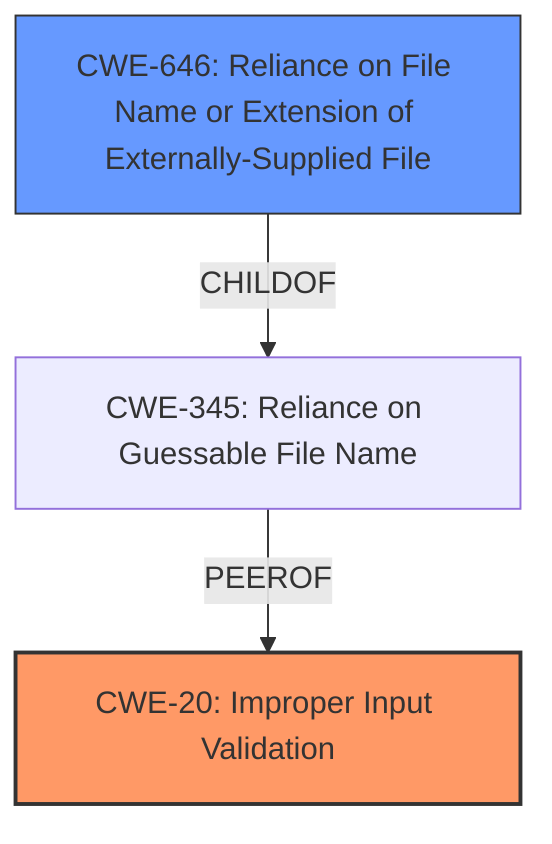

# Enhanced Analysis for CVE-2020-7867

# Summary
| CWE ID | CWE Name | Confidence | CWE Abstraction Level | CWE Vulnerability Mapping Label | CWE-Vulnerability Mapping Notes |
|---|---|---|---|---|---|
| CWE-20 | Improper Input Validation | 0.8 | Class | Primary | Discouraged |
| CWE-646 | Reliance on File Name or Extension of Externally-Supplied File | 0.6 | Variant | Secondary | Allowed |

## Evidence and Confidence

*   **Confidence Score:** 0.7
*   **Evidence Strength:** MEDIUM

## Relationship Analysis
The primary CWE selected is CWE-20, which is a Class-level CWE. While it's generally discouraged to map to Class-level CWEs, the provided vulnerability description explicitly mentions **improper input validation** as the root cause. CWE-646 is a child of CWE-345 and represents a more specific case of **improper input validation** related to file handling.



## Vulnerability Chain
The vulnerability chain starts with **improper input validation** (CWE-20), leading to arbitrary file creation and execution. The Helpu solution receives files from an agent with administrator privileges and **fails to properly validate** the file, allowing a local attacker to create and execute arbitrary files.

## Summary of Analysis
The initial assessment identified CWE-20 as the primary weakness due to the explicit mention of "**improper input validation**" in the vulnerability description. The retriever results also list CWE-20 as the top candidate. However, CWE-20 is a Class-level CWE and is generally discouraged. A more specific CWE was needed.

CWE-646 was considered as a secondary weakness because the vulnerability involves the Helpu solution relying on the file received by the agent. This reliance allows the user to create files and have them executed.

The final decision is to assign CWE-20 as the primary weakness with a confidence score of 0.8 and CWE-646 as a secondary weakness with a confidence score of 0.6. This decision is based on the evidence from the vulnerability description, the retriever results, and the CWE specifications.

Relevant CWE Information:

# Enhanced Context (25 CWEs)

## CWE-20: Improper Input Validation
**Abstraction:** Class
**Status:** Stable

### Description
The product receives input or data, but it does
        not validate or incorrectly validates that the input has the
        properties that are required to process the data safely and
        correctly.

### Extended Description
Input validation is a frequently-used technique for checking potentially dangerous inputs in order to ensure that the inputs are safe for processing within the code, or when communicating with other components. When software does not validate input properly, an attacker is able to craft the input in a form that is not expected by the rest of the application. This will lead to parts of the system receiving unintended input, which may result in altered control flow, arbitrary control of a resource, or arbitrary code execution.

### Mapping Guidance
**Usage:** Discouraged
**Rationale:** CWE-20 is commonly misused in low-information vulnerability reports when lower-level CWEs could be used instead, or when more details about the vulnerability are available [REF-1287]. It is not useful for trend analysis. It is also a level-1 Class (i.e., a child of a Pillar).

## CWE-646: Reliance on File Name or Extension of Externally-Supplied File
**Abstraction:** Variant
**Status:** Incomplete

### Description
The product allows a file to be uploaded, but it relies on the file name or extension of the file to determine the appropriate behaviors. This could be used by attackers to cause the file to be misclassified and processed in a dangerous fashion.

### Extended Description
An application might use the file name or extension of a user-supplied file to determine the proper course of action, such as selecting the correct process to which control should be passed, deciding what data should be made available, or what resources should be allocated. If the attacker can cause the code to misclassify the supplied file, then the wrong action could occur. For example, an attacker could supply a file that ends in a ".php.gif" extension that appears to be a GIF image, but would be processed as PHP code. In extreme cases, code execution is possible, but the attacker could also cause exhaustion of resources, denial of service, exposure of debug or system data (including application source code), or being bound to a particular server side process. This weakness may be due to a vulnerability in any of the technologies used by the web and application servers, due to misconfiguration, or resultant from another flaw in the application itself.


## CWE Relationship Analysis

Current CWEs represent these abstraction levels: .


### Vulnerability Chain Analysis

**Chain starting from CWE-646:**
- 646 (Reliance on File Name or Extension of Externally-Supplied File) - ROOT


**Chain starting from CWE-20:**
- 20 (Improper Input Validation) - ROOT


### CWE Relationship Diagram

```mermaid
graph TD
    classDef primary fill:#f96,stroke:#333,stroke-width:2px
    classDef secondary fill:#69f,stroke:#333
    classDef tertiary fill:#9e9,stroke:#333
```