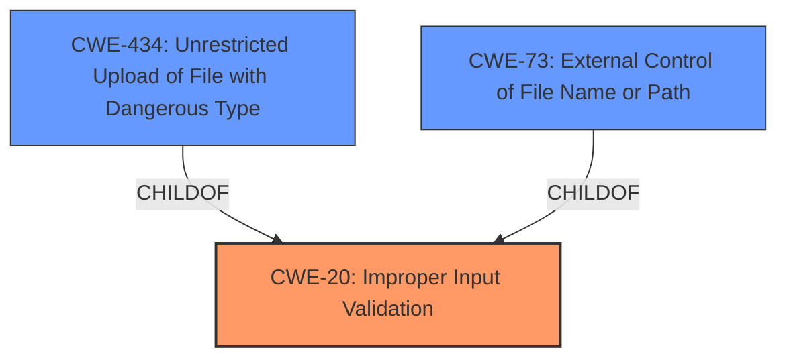

# Raw Analyzer Response for CVE-2020-7869

# Summary
| CWE ID | CWE Name | Confidence | CWE Abstraction Level | CWE Vulnerability Mapping Label | CWE-Vulnerability Mapping Notes |
|---|---|---|---|---|---|
| CWE-20 | Improper Input Validation | 0.8 | Class | Primary | Discouraged |
| CWE-434 | Unrestricted Upload of File with Dangerous Type | 0.6 | Base | Secondary | Allowed |
| CWE-73 | External Control of File Name or Path | 0.5 | Base | Secondary | Allowed |

## Evidence and Confidence

*   **Confidence Score:** 0.7
*   **Evidence Strength:** MEDIUM

## Relationship Analysis
The primary relationship influencing the decision is the parent-child relationship where CWE-20 (Improper Input Validation) is a high-level class that can lead to more specific file-related vulnerabilities. CWE-434 (Unrestricted Upload of File with Dangerous Type) and CWE-73 (External Control of File Name or Path) are base-level CWEs that more specifically describe the file creation issue but are deemed secondary because the initial **improper input validation** is the root cause.

## Vulnerability Chain
The vulnerability chain starts with **improper input validation** (CWE-20), which leads to the ability to create arbitrary files. This could involve external control of the file name or path (CWE-73), and the unrestricted upload of dangerous file types (CWE-434) that can be executed.

## Summary of Analysis
The initial analysis focused on the **improper input validation** as the root cause of the vulnerability, as indicated by the "Vulnerability Description Key Phrases". The provided text says there is an **improper input validation** which allows a remote attacker to create arbitrary files. The ZOOK viewer has the Tight file CMD function to create file. An attacker could create and execute arbitrary file in the ZOOK agent program using Tight file CMD without authority.

The Retriever Results also listed CWE-20 as the top candidate. While CWE-20 is a class-level CWE and is discouraged for use, it is being selected as the primary CWE because it is the main rootcause of the problem.

CWE-434 and CWE-73 are added as secondary candidates to better represent the arbitrary file creation.

The selected CWEs are at an appropriate level of specificity, given the available information. The evidence suggests that the **improper input validation** (CWE-20) is the primary weakness, which enables the creation of arbitrary files, potentially leading to code execution. This is supported by the vulnerability description, which states that an attacker could "create and execute arbitrary file".

Relevant CWE Information:

# Enhanced Context (25 CWEs)

## CWE-184: Incomplete List of Disallowed Inputs
**Abstraction Level**: Base
**Similarity Score**: 0.76
**Source**: dense

**Description**:
The product implements a protection mechanism that relies on a list of inputs (or properties of inputs) that are not allowed by policy or otherwise require other action to neutralize before additional processing takes place, but the list is incomplete.

**Mapping Guidance**:
- Usage: Allowed
- Rationale: This CWE entry is at the Base level of abstraction, which is a preferred level of abstraction for mapping to the root causes of vulnerabilities.

*Reason for not selecting:* Although applicable in some cases, it doesn't directly address the core issue of **improper input validation** leading to arbitrary file creation.

## CWE-74: Improper Neutralization of Special Elements in Output Used by a Downstream Component ('Injection')
**Abstraction Level**: Class
**Similarity Score**: 0.76
**Source**: dense

**Description**:
The product constructs all or part of a command, data structure, or record using externally-influenced input from an upstream component, but it does not neutralize or incorrectly neutralizes special elements that could modify how it is parsed or interpreted when it is sent to a downstream component.

**Mapping Guidance**:
- Usage: Discouraged
- Rationale: CWE-74 is high-level and often misused when lower-level weaknesses are more appropriate.

*Reason for not selecting:* Too general and doesn't accurately reflect the specific weakness.

## CWE-1289: Improper Validation of Unsafe Equivalence in Input
**Abstraction Level**: Base
**Similarity Score**: 0.76
**Source**: dense

**Description**:
The product receives an input value that is used as a resource identifier or other type of reference, but it does not validate or incorrectly validates that the input is equivalent to a potentially-unsafe value.

**Mapping Guidance**:
- Usage: Allowed
- Rationale: This CWE entry is at the Base level of abstraction, which is a preferred level of abstraction for mapping to the root causes of vulnerabilities.

*Reason for not selecting:* Doesn't fully capture the **improper input validation** leading to arbitrary file creation.

## CWE-73: External Control of File Name or Path
**Abstraction Level**: Base
**Similarity Score**: 0.76
**Source**: dense

**Description**:
The product allows user input to control or influence paths or file names that are used in filesystem operations.

**Mapping Guidance**:
- Usage: Allowed
- Rationale: This CWE entry is at the Base level of abstraction, which is a preferred level of abstraction for mapping to the root causes of vulnerabilities.

*Reason for selecting:* This is a secondary CWE because the vulnerability leads to attacker-controlled file creation.

## CWE-807: Reliance on Untrusted Inputs in a Security Decision
**Abstraction Level**: Base
**Similarity Score**: 0.74
**Source**: dense

**Description**:
The product uses a protection mechanism that relies on the existence or values of an input, but the input can be modified by an untrusted actor in a way that bypasses the protection mechanism.

**Mapping Guidance**:
- Usage: Allowed
- Rationale: This CWE entry is at the Base level of abstraction, which is a preferred level of abstraction for mapping to the root causes of vulnerabilities.

*Reason for not selecting:* While relevant, it doesn't directly address the file creation aspect of the vulnerability.

## CWE-41: Improper Resolution of Path Equivalence
**Abstraction Level**: Base
**Similarity Score**: 0.74
**Source**: dense

**Description**:
The product is vulnerable to file system contents disclosure through path equivalence. Path equivalence involves the use of special characters in file and directory names. The associated manipulations are intended to generate multiple names for the same object.

**Mapping Guidance**:
- Usage: Allowed
- Rationale: This CWE entry is at the Base level of abstraction, which is a preferred level of abstraction for mapping to the root causes of vulnerabilities.

*Reason for not selecting:* Not directly related to arbitrary file creation.

## CWE-470: Use of Externally-Controlled Input to Select Classes or Code ('Unsafe Reflection')
**Abstraction Level**: Base
**Similarity Score**: 0.74
**Source**: dense

**Description**:
The product uses external input with reflection to select which classes or code to use, but it does not sufficiently prevent the input from selecting improper classes or code.

**Mapping Guidance**:
- Usage: Allowed
- Rationale: This CWE entry is at the Base level of abstraction, which is a preferred level of abstraction for mapping to the root causes of vulnerabilities.

*Reason for not selecting:* Not applicable to the vulnerability description.

## CWE-183: Permissive List of Allowed Inputs
**Abstraction Level**: Base
**Similarity Score**: 0.74
**Source**: dense

**Description**:
The product implements a protection mechanism that relies on a list of inputs (or properties of inputs) that are explicitly allowed by policy because the inputs are assumed to be safe, but the list is too permissive - that is, it allows an input that is unsafe, leading to resultant weaknesses.

**Mapping Guidance**:
- Usage: Allowed
- Rationale: This CWE entry is at the Base level of abstraction, which is a preferred level of abstraction for mapping to the root causes of vulnerabilities.

*Reason for not selecting:* Similar to CWE-184, but less directly applicable.

## CWE-138: Improper Neutralization of Special Elements
**Abstraction Level**: Class
**Similarity Score**: 0.74
**Source**: dense

**Description**:
The product receives input from an upstream component, but it does not neutralize or incorrectly neutralizes special elements that could be interpreted as control elements or syntactic markers when they are sent to a downstream component.

**Mapping Guidance**:
- Usage: Discouraged
- Rationale: This CWE entry is a level-1 Class (