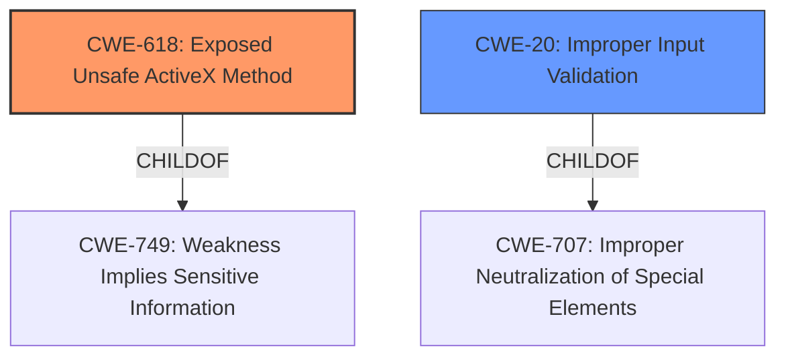

# Analysis Report for CVE-2020-7880

# Vulnerability Analysis Report: CVE-2020-7880

## Description


## Analysis (with Relationship Data)

# Summary
| CWE ID | CWE Name | Confidence | CWE Abstraction Level | CWE Vulnerability Mapping Label | CWE-Vulnerability Mapping Notes |
|---|---|---|---|---|---|
| CWE-618 | Exposed Unsafe ActiveX Method | 0.9 | Variant | Allowed | Primary CWE |
| CWE-20 | Improper Input Validation | 0.7 | Class | Discouraged | Secondary Candidate |

## Evidence and Confidence

*   **Confidence Score:** 0.8
*   **Evidence Strength:** HIGH

## Relationship Analysis
The primary CWE selected is CWE-618 (Exposed Unsafe ActiveX Method), which is a Variant-level CWE and a child of CWE-749. The secondary candidate, CWE-20 (Improper Input Validation), is a Class-level CWE and a child of CWE-707. The vulnerability stems from **improper parameter validation** within the `StartNeoRS` function of an ActiveX control. ActiveX controls, designed for web browser use, may expose methods with actions falling outside the browser's security model. The **improper validation** allows a remote attacker to download and execute arbitrary files. The relationship between CWE-618 and the root cause of **improper validation** is that the exposure of unsafe methods (CWE-618) makes the **improper validation** (CWE-20) exploitable, leading to remote code execution.



## Vulnerability Chain
The vulnerability chain starts with the exposure of an unsafe ActiveX method (CWE-618), followed by **improper parameter validation** (CWE-20) which then leads to the ability to download and execute remote files, resulting in remote code execution.

## Summary of Analysis
The initial analysis focused on the **improper parameter validation** of the `StartNeoRS` function in an ActiveX module. The **Vulnerability Description Key Phrases** section identified **improper parameter validation** as the root cause. The description explicitly mentions that this **improper validation** allows a remote attacker to download and execute remote files.

The Retriever Results listed CWE-618 (Exposed Unsafe ActiveX Method) with a high dense score, which aligns with the vulnerability description. The description of CWE-618 states: "An ActiveX control is intended for use in a web browser, but it exposes dangerous methods that perform actions that are outside of the browser's security model (e.g. the zone or domain)." Given that the vulnerability involves an ActiveX control and the ability to download and execute files, CWE-618 is a good fit. Additionally, the description states that "Exposed methods can be subject to various vulnerabilities, depending on the implemented behaviors of those methods, and whether input validation is performed on the provided arguments." which aligns with the identified root cause of **improper parameter validation**.

CWE-20 (Improper Input Validation) was also considered, as it reflects the **improper parameter validation**. However, CWE-20 is a Class-level CWE and is often misused when lower-level CWEs are more appropriate. Given the context of an ActiveX control and the exposure of unsafe methods, CWE-618 provides a more specific classification.

The selection of CWE-618 is at the optimal level of specificity because it directly addresses the exposure of unsafe methods in ActiveX controls, which is the primary context of the vulnerability. The confidence in this assessment is high (0.9) due to the clear match between the vulnerability description and the characteristics of CWE-618. The usage is Allowed.
The confidence in CWE-20 is 0.7, and the usage is Discouraged.

Relevant CWE Information:
INSERT


## CWE Relationship Analysis

Current CWEs represent these abstraction levels: .


### Vulnerability Chain Analysis

**Chain starting from CWE-749:**
- 749 (Exposed Dangerous Method or Function) - ROOT


**Chain starting from CWE-618:**
- 618 (Exposed Unsafe ActiveX Method) - ROOT


### CWE Relationship Diagram

```mermaid
graph TD
    classDef primary fill:#f96,stroke:#333,stroke-width:2px
    classDef secondary fill:#69f,stroke:#333
    classDef tertiary fill:#9e9,stroke:#333
```


*Report generated on 2025-04-01 22:18:15*
