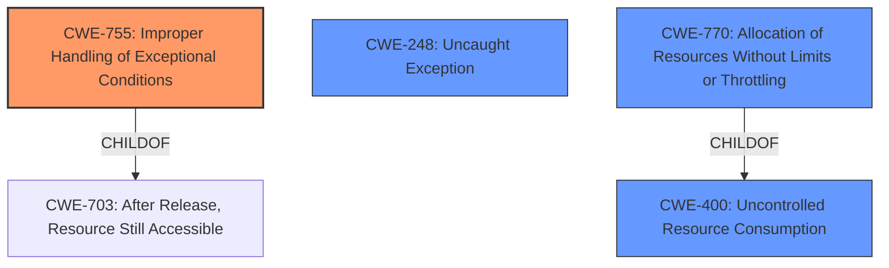

# Analysis for CVE-2020-7926

# Summary
| CWE ID | CWE Name | Confidence | CWE Abstraction Level | CWE Vulnerability Mapping Label | CWE-Vulnerability Mapping Notes |
|---|---|---|---|---|---|
| **CWE-755** | Improper Handling of Exceptional Conditions | 0.9 | Class | Primary | Allowed-with-Review |
| CWE-400 | Uncontrolled Resource Consumption | 0.7 | Class | Secondary | Discouraged |
| CWE-248 | Uncaught Exception | 0.6 | Base | Secondary | Allowed |
| CWE-770 | Allocation of Resources Without Limits or Throttling | 0.6 | Base | Secondary | Allowed |

## Evidence and Confidence

*   **Confidence Score:** 0.7
*   **Evidence Strength:** HIGH

## Relationship Analysis
The primary focus is on **CWE-755 (Improper Handling of Exceptional Conditions)**, which indicates a failure to gracefully manage an unexpected state. While **CWE-755** is a Class-level CWE, the evidence strongly suggests that the server's inability to handle the exception directly leads to the denial of service.

Other relationships exist, where **CWE-755** is a child of **CWE-703 (After Release, Resource Still Accessible)**. Also, the denial of service might be caused by **CWE-400 (Uncontrolled Resource Consumption)** or **CWE-770 (Allocation of Resources Without Limits or Throttling)**, depending on how the exception leads to resource exhaustion. **CWE-248 (Uncaught Exception)** is also potentially related because it identifies that an exception is thrown from a function, but it is not caught.

## Vulnerability Chain
The vulnerability chain starts with a **specially crafted query** from an authorized user. This query violates an invariant in the server selection subsystem, leading to an **unhandled exception**. The **improper handling of this exception (CWE-755)** results in a **denial of service**.

## Summary of Analysis
The initial analysis focused on the denial of service impact and the potential for resource exhaustion. However, the root cause lies in the **improper handling of the exception** within the server selection subsystem. The "CVE Reference Links Content Summary" section provides strong evidence for this: "The server fails to gracefully handle the exception triggered by the specially crafted query, leading to a denial of service."

The graph relationships helped to narrow down the focus to **CWE-755** as the primary weakness. While resource consumption might be a consequence, the immediate cause is the server's failure to handle the exception. **CWE-755** is at the optimal level of specificity because it directly addresses the **improper handling of exceptional conditions**.

Relevant CWE Information:

*   **CWE-755 (Improper Handling of Exceptional Conditions)**: The product does not handle or incorrectly handles an exceptional condition. This aligns directly with the vulnerability description, where the server fails to handle the exception triggered by the crafted query.
*   **CWE-400 (Uncontrolled Resource Consumption)**: The product does not properly control the allocation and maintenance of a limited resource, thereby enabling an actor to influence the amount of resources consumed, eventually leading to the exhaustion of available resources. This is a possible impact if the unhandled exception leads to excessive resource usage.
*   **CWE-248 (Uncaught Exception)**: An exception is thrown from a function, but it is not caught. This is applicable because the vulnerability description indicates that the specially crafted query leads to an unhandled exception within the MongoDB codebase.
*   **CWE-770 (Allocation of Resources Without Limits or Throttling)**: The product allocates a reusable resource or group of resources on behalf of an actor without imposing any restrictions on the size or number of resources that can be allocated, in violation of the intended security policy for that actor. This is a possible cause if the server allocates resources without limits, potentially contributing to a denial of service when the exception occurs.

CWEs considered but not used:

*   **CWE-943 (Improper Neutralization of Special Elements in Data Query Logic)**: While the vulnerability is triggered by a specially crafted query, the root cause is not related to improper neutralization of special elements in the query. The query itself is causing the exception, not an injection flaw.
*   **CWE-674 (Uncontrolled Recursion)**: There's no evidence of uncontrolled recursion in the provided description.
*   **CWE-209 (Generation of Error Message Containing Sensitive Information)**: The vulnerability is not about exposing sensitive information in error messages.
*   **CWE-306 (Missing Authentication for Critical Function)**: Authentication is not the primary issue, as the attacker is assumed to be an authorized user.
*   **CWE-121 (Stack-based Buffer Overflow)**: There is no indication of a buffer overflow in the vulnerability description.
*   **CWE-789 (Memory Allocation with Excessive Size Value)**: The root cause is not related to allocating memory with an excessive size value.