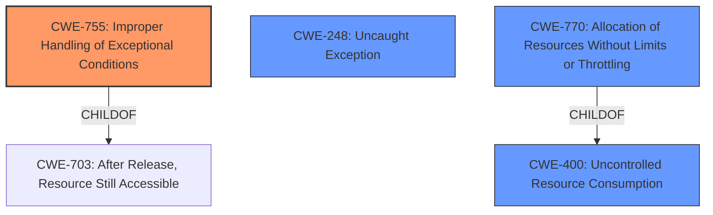

# Analysis for CVE-2020-7926

# Summary
| CWE ID | CWE Name | Confidence | CWE Abstraction Level | CWE Vulnerability Mapping Label | CWE-Vulnerability Mapping Notes |
|---|---|---|---|---|---|
| **CWE-755** | Improper Handling of Exceptional Conditions | 0.9 | Class | Primary | Allowed-with-Review |
| CWE-400 | Uncontrolled Resource Consumption | 0.7 | Class | Secondary | Discouraged |
| CWE-248 | Uncaught Exception | 0.6 | Base | Secondary | Allowed |
| CWE-770 | Allocation of Resources Without Limits or Throttling | 0.6 | Base | Secondary | Allowed |

## Evidence and Confidence

*   **Confidence Score:** 0.7
*   **Evidence Strength:** HIGH

## Relationship Analysis
The primary focus is on **CWE-755 (Improper Handling of Exceptional Conditions)**, which indicates a failure to gracefully manage an unexpected state. While **CWE-755** is a Class-level CWE, the evidence strongly suggests that the server's inability to handle the exception directly leads to the denial of service.

Other relationships exist, where **CWE-755** is a child of **CWE-703 (After Release, Resource Still Accessible)**. Also, the denial of service might be caused by **CWE-400 (Uncontrolled Resource Consumption)** or **CWE-770 (Allocation of Resources Without Limits or Throttling)**, depending on how the exception leads to resource exhaustion. **CWE-248 (Uncaught Exception)** is also potentially related because it identifies that an exception is thrown from a function, but it is not caught.

## Vulnerability Chain
The vulnerability chain starts with a **specially crafted query** from an authorized user. This query violates an invariant in the server selection subsystem, leading to an **unhandled exception**. The **improper handling of this exception (CWE-755)** results in a **denial of service**.

## Summary of Analysis
The initial analysis focused on the denial of service impact and the potential for resource exhaustion. However, the root cause lies in the **improper handling of the exception** within the server selection subsystem. The "CVE Reference Links Content Summary" section provides strong evidence for this: "The server fails to gracefully handle the exception triggered by the specially crafted query, leading to a denial of service."

The graph relationships helped to narrow down the focus to **CWE-755** as the primary weakness. While resource consumption might be a consequence, the immediate cause is the server's failure to handle the exception. **CWE-755** is at the optimal level of specificity because it directly addresses the **improper handling of exceptional conditions**.

Relevant CWE Information:

*   **CWE-755 (Improper Handling of Exceptional Conditions)**: The product does not handle or incorrectly handles an exceptional condition. This aligns directly with the vulnerability description, where the server fails to handle the exception triggered by the crafted query.
*   **CWE-400 (Uncontrolled Resource Consumption)**: The product does not properly control the allocation and maintenance of a limited resource, thereby enabling an actor to influence the amount of resources consumed, eventually leading to the exhaustion of available resources. This is a possible impact if the unhandled exception leads to excessive resource usage.
*   **CWE-248 (Uncaught Exception)**: An exception is thrown from a function, but it is not caught. This is applicable because the vulnerability description indicates that the specially crafted query leads to an unhandled exception within the MongoDB codebase.
*   **CWE-770 (Allocation of Resources Without Limits or Throttling)**: The product allocates a reusable resource or group of resources on behalf of an actor without imposing any restrictions on the size or number of resources that can be allocated, in violation of the intended security policy for that actor. This is a possible cause if the server allocates resources without limits, potentially contributing to a denial of service when the exception occurs.

CWEs considered but not used:

*   **CWE-943 (Improper Neutralization of Special Elements in Data Query Logic)**: While the vulnerability is triggered by a specially crafted query, the root cause is not related to improper neutralization of special elements in the query. The query itself is causing the exception, not an injection flaw.
*   **CWE-674 (Uncontrolled Recursion)**: There's no evidence of uncontrolled recursion in the provided description.
*   **CWE-209 (Generation of Error Message Containing Sensitive Information)**: The vulnerability is not about exposing sensitive information in error messages.
*   **CWE-306 (Missing Authentication for Critical Function)**: Authentication is not the primary issue, as the attacker is assumed to be an authorized user.
*   **CWE-121 (Stack-based Buffer Overflow)**: There is no indication of a buffer overflow in the vulnerability description.
*   **CWE-789 (Memory Allocation with Excessive Size Value)**: The root cause is not related to allocating memory with an excessive size value.

# Enhanced Query for CVE-2020-7926

## Vulnerability Description
A user authorized to perform database queries may cause denial of service by issuing a specially crafted query which violates an invariant in the server selection subsystem. This issue affects MongoDB Server v4.4 versions prior to 4.4.1. Versions before 4.4 are not affected.

### Vulnerability Description Key Phrases
- **impact:** denial of service
- **vector:** specially crafted query
- **attacker:** user authorized to perform database queries
- **product:** MongoDB Server
- **version:** v4.4 versions prior to 4.4.1
- **component:** server selection subsystem

## CVE Reference Links Content Summary
Based on the provided information, here's a breakdown of the vulnerability:

**Root Cause:**
A bug in the query planner allows specific queries to violate an invariant in the server selection subsystem, leading to an unhandled exception. The issue is located in the `index_bounds_builder.cpp` file within the MongoDB codebase.

**Weaknesses/Vulnerabilities:**
- Improper Handling of Exceptional Conditions (CWE-755): The server fails to gracefully handle the exception triggered by the specially crafted query, leading to a denial of service.

**Impact of Exploitation:**
- Denial of Service (DoS): A successful exploit can cause the MongoDB server to become unresponsive, disrupting service availability.

**Attack Vectors:**
- Network-based: The attack is triggered by sending a specially crafted query to the MongoDB server.

**Required Attacker Capabilities/Position:**
- Authenticated User: The attacker must have database query privileges to execute the malicious query.

**Affected Versions:**
- MongoDB Server version 4.4 prior to 4.4.1.
- Versions before 4.4 are not affected.

**Additional Information:**
- The vulnerability has a CVSS score of 6.5, with the vector: AV:N/AC:L/PR:L/UI:N/S:U/C:N/I:N/A:H. This indicates a network-based attack, low attack complexity, low privileges required, no user interaction, and high impact on availability.
- The issue was fixed in version 4.4.1

## Retriever Results

### Top Combined Results

| Rank | CWE ID | Name | Abstraction | Usage  | Retrievers | Individual Scores |
|------|--------|------|-------------|-------|------------|-------------------|
| 1 | 755 | Improper Handling of Exceptional Conditions | Class | Discouraged | sparse | 0.108 |
| 2 | 943 | Improper Neutralization of Special Elements in Data Query Logic | Class | Allowed-with-Review | sparse | 0.085 |
| 3 | 400 | Uncontrolled Resource Consumption | Class | Discouraged | sparse | 0.083 |
| 4 | 674 | Uncontrolled Recursion | Class | Allowed-with-Review | sparse | 0.083 |
| 5 | 248 | Uncaught Exception | Base | Allowed | sparse | 0.083 |
| 6 | 1049 | Excessive Data Query Operations in a Large Data Table | Base | Allowed | dense | 0.418 |
| 7 | 209 | Generation of Error Message Containing Sensitive Information | Base | Allowed | graph | 0.002 |
| 8 | 770 | Allocation of Resources Without Limits or Throttling | Base | Allowed | sparse | 0.081 |
| 9 | 306 | Missing Authentication for Critical Function | Base | Allowed | sparse | 0.080 |
| 10 | 121 | Stack-based Buffer Overflow | Variant | Allowed | sparse | 0.080 |

# Complete CWE Specifications

## CWE-755: Improper Handling of Exceptional Conditions
**Abstraction:** Class
**Status:** Incomplete

### Description
The product does not handle or incorrectly handles an exceptional condition.

### Extended Description
Not provided

### Alternative Terms
None

### Relationships
ChildOf -> CWE-703

### Mapping Guidance
**Usage:** Discouraged
**Rationale:** This CWE entry is a level-1 Class (i.e., a child of a Pillar). It might have lower-level children that would be more appropriate
**Comments:** Examine children of this entry to see if there is a better fit
**Reasons:**
- Abstraction

### Observed Examples
- **CVE-2023-41151:** SDK for OPC Unified Architecture (OPC UA) server has uncaught exception when a socket is blocked for writing but the server tries to send an error
- **[REF-1374]:** Chain: JavaScript-based cryptocurrency library can fall back to the insecure Math.random() function instead of reporting a failure (CWE-392), thus reducing the entropy (CWE-332) and leading to generation of non-unique cryptographic keys for Bitcoin wallets (CWE-1391)
- **CVE-2021-3011:** virtual interrupt controller in a virtualization product allows crash of host by writing a certain invalid value to a register, which triggers a fatal error instead of returning an error code

## CWE-943: Improper Neutralization of Special Elements in Data Query Logic
**Abstraction:** Class
**Status:** Incomplete

### Description
The product generates a query intended to access or manipulate data in a data store such as a database, but it does not neutralize or incorrectly neutralizes special elements that can modify the intended logic of the query.

### Extended Description

Depending on the capabilities of the query language, an attacker could inject additional logic into the query to:

  - Modify the intended selection criteria, thus changing which data entities (e.g., records) are returned, modified, or otherwise manipulated

  - Append additional commands to the query

  - Return more entities than intended

  - Return fewer entities than intended

  - Cause entities to be sorted in an unexpected way

The ability to execute additional commands or change which entities are returned has obvious risks. But when the product logic depends on the order or number of entities, this can also lead to vulnerabilities. For example, if the query expects to return only one entity that specifies an administrative user, but an attacker can change which entities are returned, this could cause the logic to return information for a regular user and incorrectly assume that the user has administrative privileges.

While this weakness is most commonly associated with SQL injection, there are many other query languages that are also subject to injection attacks, including HTSQL, LDAP, DQL, XQuery, Xpath, and "NoSQL" languages.

### Alternative Terms
None

### Relationships
ChildOf -> CWE-74

### Mapping Guidance
**Usage:** Allowed-with-Review
**Rationale:** This CWE entry is a Class and might have Base-level children that would be more appropriate
**Comments:** Examine children of this entry to see if there is a better fit
**Reasons:**
- Abstraction

### Additional Notes
**[Relationship]** It could be argued that data query languages are effectively a command language - albeit with a limited set of commands - and thus any query-language injection issue could be treated as a child of CWE-74. However, CWE-943 is intended to better organize query-oriented issues to separate them from fully-functioning programming languages, and also to provide a more precise identifier for the many query languages that do not have their own CWE identifier.

### Observed Examples
- **CVE-2014-2503:** Injection using Documentum Query Language (DQL)
- **CVE-2014-2508:** Injection using Documentum Query Language (DQL)

## CWE-400: Uncontrolled Resource Consumption
**Abstraction:** Class
**Status:** Draft

### Description
The product does not properly control the allocation and maintenance of a limited resource, thereby enabling an actor to influence the amount of resources consumed, eventually leading to the exhaustion of available resources.

### Extended Description

Limited resources include memory, file system storage, database connection pool entries, and CPU. If an attacker can trigger the allocation of these limited resources, but the number or size of the resources is not controlled, then the attacker could cause a denial of service that consumes all available resources. This would prevent valid users from accessing the product, and it could potentially have an impact on the surrounding environment. For example, a memory exhaustion attack against an application could slow down the application as well as its host operating system.

There are at least three distinct scenarios which can commonly lead to resource exhaustion:

  - Lack of throttling for the number of allocated resources

  - Losing all references to a resource before reaching the shutdown stage

  - Not closing/returning a resource after processing

Resource exhaustion problems are often result due to an incorrect implementation of the following situations:

  - Error conditions and other exceptional circumstances.

  - Confusion over which part of the program is responsible for releasing the resource.

### Alternative Terms
Resource Exhaustion

### Relationships
ChildOf -> CWE-664

### Mapping Guidance
**Usage:** Discouraged
**Rationale:** CWE-400 is intended for incorrect behaviors in which the product is expected to track and restrict how many resources it consumes, but CWE-400 is often misused because it is conflated with the "technical impact" of vulnerabilities in which resource consumption occurs. It is sometimes used for low-information vulnerability reports. It is a level-1 Class (i.e., a child of a Pillar).
**Comments:** Closely analyze the specific mistake that is causing resource consumption, and perform a CWE mapping for that mistake. Consider children/descendants such as CWE-770: Allocation of Resources Without Limits or Throttling, CWE-771: Missing Reference to Active Allocated Resource, CWE-410: Insufficient Resource Pool, CWE-772: Missing Release of Resource after Effective Lifetime, CWE-834: Excessive Iteration, CWE-405: Asymmetric Resource Consumption (Amplification), and others.
**Reasons:**
- Frequent Misuse

### Additional Notes
**[Maintenance]** "Resource consumption" could be interpreted as a consequence instead of an insecure behavior, so this entry is being considered for modification. It appears to be referenced too frequently when more precise mappings are available. Some of its children, such as CWE-771, might be better considered as a chain.

**[Theoretical]** Vulnerability theory is largely about how behaviors and resources interact. "Resource exhaustion" can be regarded as either a consequence or an attack, depending on the perspective. This entry is an attempt to reflect the underlying weaknesses that enable these attacks (or consequences) to take place.

**[Other]** 

Database queries that take a long time to process are good DoS targets. An attacker would have to write a few lines of Perl code to generate enough traffic to exceed the site's ability to keep up. This would effectively prevent authorized users from using the site at all. Resources can be exploited simply by ensuring that the target machine must do much more work and consume more resources in order to service a request than the attacker must do to initiate a request.

A prime example of this can be found in old switches that were vulnerable to "macof" attacks (so named for a tool developed by Dugsong). These attacks flooded a switch with random IP and MAC address combinations, therefore exhausting the switch's cache, which held the information of which port corresponded to which MAC addresses. Once this cache was exhausted, the switch would fail in an insecure way and would begin to act simply as a hub, broadcasting all traffic on all ports and allowing for basic sniffing attacks.

**[Maintenance]** The Taxonomy_Mappings to ISA/IEC 62443 were added in CWE 4.10, but they are still under review and might change in future CWE versions. These draft mappings were performed by members of the "Mapping CWE to 62443" subgroup of the CWE-CAPEC ICS/OT Special Interest Group (SIG), and their work is incomplete as of CWE 4.10. The mappings are included to facilitate discussion and review by the broader ICS/OT community, and they are likely to change in future CWE versions.

### Observed Examples
- **CVE-2022-21668:** Chain: Python library does not limit the resources used to process images that specify a very large number of bands (CWE-1284), leading to excessive memory consumption (CWE-789) or an integer overflow (CWE-190).
- **CVE-2020-7218:** Go-based workload orchestrator does not limit resource usage with unauthenticated connections, allowing a DoS by flooding the service
- **CVE-2020-3566:** Resource exhaustion in distributed OS because of "insufficient" IGMP queue management, as exploited in the wild per CISA KEV.

## CWE-674: Uncontrolled Recursion
**Abstraction:** Class
**Status:** Draft

### Description
The product does not properly control the amount of recursion that takes place,  consuming excessive resources, such as allocated memory or the program stack.

### Extended Description
Not provided

### Alternative Terms
Stack Exhaustion

### Relationships
ChildOf -> CWE-834

### Mapping Guidance
**Usage:** Allowed-with-Review
**Rationale:** This CWE entry is a Class and might have Base-level children that would be more appropriate
**Comments:** Examine children of this entry to see if there is a better fit
**Reasons:**
- Abstraction

### Observed Examples
- **CVE-2007-1285:** Deeply nested arrays trigger stack exhaustion.
- **CVE-2007-3409:** Self-referencing pointers create infinite loop and resultant stack exhaustion.
- **CVE-2016-10707:** Javascript application accidentally changes input in a way that prevents a recursive call from detecting an exit condition.

## CWE-248: Uncaught Exception
**Abstraction:** Base
**Status:** Draft

### Description
An exception is thrown from a function, but it is not caught.

### Extended Description
When an exception is not caught, it may cause the program to crash or expose sensitive information.

### Alternative Terms
None

### Relationships
ChildOf -> CWE-705
ChildOf -> CWE-755
ChildOf -> CWE-703
ChildOf -> CWE-703

### Mapping Guidance
**Usage:** Allowed
**Rationale:** This CWE entry is at the Base level of abstraction, which is a preferred level of abstraction for mapping to the root causes of vulnerabilities.
**Comments:** Carefully read both the name and description to ensure that this mapping is an appropriate fit. Do not try to 'force' a mapping to a lower-level Base/Variant simply to comply with this preferred level of abstraction.
**Reasons:**
- Acceptable-Use

### Observed Examples
- **CVE-2023-41151:** SDK for OPC Unified Architecture (OPC UA) server has uncaught exception when a socket is blocked for writing but the server tries to send an error
- **CVE-2023-21087:** Java code in a smartphone OS can encounter a "boot loop" due to an uncaught exception

## CWE-1049: Excessive Data Query Operations in a Large Data Table
**Abstraction:** Base
**Status:** Incomplete

### Description
The product performs a data query with a large number of joins
					and sub-queries on a large data table.

### Extended Description

This issue can make the product perform more slowly. If the relevant code is reachable by an attacker, then this performance problem might introduce a vulnerability.

While the interpretation of "large data table" and "large number of joins or sub-queries" may vary for each product or developer, CISQ recommends a default of 1 million rows for a "large" data table, a default minimum of 5 joins, and a default minimum of 3 sub-queries.

### Alternative Terms
None

### Relationships
ChildOf -> CWE-1176

### Mapping Guidance
**Usage:** Allowed
**Rationale:** This CWE entry is at the Base level of abstraction, which is a preferred level of abstraction for mapping to the root causes of vulnerabilities.
**Comments:** Carefully read both the name and description to ensure that this mapping is an appropriate fit. Do not try to 'force' a mapping to a lower-level Base/Variant simply to comply with this preferred level of abstraction.
**Reasons:**
- Acceptable-Use

## CWE-209: Generation of Error Message Containing Sensitive Information
**Abstraction:** Base
**Status:** Draft

### Description
The product generates an error message that includes sensitive information about its environment, users, or associated data.

### Extended Description

The sensitive information may be valuable information on its own (such as a password), or it may be useful for launching other, more serious attacks. The error message may be created in different ways:

  - self-generated: the source code explicitly constructs the error message and delivers it

  - externally-generated: the external environment, such as a language interpreter, handles the error and constructs its own message, whose contents are not under direct control by the programmer

An attacker may use the contents of error messages to help launch another, more focused attack. For example, an attempt to exploit a path traversal weakness (CWE-22) might yield the full pathname of the installed application. In turn, this could be used to select the proper number of ".." sequences to navigate to the targeted file. An attack using SQL injection (CWE-89) might not initially succeed, but an error message could reveal the malformed query, which would expose query logic and possibly even passwords or other sensitive information used within the query.

### Alternative Terms
None

### Relationships
ChildOf -> CWE-200
ChildOf -> CWE-200
ChildOf -> CWE-755

### Mapping Guidance
**Usage:** Allowed
**Rationale:** This CWE entry is at the Base level of abstraction, which is a preferred level of abstraction for mapping to the root causes of vulnerabilities.
**Comments:** Carefully read both the name and description to ensure that this mapping is an appropriate fit. Do not try to 'force' a mapping to a lower-level Base/Variant simply to comply with this preferred level of abstraction.
**Reasons:**
- Acceptable-Use

### Observed Examples
- **CVE-2008-2049:** POP3 server reveals a password in an error message after multiple APOP commands are sent. Might be resultant from another weakness.
- **CVE-2007-5172:** Program reveals password in error message if attacker can trigger certain database errors.
- **CVE-2008-4638:** Composite: application running with high privileges (CWE-250) allows user to specify a restricted file to process, which generates a parsing error that leaks the contents of the file (CWE-209).

## CWE-770: Allocation of Resources Without Limits or Throttling
**Abstraction:** Base
**Status:** Incomplete

### Description
The product allocates a reusable resource or group of resources on behalf of an actor without imposing any restrictions on the size or number of resources that can be allocated, in violation of the intended security policy for that actor.

### Extended Description

Code frequently has to work with limited resources, so programmers must be careful to ensure that resources are not consumed too quickly, or too easily. Without use of quotas, resource limits, or other protection mechanisms, it can be easy for an attacker to consume many resources by rapidly making many requests, or causing larger resources to be used than is needed. When too many resources are allocated, or if a single resource is too large, then it can prevent the code from working correctly, possibly leading to a denial of service.

### Alternative Terms
None

### Relationships
ChildOf -> CWE-400
ChildOf -> CWE-665
ChildOf -> CWE-400

### Mapping Guidance
**Usage:** Allowed
**Rationale:** This CWE entry is at the Base level of abstraction, which is a preferred level of abstraction for mapping to the root causes of vulnerabilities.
**Comments:** Carefully read both the name and description to ensure that this mapping is an appropriate fit. Do not try to 'force' a mapping to a lower-level Base/Variant simply to comply with this preferred level of abstraction.
**Reasons:**
- Acceptable-Use

### Additional Notes
**[Relationship]** This entry is different from uncontrolled resource consumption (CWE-400) in that there are other weaknesses that are related to inability to control resource consumption, such as holding on to a resource too long after use, or not correctly keeping track of active resources so that they can be managed and released when they are finished (CWE-771).

**[Theoretical]** Vulnerability theory is largely about how behaviors and resources interact. "Resource exhaustion" can be regarded as either a consequence or an attack, depending on the perspective. This entry is an attempt to reflect one of the underlying weaknesses that enable these attacks (or consequences) to take place.

### Observed Examples
- **CVE-2022-21668:** Chain: Python library does not limit the resources used to process images that specify a very large number of bands (CWE-1284), leading to excessive memory consumption (CWE-789) or an integer overflow (CWE-190).
- **CVE-2009-4017:** Language interpreter does not restrict the number of temporary files being created when handling a MIME request with a large number of parts..
- **CVE-2009-2726:** Driver does not use a maximum width when invoking sscanf style functions, causing stack consumption.

## CWE-306: Missing Authentication for Critical Function
**Abstraction:** Base
**Status:** Draft

### Description
The product does not perform any authentication for functionality that requires a provable user identity or consumes a significant amount of resources.

### Extended Description
Not provided

### Alternative Terms
None

### Relationships
ChildOf -> CWE-287
ChildOf -> CWE-287

### Mapping Guidance
**Usage:** Allowed
**Rationale:** This CWE entry is at the Base level of abstraction, which is a preferred level of abstraction for mapping to the root causes of vulnerabilities.
**Comments:** Carefully read both the name and description to ensure that this mapping is an appropriate fit. Do not try to 'force' a mapping to a lower-level Base/Variant simply to comply with this preferred level of abstraction.
**Reasons:**
- Acceptable-Use

### Observed Examples
- **CVE-2022-31260:** Chain: a digital asset management program has an undisclosed backdoor in the legacy version of a PHP script (CWE-912) that could allow an unauthenticated user to export metadata (CWE-306)
- **CVE-2022-29951:** TCP-based protocol in Programmable Logic Controller (PLC) has no authentication.
- **CVE-2022-29952:** Condition Monitor firmware uses a protocol that does not require authentication.

## CWE-121: Stack-based Buffer Overflow
**Abstraction:** Variant
**Status:** Draft

### Description
A stack-based buffer overflow condition is a condition where the buffer being overwritten is allocated on the stack (i.e., is a local variable or, rarely, a parameter to a function).

### Extended Description
Not provided

### Alternative Terms
Stack Overflow: "Stack Overflow" is often used to mean the same thing as stack-based buffer overflow, however it is also used on occasion to mean stack exhaustion, usually a result from an excessively recursive function call. Due to the ambiguity of the term, use of stack overflow to describe either circumstance is discouraged.

### Relationships
ChildOf -> CWE-788
ChildOf -> CWE-787

### Mapping Guidance
**Usage:** Allowed
**Rationale:** This CWE entry is at the Variant level of abstraction, which is a preferred level of abstraction for mapping to the root causes of vulnerabilities.
**Comments:** Carefully read both the name and description to ensure that this mapping is an appropriate fit. Do not try to 'force' a mapping to a lower-level Base/Variant simply to comply with this preferred level of abstraction.
**Reasons:**
- Acceptable-Use

### Additional Notes
**[Other]** Stack-based buffer overflows can instantiate in return address overwrites, stack pointer overwrites or frame pointer overwrites. They can also be considered function pointer overwrites, array indexer overwrites or write-what-where condition, etc.

### Observed Examples
- **CVE-2021-35395:** Stack-based buffer overflows in SFK for wifi chipset used for IoT/embedded devices, as exploited in the wild per CISA KEV.

