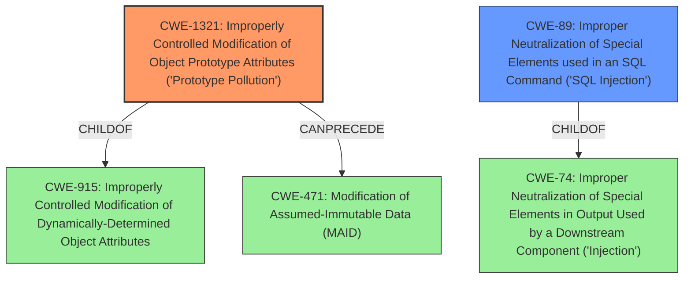

# Enhanced Analysis for CVE-2020-8158

# Summary
| CWE ID | CWE Name | Confidence | CWE Abstraction Level | CWE Vulnerability Mapping Label | CWE-Vulnerability Mapping Notes |
|---|---|---|---|---|---|
| CWE-1321 | Improperly Controlled Modification of Object Prototype Attributes ('Prototype Pollution') | 1.0 | Variant | Allowed | Primary CWE. The vulnerability description explicitly mentions "**prototype pollution**". |
| CWE-89 | Improper Neutralization of Special Elements used in an SQL Command ('SQL Injection') | 0.7 | Base | Allowed | Secondary CWE. The vulnerability description mentions that prototype pollution can lead to SQL injection attacks. |

## Evidence and Confidence

*   **Confidence Score:** 0.9
*   **Evidence Strength:** HIGH

## Relationship Analysis
The primary CWE is CWE-1321, which is a variant of CWE-915. CWE-1321 can precede CWE-471 (Modification of Assumed-Immutable Data). CWE-89 (SQL Injection) is a child of CWE-74 (Improper Neutralization of Special Elements in Output Used by a Downstream Component ('Injection')). This relationship influences the decision to include CWE-89 as a secondary weakness, as the **prototype pollution** can lead to SQL injection.



## Vulnerability Chain
The vulnerability chain starts with the **improperly controlled modification of object prototype attributes** (CWE-1321), which leads to potential modification of assumed-immutable data (CWE-471) and ultimately can result in SQL injection (CWE-89).

## Summary of Analysis
The initial analysis correctly identified CWE-1321 as the primary weakness due to the explicit mention of "**prototype pollution**" in the vulnerability description. The description also mentions that this can lead to denial of service or SQL injection. Given that SQL injection is a potential consequence, CWE-89 is included as a secondary weakness.

The analysis is primarily based on the vulnerability description, which states: "Prototype pollution vulnerability in the TypeORM package < 0.2.25 may allow attackers to add or modify Object properties leading to further denial of service or SQL injection attacks."

The graph relationships highlight that CWE-1321 is a variant of CWE-915 and can precede CWE-471. The relationship between CWE-89 and CWE-74 is also important, as it shows that SQL injection is a type of injection vulnerability.

The selected CWEs are at the optimal level of specificity, with CWE-1321 being a Variant and CWE-89 being a Base CWE.

Other CWEs considered but not used:

*   CWE-915: Improperly Controlled Modification of Dynamically-Determined Object Attributes: While related to CWE-1321, it is a higher-level CWE and less specific.
*   CWE-74: Improper Neutralization of Special Elements in Output Used by a Downstream Component ('Injection'): While related to CWE-89, it is a higher-level CWE and less specific.
*   CWE-502: Deserialization of Untrusted Data: Not directly related to the vulnerability description.
*   CWE-20: Improper Input Validation: Too generic and doesn't capture the specific weakness.
*   CWE-1333: Inefficient Regular Expression Complexity: Not related to the vulnerability description.
*   CWE-1188: Initialization of a Resource with an Insecure Default: Not related to the vulnerability description.
*   CWE-843: Access of Resource Using Incompatible Type ('Type Confusion'): Not directly related to the vulnerability.
*   CWE-456: Missing Initialization of a Variable: Not related to the vulnerability description.
*   CWE-73: External Control of File Name or Path, CWE-22: Improper Limitation of a Pathname to a Restricted Directory ('Path Traversal'), CWE-770: Allocation of Resources Without Limits or Throttling, CWE-190: Integer Overflow or Wraparound, CWE-120: Buffer Copy without Checking Size of Input ('Classic Buffer Overflow'), CWE-476: NULL Pointer Dereference, CWE-41: Improper Resolution of Path Equivalence, CWE-471: Modification of Assumed-Immutable Data (MAID): Not related to the vulnerability description.

Relevant CWE Information:


## CWE Relationship Analysis

Current CWEs represent these abstraction levels: .


### Vulnerability Chain Analysis

**Chain starting from CWE-502:**
- 502 (Deserialization of Untrusted Data) - ROOT


**Chain starting from CWE-476:**
- 476 (NULL Pointer Dereference) - ROOT


### CWE Relationship Diagram

```mermaid
graph TD
    classDef primary fill:#f96,stroke:#333,stroke-width:2px
    classDef secondary fill:#69f,stroke:#333
    classDef tertiary fill:#9e9,stroke:#333
```