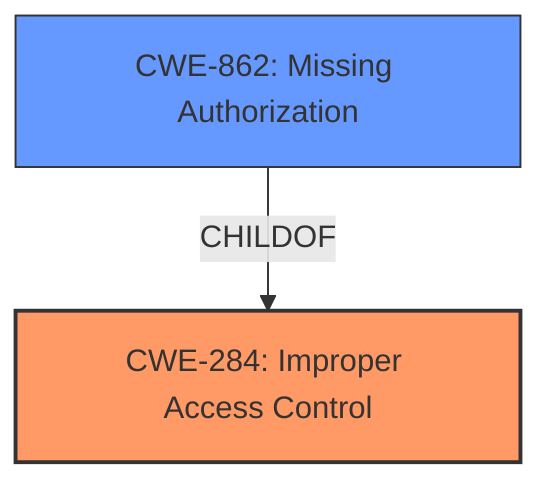

# Analysis for CVE-2020-8193

# Summary
| CWE ID  | CWE Name                                                                           | Confidence | CWE Abstraction Level | CWE Vulnerability Mapping Label | CWE-Vulnerability Mapping Notes |
| :-------- | :--------------------------------------------------------------------------------- | :--------- | :---------------------- | :------------------------------ | :------------------------------ |
| CWE-284   | Improper Access Control                                                            | 0.7        | Pillar                  | Primary                         | Discouraged                    |
| CWE-862 | Missing Authorization | 0.6 | Base | Secondary | Allowed |

## Evidence and Confidence

*   **Confidence Score:** 0.65
*   **Evidence Strength:** MEDIUM

## Relationship Analysis
The primary relationship considered was the parent-child relationship between CWE-284 (Improper Access Control) and its children, especially CWE-862 (Missing Authorization). While CWE-284 is a high-level category, the vulnerability description clearly points to a lack of access control, making CWE-284 relevant but not specific enough.
CWE-862 is a base level CWE, which is more specific and better fits the description.

## Vulnerability Chain
The chain of events is as follows:
1.  **Root Cause:** **Improper Access Control** (CWE-284) / **Missing Authorization** (CWE-862): The application lacks the necessary checks to ensure that users accessing specific URL endpoints are authenticated or authorized to do so.
2.  **Impact:** Unauthenticated access to certain URL endpoints: Attackers can access sensitive resources or functionality without proper authentication, potentially leading to data breaches or unauthorized actions.

## Summary of Analysis
Initially, the description highlights **"Improper access control"** as the weakness, making CWE-284 a seemingly appropriate choice. However, CWE-284 is a high-level "Pillar" and the mapping guidance discourages its use, recommending more specific descendants.
The evidence from the vulnerability description is that unauthenticated access to certain URL endpoints is allowed. The description indicates a **lack of access control**, meaning the URL endpoints are missing authorization checks.
Therefore, I considered CWE-862 **Missing Authorization** which is a more specific "Base" level CWE, and a child of CWE-284, which better describes the **root cause**.

Relevant CWE Information:

# Enhanced Context (25 CWEs)
The following CWEs were identified as potentially relevant to this vulnerability:

## CWE-1289: Improper Validation of Unsafe Equivalence in Input
**Abstraction Level**: Base
**Similarity Score**: 0.79

## CWE-807: Reliance on Untrusted Inputs in a Security Decision
**Abstraction Level**: Base
**Similarity Score**: 0.78

## CWE-183: Permissive List of Allowed Inputs
**Abstraction Level**: Base
**Similarity Score**: 0.78

## CWE-184: Incomplete List of Disallowed Inputs
**Abstraction Level**: Base
**Similarity Score**: 0.78

## CWE-274: Improper Handling of Insufficient Privileges
**Abstraction Level**: Base
**Similarity Score**: 0.76

## CWE-280: Improper Handling of Insufficient Permissions or Privileges 
**Abstraction Level**: Base
**Similarity Score**: 0.76

## CWE-138: Improper Neutralization of Special Elements
**Abstraction Level**: Class
**Similarity Score**: 0.75

## CWE-799: Improper Control of Interaction Frequency
**Abstraction Level**: Class
**Similarity Score**: 0.75

## CWE-472: External Control of Assumed-Immutable Web Parameter
**Abstraction Level**: Base
**Similarity Score**: 0.75

## CWE-653: Improper Isolation or Compartmentalization
**Abstraction Level**: Class
**Similarity Score**: 0.75

## CWE-184: Incomplete List of Disallowed Inputs
**Abstraction Level**: Base
**Similarity Score**: 8071.57

## CWE-863: Incorrect Authorization
**Abstraction Level**: Class
**Similarity Score**: 7956.22

## CWE-22: Improper Limitation of a Pathname to a Restricted Directory ('Path Traversal')
**Abstraction Level**: Base
**Similarity Score**: 7901.69

## CWE-639: Authorization Bypass Through User-Controlled Key
**Abstraction Level**: Base
**Similarity Score**: 7744.61

## CWE-285: Improper Authorization
**Abstraction Level**: Class
**Similarity Score**: 7741.77

## CWE-79: Improper Neutralization of Input During Web Page Generation ('Cross-site Scripting')
**Abstraction Level**: base
**Similarity Score**: 4.33

## CWE-22: Improper Limitation of a Pathname to a Restricted Directory ('Path Traversal')
**Abstraction Level**: base
**Similarity Score**: 4.33

## CWE-190: Integer Overflow or Wraparound
**Abstraction Level**: base
**Similarity Score**: 4.33

## CWE-434: Unrestricted Upload of File with Dangerous Type
**Abstraction Level**: base
**Similarity Score**: 4.33

## CWE-78: Improper Neutralization of Special Elements used in an OS Command ('OS Command Injection')
**Abstraction Level**: base
**Similarity Score**: 4.33

## CWE-73: External Control of File Name or Path
**Abstraction Level**: base
**Similarity Score**: 4.33

## CWE-770: Allocation of Resources Without Limits or Throttling
**Abstraction Level**: base
**Similarity Score**: 4.33

## CWE-1284: Improper Validation of Specified Quantity in Input
**Abstraction Level**: base
**Similarity Score**: 4.33

## CWE-410: Insufficient Resource Pool
**Abstraction Level**: base
**Similarity Score**: 4.33

## CWE-789: Memory Allocation with Excessive Size Value
**Abstraction Level**: variant
**Similarity Score**: 3.88

**CWE Selection Rationale:**

*   **CWE-284: Improper Access Control:** This is a broad, high-level category that encompasses the general problem. The vulnerability description explicitly mentions **"Improper access control"**, making this CWE relevant. However, it's a Pillar-level CWE, and the mapping guidance discourages its direct use. Confidence: 0.7
*   **CWE-862: Missing Authorization:** This CWE is a more specific child of CWE-284 and accurately describes the **root cause**: the application **fails to** perform authorization checks before granting access to certain URL endpoints. Confidence: 0.6

**CWEs Considered But Not Used:**

*   **CWE-287: Improper Authentication:** While authentication is related to access control, the description specifically mentions **unauthenticated access**, indicating a lack of authorization rather than a failure in authentication.
*   **CWE-863: Incorrect Authorization:** This CWE implies that authorization checks are performed but are flawed. The vulnerability description suggests that authorization checks are simply missing.
*   **CWE-22: Improper Limitation of a Pathname to a Restricted Directory ('Path Traversal'):** This CWE is related to path traversal vulnerabilities, which are not directly relevant to the described access control issue.
*   **CWE-20: Improper Input Validation:** While input validation is a general security principle, the specific vulnerability does not involve improper input validation as the root cause.