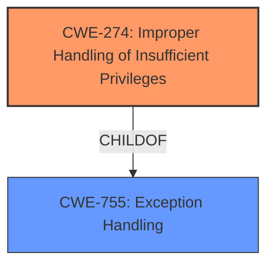

# Raw Analyzer Response for CVE-2020-8196

# Summary
| CWE ID  | CWE Name                                                       | Confidence | CWE Abstraction Level | CWE Vulnerability Mapping Label | CWE-Vulnerability Mapping Notes |
| :-------- | :------------------------------------------------------------- | :--------- | :---------------------- | :------------------------------ | :------------------------------ |
| CWE-274 | Improper Handling of Insufficient Privileges | 0.75       | Base                    | Primary CWE              | Allowed  |

## Evidence and Confidence

*   **Confidence Score:** 0.75
*   **Evidence Strength:** MEDIUM

## Relationship Analysis
The primary relationship considered was the ChildOf relationship.
  - CWE-274 is a child of CWE-755.
  - The abstraction levels helped choose the most specific CWE.

## Vulnerability Chain
The chain of root cause and weaknesses for the Vulnerability Description is:
  - **Improper access control** -> limited information disclosure

## Summary of Analysis
The initial analysis focused on the **improper access control** aspect mentioned in the vulnerability description. The retriever results highlighted several relevant CWEs, including CWE-280, CWE-285, and CWE-284. However, upon closer inspection, the vulnerability description pointed towards a more specific scenario where low-privileged users were able to access limited information, indicating that the system wasn't adequately handling situations where users had insufficient privileges.

The final decision was to select CWE-274 (**Improper Handling of Insufficient Privileges**) because it specifically addresses cases where a product does not handle or incorrectly handles scenarios when it has insufficient privileges to perform an operation. This aligned well with the vulnerability description indicating "limited information disclosure to low privileged users."

Relevant CWE Information:

# Enhanced Context (25 CWEs)
The following CWEs were identified as potentially relevant to this vulnerability:

## CWE-274: Improper Handling of Insufficient Privileges
**Abstraction Level**: Base
**Similarity Score**: 0.79
**Source**: dense

**Description**:
The product does not handle or incorrectly handles when it has insufficient privileges to perform an operation, leading to resultant weaknesses.

**Mapping Guidance**:
- Usage: Discouraged
- Rationale: This CWE entry could be deprecated in a future version of CWE.

## CWE-280: Improper Handling of Insufficient Permissions or Privileges 
**Abstraction Level**: Base
**Similarity Score**: 0.79
**Source**: dense

**Description**:
The product does not handle or incorrectly handles when it has insufficient privileges to access resources or functionality as specified by their permissions. This may cause it to follow unexpected code paths that may leave the product in an invalid state.

**Mapping Guidance**:
- Usage: Allowed
- Rationale: This CWE entry is at the Base level of abstraction, which is a preferred level of abstraction for mapping to the root causes of vulnerabilities.

## CWE-284: Improper Access Control
**Abstraction Level**: Pillar
**Similarity Score**: 0.77
**Source**: dense

**Description**:
The product does not restrict or incorrectly restricts access to a resource from an unauthorized actor.

**Mapping Guidance**:
- Usage: Discouraged
- Rationale: CWE-284 is extremely high-level, a Pillar. Its name, "Improper Access Control," is often misused in low-information vulnerability reports [REF-1287] or by active use of the OWASP Top Ten, such as "A01:2021-Broken Access Control". It is not useful for trend analysis.

## CWE-285: Improper Authorization
**Abstraction Level**: Class
**Similarity Score**: 7646.16
**Source**: sparse

**Description**:
The product does not perform or incorrectly performs an authorization check when an actor attempts to access a resource or perform an action.

**Mapping Guidance**:
- Usage: Allowed-with-Review
- Rationale: This CWE entry is a Class and might have Base-level children that would be more appropriate

## Justification for CWE Selection:

CWE-274 (**Improper Handling of Insufficient Privileges**) was selected as the primary CWE because it best describes the root cause of the vulnerability. The vulnerability description states that there is "limited information disclosure to low privileged users." This indicates that the system is not properly handling cases where users have insufficient privileges to access certain information.

*   **Relevance to Vulnerability:** The vulnerability description directly mentions **improper access control** leading to "limited information disclosure to low privileged users."
*   **CWE Description Alignment:** CWE-274's description states, "The product does not handle or incorrectly handles when it has insufficient privileges to perform an operation, leading to resultant weaknesses." This aligns perfectly with the scenario described in the vulnerability.
*   **Abstraction Level:** CWE-274 is a Base level CWE, which is preferred for mapping root causes.
*   **Usage Guidance:** While the usage guidance indicates that CWE-274 could be deprecated in the future, it is still the most appropriate CWE to describe the vulnerability based on the available information.

**CWEs Considered But Not Used:**

*   **CWE-280 (Improper Handling of Insufficient Permissions or Privileges):** This CWE is similar to CWE-274 but focuses on permissions related to accessing resources or functionality. While relevant, CWE-274 more directly addresses the handling of insufficient privileges in general.
*   **CWE-284 (Improper Access Control):** This is a very high-level CWE (Pillar) and is too generic for this specific vulnerability. It is recommended to use more specific children of CWE-284 when possible.
*   **CWE-285 (Improper Authorization):** While authorization is a form of access control, this CWE focuses on cases where authorization checks are not performed or are performed incorrectly. The vulnerability description indicates that the issue is more about how the system handles cases where users already have low privileges rather than an error in the authorization check itself.

Therefore, CWE-274 was deemed the most appropriate and specific CWE to represent the root cause of this vulnerability.