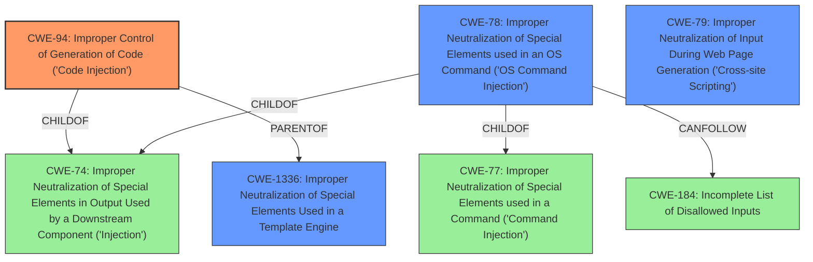

# Analysis for CVE-2020-8218

# Summary
| CWE ID | CWE Name | Confidence | CWE Abstraction Level | CWE Vulnerability Mapping Label | CWE-Vulnerability Mapping Notes |
|---|---|---|---|---|---|
| CWE-94 | Improper Control of Generation of Code ('Code Injection') | 1.0 | Base | Allowed-with-Review | Primary CWE |
| CWE-78 | Improper Neutralization of Special Elements used in an OS Command ('OS Command Injection') | 0.7 | Base | Allowed | Secondary Candidate |
| CWE-79 | Improper Neutralization of Input During Web Page Generation ('Cross-site Scripting') | 0.5 | Base | Allowed | Secondary Candidate |
| CWE-1336 | Improper Neutralization of Special Elements Used in a Template Engine | 0.5 | Base | Allowed | Secondary Candidate |

## Evidence and Confidence

*   **Confidence Score:** 0.8
*   **Evidence Strength:** HIGH

## Relationship Analysis
The primary CWE is CWE-94, which is a child of CWE-74 and CWE-913. CWE-94 can be followed by CWE-98. CWE-78 is a child of CWE-77 and CWE-74 and can be followed by CWE-184. CWE-79 has parent CWEs like CWE-87, CWE-86, CWE-85, CWE-84, and CWE-83. CWE-1336 is a child of CWE-94. The abstraction levels influenced the selection, prioritizing Base level CWEs when possible. The relationship between CWE-94 and CWE-1336 shows that code injection can manifest through template engines, but that is not the case here.

## Vulnerability Chain
The chain starts with **improper input sanitization**, leading to **code injection**, and ultimately resulting in remote code execution.

## Summary of Analysis
The initial assessment identified **code injection** as the primary weakness, which is supported by the vulnerability description. The description states, "A **code injection** vulnerability exists in Pulse Connect Secure <9.1R8 that allows an attacker to crafted a URI to perform an arbitrary code execution via the admin web interface." Further, the **Vulnerability Description Key Phrases** include "**weakness: code injection**" and "**rootcause: improper input sanitization**". The CVE Reference Links Content Summary section details CVE-2020-8218, which involves command injection due to unsanitized user input in the `downloadlicenses.cgi` file.

The analysis considered CWE-78 (Improper Neutralization of Special Elements used in an OS Command ('OS Command Injection')) due to the command injection aspect described in CVE-2020-8218. However, the primary issue is the broader **code injection** vulnerability (CWE-94) due to the ability to execute arbitrary code.

CWE-79 (Improper Neutralization of Input During Web Page Generation ('Cross-site Scripting')) and CWE-1336 (Improper Neutralization of Special Elements Used in a Template Engine) were considered but deemed less relevant as the primary issue is **code injection**, not XSS or template injection.

The final selection of CWE-94 is at the optimal level of specificity, as it directly addresses the **code injection** vulnerability described. The evidence supports this classification with a high degree of confidence.

Relevant CWE Information:

# Enhanced Context (25 CWEs)

## CWE-94: Improper Control of Generation of Code ('Code Injection')

**How the Vulnerability Matches:** The vulnerability description explicitly states a "code injection" vulnerability, which aligns directly with CWE-94. The attacker crafts a URI to perform arbitrary code execution.

**Security Implications and Potential Impact:** This allows an attacker to execute arbitrary code on the system, potentially gaining full control.

**Parent-Child Relationships:** CWE-94 is a child of CWE-74 (Improper Neutralization of Special Elements in Output Used by a Downstream Component ('Injection')) and CWE-913 (Improper Control of Dynamically-Managed Code Resources). It's a parent of CWE-96 (Improper Neutralization of Directives in Statically Saved Code ('Static Code Injection')) and CWE-1336 (Improper Neutralization of Special Elements Used in a Template Engine).

**Primary/Secondary:** Primary. This is the core weakness.

**MITRE Mapping Guidance:** Allowed-with-Review because it can be misused for vulnerabilities with a technical impact of "code execution," which does not by itself indicate a root cause weakness, since dozens of weaknesses can enable code execution. However, given the provided information, it is the most accurate.

## CWE-78: Improper Neutralization of Special Elements used in an OS Command ('OS Command Injection')

**How the Vulnerability Matches:** The CVE Reference Links Content Summary describes CVE-2020-8218 as a command injection vulnerability due to unsanitized user input in the `downloadlicenses.cgi` file. The `$authCode` variable is directly incorporated into a system command.

**Security Implications and Potential Impact:** This allows an attacker to execute arbitrary OS commands on the system.

**Parent-Child Relationships:** CWE-78 is a child of CWE-77 (Improper Neutralization of Special Elements used in a Command ('Command Injection')) and CWE-74 (Improper Neutralization of Special Elements in Output Used by a Downstream Component ('Injection')).

**Primary/Secondary:** Secondary. The broader **code injection** (CWE-94) encompasses this.

**MITRE Mapping Guidance:** Allowed because it is at the Base level of abstraction.

## CWE-79: Improper Neutralization of Input During Web Page Generation ('Cross-site Scripting')

**How the Vulnerability Matches:** The CVE Reference Links Content Summary mentions reflected XSS in `launch.cgi` (CVE-2020-8238) and `downloadlicenses.cgi`.

**Security Implications and Potential Impact:** This allows an attacker to inject malicious scripts into web pages viewed by other users.

**Parent-Child Relationships:** CWE-79 has multiple parents.

**Primary/Secondary:** Secondary. While XSS vulnerabilities are present, the primary issue is the broader **code injection**.

**MITRE Mapping Guidance:** Allowed because it is at the Base level of abstraction.

## CWE-1336: Improper Neutralization of Special Elements Used in a Template Engine

**How the Vulnerability Matches:** There is no direct evidence of the use of a template engine in the vulnerability description.

**Security Implications and Potential Impact:** N/A.

**Parent-Child Relationships:** CWE-1336 is a child of CWE-94.

**Primary/Secondary:** Secondary. This does not directly apply to the vulnerability.

**MITRE Mapping Guidance:** Allowed because it is at the Base level of abstraction, but the description must match closely.